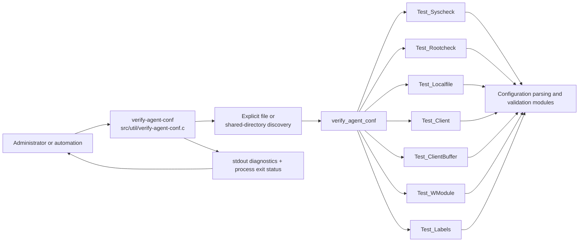
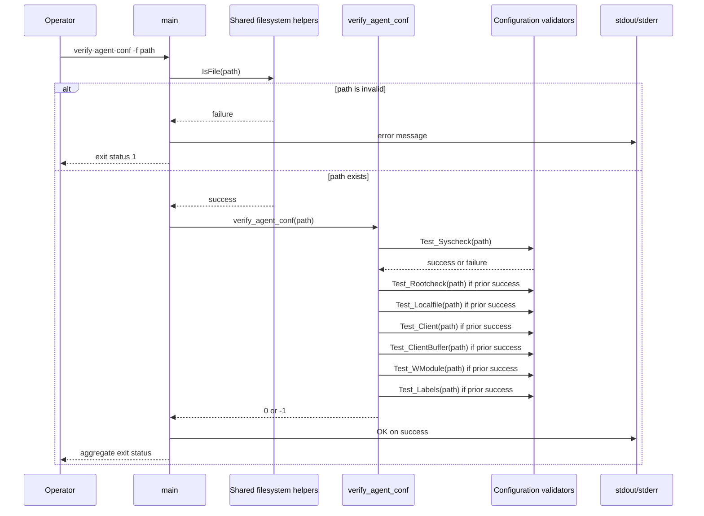
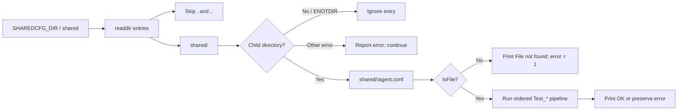

# `util_cli_tools_verify_agent_conf`

`util_cli_tools_verify_agent_conf` documents the native Wazuh `verify-agent-conf` command-line utility, implemented in `src/util/verify-agent-conf.c`. The program validates one `agent.conf` file or discovers and validates the agent configuration under every shared-agent directory. It is a manager-side diagnostic tool: it parses and checks configuration syntax, reports failures, and returns a non-zero status when any requested file is invalid or missing.

The executable is part of the repository's CLI utilities and migration tools area. Its validation work is delegated to the configuration modules documented in [Global_Config_Core](Global_Config_Core.md), [Syscheck_Config](Syscheck_Config.md), [Rootcheck_Config](Rootcheck_Config.md), [Localfile_Config](Localfile_Config.md), [Client_Config](Client_Config.md), and [Wmodules_Config](Wmodules_Config.md).

## Purpose and scope

The utility answers a narrow operational question: “Can Wazuh parse this agent configuration?” For each selected file, `verify_agent_conf()` invokes the configuration validators in a fixed sequence:

1. `Test_Syscheck(path)`
2. `Test_Rootcheck(path)`
3. `Test_Localfile(path)`
4. `Test_Client(path)`
5. `Test_ClientBuffer(path)`
6. `Test_WModule(path)`
7. `Test_Labels(path)`

Validation stops at the first failure. The utility does not start an agent, apply configuration changes, contact agents, or persist a parsed configuration. It only reads the selected file(s), prints a human-readable result, and returns an aggregate error code.

## System position



The CLI owns selection, directory traversal, output, and aggregation. The configuration subsystem owns the meaning of each XML section and its syntax rules. This separation means a change to an `agent.conf` section should normally be made in the corresponding configuration module, not in this executable.

## Components

| Component | Location | Responsibility |
|---|---|---|
| Entry point | `src/util/verify-agent-conf.c::main` | Sets the process name and working directory, parses options, selects files, prints results, and returns the aggregate status. |
| Help handler | `src/util/verify-agent-conf.c::helpmsg` | Prints the command description, usage, and options, then exits with status `1`. |
| File validator | `src/util/verify-agent-conf.c::verify_agent_conf` | Runs the seven section validators in order and returns `0` only when all succeed. |
| Directory handles | `DIR *gdir`, `DIR *subdir`, `struct dirent *entry` | Traverse `SHAREDCFG_DIR` and each child directory in default discovery mode. |
| Path buffers | `path`, `path_f` | Build child-directory and `agent.conf` paths, bounded by `PATH_MAX`. |
| Shared helpers | `w_homedir`, `wopendir`, `IsFile`, `OS_SetName`, logging/error helpers | Provide installation-path resolution, filesystem checks, process setup, and diagnostics. |

## Command-line interface

The implementation accepts options through `getopt` with the option string `Vdhf:`.

| Option | Meaning | Result |
|---|---|---|
| `-f <path>` | Validate one explicitly supplied configuration file. | Prints `verify-agent-conf: OK` on success; sets the aggregate error on failure. |
| `-h` | Print help. | Terminates from `helpmsg()` with status `1`. |
| `-V` | Print the Wazuh version. | Delegates to the shared `print_version()` helper. |
| `-d` | Enable debug logging. | Delegates to `nowDebug()` and continues parsing. |
| no options | Scan shared agent directories. | Validates `<shared>/<child>/agent.conf` for each child directory. |

Although `-V` and `-d` are accepted by the parser, the help text documents only `-h` and `-f`. An invalid option invokes `helpmsg()`. The `-f` option requires an argument; a missing argument also prints an error and terminates through the help handler.

## Process lifecycle

```mermaid
flowchart TD
    Start([Start]) --> Name[OS_SetName("verify-agent-conf")]
    Name --> Home[w_homedir(argv[0])]
    Home --> Chdir[chdir(home_path)]
    Chdir --> ChdirOK{Success?}
    ChdirOK -- No --> Fatal[Report CHDIR_ERROR and exit]
    ChdirOK -- Yes --> Args{Arguments present?}
    Args -- Yes --> Parse[getopt: V / d / h / f]
    Parse --> FMode{"-f" supplied?}
    FMode -- Yes --> FileCheck[IsFile(optarg)]
    FileCheck --> ValidFile{Regular file valid?}
    ValidFile -- No --> MarkError[Set error = 1]
    ValidFile -- Yes --> Validate[verify_agent_conf(path)]
    FMode -- No --> Continue[Continue option handling]
    Continue --> Parse
    Args -- No --> OpenShared[wopendir(SHAREDCFG_DIR)]
    OpenShared --> SharedOK{Opened?}
    SharedOK -- No --> ReturnError[Report error and return 1]
    SharedOK -- Yes --> Iterate[Iterate child entries]
    Iterate --> ChildDir[wopendir(shared/entry)]
    ChildDir --> IsDir{Directory?}
    IsDir -- No --> Skip[Skip non-directories]
    IsDir -- Yes --> AgentConf[Build child/agent.conf]
    AgentConf --> Exists{agent.conf exists?}
    Exists -- No --> Missing[Print File not found; error = 1]
    Exists -- Yes --> Validate
    Validate --> More{More files or options?}
    More -- Yes --> Iterate
    More -- No --> Cleanup[Close directories; free home_path]
    MarkError --> Cleanup
    Cleanup --> Exit([Return aggregate error])
```

Before processing files, `main` resolves the Wazuh home path using `w_homedir(argv[0])`, changes the current directory to it, and aborts if `chdir` fails. Unlike some other native manager utilities, this source does not explicitly perform a privilege drop or chroot; it relies on the process environment and shared configuration/file helpers.

## Explicit-file validation flow

When `-f` is supplied, the program validates only the requested path. `IsFile()` is checked first so an invalid path is reported without invoking the configuration parsers.



The validators are short-circuited with `else if`; later validators are not called after an earlier section reports an error. The return value from `verify_agent_conf()` is normalized by `main` into `error = 1`, so multiple failures still produce a simple success/failure process status.

## Default discovery mode

Without command-line arguments, the utility scans `SHAREDCFG_DIR`, normally the manager’s `shared` configuration directory. For every entry other than `.` and `..`, it constructs `<shared>/<entry>` and attempts to open it as a directory. Non-directory entries are ignored when `wopendir()` fails with `ENOTDIR`; other directory-open errors are reported and contribute to the final error status.

For each child directory, it constructs `<shared>/<entry>/agent.conf`, prints a verification heading, checks that the file exists, and then runs the same validator pipeline used by `-f`.



Path construction uses `snprintf(..., PATH_MAX + 1, ...)`. If the resulting path would exceed `PATH_MAX`, the program reports `Path too long.`, marks the aggregate error, and stops the relevant traversal. `gdir` and each successfully opened `subdir` are closed during normal traversal.

## Validation dependencies

```mermaid
graph TD
    V[verify_agent_conf(path)] --> S[Test_Syscheck]
    V --> R[Test_Rootcheck]
    V --> L[Test_Localfile]
    V --> C[Test_Client]
    V --> B[Test_ClientBuffer]
    V --> W[Test_WModule]
    V --> T[Test_Labels]
    S --> SC[Syscheck_Config]
    R --> RC[Rootcheck_Config]
    L --> LF[Localfile_Config]
    C --> CC[Client_Config]
    B --> CC
    W --> WM[Wmodules_Config]
    T --> Shared[Shared configuration and label helpers]
    SC --> XML[Shared XML/configuration infrastructure]
    RC --> XML
    LF --> XML
    CC --> XML
    WM --> XML
    Shared --> XML
```

The source includes `config/localfile-config.h`, `config/config.h`, and `logcollector/logcollector.h`. These headers expose the configuration-test functions and the shared configuration constants used by the utility. The detailed parser behavior belongs to the linked module pages:

- [Global_Config_Core](Global_Config_Core.md) — generic XML/configuration dispatch and common configuration infrastructure.
- [Syscheck_Config](Syscheck_Config.md) — Syscheck/FIM configuration validation.
- [Rootcheck_Config](Rootcheck_Config.md) — Rootcheck configuration validation.
- [Localfile_Config](Localfile_Config.md) — `<localfile>` parsing and Logcollector configuration.
- [Client_Config](Client_Config.md) — agent/client configuration and client buffer settings.
- [Wmodules_Config](Wmodules_Config.md) — Wazuh module configuration blocks.

This page deliberately does not duplicate the XML schema or section-specific rules. `verify-agent-conf` is the composition point that invokes them.

## Output and error behavior

| Condition | Behavior |
|---|---|
| `chdir(w_homedir(argv[0]))` fails | Calls `merror_exit(CHDIR_ERROR, ...)`; the process terminates. |
| `-h` or invalid option | Prints usage through `helpmsg()` and exits `1`. |
| `-f` has no argument | Reports that `-f` needs an argument, then prints help and exits `1`. |
| `-f` path is not a file | Reports that the path is invalid and returns a non-zero aggregate status. |
| A section validator fails | `verify_agent_conf()` returns `-1`; the caller sets `error = 1`. |
| Shared directory cannot be opened | Reports the directory error and returns `1`. |
| Child `agent.conf` is missing | Prints `verify-agent-conf: File not found` and marks failure. |
| Path exceeds `PATH_MAX` | Prints `Path too long.`, marks failure, and stops the relevant loop. |
| All selected files pass | Prints `verify-agent-conf: OK` for each file and returns `0`. |

The final debug call records the Wazuh home path with `mdebug1`, then `home_path` is released with `os_free`. The status is an aggregate: one failure is enough to make the final return value non-zero, even if later files validate successfully.

## Maintenance guidance

- Preserve the validation order unless there is a deliberate compatibility reason to change it; callers and diagnostics currently rely on the first failing section stopping the pipeline.
- Add or modify section syntax rules in the owning configuration module and its tests. Keep this utility as the composition layer.
- Keep path construction bounded by `PATH_MAX` and continue using the shared `wopendir()`/`IsFile()` helpers for platform-aware filesystem behavior.
- When changing CLI flags, update both the `getopt` option string and `helpmsg()`; currently `-V` and `-d` are accepted but omitted from the displayed option list.
- Preserve the aggregate-error behavior in discovery mode so automation can treat any missing or invalid shared configuration as a failed verification.
- For tests of individual configuration sections, refer to the relevant configuration test suites rather than adding parser-specific logic to this CLI.

## Source reference

Primary implementation: `src/util/verify-agent-conf.c`

Core symbols:

- `main()` — process setup, option handling, explicit-file mode, discovery mode, output, cleanup, and exit status.
- `helpmsg()` — usage text and terminating help/error path.
- `verify_agent_conf()` — ordered composition of the seven `Test_*` validators.
