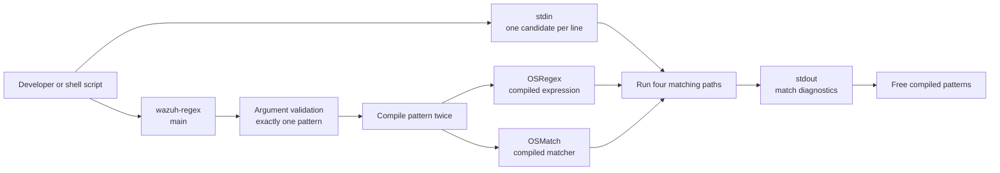
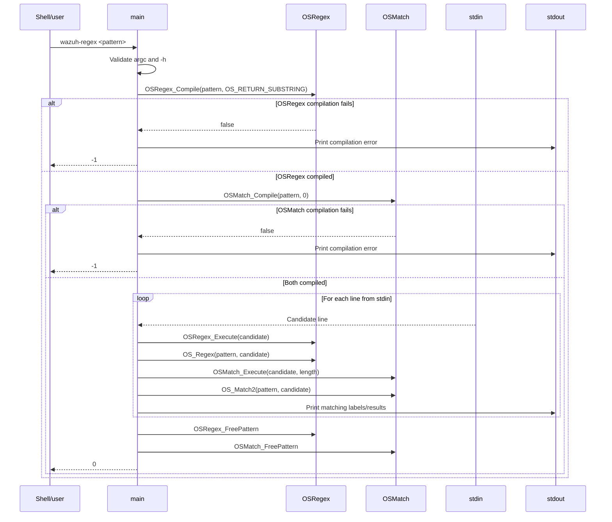
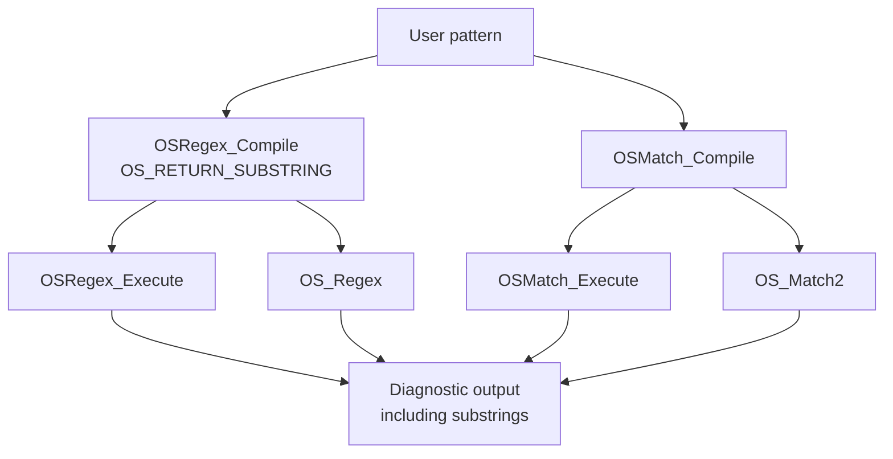
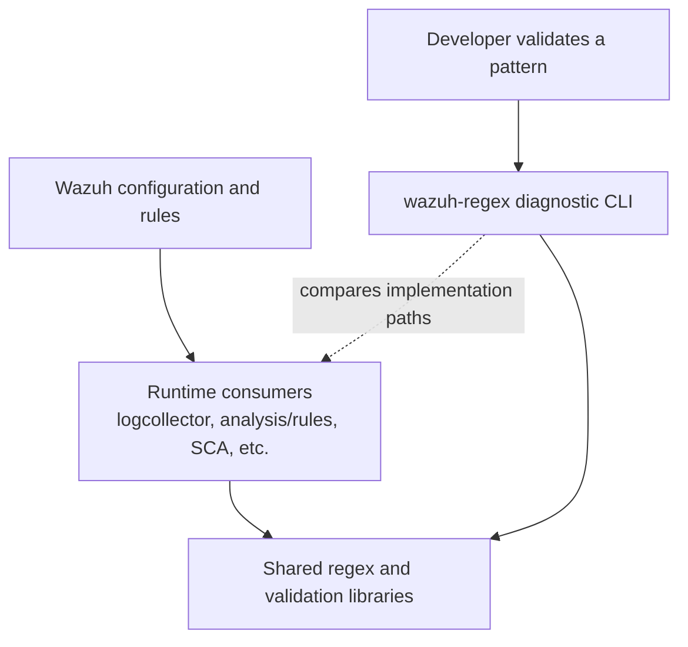

# `util_cli_tools_wazuh_regex`

`wazuh-regex` is a command-line diagnostic utility for comparing the behavior of Wazuh's legacy regular-expression and match engines. It accepts one pattern, reads candidate strings line by line from standard input, and reports which engines match each line. It is primarily useful when developing, troubleshooting, or validating decoder, rule, and log-collection patterns.

The executable is implemented in [`src/util/wazuh-regex.c`](src/util/wazuh-regex.c) and belongs to the broader [`util_cli_tools`](util_cli_tools.md) collection of native administration and diagnostic utilities.

## Purpose and scope

The utility provides a small, reproducible comparison harness around four matching paths:

| Report label | Underlying operation | Behavior exposed |
|---|---|---|
| `OSRegex_Execute` | Compiled `OSRegex` object | Executes a compiled OSRegex expression and prints captured substrings. |
| `OS_Regex` | Pattern-based legacy helper | Executes the pattern through the convenience OSRegex path. |
| `OSMatch_Compile` / `OSMatch_Execute` | Compiled `OSMatch` object | Executes a compiled match expression against a buffer and length. |
| `OS_Match2` | Pattern-based match helper | Executes the pattern through the convenience OSMatch path. |

The program does not transform, persist, or forward input. Its output is intended for humans and shell-based test workflows.

## Architecture

The executable is a thin adapter over the shared C regex library. It owns command-line validation, compilation, standard-input iteration, result formatting, and cleanup; the matching algorithms and pattern representations remain in the shared regex implementation.



### Component responsibilities

#### `helpmsg`

`helpmsg` prints the invocation form, using the Wazuh product name and the executable name configured as `ARGV0`, then terminates with status `1`. It is used when the argument count is invalid or when `-h` is supplied.

#### `main`

`main` coordinates the complete lifecycle:

1. Initializes the input buffer and matching objects.
2. Sets the process name to `wazuh-regex` through `OS_SetName`.
3. Requires exactly one argument and rejects `-h` through the same help path.
4. Compiles the supplied pattern into both an `OSRegex` and an `OSMatch` object.
5. Reads standard input with `fgets`, treating each line as a candidate string.
6. Removes one trailing newline, duplicates the candidate, and evaluates all four matching paths.
7. Prints positive matches and any OSRegex captured substrings.
8. Releases both compiled pattern objects before returning success.

The shared regex data structures and algorithms are documented in [`os_regex`](os_regex.md). This module intentionally does not duplicate their implementation details.

## Execution flow



## Input and output contract

### Invocation

```text
wazuh-regex <pattern>
```

The pattern is passed as a single shell argument. Patterns containing spaces, shell metacharacters, or regular-expression syntax generally need shell quoting:

```bash
printf '%s\n' 'ERROR user=alice' 'INFO started' | wazuh-regex 'ERROR.*'
```

The program consumes input until EOF. Each input line is tested independently, and one trailing `\n` is removed before matching. The input buffer is bounded by `OS_MAXSTR`; longer lines are therefore processed in the same bounded-read manner as `fgets` rather than as an unbounded record.

### Successful match output

For a candidate matched by one or more paths, output may contain lines like:

```text
+OSRegex_Execute: ERROR user=alice
 -Substring: ERROR user=alice
+OS_Regex       : ERROR user=alice
+OSMatch_Compile: ERROR user=alice
+OS_Match2      : ERROR user=alice
```

The four result lines are independent. A pattern can match through one implementation and not another, which is the principal diagnostic value of the tool. `OSRegex_Execute` additionally prints every non-null captured substring returned in `regex.d_sub_strings`.

Compilation failures are reported before standard input is processed:

```text
Pattern '<pattern>' does not compile with OSRegex_Compile
Pattern '<pattern>' does not compile with OSMatch_Compile
```

### Exit behavior

| Condition | Result |
|---|---:|
| Valid pattern, input processed, cleanup completed | `0` |
| Invalid argument count or `-h` | `1` via `helpmsg` |
| OSRegex compilation failure | `-1` |
| OSMatch compilation failure | `-1` |

Because C process exit status is conventionally represented modulo 256 by a shell, callers should treat the compilation-failure path as nonzero rather than depending on the displayed `-1` value.

## Pattern compilation and matching

The pattern is compiled independently into two representations. This is deliberate: `OSRegex` and `OSMatch` are related but distinct Wazuh matching mechanisms, and the utility exposes differences in their accepted syntax and matching semantics.



`OSRegex_Compile` is requested with `OS_RETURN_SUBSTRING`, so a successful `OSRegex_Execute` can expose captured portions of the candidate. The `OSMatch_Execute` call explicitly supplies both the candidate pointer and its length. The convenience helpers receive the original pattern and candidate string directly.

For implementation-level details, pattern syntax, and the distinction between the shared matching APIs, see [`os_regex`](os_regex.md) and [`shared_lib_string_validation`](shared_lib_string_validation.md).

## Relationship to the Wazuh system

`wazuh-regex` is not part of the API request path and does not interact with Wazuh DB, agents, sockets, or daemon queues. It is a standalone executable linked against common Wazuh libraries. Developers use it alongside configuration-driven consumers that rely on compatible matching behavior, including log collection, decoders, rules, and compliance checks.



The dashed relationship is diagnostic rather than a runtime dependency from the consumers to the CLI. The utility helps reproduce matching behavior without starting a daemon or constructing a complete configuration.

The sibling [`util_cli_tools_parallel_regex`](util_cli_tools_parallel_regex.md) is another regex-oriented command-line utility, but it serves a different operational purpose. Keep this document focused on `wazuh-regex`'s single-pattern, stdin-driven comparison workflow.

## Failure handling and maintenance considerations

- Argument validation occurs before compilation or input processing.
- Failure to compile either engine stops processing immediately; the already-created object is not explicitly freed on the later compilation-failure branch.
- Input lines are copied with `strdup` so the matching calls operate on an independently owned buffer; the buffer is freed after each line.
- Pattern objects are freed only after the input loop completes normally.
- Output is written to standard output, while usage and compilation diagnostics are also printed with `printf`; consumers should not assume a separate diagnostic stream.
- The code assumes `fgets` returns a non-empty line when removing the final newline. Normal `fgets` line records satisfy this, including blank lines represented by `"\n"`.

When changing this utility, preserve the four-way comparison and output labels: scripts and developers may use them to identify which matching implementation accepted a candidate. Changes to matching semantics should normally be made in the shared regex layer and covered by its tests, including [`os_regex_test_os_regex`](os_regex_test_os_regex.md), [`os_regex_test_os_regex_execute`](os_regex_test_os_regex_execute.md), and [`os_regex_test_os_regex_match`](os_regex_test_os_regex_match.md).

## Testing and verification workflow

A practical manual verification sequence is:

```bash
printf '%s\n' 'alpha 123' 'beta' | wazuh-regex 'alpha [0-9]+'
```

Then compare cases involving anchors, capture groups, escaped characters, and syntax accepted by only one engine. For automated changes, combine CLI-level tests with the shared regex tests referenced above; the CLI itself is intentionally small and delegates matching correctness to the shared implementations.

## Source reference

- `src/util/wazuh-regex.c`: `helpmsg`, `main`
- [`util_cli_tools`](util_cli_tools.md): sibling native CLI utilities
- [`os_regex`](os_regex.md): shared OSRegex and OSMatch implementation
- [`shared_lib_string_validation`](shared_lib_string_validation.md): shared string and validation helpers
