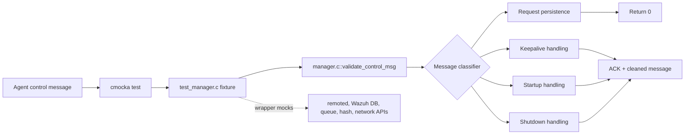
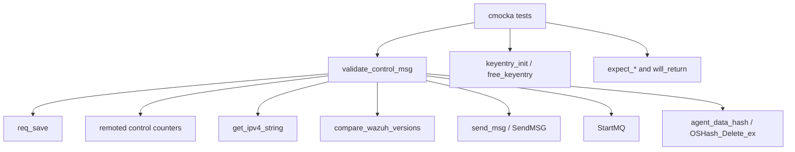
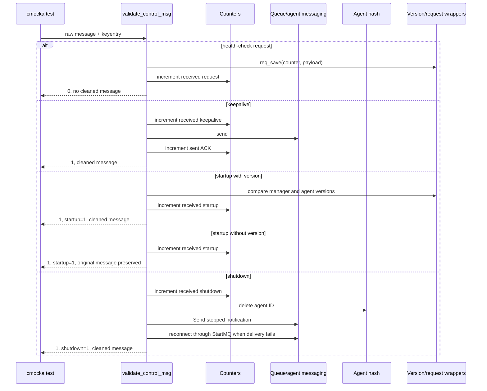
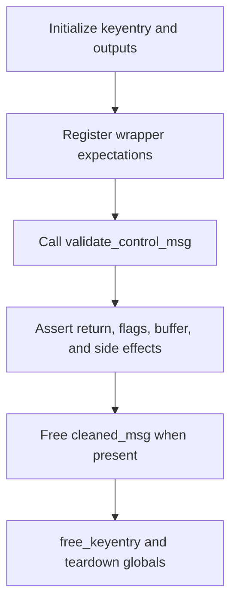

# `validate_control_msg_tests`

This module documents the cmocka tests that exercise `validate_control_msg`, the remoted control-message validator used to classify agent requests, startup notifications, keepalives, and shutdowns. The tests isolate the validator with wrapper-based mocks and verify both its return contract and its observable side effects.

The tests are defined in `src/unit_tests/remoted/test_manager.c`; the production implementation is included directly from `src/remoted/manager.c`. This document is intentionally limited to the five module components identified in the module tree.

## Scope

| Test | Message class | Main assertion |
|---|---|---|
| `test_validate_control_msg_hc_request_success` | `req <counter> <payload>` | Saves the request and returns `0`, meaning it is handled without queueing. |
| `test_validate_control_msg_shutdown_success` | `HC_SHUTDOWN` | Marks shutdown, removes agent state, emits an “agent stopped” notification, and returns `1`. |
| `test_validate_control_msg_startup_success` | `agent startup {"version":...}` | Marks startup, compares versions, records the startup metric, and returns a queueable message. |
| `test_validate_control_msg_keepalive_success` | `agent keepalive\n...` | Records the keepalive, sends an acknowledgement, and returns `1`. |
| `test_validate_control_msg_get_agent_version_fail` | Startup JSON without `version` | Defers version handling while preserving the original message for later processing. |

Adjacent invalid-message and malformed-request tests exist in the same parent source file, but are outside this generated module’s core component set.

## Architectural context

`validate_control_msg` sits at the boundary between remoted transport handling and agent-state processing. It receives an authenticated `keyentry`, normalizes or copies the raw message, updates remoted counters, and signals the caller whether the message should continue through the queue-processing path.



The test file includes the implementation under test rather than linking to a separately built production object. This makes the wrapper expectations visible at the unit-test boundary and avoids dependence on live sockets, Wazuh DB state, or agent processes.

## Dependencies and test doubles



| Dependency | Role in these tests |
|---|---|
| `cmocka` | Registers tests and checks return values, output flags, strings, and mocked calls. |
| `keyentry` | Supplies agent identity, ID, address, and authentication context. Each test initializes and frees it. |
| `req_save` | Persists the counter and payload of a health-check request. |
| Remoted counters | Track received requests, startup, shutdown, keepalive, and sent acknowledgements. |
| `get_ipv4_string` | Resolves the peer address for startup and shutdown log messages. |
| `compare_wazuh_versions` | Compares the startup version with `__ossec_version`. |
| `send_msg`, `SendMSG`, `StartMQ` | Represent agent acknowledgements and manager queue notification/reconnect behavior. |
| `agent_data_hash` | Represents in-memory connected-agent state; shutdown removes the agent entry. |

All external interactions are mocked through wrapper headers. Consequently, these tests validate decision logic and call contracts, not socket delivery, database persistence, or actual queue recovery.

## Control-message data flow



## Test behavior by message type

### Health-check request

`test_validate_control_msg_hc_request_success` passes `req 5 test_payload`. The validator must split the counter and payload exactly as expected by `req_save`: counter `5`, payload `test_payload`, and length `12`. A successful `req_save` result is followed by `rem_inc_recv_ctrl_request("001")`.

The return value is `0`, and `cleaned_msg` remains `NULL`. This distinguishes a request consumed by the validation path from control messages that must be forwarded to later processing.

### Keepalive

`test_validate_control_msg_keepalive_success` uses a multiline keepalive message. The validator increments the received-keepalive counter, sends `#!-agent ack ` to agent `001`, and increments the sent-ack counter. It returns `1` and produces a non-null cleaned message; the caller owns and frees that buffer.

### Startup with a version

`test_validate_control_msg_startup_success` supplies `agent startup {"version":"v4.6.0"}` from IPv4 peer `192.168.1.1`. The validator logs the peer, compares the agent version to `__ossec_version`, records startup reception, sets `is_startup` to `1`, and returns a non-null cleaned message with result `1`.

The test’s comparison result is `-1`, representing an older agent version that is still accepted by this validation stage. Compatibility consequences are handled by later processing, including `save_controlmsg` (covered by the neighboring save-control-message test module when available).

### Startup without a retrievable version

`test_validate_control_msg_get_agent_version_fail` sends `agent startup {"test":"fail"}`. No version comparison is expected because the JSON does not contain a `version` field. The validator still recognizes the control type, increments the startup counter, sets `is_startup`, returns `1`, and preserves the exact original text in `cleaned_msg`.

This is an intentional deferred-processing contract: syntactic startup recognition succeeds even when semantic version extraction cannot yet be completed.

### Shutdown

`test_validate_control_msg_shutdown_success` supplies `HC_SHUTDOWN` and an IPv4 peer. The validator logs the event, increments the shutdown counter, deletes agent `001` from `agent_data_hash`, and sends the stopped notification:

```text
1:wazuh-remoted:ossec: Agent stopped: 'agent1->192.168.1.1'.
```

The test forces the first `SendMSG` attempt to fail, expects a `StartMQ(DEFAULTQUEUE, WRITE)` reconnect attempt, and verifies the second notification attempt. It then checks `result == 1`, `is_shutdown == 1`, and a non-null cleaned message.

## Output contract

| Output | Meaning verified here |
|---|---|
| Return `0` | Request was handled immediately and is not queued. |
| Return `1` | Message remains eligible for downstream processing. |
| `is_startup` | Set to `1` only for recognized startup messages. |
| `is_shutdown` | Set to `1` only for recognized shutdown messages. |
| `cleaned_msg` | `NULL` for the consumed request; allocated for queueable control messages. |

The tests initialize flags to sentinel values in startup/shutdown cases, proving that the validator writes deterministic values rather than leaving stale caller state. Non-null cleaned messages are explicitly released by the tests, documenting the ownership expectation.

## Fixtures and lifecycle

Startup and shutdown tests use `setup_globals`/`teardown_globals`, which initialize `agent_data_hash` and enable test mode before execution, then clean the hash and restore global state. The startup-without-version test uses the same fixture because it exercises shared remoted globals. Request and keepalive tests only require local `keyentry` setup and wrapper expectations.

Every test follows the same lifecycle:



## Execution and maintenance notes

Run the project’s remoted unit-test target through its normal CMake/CTest build. A build-tree discovery command can identify the exact target without assuming a fixed binary name:

```bash
ctest --test-dir <build-directory> -N | rg 'manager|remoted'
```

When changing `validate_control_msg`, update these tests whenever any of the following contracts changes: message classification, queue-vs-consume return values, flag initialization, cleaned-message ownership, counter updates, startup version deferral, or shutdown notification retry behavior. Keep transport and database behavior in their dedicated tests rather than duplicating it here.

## Related documentation

- [Manager module](manager_module.md) — manager-facing service responsibilities and APIs.
- [Remote configuration](Remote_Config.md) — remoted configuration data structures.
- [Agent and manager native daemons](Agent_&_Manager_Native_Daemons_(C).md) — daemon-level context.
- [Logcollector remote control](logcollector_remote_control.md) — related remote-control message handling patterns.
- [Process-deleted-groups tests](process_deleted_groups_tests.md) and [copy-directory tests](copy_directory_tests.md) — neighboring suites from the same `test_manager.c` parent file; linked to avoid duplicating their documentation here.
