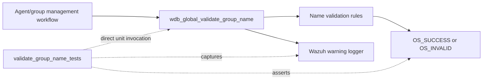
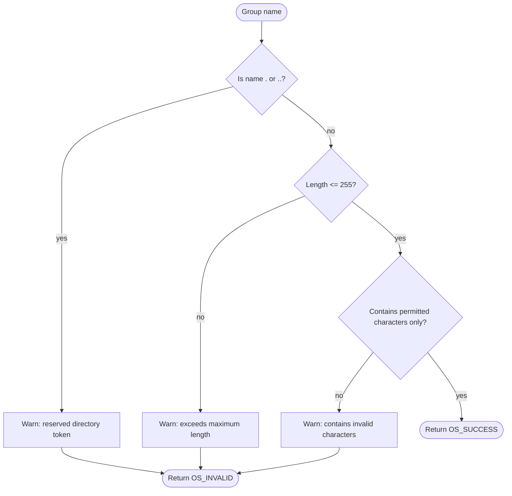
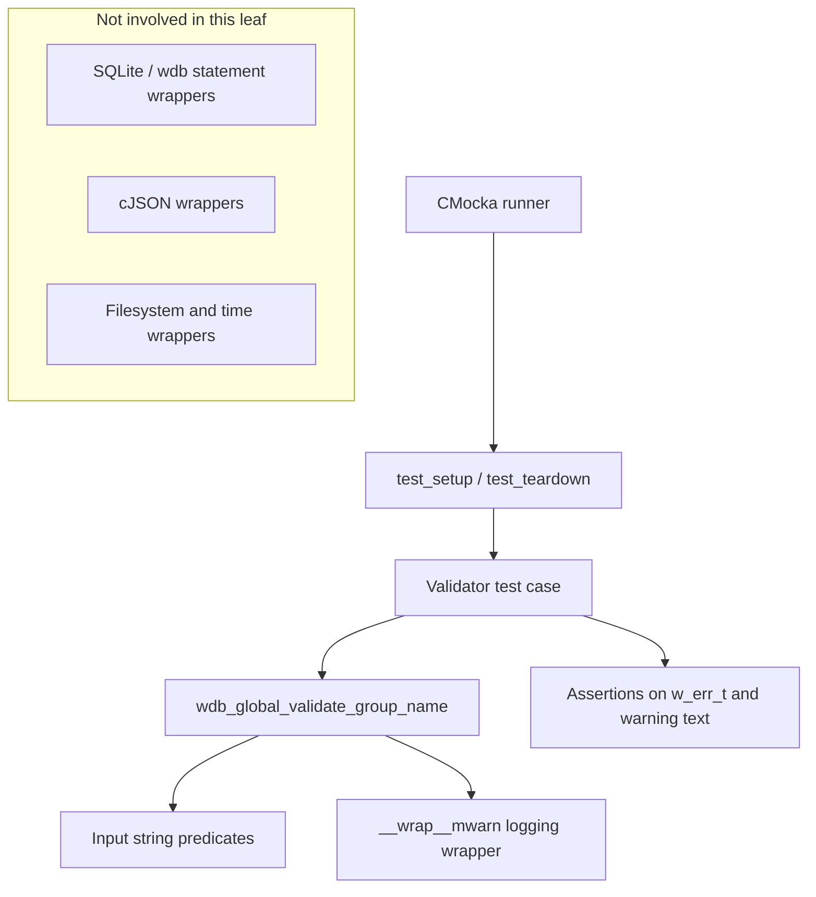
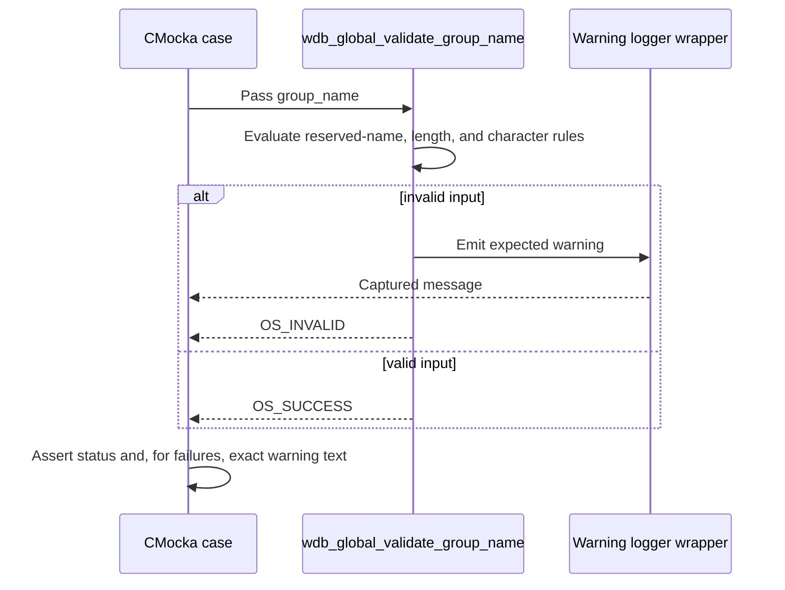
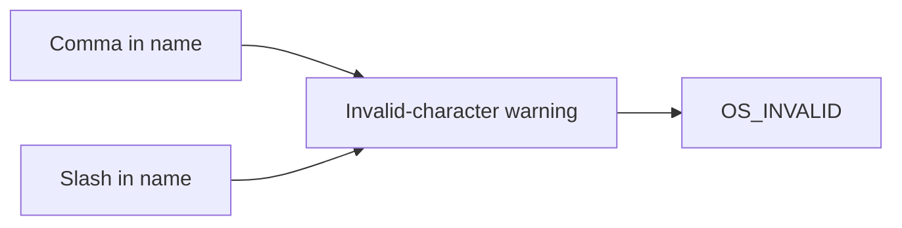
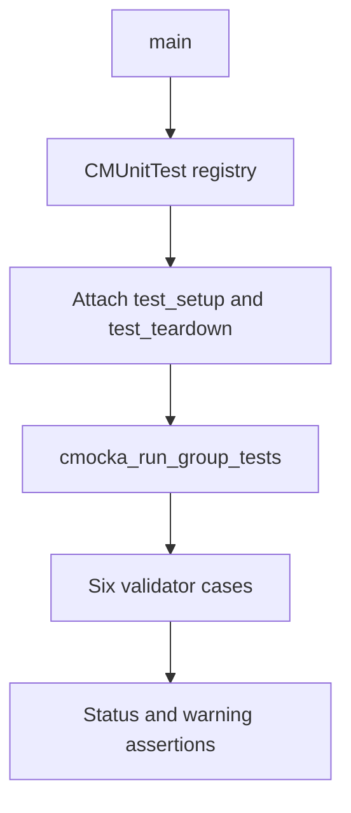
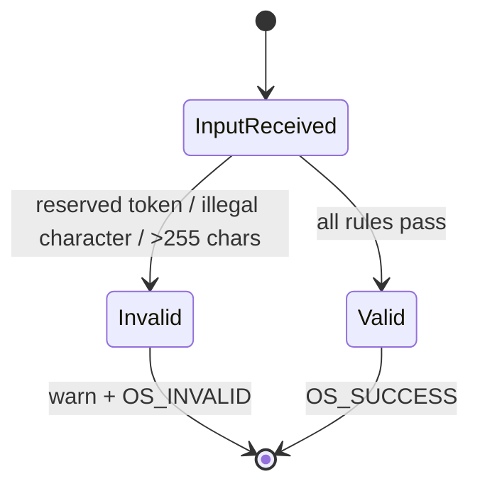

# `validate_group_name_tests`

## Introduction

`validate_group_name_tests` documents the focused CMocka coverage for
`wdb_global_validate_group_name()`, the Wazuh global-database validation
routine that checks whether a group name is safe and acceptable before it is
stored or used in agent-group operations.

The tests are defined in
[`src/unit_tests/wazuh_db/test_wdb_global.c`](../../src/unit_tests/wazuh_db/test_wdb_global.c)
and are registered as part of the larger [`test_wdb_global`](test_wdb_global.md)
unit-test executable. They isolate the validator from SQLite and filesystem
behavior: the input is a plain C string, the observable side effect is a
warning log for invalid input, and the result is a `w_err_t` status.

## Position in the system

The validator belongs to the group-management portion of the `global.db`
data-access layer. Higher-level group assignment and insertion workflows use
the same global database implementation; those broader relationships are
described in [`wazuh_db_global`](wazuh_db_global.md).

The test module is a leaf test component. It does not exercise the database
schema, statement cache, transaction lifecycle, group membership tables, or
socket pagination. Those concerns are covered by the parent global tests and
related group-management modules.

## Responsibility and contract

At the behavior level, `wdb_global_validate_group_name(group_name)` accepts a
group name only when it satisfies all rules represented by this test matrix:

| Rule | Covered input | Expected result |
|---|---|---|
| Reject comma | `group_name,with_comma` | `OS_INVALID` and warning |
| Reject slash | `group_name/with_slash` | `OS_INVALID` and warning |
| Enforce maximum length | A 256-character name | `OS_INVALID` and warning stating the 255-character limit |
| Reject current-directory token | `.` | `OS_INVALID` and warning |
| Reject parent-directory token | `..` | `OS_INVALID` and warning |
| Accept valid boundary-length content | A valid 255-character name using permitted characters | `OS_SUCCESS` and no warning expectation |

The tests establish that the maximum permitted length is 255 characters. The
exact complete allow-list is intentionally not duplicated here; the
production implementation remains authoritative. The examples demonstrate
that letters, digits, underscore, and hyphen are accepted, while comma and
slash are rejected.

## Validation flow

The observable validation pipeline can be understood as a sequence of
short-circuit checks. The source tests do not expose the internal ordering of
every predicate, so the diagram describes the externally relevant decision
model rather than asserting a private implementation order.

Each invalid case is expected to stop at validation and return `OS_INVALID`.
There is no SQLite call, statement preparation, transaction, JSON allocation,
or database mutation in this unit boundary.

## Test harness and dependencies

The six tests reuse the common `test_setup` and `test_teardown` fixture from
`test_wdb_global.c` through `cmocka_unit_test_setup_teardown`. The fixture
creates a synthetic global `wdb_t`, initializes Wazuh DB configuration, and
frees all allocations after each test. The validator itself does not depend on
the synthetic database handle, but the shared executable uses the common
fixture for consistent isolation.

The source includes many wrappers because all group, agent, synchronization,
and backup tests share one translation unit. The focused validator cases only
use the warning logger wrapper and CMocka assertions. The common fixture and
wrapper conventions are documented in
[`test_wdb_global_test_infrastructure`](test_wdb_global_test_infrastructure.md).

## Component interaction

The tests intentionally assert the complete warning strings. This makes
diagnostics part of the tested behavior and helps maintainers detect changes
to the reason reported to operators.

## Test cases

### Invalid characters

`test_wdb_global_validate_group_name_fail_group_name_contains_invalid_character_1`
passes `group_name,with_comma`. It expects the warning that identifies the
comma-containing name and returns `OS_INVALID`.

`test_wdb_global_validate_group_name_fail_group_name_contains_invalid_character_2`
passes `group_name/with_slash`. It follows the same contract for `/`, proving
that path separators are rejected rather than treated as ordinary group-name
content.

### Maximum length

`test_wdb_global_validate_group_name_fail_group_name_exceeds_max_length`
passes a name longer than the permitted 255 characters. It verifies both the
failure status and a warning that includes the offending name and the stated
limit.

The boundary is complemented by the success test, which uses a valid name of
exactly 255 characters. Together these cases distinguish “maximum length is
inclusive” from “maximum length is exclusive.”

### Reserved directory names

`test_wdb_global_validate_group_name_fail_group_name_current_directory_reserved_name`
rejects `.` and explains that it represents the current directory on Unix.

`test_wdb_global_validate_group_name_fail_group_name_parent_directory_reserved_name`
rejects `..` and explains that it represents the parent directory on Unix.

These checks prevent group names from colliding with path-navigation tokens in
code paths that serialize, materialize, or otherwise handle group names as
filesystem-related identifiers.

### Valid name

`test_wdb_global_validate_group_name_success` passes a 255-character string
made from permitted alphanumeric, underscore, and hyphen characters. It
expects `OS_SUCCESS` and no warning expectation, demonstrating the positive
boundary case.

## Test registration and execution

The cases are added to the `CMUnitTest` array in `main()` using
`cmocka_unit_test_setup_teardown`:

The six registered cases are:

- `test_wdb_global_validate_group_name_fail_group_name_contains_invalid_character_1`
- `test_wdb_global_validate_group_name_fail_group_name_contains_invalid_character_2`
- `test_wdb_global_validate_group_name_fail_group_name_exceeds_max_length`
- `test_wdb_global_validate_group_name_fail_group_name_current_directory_reserved_name`
- `test_wdb_global_validate_group_name_fail_group_name_parent_directory_reserved_name`
- `test_wdb_global_validate_group_name_success`

The list contains six cases; the two invalid-character variants are separate
tests. Each case receives a fresh fixture and has no dependency on execution
order.

## Failure model

The validator has a simple synchronous failure model:

Unlike database-oriented tests in the same source file, no `WDBC_DUE` or
`WDBC_ERROR` result is involved. `OS_INVALID` is the direct validation result;
the warning message identifies the violated rule.

## Maintenance guidance

When changing group-name policy:

- Update the production implementation and this focused matrix together.
- Preserve both invalid and valid boundary cases for the 255-character limit.
- Add one targeted case per newly rejected character or reserved token when
  the diagnostic behavior is important.
- Keep exact warning assertions synchronized with operator-facing wording.
- Leave transaction, statement-cache, group-count, and assignment behavior to
  the broader [`test_wdb_global`](test_wdb_global.md) and related group tests.

If the validator begins consulting configuration or external state, extend the
fixture and dependency diagram only as required. Until then, keeping this
leaf free of SQLite and filesystem mocks preserves its value as a fast,
deterministic input-validation test.

## Related documentation

- [`test_wdb_global`](test_wdb_global.md) — complete unit-test coverage for
  `wdb_global.c`.
- [`test_wdb_global_test_infrastructure`](test_wdb_global_test_infrastructure.md)
  — shared fixture and wrapper behavior.
- [`wazuh_db_global`](wazuh_db_global.md) — production global database and
  group-management architecture.
- [`wazuh_db_engine`](wazuh_db_engine.md) — shared Wazuh DB engine context;
  relevant to neighboring database tests, but not called by this validator
  leaf.

## Source references

- [`src/unit_tests/wazuh_db/test_wdb_global.c`](../../src/unit_tests/wazuh_db/test_wdb_global.c)
- [`src/wazuh_db/wdb_global.c`](../../src/wazuh_db/wdb_global.c)
- [`src/wazuh_db/wdb.h`](../../src/wazuh_db/wdb.h)
