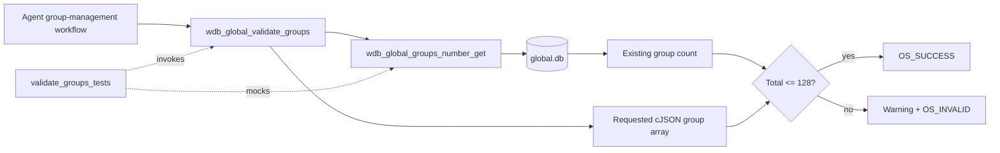
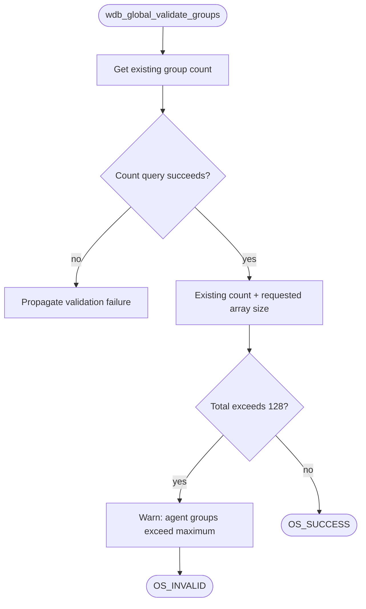
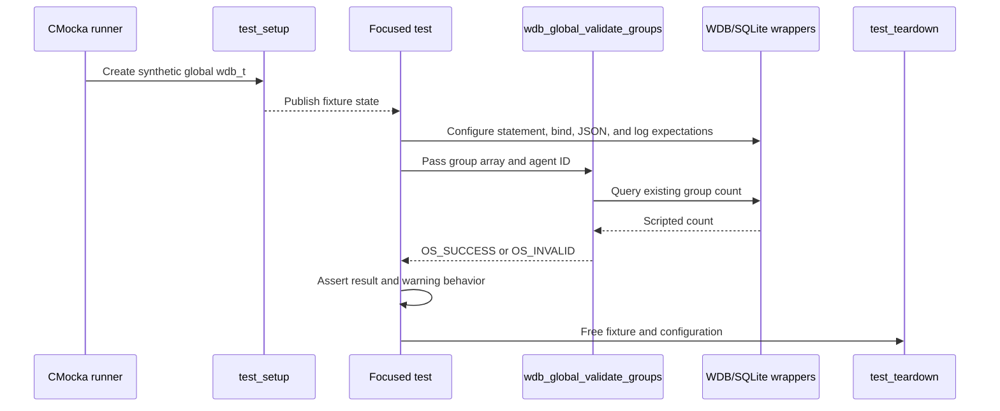
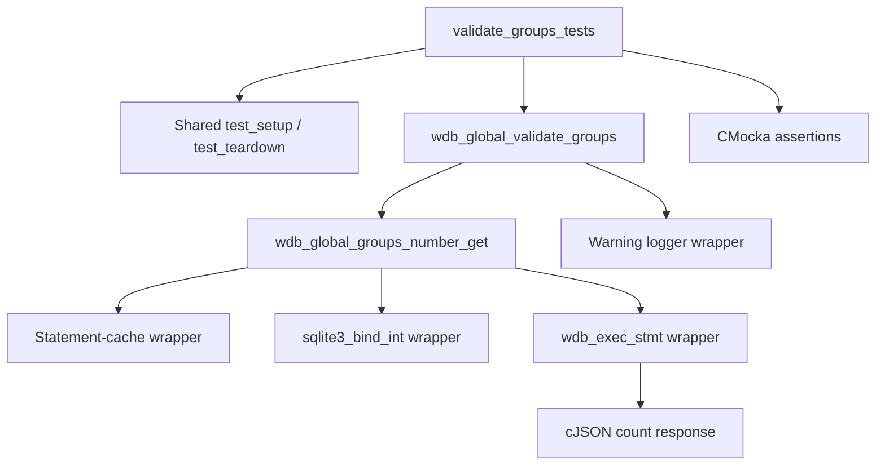
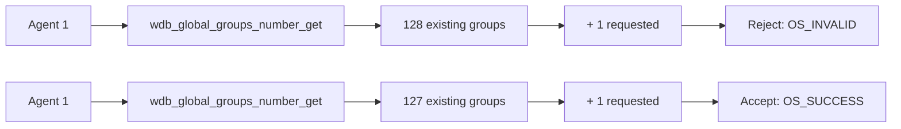
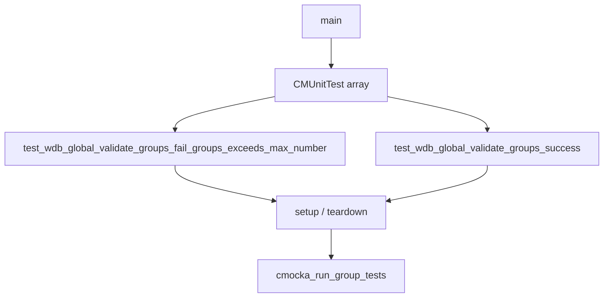

# `validate_groups_tests`

## Introduction

`validate_groups_tests` documents the focused CMocka coverage for
`wdb_global_validate_groups()`. The function validates whether a proposed set
of groups can be assigned to an agent without exceeding Wazuh's maximum group
count. The tests are part of the global Wazuh DB unit-test source
[`src/unit_tests/wazuh_db/test_wdb_global.c`](../../src/unit_tests/wazuh_db/test_wdb_global.c)
and are registered in the broader [`test_wdb_global`](test_wdb_global.md)
executable.

The module tests the boundary between group-management policy and the global
database count query. It does not perform a real SQLite operation: statement
initialization, parameter binding, query execution, JSON results, and logging
are controlled with wrappers.

## Position in the system

Group assignment workflows use the global database to determine the number of
groups already associated with an agent. `wdb_global_validate_groups()` adds
the number of requested groups to that existing count and rejects the request
when the configured limit would be exceeded. The surrounding group-management
operations are documented in [`wazuh_db_global`](wazuh_db_global.md), while
the count primitive is covered separately by
[`groups_number_get_tests`](groups_number_get_tests.md).



The limit is represented by `MAX_GROUPS_PER_MULTIGROUP`, which the tests
demonstrate as 128. The function under test is a validation helper; it does
not insert membership rows or update an agent's group context. Those mutation
paths are covered by the group assignment tests in the parent suite.

## Function contract

At the tested boundary, `wdb_global_validate_groups(wdb, j_groups, agent_id)`
performs these logical operations:

1. Query the current number of groups for `agent_id` through
   `wdb_global_groups_number_get()`.
2. Compare the current count plus the requested array size with the maximum
   permitted group count.
3. Emit a warning and return `OS_INVALID` if the total exceeds the limit.
4. Return `OS_SUCCESS` when the request remains within the limit.



The supplied tests specifically establish that the comparison includes the
existing database count and that a request is accepted when the resulting
total is within the limit. They do not define behavior for malformed JSON,
database failure, or an empty request; those cases belong to the broader
global test suite and production implementation documentation.

## Test harness and isolation

Both cases use `cmocka_unit_test_setup_teardown` with the shared
`test_setup()` and `test_teardown()` fixture from `test_wdb_global.c`.

The fixture creates a minimal synthetic `wdb_t` whose identifier is
`"global"`, allocates the database pointer and output buffer, and initializes
Wazuh DB configuration. No live database connection is required. Teardown
releases the allocations and configuration after each test, so the cases are
independent and order-insensitive.



The source file includes wrappers for many unrelated global DB tests. For
these two cases, the relevant interaction is limited to the statement cache,
SQLite bind, statement execution, cJSON ownership, and warning logger.

## Dependencies

| Dependency | Role in this module |
|---|---|
| `test_wdb_global.c` | Defines the two tests, shared fixture, and registration in `main()`. |
| `wdb_global_validate_groups()` | Production validation routine under test. |
| `wdb_global_groups_number_get()` | Retrieves the existing group count used by the validator. |
| `WDB_STMT_GLOBAL_AGENT_GROUPS_NUMBER_GET` | Statement identifier expected by the count query. |
| `wdb_init_stmt_in_cache` wrapper | Supplies a synthetic prepared statement. |
| `sqlite3_bind_int` wrapper | Verifies binding of the target agent ID. |
| `wdb_exec_stmt` wrapper | Supplies the JSON count response. |
| cJSON | Represents the mocked `[{"groups_number": N}]` query result. |
| `__wrap__mwarn` | Captures the limit-exceeded warning. |
| CMocka | Provides expectations, fixtures, and assertions. |



The test module therefore depends conceptually on three production areas:
global DB group-management logic, the global SQLite statement layer, and the
shared JSON/logging utilities. Detailed implementation ownership remains in
[`wazuh_db_global`](wazuh_db_global.md) and [`wazuh_db_engine`](wazuh_db_engine.md).

## Test scenarios

### Existing count already at the limit

`test_wdb_global_validate_groups_fail_groups_exceeds_max_number` creates a
single requested group and mocks the count query to return
`[{"groups_number":128}]` for agent `1`. The validator must reject the
request, emit:

```text
The groups assigned to agent 001 exceed the maximum of 128 permitted.
```

and return `OS_INVALID`. The test also verifies that the count query binds
agent ID `1` as parameter 1 and that the returned cJSON value is cleaned up.

### Count remains below the limit

`test_wdb_global_validate_groups_success` creates one requested group and
mocks the current count as `127`. The resulting total remains within the
limit, so the function returns `OS_SUCCESS` without expecting a warning.
The requested group name is 255 characters long, showing that group-count
validation accepts a valid boundary-length name when the count constraint is
satisfied. Character and length validation itself is documented in
[`validate_group_name_tests`](validate_group_name_tests.md).



## Component interaction and data flow

The validator receives a cJSON array but uses the database count as the
baseline for its capacity check. The mocked count response is an array of
objects, and the `groups_number` field is extracted by the count helper before
the validator performs its comparison.

```mermaid
sequenceDiagram
    participant T as Test case
    participant V as wdb_global_validate_groups
    participant G as wdb_global_groups_number_get
    participant S as Cached SQLite statement
    participant J as cJSON response
    participant L as Warning logger

    T->>V: j_groups=[one group], agent_id=1
    V->>G: Query current group count
    G->>S: Initialize and bind agent_id
    S-->>G: Scripted JSON count
    G->>J: Read groups_number; delete response
    G-->>V: 128 or 127
    V->>V: Add requested array size
    alt Total exceeds maximum
        V->>L: Emit exact limit warning
        V-->>T: OS_INVALID
    else Total is allowed
        V-->>T: OS_SUCCESS
    end
```

## Registration and execution

The cases are registered in `main()` alongside the other global database
tests:



The two registered cases are:

- `test_wdb_global_validate_groups_fail_groups_exceeds_max_number`
- `test_wdb_global_validate_groups_success`

They use fresh state and do not rely on one another. To run the complete
translation-unit suite, use the project’s normal unit-test build and invoke
the resulting `test_wdb_global` executable. Filtering to these names depends
on the CMocka runner options supplied by the build environment.

## Maintenance guidance

Changes to the group-count limit, count-query statement, JSON response shape,
or warning text should be reviewed against this module and
[`groups_number_get_tests`](groups_number_get_tests.md). Changes to group-name
syntax should be covered in [`validate_group_name_tests`](validate_group_name_tests.md)
instead of expanding this count-focused module.

The tests intentionally mock the count lookup rather than duplicating its SQL
behavior. This keeps the validator contract clear: the count helper owns
database access, while `wdb_global_validate_groups()` owns the capacity
decision.
