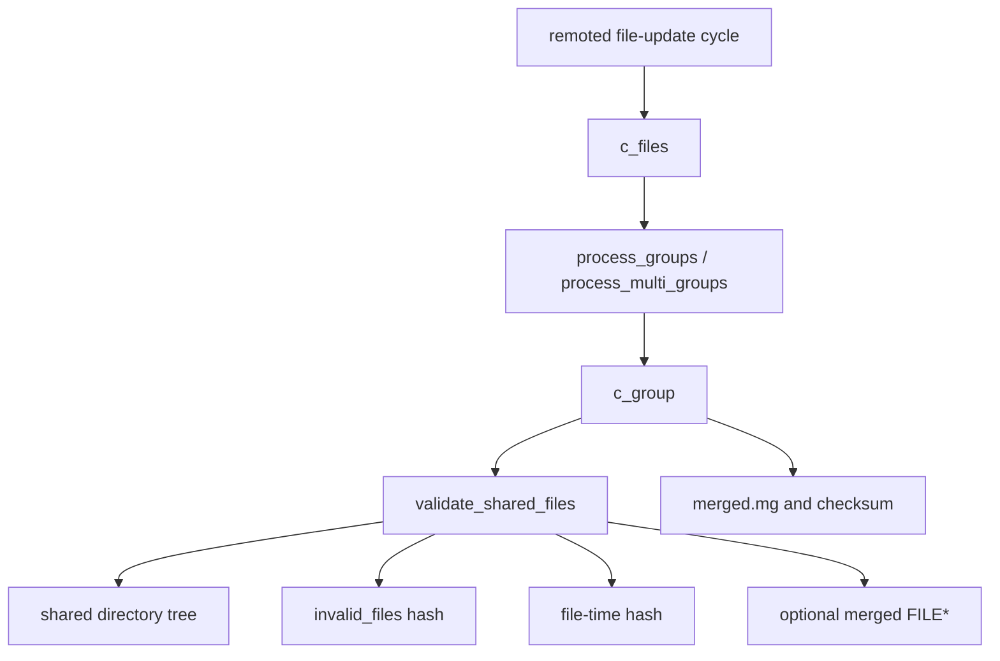
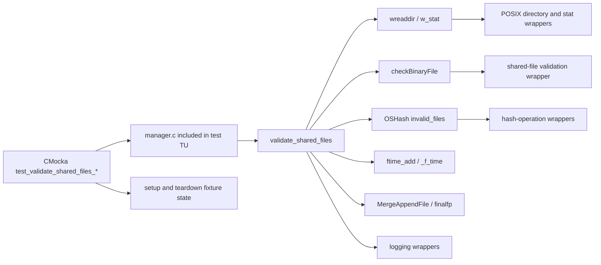
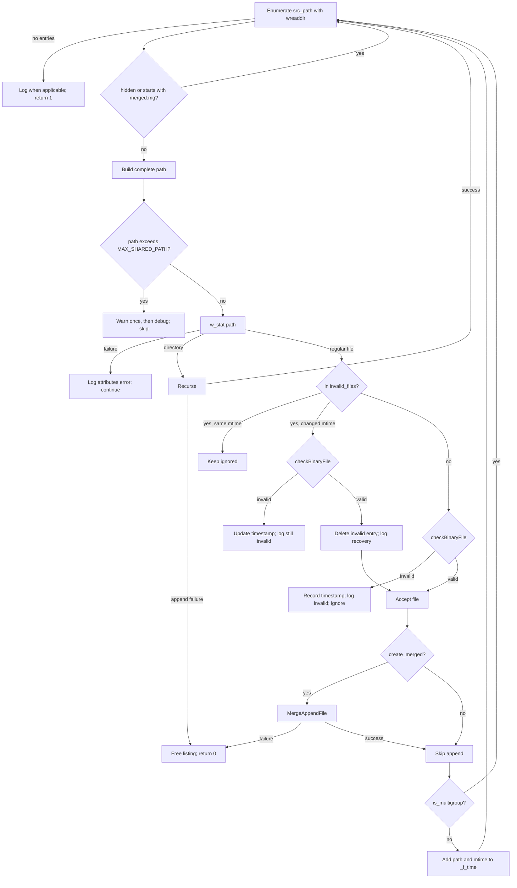
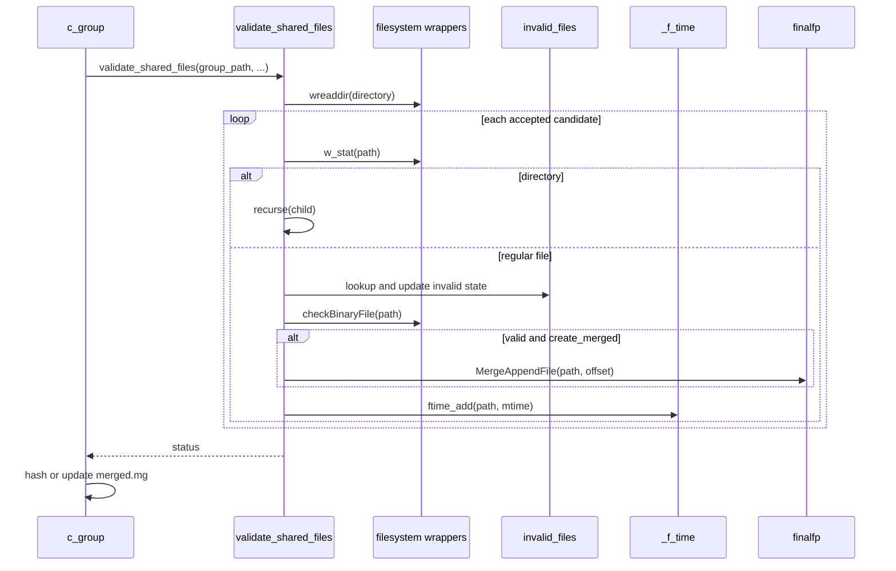
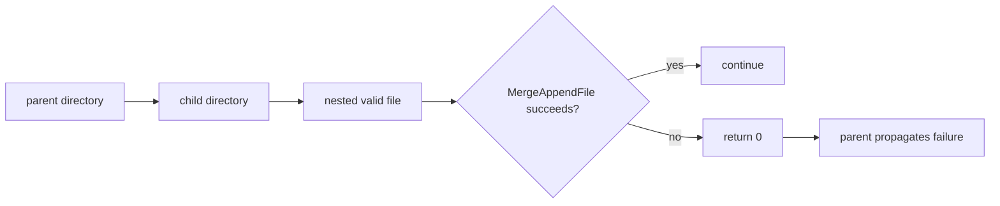

# `validate_shared_files_tests`

## Introduction

`validate_shared_files_tests` documents the CMocka coverage for the private
`validate_shared_files()` routine in Wazuh `remoted/manager.c`. The routine
walks a group shared-configuration directory, rejects unsafe or invalid
entries, optionally appends valid files to a merged configuration stream, and
records modification times for change detection.

The tests are white-box tests: `src/unit_tests/remoted/test_manager.c` includes
`../../remoted/manager.c` directly. This lets the suite exercise private
functions and process-wide hash tables while replacing filesystem, logging,
hashing, and file-validation calls with CMocka wrappers.

The focused module is the shared-file validation slice of the larger manager
test file. Group orchestration and control-message behavior are documented by
[`c_group_tests.md`](c_group_tests.md),
[`process_multi_groups_tests.md`](process_multi_groups_tests.md),
[`remoted_group_management.md`](remoted_group_management.md), and
[`save_controlmsg_tests.md`](save_controlmsg_tests.md).

## System position



`c_group()` creates the merge stream, adds the group header and `ar.conf`,
invokes the validator, and computes the merged checksum. `c_multi_group()`
stages files from several groups and invokes the same path. `c_files()` locks
the shared-file state and coordinates the complete update cycle.

## Architecture and dependencies



| Component | Responsibility | Role in these tests |
| --- | --- | --- |
| `validate_shared_files()` | Recursively validates and optionally merges entries | Primary unit under test |
| `c_group()` | Builds a group merge and tracks its checksum | Main caller/context |
| `c_multi_group()` | Stages group files into a hashed directory | Indirect caller |
| `invalid_files` | Maps invalid paths to their last observed mtime | Prevents repeated validation until a file changes |
| `_f_time` | Maps accepted paths to mtimes | Supports `ftime_changed()` |
| `finalfp` | Merge destination stream | Receives `MergeAppendFile()` output |

The fixture includes `manager.c` and mocks directory operations, `stat`, file
copying, hash/crypto operations, logging, Wazuh DB helpers, shared downloads,
and remoted operations. This isolates branch behavior from the real filesystem,
database, and network.

## Function contract

```c
STATIC int validate_shared_files(const char *src_path, FILE *finalfp,
                                 OSHash **_f_time, bool create_merged,
                                 bool is_multigroup, int path_offset);
```

| Parameter/state | Meaning |
| --- | --- |
| `src_path` | Directory currently being enumerated; recursive calls pass child directories. |
| `finalfp` | Optional merge stream. |
| `_f_time` | Output hash receiving accepted file paths and mtimes. |
| `create_merged` | Enables `MergeAppendFile()` for accepted files. |
| `is_multigroup` | Suppresses ordinary file-time entries for multi-group processing. |
| `path_offset` | Merge prefix length; the first invocation derives it from the first file path. |

Normal completion returns `1`. A failed merge append or recursive failure
returns `0` to the caller. An unreadable directory logs a diagnostic and
returns `1`; `ENOTDIR` is treated as a benign non-directory case.

## Validation and merge flow



The routine skips dot-prefixed entries, `merged.mg`, and generated temporary
merge files by the `merged.mg` prefix check. It recurses through directories,
checks regular files with `checkBinaryFile()`, and tracks invalid files by
mtime. A previously invalid file is rechecked only after its mtime changes.



## Test catalog

| Test | Behavior verified |
| --- | --- |
| `test_validate_shared_files_files_null` | Missing directory listing logs the open-directory diagnostic. |
| `..._hidden_file` | Dot-prefixed entries are ignored. |
| `..._merged_file` | `merged.mg` is not re-merged. |
| `..._max_path_size_warning` / `..._debug` | First oversized path warns; later oversized paths debug-log. |
| `..._valid_file_limite_size` | A boundary-sized path is processed. |
| `..._stat_error` | Attribute failure logs and processing continues. |
| `..._valid_file` | Valid regular file is accepted and added to `_f_time`. |
| `..._fail_add` | Invalid-file hash insertion failure logs an error. |
| `..._still_invalid` | Changed invalid file remains excluded and receives a new mtime. |
| `..._valid_now` | Previously invalid file recovers, is removed from `invalid_files`, and is accepted. |
| `..._merge_file` / `..._merge_file_append_fail` | Successful and failed merge appends. |
| `..._subfolder_empty` | Empty/unreadable child directory is safe. |
| `..._subfolder_valid_file` | Nested valid file is processed. |
| `..._valid_file_subfolder_empty` | Top-level file is processed before an empty child. |
| `..._valid_file_subfolder_valid_file` | Mixed top-level and nested files are processed. |
| `..._subfolder_append_fail` | Nested append failure propagates. |
| `..._sub_subfolder_valid_file` | Multi-level recursion works. |

The same `test_manager.c` translation unit also contains tests for
`copy_directory`, `c_group`, `c_multi_group`, `process_groups`,
`process_multi_groups`, `ftime_changed`, and `group_changed`. Those are
adjacent integration-oriented slices, not duplicated here.

## Key process flows

### Invalid-file recovery

```mermaid
stateDiagram-v2
    [*] --> Unseen
    Unseen --> Invalid : checkBinaryFile != 0
    Unseen --> Valid : checkBinaryFile == 0
    Invalid --> Invalid : same mtime / ignore
    Invalid --> Invalid : new mtime + invalid / update timestamp
    Invalid --> Valid : new mtime + valid / delete invalid entry
    Valid --> Accepted : optional merge; add file time
    Invalid --> [*] : excluded from merge and _f_time
```



### Path-length reporting

`reported_path_size_exceeded` is process-wide state. The first oversized path
emits a warning; subsequent oversized paths emit debug messages. `c_files()`
sets the flag after an update pass, which is why the warning/debug tests reset
it explicitly.



## Isolation and maintenance notes

Since `manager.c` is included into the test translation unit, changes to
private declarations, static globals, or wrapper call order can affect this
module even if the public remoted API is unchanged. New tests should:

1. isolate `invalid_files`, `_f_time`, and global flags in setup/teardown;
2. provide a complete `wreaddir()` sequence for every recursive level;
3. assert full paths, return values, and important diagnostics;
4. cover success and failure results from external calls; and
5. free arrays, timestamps, and hash entries consistently.

These tests are deterministic but do not replace integration coverage for real
permissions, filesystem races, file contents, or complete merged-file syntax.

## References

- Production: `repos/wazuh/src/remoted/manager.c`.
- Tests: `repos/wazuh/src/unit_tests/remoted/test_manager.c`.
- Related modules: [`remoted.md`](remoted.md),
  [`remoted_lifecycle.md`](remoted_lifecycle.md),
  [`remoted_group_management.md`](remoted_group_management.md), and
  [`test_manager_remoted_test_infrastructure.md`](test_manager_remoted_test_infrastructure.md).
