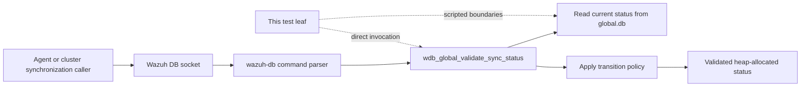
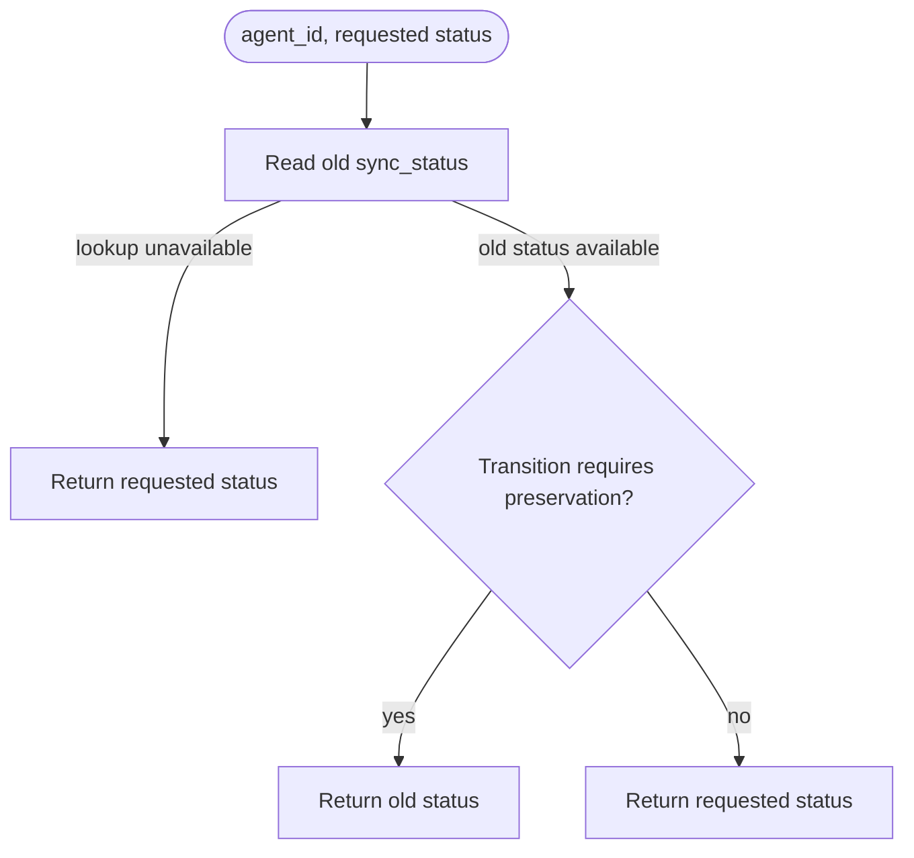
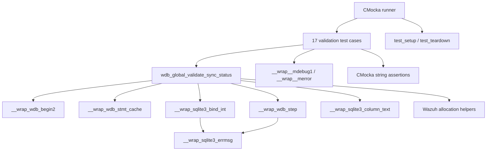
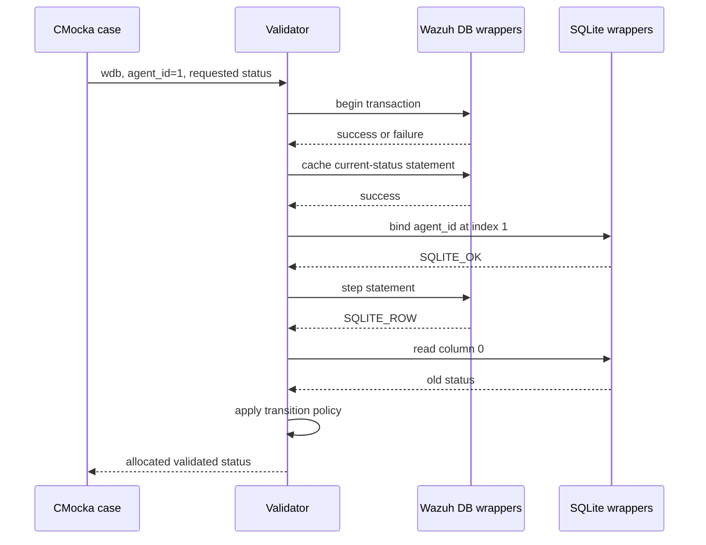
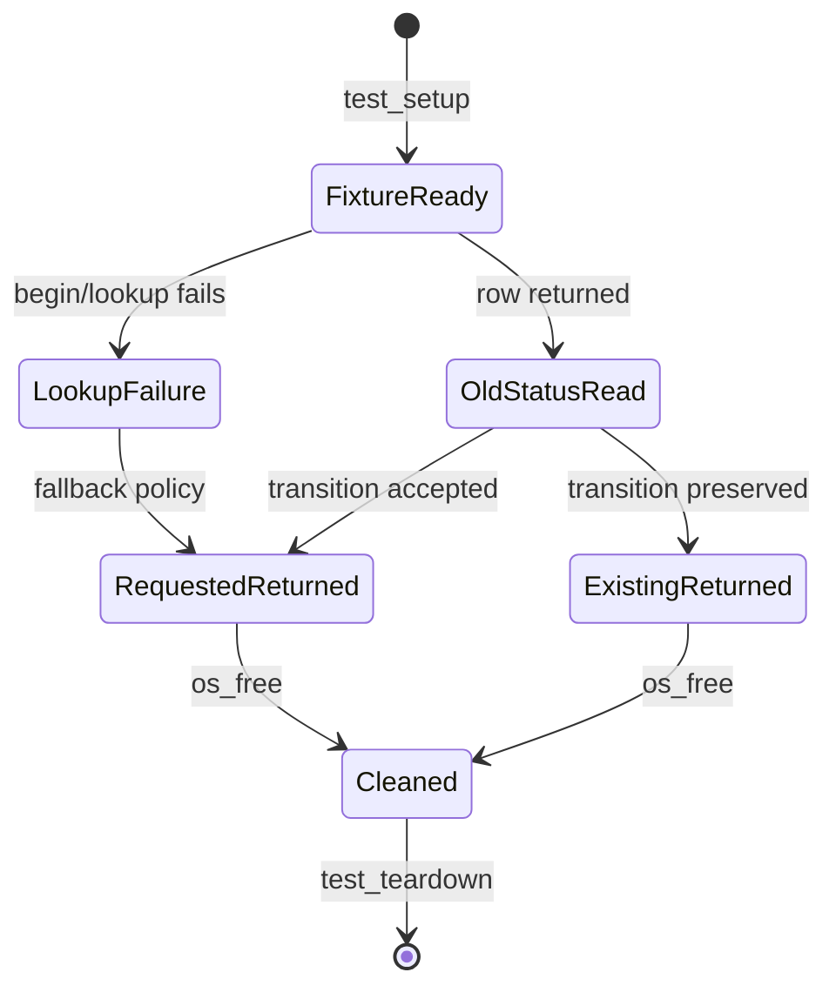

# `validate_sync_status_tests`

## Introduction

`validate_sync_status_tests` documents the 17 CMocka cases for
`wdb_global_validate_sync_status()` in
[`src/unit_tests/wazuh_db/test_wdb_global.c`](../../src/unit_tests/wazuh_db/test_wdb_global.c).
The function reads an agent's current synchronization status, evaluates a
requested replacement status, and returns the status that should be applied.

This is a focused leaf of the broader [`test_wdb_global`](test_wdb_global.md)
suite. The shared fixture and linker-wrapper conventions are documented in
[`test_wdb_global_test_infrastructure`](test_wdb_global_test_infrastructure.md),
and the production synchronization layer is described in
[`wazuh_db_global`](wazuh_db_global.md). This page does not duplicate the
parser, socket, or cluster synchronization documentation.

## Purpose and system position

The validator is a small policy boundary inside `wazuh-db`. Callers normally
reach it through the global-database command path; these tests call it
directly and replace the database access with CMocka-controlled wrappers.



The test scope is the validator's decision and its current-status lookup. It
does not test command parsing, socket framing, replication transport, or the
separate write operation that persists the returned value. Related status
reading and writing are covered by [`get_sync_status_tests`](get_sync_status_tests.md)
and [`set_sync_status_tests`](set_sync_status_tests.md).

## Contract under test

The exercised call is:

```c
char *wdb_global_validate_sync_status(wdb_t *wdb,
                                      int agent_id,
                                      const char *status);
```

The function obtains the old value for `agent_id`, compares it with the
requested `status`, and returns a newly allocated string. The tests show two
important policy rules:

- If the old status cannot be obtained, the requested status is accepted as a
  forward-progress fallback. The failure is logged as
  `Failed to get old sync_status for agent '1'`.
- Most transitions return the requested status unchanged. The validator keeps
  the existing status for two potentially unsafe downgrades:
  `syncreq -> syncreq_status` and `syncreq -> syncreq_keepalive`, plus
  `syncreq_status -> syncreq_keepalive`.



The returned string is owned by the caller. Every focused test releases it
with `os_free()`, including cases where the returned value equals the input
text by content.

## Status-transition matrix

The matrix below is derived from the named test cases. Each cell is the
expected returned value for the requested status in the column.

| Existing status | Requested `synced` | Requested `syncreq` | Requested `syncreq_status` | Requested `syncreq_keepalive` |
|---|---|---|---|---|
| `synced` | requested | requested | requested | requested |
| `syncreq` | requested | requested | existing (`syncreq`) | existing (`syncreq`) |
| `syncreq_status` | requested | requested | requested | existing (`syncreq_status`) |
| `syncreq_keepalive` | requested | requested | requested | requested |

There is no test for an unknown existing status. The test suite therefore
documents the supported synchronization-state combinations only; changes to
the production state model should add explicit cases here.

## Architecture and dependencies



| Dependency | Role in this leaf |
|---|---|
| `wdb.h` | Declares the target function, `wdb_t`, and Wazuh DB types. |
| `test_setup()` / `test_teardown()` | Creates and destroys a synthetic `global` database context. |
| `__wrap_wdb_begin2` | Controls whether the current-status lookup can start. |
| `__wrap_wdb_stmt_cache` | Controls prepared-statement acquisition. |
| `__wrap_sqlite3_bind_int` | Verifies agent ID binding at SQLite index `1`. |
| `__wrap_wdb_step` | Supplies `SQLITE_ROW` so an old status can be read. |
| `__wrap_sqlite3_column_text` | Supplies the existing status from result column `0`. |
| Logging and SQLite-error wrappers | Verify diagnostics for lookup failures. |
| CMocka and Wazuh allocators | Assert returned content and manage returned memory. |

The implementation details of these wrappers belong to
[`wazuh_db_wrappers`](wazuh_db_wrappers.md) and the shared fixture page; this
leaf records only the interactions relevant to status validation.

## Lookup and decision flow

For a normal old-status lookup, the tests establish the following interaction
sequence. The exact prepared-statement identifier is intentionally abstracted
behind `wdb_stmt_cache()` in this focused documentation.



The `no_old_status` case takes the failure branch at transaction start. It
asserts that the error is reported but that validation still returns the
requested `synced` value. The remaining 16 cases provide `SQLITE_ROW` and
exercise the transition matrix.

## Test scenarios

| Test case | Existing status | Requested status | Expected result |
|---|---|---|---|
| `test_wdb_global_validate_sync_status_no_old_status` | unavailable | `synced` | Returns requested `synced`; logs lookup failure. |
| `test_wdb_global_validate_sync_status_synced_to_synced` | `synced` | `synced` | Returns requested status. |
| `test_wdb_global_validate_sync_status_synced_to_syncreq` | `synced` | `syncreq` | Returns requested status. |
| `test_wdb_global_validate_sync_status_synced_to_syncreq_status` | `synced` | `syncreq_status` | Returns requested status. |
| `test_wdb_global_validate_sync_status_synced_to_syncreq_keepalive` | `synced` | `syncreq_keepalive` | Returns requested status. |
| `test_wdb_global_validate_sync_status_syncreq_to_synced` | `syncreq` | `synced` | Returns requested status. |
| `test_wdb_global_validate_sync_status_syncreq_to_syncreq` | `syncreq` | `syncreq` | Returns requested status. |
| `test_wdb_global_validate_sync_status_syncreq_to_syncreq_status` | `syncreq` | `syncreq_status` | Preserves and returns old `syncreq`. |
| `test_wdb_global_validate_sync_status_syncreq_to_syncreq_keepalive` | `syncreq` | `syncreq_keepalive` | Preserves and returns old `syncreq`. |
| `test_wdb_global_validate_sync_status_syncreq_status_to_synced` | `syncreq_status` | `synced` | Returns requested status. |
| `test_wdb_global_validate_sync_status_syncreq_status_to_syncreq` | `syncreq_status` | `syncreq` | Returns requested status. |
| `test_wdb_global_validate_sync_status_syncreq_status_to_syncreq_status` | `syncreq_status` | `syncreq_status` | Returns requested status. |
| `test_wdb_global_validate_sync_status_syncreq_status_to_syncreq_keepalive` | `syncreq_status` | `syncreq_keepalive` | Preserves and returns old `syncreq_status`. |
| `test_wdb_global_validate_sync_status_syncreq_keepalive_to_synced` | `syncreq_keepalive` | `synced` | Returns requested status. |
| `test_wdb_global_validate_sync_status_syncreq_keepalive_to_syncreq` | `syncreq_keepalive` | `syncreq` | Returns requested status. |
| `test_wdb_global_validate_sync_status_syncreq_keepalive_to_syncreq_status` | `syncreq_keepalive` | `syncreq_status` | Returns requested status. |
| `test_wdb_global_validate_sync_status_syncreq_keepalive_to_syncreq_keepalive` | `syncreq_keepalive` | `syncreq_keepalive` | Returns requested status. |

All row-returning cases verify the agent ID bind (`1` at index `1`) and read
the old value from column `0`. The tests therefore cover both the policy
table and the minimum database interaction required to obtain its input.

## Fixture and execution model

Each case is registered with `cmocka_unit_test_setup_teardown`. The common
fixture allocates a `test_struct_t`, a `wdb_t` whose ID is `"global"`, a
synthetic SQLite-handle slot, and the global Wazuh DB configuration. No real
SQLite connection, database file, or Wazuh DB socket is opened.



This isolation is important: the tests prove return values and call ordering,
not persistence. Persistence of a selected status is covered by the related
`wdb_global_set_sync_status()` tests and production documentation.

## Maintenance guidance

Update this module documentation when any of the following changes:

- a synchronization status is added, removed, or renamed;
- a transition changes from “requested” to “existing” or vice versa;
- lookup failure no longer falls back to the requested value;
- the status lookup changes its bind index, step behavior, or result column; or
- the returned string ownership or allocation contract changes.

Keep transport and orchestration details in the linked parent modules. When
the validator is called as part of agent or group synchronization, consult
[`wazuh_db_global`](wazuh_db_global.md) and the relevant cluster documentation
instead of expanding this unit-test leaf.

## Source references

- Test source: [`src/unit_tests/wazuh_db/test_wdb_global.c`](../../src/unit_tests/wazuh_db/test_wdb_global.c)
- Production module: [`wazuh_db_global`](wazuh_db_global.md)
- Parent suite: [`test_wdb_global`](test_wdb_global.md)
- Shared fixture and wrapper strategy: [`test_wdb_global_test_infrastructure`](test_wdb_global_test_infrastructure.md)
- Related status read tests: [`get_sync_status_tests`](get_sync_status_tests.md)
- Related status write tests: [`set_sync_status_tests`](set_sync_status_tests.md)
