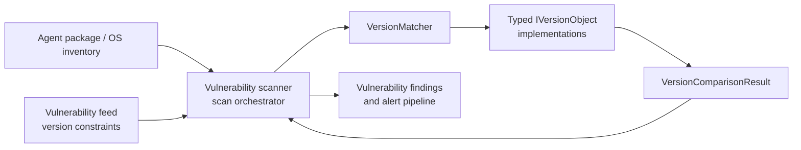
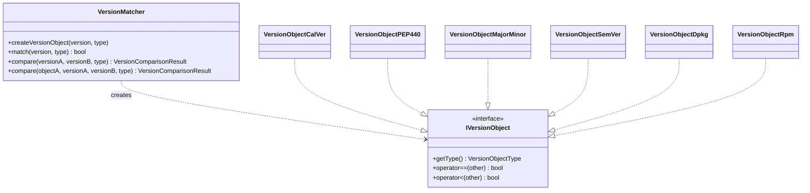
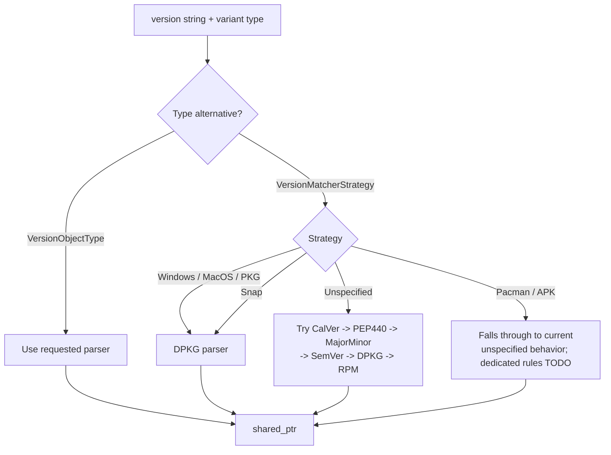
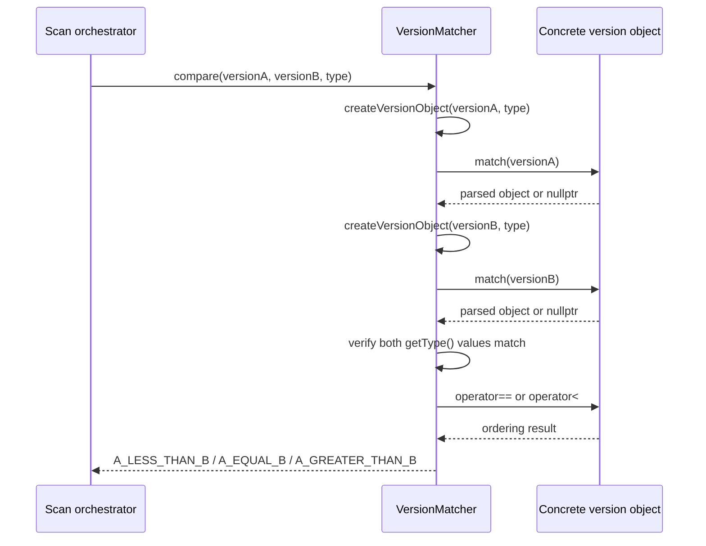

# Version matcher

## Purpose

The `version_matcher` module provides a common, type-aware way to parse and compare software version strings for Wazuh's vulnerability scanner. It converts raw package or operating-system version text into an `IVersionObject`, then applies the comparison rules of the selected ecosystem.

The module is header-only in the supplied tree and is located at:

`src/wazuh_modules/vulnerability_scanner/src/scanOrchestrator/versionMatcher/`

Its public entry point is `VersionMatcher`. The implementation supports explicit version types and higher-level package-manager strategies.

## Position in the vulnerability scanner

The matcher is a value-comparison service used by the vulnerability scanner's scan orchestration and package/feed evaluation logic. It does not retrieve inventory, download vulnerability feeds, or emit alerts itself. Those responsibilities belong to neighboring vulnerability-scanner components such as the [vulnerability scanner façade](vulnerability_scanner_facade.md), [database feed manager](database_feed_manager.md), scanner pipeline, and alert builders.

## Architecture

The design has three layers:

1. `VersionMatcher` is the façade and dispatch layer.
2. `IVersionObject` defines the polymorphic contract: `getType()`, equality, and ordering.
3. Concrete version objects parse and compare one representation: CalVer, PEP 440, major/minor, SemVer, Debian/DPKG, and RPM.

The shared interface is defined in `iVersionObjectInterface.hpp`. The matcher additionally uses `VersionObjectType` from the vulnerability scanner definitions and returns `VersionComparisonResult`.

## Sub-modules

- [Version matcher dispatch](version_matcher_dispatch.md) — public façade, strategy routing, object construction, validation, comparison, error behavior, and package-strategy mapping.
- [Version object implementations](version_matcher_version_objects.md) — parsing fields and ordering semantics for all six concrete representations.

These pages contain the detailed component descriptions; this overview intentionally avoids duplicating their implementation-level details.

## Supported representations

| Representation | Main use | Comparison model |
|---|---|---|
| CalVer | Calendar-style releases | year, month, day, micro component |
| PEP 440 | Python-style releases | epoch, release segments, pre/post/dev releases |
| MajorMinor | Two-component versions | major, then minor |
| SemVer | Semantic versions | major, minor, patch, pre-release; build metadata is parsed but not ordering data |
| DPKG | Debian-family packages and mapped package strategies | epoch, upstream version, Debian revision |
| RPM | RPM-family packages | epoch, version, release using RPM segment rules |

## Strategy routing

A caller can pass either a concrete `VersionObjectType` or a `VersionMatcherStrategy` through a `std::variant`.

Important implementation details:

- The default strategy is `Unspecified`, which tries parsers in a fixed order and returns the first successful type.
- Windows, MacOS, and PKG currently map to DPKG parsing.
- Snap currently maps to DPKG parsing.
- Pacman and APK are marked for dedicated strategy definitions but currently fall through to the unspecified chain.
- Explicit object types avoid ambiguity and should be preferred when the caller knows the package ecosystem.

## Processing and comparison flow

If either version cannot be parsed, or if the two objects resolve to different concrete types, `compare` throws `std::invalid_argument`. A null cached left-hand object in the overload accepting `shared_ptr<IVersionObject>` is also invalid.

## API summary

### `createVersionObject`

Creates a polymorphic version object from a string and either an explicit type or strategy. It returns `nullptr` when parsing fails.

### `match`

Returns whether the supplied version can be represented by the requested type or strategy. It is a non-throwing validity check for normal parse failures.

### `compare`

Provides three-way ordering through `VersionComparisonResult`. The overload accepting a pre-created left object allows callers to reuse a parsed value, while the right-hand string is parsed on demand.

## Design considerations and limitations

- Automatic detection is order-sensitive. A string accepted by more than one parser is classified by the first successful parser in the unspecified chain.
- Cross-type comparison is intentionally rejected; callers must select a compatible type or strategy.
- Parser strictness differs by implementation. CalVer, PEP 440, major/minor, and SemVer use regular expressions; DPKG applies Debian-oriented structural checks; RPM extraction is comparatively permissive and delegates ordering to RPM-style rules.
- Build metadata is captured by SemVer parsing but excluded from equality and ordering.
- The Pacman and APK strategy cases still require dedicated rules.
- Logging uses the vulnerability scanner log tag for parser and strategy failures.

## Maintenance guide

When adding a new ecosystem:

1. Add a data structure and concrete `IVersionObject` implementation.
2. Define parsing and ordering semantics in that implementation.
3. Add the corresponding `VersionObjectType`.
4. Wire the type into `VersionMatcher::createVersionObject`.
5. Add a strategy mapping if package-manager-specific behavior is needed.
6. Add tests for parsing, equality, ordering, invalid input, and mixed-type rejection.
7. Update [Version object implementations](version_matcher_version_objects.md) and this support table.

