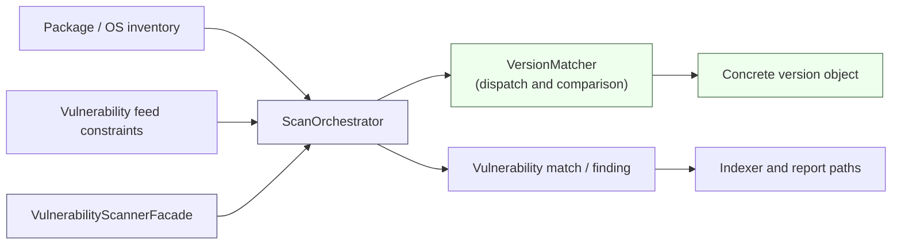
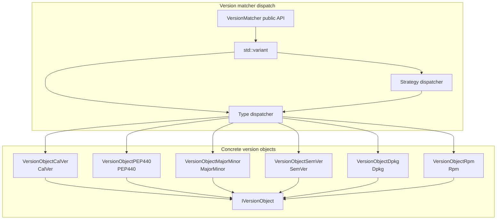
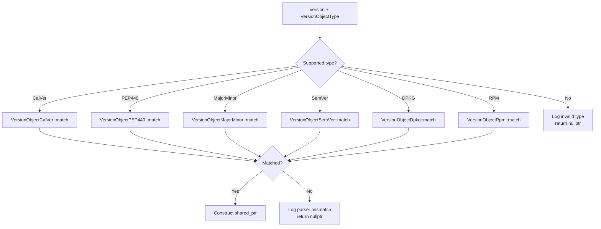
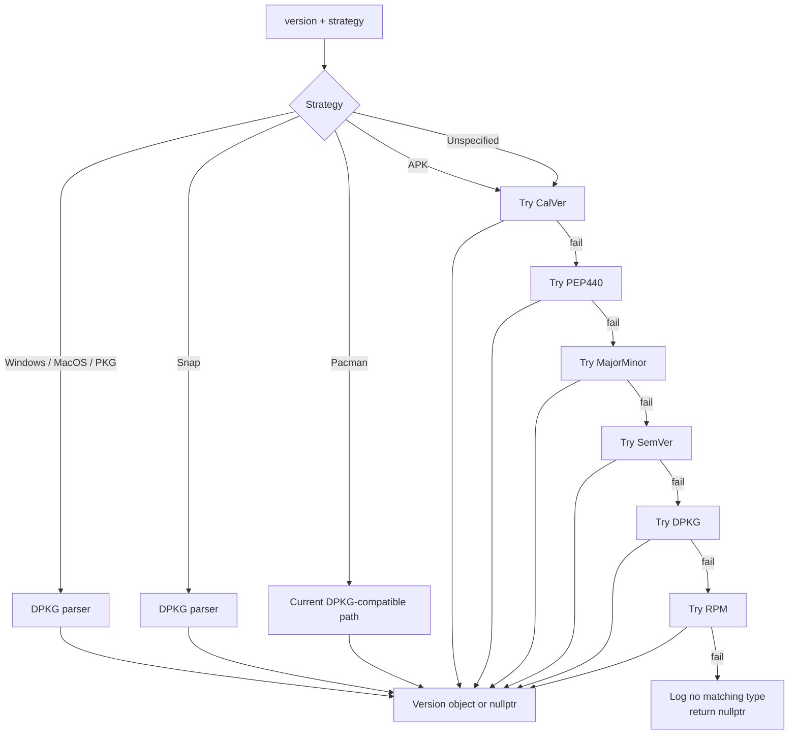
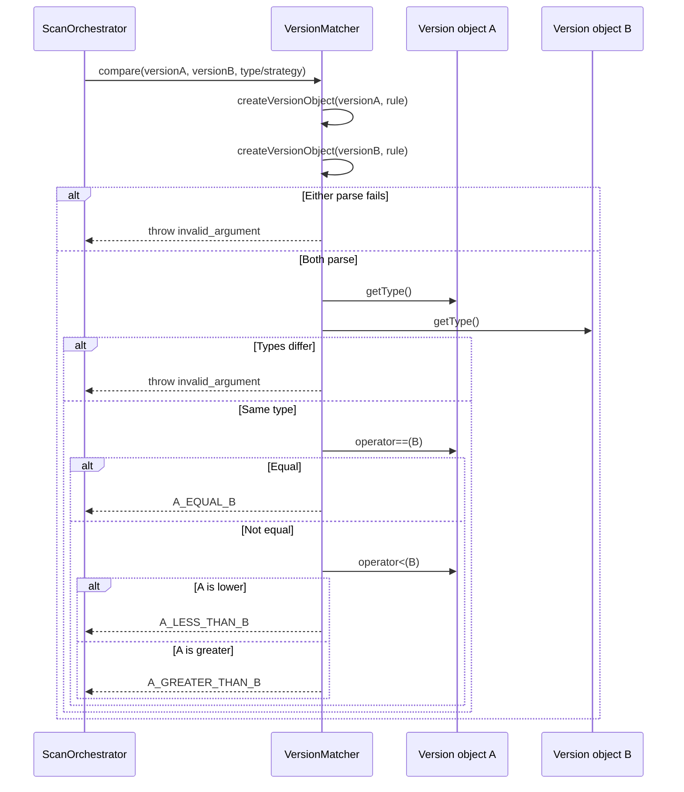
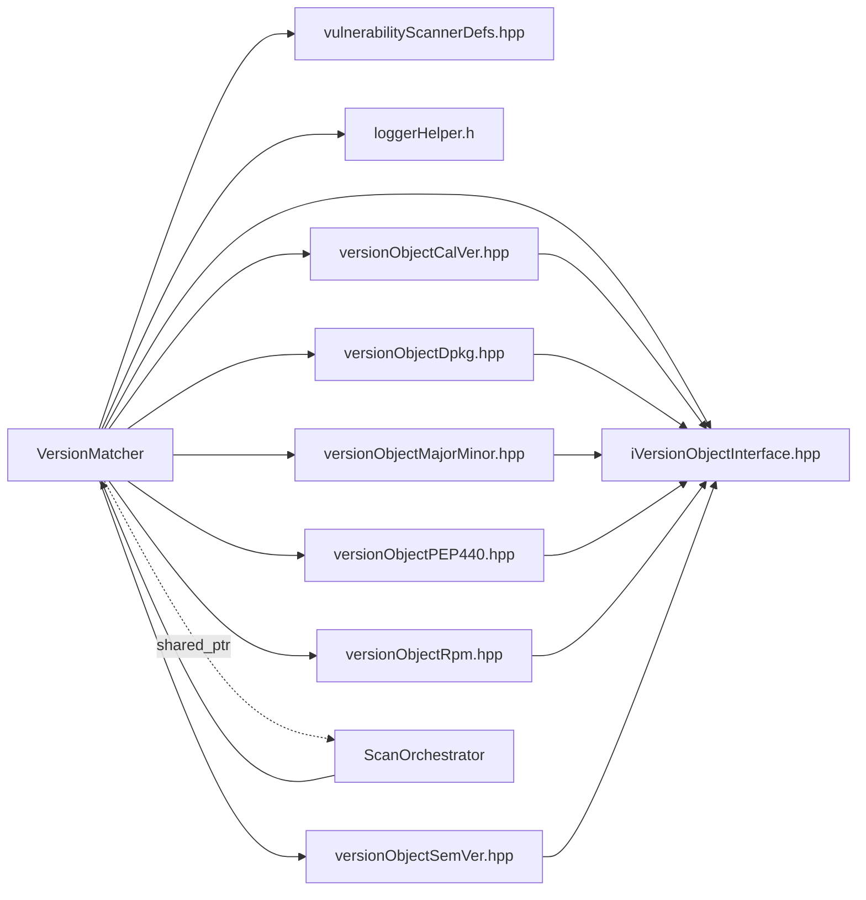

# Version Matcher Dispatch

## Introduction

The **Version Matcher Dispatch** module is the type-and-strategy dispatch layer for Wazuh vulnerability scanning. It converts a package version string into a concrete `IVersionObject`, selects the appropriate parser for a package ecosystem, validates version syntax, and compares two versions through the common version-object interface.

The module is implemented by the header-only `VersionMatcher` class in `versionMatcher.hpp`. It does not collect inventory, load vulnerability feeds, or publish findings. Those responsibilities belong to the surrounding [vulnerability scanner facade](vulnerability_scanner_facade.md), scan orchestrator, and database feed manager.

## Position in the system

`VersionMatcher` is consumed by the vulnerability scanner’s scan-orchestration path after package or operating-system inventory has been obtained and before a vulnerability condition is evaluated. Its output is a normalized comparison result or a failure when a version cannot be parsed consistently.



For lifecycle, subscriptions, inventory events, feed updates, and reporting, see [vulnerability_scanner_facade.md](vulnerability_scanner_facade.md). For feed ingestion and vulnerability database state, see [database_feed_manager.md](database_feed_manager.md).

## Responsibilities

| Responsibility | Implementation | Description |
|---|---|---|
| Type dispatch | `createVersionObject(version, VersionObjectType)` | Invokes the matching parser and constructs the concrete version object. |
| Strategy dispatch | `createVersionObject(version, VersionMatcherStrategy)` | Maps platform/package strategies to a parser or applies the default parser order. |
| Variant dispatch | Public `createVersionObject` | Accepts either an explicit object type or a matcher strategy. |
| Validation | `match` | Returns whether a string can be represented by the requested type or strategy. |
| Comparison | `compare` overloads | Compares parsed objects and returns `VersionComparisonResult`. |
| Diagnostics | `logDebug2` with `WM_VULNSCAN_LOGTAG` | Records invalid types, strategies, and parser mismatches. |

The class is `final` and exposes only static operations. It has no instance state, cache, I/O, or ownership of scanner services.

## Architecture



The concrete parser and value-object semantics are documented in [version_matcher_version_objects.md](version_matcher_version_objects.md). This document focuses on how `VersionMatcher` chooses and coordinates them.

## Core types

### `VersionComparisonResult`

The comparison API returns one of three ordered outcomes:

- `A_LESS_THAN_B`
- `A_EQUAL_B`
- `A_GREATER_THAN_B`

The result is deliberately independent of the concrete version format. Ordering is implemented by the selected `IVersionObject` type.

### `VersionMatcherStrategy`

Strategies describe package or platform conventions rather than a single parser:

| Strategy | Dispatch behavior |
|---|---|
| `Unspecified` | Try `CalVer`, `PEP440`, `MajorMinor`, `SemVer`, `DPKG`, then `RPM`, in that order. |
| `Windows` | Use DPKG-compatible parsing. |
| `MacOS` | Use DPKG-compatible parsing. |
| `PKG` | Use DPKG-compatible parsing. |
| `Snap` | Use DPKG-compatible parsing. |
| `Pacman` | Falls through to the currently shared DPKG-compatible path; a dedicated strategy is marked TODO in the source. |
| `APK` | Falls through to the `Unspecified` parser chain; a dedicated strategy is marked TODO in the source. |

The Pacman and APK mappings are compatibility behavior, not evidence that their package semantics are fully modeled. Maintainers should treat the TODO markers as extension points.

### `PackageMap`

`PackageMap` is an alias for an unordered map from `std::string_view` to a variant containing either `VersionObjectType` or `VersionMatcherStrategy`. The alias provides a compact way for higher-level scanner code to associate package names or package families with parsing rules; the supplied component does not populate or consume the map itself.

## Dispatch behavior

### Explicit object type

The type dispatcher handles each supported `VersionObjectType` independently:

1. Create the corresponding value object (`CalVer`, `PEP440`, `MajorMinor`, `SemVer`, `Dpkg`, or `Rpm`).
2. Call that type’s static `match(version, output)` parser.
3. If parsing succeeds, return a `std::shared_ptr<IVersionObject>` containing the populated object.
4. If parsing fails, log a debug message and return `nullptr`.



### Strategy type

The strategy dispatcher first translates platform/package conventions into a concrete type. For `Unspecified`, it performs ordered fallback parsing. The first successful parser wins, so the order is significant when a string could be accepted by more than one grammar.



## Public API

### `createVersionObject`

```cpp
static std::shared_ptr<IVersionObject> createVersionObject(
    const std::string& version,
    std::variant<VersionObjectType, VersionMatcherStrategy> type);
```

The public overload inspects the variant with `std::holds_alternative` and delegates to either the type or strategy dispatcher. A valid parser result is returned as a polymorphic shared pointer; invalid input, type, or strategy returns `nullptr`.

### `match`

```cpp
static bool match(
    const std::string& version,
    std::variant<VersionObjectType, VersionMatcherStrategy> type);
```

`match` is a lightweight validation operation implemented as a null check around `createVersionObject`. It does not retain the parsed object. The source documentation states that an unspecified *version type* is not allowed; callers should pass an explicit type or an intentional matcher strategy and handle a false result.

### `compare` from two strings

```cpp
static VersionComparisonResult compare(
    const std::string& versionA,
    const std::string& versionB,
    std::variant<VersionObjectType, VersionMatcherStrategy> type =
        VersionMatcherStrategy::Unspecified);
```

The method parses both strings using the same requested type or strategy. It then requires both resulting objects to report the same concrete `getType()` before applying `==` and `<`. If either parse fails, or the concrete types differ, it throws `std::invalid_argument`.

### `compare` with a pre-parsed left operand

```cpp
static VersionComparisonResult compare(
    std::shared_ptr<IVersionObject> pVersionObjectA,
    const std::string& versionA,
    const std::string& versionB,
    std::variant<VersionObjectType, VersionMatcherStrategy> type =
        VersionMatcherStrategy::Unspecified);
```

This overload avoids reparsing the left-hand object. It validates that the pointer is non-null, parses only `versionB`, checks concrete type compatibility, and performs the same comparison. The caller remains responsible for ensuring that the pre-parsed object represents `versionA` and is appropriate for the requested comparison context.

## Comparison process



The matcher intentionally does not compare objects of different concrete types. This prevents silently applying incompatible ordering rules when automatic strategy detection selects different formats for the two operands.

## Error handling and diagnostics

There are two failure styles:

1. **Non-throwing construction/validation:** `createVersionObject` and `match` return `nullptr` or `false` when parsing fails. Debug logs identify the attempted parser, strategy, or invalid enum value.
2. **Comparison failure:** `compare` converts construction failure, null pre-parsed input, and concrete-type mismatch into `std::invalid_argument` with both version strings in the message.

The debug path uses the vulnerability scanner logging tag and `logDebug2` from shared utility infrastructure. Logging is diagnostic only; it does not change parser selection or comparison behavior.

## Dependency relationships



The standard library dependencies are `memory`, `stdexcept`, `string`, and `variant`; the source also relies on the unordered-map type used by `PackageMap`. The module’s only behavioral dependencies are the version-object parsers, the common interface, and scanner logging definitions.

## Maintainer considerations

- Preserve the fallback order for `Unspecified` unless changing compatibility behavior is intentional and tested.
- Keep both operands on the same concrete version-object type. A successful parse alone is not sufficient for a valid comparison.
- Add a dedicated strategy when package-manager semantics cannot safely be represented by an existing parser. The source currently marks Pacman and APK strategy specialization as TODO.
- Keep parser construction polymorphic through `IVersionObject`; callers should not need to know the concrete class selected by automatic dispatch.
- Treat `nullptr` from construction as a normal validation outcome, but treat comparison exceptions as a contract failure requiring caller handling.
- Avoid adding mutable matcher state without reassessing thread safety: the current class is stateless and naturally safe for concurrent calls, assuming its parser implementations are safe.

## Related modules

- [version_matcher_version_objects.md](version_matcher_version_objects.md) — concrete CalVer, PEP440, MajorMinor, SemVer, DPKG, and RPM representations and parsing rules.
- [vulnerability_scanner_facade.md](vulnerability_scanner_facade.md) — scanner lifecycle, event transport, scan orchestration, and the matcher’s system-level owner.
- [database_feed_manager.md](database_feed_manager.md) — vulnerability-feed and database-feed responsibilities that provide constraints to scanning.
- [wazuh_modules_core_native_bridges.md](wazuh_modules_core_native_bridges.md) — native daemon bridge that loads and starts the vulnerability scanner.

## Source reference

- `src/wazuh_modules/vulnerability_scanner/src/scanOrchestrator/versionMatcher/versionMatcher.hpp` — `VersionMatcher`, `VersionComparisonResult`, `VersionMatcherStrategy`, and `PackageMap`.
