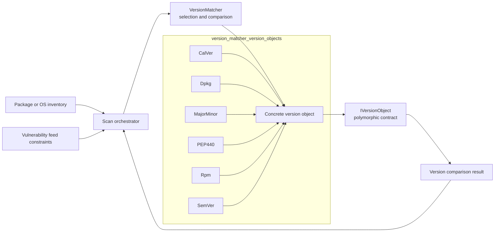
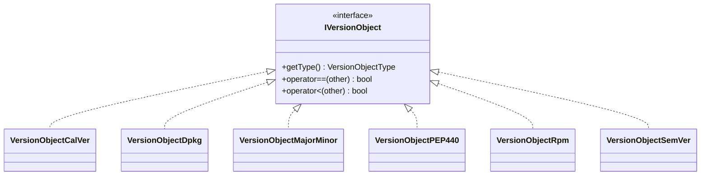
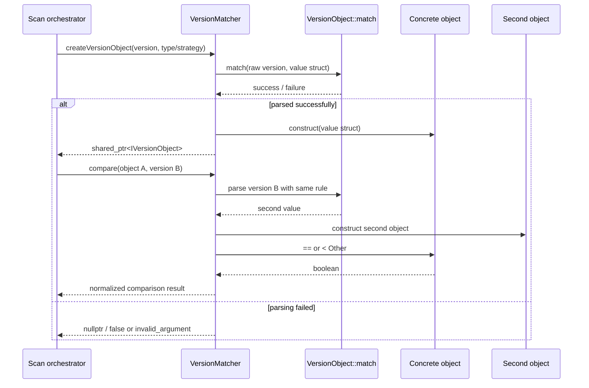
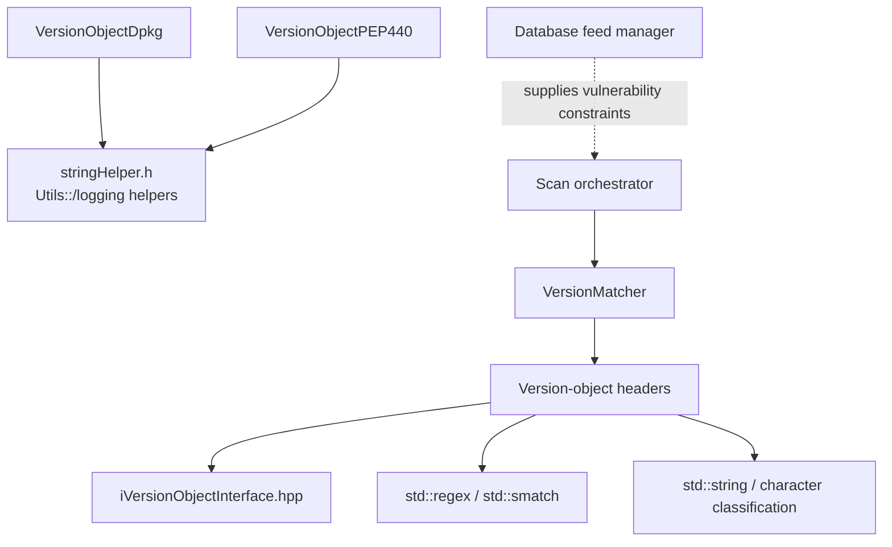

# Version Matcher Version Objects

## Introduction

The **Version Matcher Version Objects** module implements the concrete, format-specific representations used by Wazuh vulnerability scanning to parse and order package or operating-system versions. Each object converts a string into structured fields, reports its `VersionObjectType`, and implements equality and less-than comparison through the common `IVersionObject` interface.

The module is a leaf of the version-matching subsystem. Selection of a parser, automatic fallback, polymorphic construction, and comparison-result mapping are handled by [version_matcher_dispatch.md](version_matcher_dispatch.md). Feed ingestion and vulnerability candidate lookup remain the responsibility of [database_feed_manager.md](database_feed_manager.md), while scanner lifecycle and orchestration are described in [vulnerability_scanner_facade.md](vulnerability_scanner_facade.md).

## Position in the system



The normal flow is: `VersionMatcher` chooses a concrete type, calls its static `match()` function, constructs the corresponding `VersionObject*`, and compares two objects through `operator==` and `operator<`. The concrete classes do not access inventory, feeds, databases, sockets, or the indexer.

## Components and source locations

| Format / value struct | Concrete class | Source |
|---|---|---|
| Calendar version | `CalVer` / `VersionObjectCalVer` | `versionObjectCalVer.hpp` |
| Debian package version | `Dpkg` / `VersionObjectDpkg` | `versionObjectDpkg.hpp` |
| Major and minor version | `MajorMinor` / `VersionObjectMajorMinor` | `versionObjectMajorMinor.hpp` |
| Python packaging version | `PEP440` / `VersionObjectPEP440` | `versionObjectPEP440.hpp` |
| RPM package version | `Rpm` / `VersionObjectRpm` | `versionObjectRpm.hpp` |
| Semantic version | `SemVer` / `VersionObjectSemVer` | `versionObjectSemVer.hpp` |

All six classes are `final`, inherit from `IVersionObject`, and expose a constructor taking the parsed value struct. Their destructors are defaulted and virtual through the interface. Parsing is static and writes into a caller-provided struct, which keeps parsing separate from object construction.

## Common object contract



### Shared behavior

- `match(version, output)` returns `true` when the input can be represented by the format and populates the value struct.
- `getType()` identifies the concrete format.
- `operator==` and `operator<` first `dynamic_cast` the right-hand operand to the same concrete class.
- Comparing different concrete types throws `std::runtime_error`; cross-format comparisons should therefore be prevented by [version_matcher_dispatch.md](version_matcher_dispatch.md).
- The classes store parsed fields privately, so callers compare normalized objects rather than raw strings.

## Parsing and comparison behavior

### CalVer

`CalVer` stores `year`, `month`, `day`, and `micro`. `VersionObjectCalVer::match()` uses its static regular expression to extract four components. A two-digit year is interpreted as `2000 + year`; a four-digit year is retained. Month and day are optional and default to zero, while supplied values must be in the ranges 1–12 and 1–31 respectively. The micro component defaults to zero.

Ordering is lexicographic by `year`, then `month`, then `day`, then `micro`. This is a field ordering; it does not validate calendar-specific month/day combinations such as February 30.

### Dpkg

`Dpkg` models Debian’s epoch, upstream version, and Debian revision:

```text
epoch:version-revision
```

The epoch is optional and defaults to zero. The revision is the suffix after the first hyphen in the version portion. Leading and trailing whitespace is accepted only when it surrounds the complete value; additional non-whitespace content causes rejection. The version must begin with a digit, and empty versions or empty revisions are rejected.

Comparison follows the Debian `deb-version(5)` style algorithm implemented locally:

1. Compare epoch numerically.
2. Compare the upstream version in alternating non-digit and digit runs.
3. In non-digit runs, digits sort before letters, `~` sorts before everything, and other punctuation receives a higher ordering weight.
4. Ignore leading zeroes in numeric runs and compare the numeric run lengths and first differing digit.
5. Compare the Debian revision using the same algorithm when upstream versions are equal.

The parser logs characters outside the expected character sets but, as implemented, does not return `false` solely for those characters. Maintainers should distinguish this diagnostic behavior from strict validation.

### MajorMinor

`MajorMinor` contains only unsigned `major` and `minor` fields. Its parser regular expression must capture exactly those two components; both are converted with `std::stoul`. Comparison is numeric major-first, then numeric minor. This type is intentionally narrower than SemVer and has no patch, pre-release, or metadata fields.

### PEP 440

`PEP440` stores epoch, a dotted release string, optional pre-release information, optional post-release number, and optional development-release number. The parser normalizes pre-release labels:

| Input labels | Stored label |
|---|---|
| `alpha` | `a` |
| `beta` | `b` |
| `c`, `pre`, `preview` | `rc` |

Absent epoch and release suffixes become zero-valued fields or false presence flags. Release components are split on dots and padded with zeroes before numeric comparison.

Ordering is epoch, release components, pre-release presence/content/number, post-release presence/number, and development-release presence/number. The implementation uses lexical comparison for normalized pre-release labels (`a`, `b`, `rc`) and stores presence flags explicitly, so callers should rely on this class’s behavior rather than assuming a generic PEP 440 library is being used.

### RPM

`Rpm` models an RPM EVR value:

```text
[epoch:]version[-release]
```

The parser defaults the epoch to zero, takes the portion before the hyphen as `version`, and takes the suffix as `release`. The supplied `match()` implementation is intentionally lightweight: it always returns `true` after splitting, while malformed epoch text can still cause the numeric conversion to throw.

Comparison first orders epoch numerically, then compares version, then release using the local `rpmvercmp()` implementation. The comparator:

- skips separators that are neither alphanumeric nor `~`/`^`;
- treats `~` as older than other content;
- treats `^` as a post-release separator with special end-of-string handling;
- compares numeric segments by ignoring leading zeroes and then by length;
- compares alphabetic segments lexically; and
- treats a remaining suffix as newer unless it is ordered by the special separator rules.

The constants `RIGHT_IS_NEWER`, `LEFT_EQ_RIGHT`, and `LEFT_IS_NEWER` express the comparator’s result convention. `operator<` maps `RIGHT_IS_NEWER` to the left object being older than the right object.

### SemVer

`SemVer` stores numeric `major`, `minor`, and `patch` values, plus `preRelease` and `buildMetadata` strings. The regular-expression parser must capture all five fields, with optional suffixes represented as empty strings.

Comparison is numeric major/minor/patch ordering followed by pre-release ordering. A non-empty pre-release is older than an empty pre-release; two non-empty pre-release strings are compared lexically. Build metadata is parsed and retained but is deliberately ignored by both equality and ordering, consistent with its non-ordering role in semantic-version precedence.

The implementation does not split pre-release identifiers into numeric and non-numeric components; its behavior is the direct string comparison shown above. This is an important maintenance constraint when changing the parser or using the class for standards-sensitive comparisons.

## Parsing and comparison flow



The parser functions are pure with respect to scanner state: they consume a string and populate a value struct. The only notable external behavior is diagnostic logging in the DPKG parser for unexpected characters. Object construction copies the parsed fields, so the caller’s temporary value struct can be discarded after construction.

## Dependencies



Direct dependencies are standard C++ facilities plus the shared interface. DPKG and PEP440 additionally include shared helpers; PEP440 uses `Utils::splitToNumbers`, while DPKG uses shared logging and character/string utilities. The module has no direct dependency on the vulnerability database or package inventory providers.

## Failure modes and maintenance notes

| Condition | Behavior |
|---|---|
| Regular-expression mismatch in CalVer, MajorMinor, PEP440, or SemVer | `match()` returns `false`. |
| Invalid CalVer month/day | `match()` returns `false`; impossible month/day combinations are not checked. |
| Empty or structurally invalid DPKG value | `match()` returns `false`. |
| Unexpected DPKG characters | Debug logging occurs; the current parser may still return `true`. |
| RPM split input | `match()` returns `true` after splitting; epoch conversion may throw for malformed numeric text. |
| Unsupported right-hand object type | Comparison throws `std::runtime_error`. |
| Build metadata difference in SemVer | Objects remain equal because metadata is ignored. |
| Different pre-release strings | SemVer and PEP440 use the class-specific ordering rules described above. |

When adding a new version format, maintainers should add a value struct and concrete `IVersionObject` implementation here, define parsing and total ordering semantics, extend the enum and dispatch paths in [version_matcher_dispatch.md](version_matcher_dispatch.md), and add tests for malformed input, equality, boundary ordering, and cross-type rejection. Keep parser selection out of these value objects so the leaf module remains independent of package discovery and scanner orchestration.

## Related modules

- [version_matcher_dispatch.md](version_matcher_dispatch.md) — parser selection, strategy fallback, polymorphic construction, and public comparison APIs.
- [database_feed_manager.md](database_feed_manager.md) — vulnerability-feed persistence and candidate lookup that supplies constraints to scanning.
- [vulnerability_scanner_facade.md](vulnerability_scanner_facade.md) — vulnerability scanner lifecycle and orchestration boundary.
- [data_provider_packages_linux_parsers.md](data_provider_packages_linux_parsers.md) — package metadata parsing on Linux; it produces inventory consumed upstream of this module but does not implement these comparison objects.
