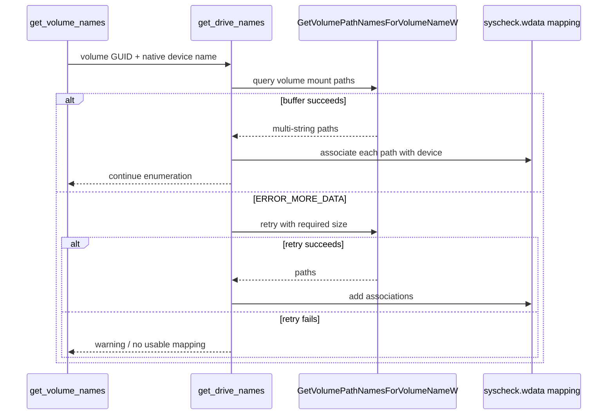
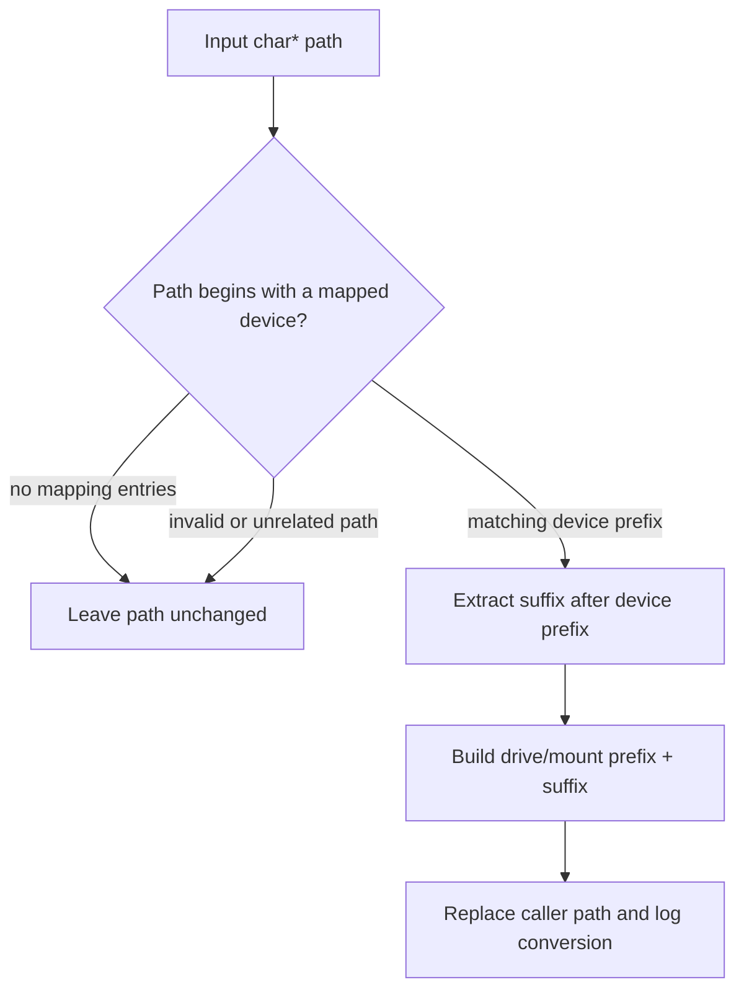
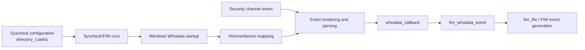

# `volume_device_path_tests`

## Introduction

`volume_device_path_tests` documents the Windows-specific unit tests that verify how Syscheck/FIM translates native Windows volume and device paths into usable drive or mount paths. The focused tests live in `src/unit_tests/syscheckd/whodata/test_win_whodata.c` and exercise `replace_device_path()`, `get_drive_names()`, and `get_volume_names()` through CMocka wrappers around the Windows volume APIs.

This translation is required by the Windows Whodata engine: Windows event records may identify an object as a native device path such as `\\Device\\HarddiskVolume1\\...`, while configured FIM paths normally use DOS drive paths such as `C:\\...`. The tests verify successful translation, no-match behavior, malformed input, empty mapping state, volume enumeration failures, and mount-point discovery failures.

The production Whodata lifecycle, SACL management, event parsing, and callback processing are described in [syscheckd_whodata](syscheckd_whodata.md). Generic FIM event consumption is covered by [fim_realtime_whodata_tests](fim_realtime_whodata_tests.md); shared CMocka and wrapper conventions are described by [test_infrastructure](test_infrastructure.md) where applicable.

## Scope and source location

| Item | Description |
| --- | --- |
| Test source | `src/unit_tests/syscheckd/whodata/test_win_whodata.c` |
| Documented test group | Device-path replacement and Windows volume/drive mapping tests |
| Production functions | `replace_device_path`, `get_drive_names`, `get_volume_names` |
| Test framework | CMocka with linker/API wrappers |
| Platform | Windows agent / Windows Whodata build |
| Input forms | Native device paths, volume GUID paths, DOS drive letters, mount points |
| Main state | `syscheck.wdata.device[]` and `syscheck.wdata.drive[]` |

The translation unit also contains tests for SACLs, audit policies, event parsing, callback dispatch, and the Whodata state checker. Those broader responsibilities are intentionally not duplicated here; see [syscheckd_whodata](syscheckd_whodata.md) for the runtime design.

## Role in the Windows Whodata architecture

Windows Whodata receives Security Event Log records through the Windows Event Log subscription. The event path is normalized before it is matched against FIM configuration. Volume discovery builds the device-to-mount mapping used by that normalization.

```mermaid
flowchart LR
    FIM[Syscheck/FIM configuration] --> WD[Windows Whodata]
    WD --> ENUM[get_volume_names]
    ENUM --> Q[QueryDosDeviceW]
    ENUM --> V[FindFirstVolumeW / FindNextVolumeW]
    V --> DRIVE[get_drive_names]
    DRIVE --> MOUNT[GetVolumePathNamesForVolumeNameW]
    Q --> MAP[device[] + drive[] mapping]
    MOUNT --> MAP
    MAP --> REPLACE[replace_device_path]
    EVENT[Windows Security event path] --> REPLACE
    REPLACE --> NORMALIZED[DOS or mount-point path]
    NORMALIZED --> MATCH[FIM directory/path matching]
    MATCH --> CORE[Whodata callback and FIM event processing]
```

The mapping is shared state owned by `syscheck.wdata`. `device[i]` stores a native device prefix and `drive[i]` stores the corresponding DOS drive or mount-point prefix. `replace_device_path()` scans the mapping and replaces the first matching device prefix while preserving the suffix.

## Component relationships

```mermaid
graph TD
    T[volume_device_path_tests\n(test_win_whodata.c)] --> C[CMocka]
    T --> S[syscheck.wdata\ndevice[] / drive[]]
    T --> R[replace_device_path]
    T --> G[get_drive_names]
    T --> V[get_volume_names]
    V --> F1[FindFirstVolumeW]
    V --> F2[FindNextVolumeW]
    V --> Q[QueryDosDeviceW]
    V --> C1[FindVolumeClose]
    G --> P[GetVolumePathNamesForVolumeNameW]
    T --> L[logging wrappers]
    T --> W[Windows API wrappers]
    W -. scripted results .-> F1
    W -. scripted results .-> F2
    W -. scripted results .-> Q
    W -. scripted results .-> P
```

The tests call the real production functions but replace operating-system calls with wrappers. This isolates string manipulation, enumeration control flow, return values, diagnostics, and cleanup from the host machine’s actual volumes.

## Data model and mapping semantics

The relevant state is an indexed parallel mapping:

| Array | Meaning | Example |
| --- | --- | --- |
| `syscheck.wdata.device[i]` | Native Windows device prefix | `\\Device\\Floppy0` |
| `syscheck.wdata.drive[i]` | User-visible drive/mount prefix | `A:` |

For an input path `\\Device\\Floppy0\\a\\path`, the expected output is `A:\\a\\path`. The replacement preserves the portion after the matched device prefix. If no entry matches, the original string remains unchanged.

The fixtures allocate ten pointer slots for both arrays. Each test owns any strings it inserts, and `teardown_replace_device_path()` releases both arrays using the project’s string-array cleanup helper. This prevents mapping state from leaking between tests.

## Processing flows

### Volume enumeration and mapping construction

`get_volume_names()` enumerates Windows volumes, validates the returned volume path, strips the `\\\\?\\` prefix and trailing separator as required for `QueryDosDeviceW`, queries the native device name, and delegates mount-point discovery to `get_drive_names()`.

```mermaid
flowchart TD
    S[get_volume_names] --> FIRST[FindFirstVolumeW]
    FIRST -->|invalid handle| E1[Warn and return -1]
    FIRST --> VALID[Validate volume path]
    VALID -->|bad path| E2[Warn, close handle, return -1]
    VALID --> QUERY[QueryDosDeviceW]
    QUERY -->|failure| E3[Warn, close handle, return -1]
    QUERY --> DRIVE[get_drive_names(volume, device)]
    DRIVE --> NEXT[FindNextVolumeW]
    NEXT -->|success| VALID
    NEXT -->|ERROR_NO_MORE_FILES| CLOSE[Close volume enumeration]
    NEXT -->|other error| E4[Warn, close handle, return -1]
    CLOSE --> OK[Return 0]
```

The tests cover:

- failure to obtain the first volume;
- an invalid first-volume path;
- a volume with no DOS device mapping;
- failure while advancing to the next volume;
- normal `ERROR_NO_MORE_FILES` termination.

### Mount-point discovery

`get_drive_names()` asks Windows for all paths associated with a volume. The API returns a double-null-terminated wide-character list. The test fixture supplies `A`, `C`, and `\\Some\\path` and verifies that each is logged as a mounting point associated with the queried device.



The test suite also verifies an access-denied result on the initial call and a retry path where `ERROR_MORE_DATA` is followed by another failure. Diagnostics include the Windows error code and formatted system message.

### Device-path replacement



The focused cases are:

| Case | Input | Expected result |
| --- | --- | --- |
| Invalid path | `invalid\\path` | Unchanged |
| Empty mapping | `\\C:\\a\\path` | Unchanged |
| No match | `\\Device\\NotFound0\\a\\path` | Unchanged |
| Match | `\\Device\\Floppy0\\a\\path` | `A:\\a\\path` |

Each configured device is logged while it is checked. A successful match additionally logs the old and new path, which makes the replacement decision observable without inspecting private implementation details.

## Test fixtures and isolation

The replacement tests use:

1. `setup_replace_device_path()` to allocate parallel device and drive arrays.
2. A test-specific path allocated with `strdup()`.
3. `teardown_replace_device_path()` to free mapping strings, arrays, and the test-owned path.

Volume and drive tests do not require a persistent fixture because all Windows API behavior is supplied through wrappers. The wrapper expectations specify input buffers, return values, output strings, and `GetLastError()` values. This is important because volume enumeration is inherently host-dependent in a live process.

The broader `test_win_whodata.c` runner uses separate groups for callback tests, state-checker tests, directory-map cleanup, and general Whodata tests. The group setup loads a Syscheck test configuration and establishes `syscheck` state; the focused device-path fixtures deliberately reset only the mapping state they own.

## Failure contracts validated

The tests establish the following observable contracts:

- `replace_device_path()` is non-destructive when the path is malformed, empty, or unmatched.
- `get_drive_names()` reports API failures and does not assume a mount-point list exists.
- `get_volume_names()` returns `-1` for enumeration, path-validation, DOS-device-query, or non-terminal next-volume errors.
- `get_volume_names()` returns `0` when enumeration ends normally with `ERROR_NO_MORE_FILES`.
- Every successful mapping may have multiple associated mount paths.
- Volume enumeration handles are closed on both error and normal completion.
- Windows error details are surfaced through the Wazuh warning/logging wrappers.

These are unit-level contracts. They do not prove that a particular Windows installation exposes a given volume GUID, drive letter, or mount point; that behavior belongs to platform/integration testing.

## Relationship to the rest of Syscheck/FIM



The path mapping is an enabling utility, not a standalone event processor. Once a normalized path is produced, matching, attribution, scan-state transitions, SACL validation, and FIM event generation are handled by the surrounding Windows Whodata and Syscheck components. See [fim_realtime_whodata_tests](fim_realtime_whodata_tests.md) for the downstream FIM event boundary and [syscheckd_core](syscheckd_core.md) for daemon orchestration.

## Maintenance guidance

When changing Windows path normalization or volume discovery:

- update both the device/drive arrays and their teardown assumptions;
- preserve the double-null-terminated multi-string behavior of `GetVolumePathNamesForVolumeNameW`;
- keep `ERROR_NO_MORE_FILES` distinct from actual `FindNextVolumeW` errors;
- add coverage for prefix collisions and mount paths if matching semantics change;
- compile and run the Windows Whodata variant, since these APIs and wrappers are platform-specific;
- update [syscheckd_whodata](syscheckd_whodata.md) if the mapping becomes part of startup, callback, or resource-release behavior.

## References

- [syscheckd_whodata](syscheckd_whodata.md) — Windows/Linux Whodata context and runtime responsibilities.
- [fim_realtime_whodata_tests](fim_realtime_whodata_tests.md) — downstream FIM handling of normalized Whodata events.
- [syscheckd_core](syscheckd_core.md) — Syscheck daemon lifecycle and scan orchestration.
- [syscheckd_file](syscheckd_file.md) — file-level FIM processing after event normalization.
- [test_run_check](test_run_check.md) — Windows Whodata startup and mode-transition tests.
