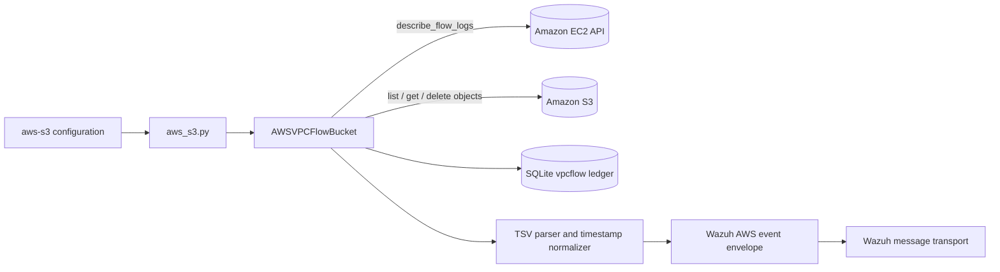
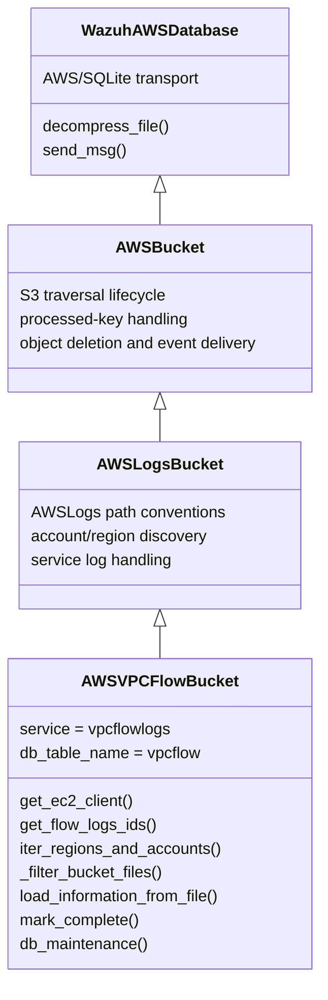
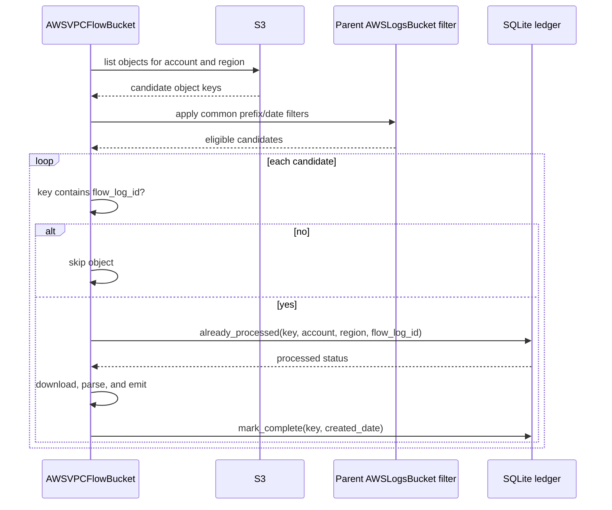
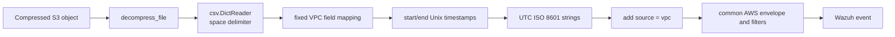
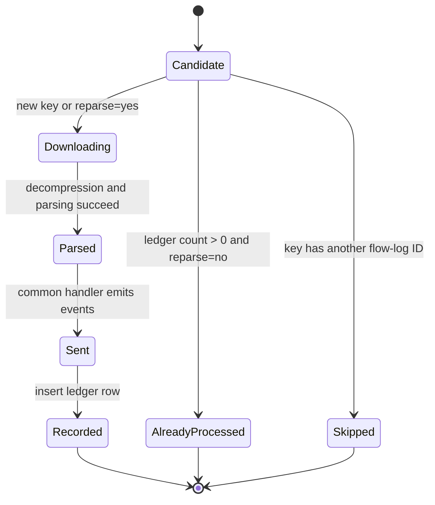
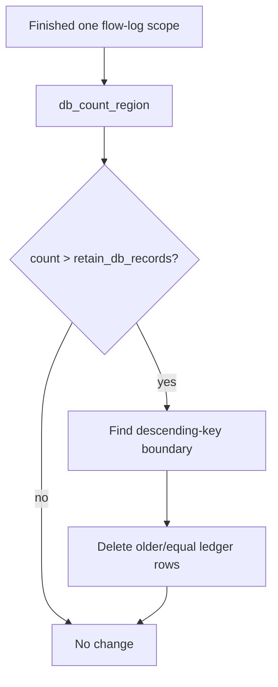

# AWS VPC Flow Logs bucket handler

`AWSVPCFlowBucket` is the VPC Flow Logs specialization of Wazuh’s AWS S3 ingestion pipeline. It discovers flow-log IDs through the EC2 API, restricts S3 traversal to objects belonging to each flow log, parses space-delimited records, converts Unix timestamps to ISO 8601, and emits normalized events with `source: vpc`.

The class supplies VPC-specific state and parsing rules while inheriting object listing, downloading, decompression, event delivery, and common S3 error handling from [`aws_buckets_s3_core`](aws_buckets_s3_core.md). Its broader placement in the AWS Wodle is described in [`aws_buckets_s3`](aws_buckets_s3.md) and [`aws`](aws.md).

## Role in the system

The handler is created by the AWS S3 runner after configuration has selected the VPC Flow Logs source. It coordinates two AWS APIs: EC2 identifies valid flow-log IDs for an account and region, while S3 provides the log objects. A SQLite ledger prevents the same object from being processed repeatedly.



## Architecture



`AWSVPCFlowBucket` deliberately calls the parent constructor first. The inherited S3/database setup must exist before the subclass installs its VPC-specific SQL statements. The constructor then stores explicit credentials or an AWS profile and sets the EC2 service name used by the integration.

## Responsibilities

| Component | Responsibility |
|---|---|
| `AWSVPCFlowBucket.__init__` | Establish VPC service identity, credentials/profile, and the `vpcflow` processed-object ledger schema. |
| `get_ec2_client` | Build a boto3 session from keys or profile, validate the region, and create an EC2 client. |
| `get_flow_logs_ids` | Call `describe_flow_logs()` and extract each `FlowLogId`. Invalid regions are logged and produce no work. |
| `iter_regions_and_accounts` | Resolve missing accounts/regions, enumerate flow-log IDs, process each scope, and run cleanup. |
| `_filter_bucket_files` | Retain only parent-selected S3 objects whose key contains the current flow-log ID. |
| `load_information_from_file` | Decompress an object, parse its space-delimited rows, normalize timestamps, and add the VPC source marker. |
| `already_processed` / `mark_complete` | Read and write the object-processing ledger, with reparse-aware behavior. |
| `db_count_region` / `db_maintenance` | Bound ledger growth per bucket/account/region/flow-log scope. |

## Account, region, and flow-log traversal

The method accepts optional `account_id` and `regions` collections. If accounts are absent, inherited bucket discovery finds accounts represented in S3. If regions are absent for an account, inherited discovery finds the available regions. For every account-region pair, the handler queries EC2 for flow-log IDs and processes each ID independently.

```mermaid
flowchart TD
    Start[iter_regions_and_accounts] --> Accounts{account_id supplied?}
    Accounts -->|no| FindAccounts[find_account_ids from S3]
    Accounts -->|yes| UseAccounts[use configured accounts]
    FindAccounts --> AccountLoop[for each AWS account]
    UseAccounts --> AccountLoop
    AccountLoop --> Regions{regions supplied?}
    Regions -->|no| FindRegions[find_regions from S3]
    Regions -->|yes| UseRegions[use configured regions]
    FindRegions --> RegionLoop[for each region]
    UseRegions --> RegionLoop
    RegionLoop --> EC2[describe_flow_logs]
    EC2 --> IDs[FlowLogId list]
    IDs --> Files[iter_files_in_bucket(account, region, flow_log_id)]
    Files --> Cleanup[db_maintenance]
```

An invalid region is handled inside `get_flow_logs_ids`: `get_ec2_client` raises `ValueError`, a diagnostic is written, and the current scope is skipped. Other EC2 client-creation failures are logged by `aws_tools.error` and terminate through the existing integration policy.

## AWS credentials and EC2 client creation

`get_ec2_client` passes the target region to `boto3.Session`. Credential selection is mutually exclusive:

1. When both `access_key` and `secret_key` are present, they become explicit session credentials.
2. Otherwise, a configured `profile_name` is used.
3. The session creates an `ec2` client with inherited connection configuration.

The region is checked against `aws_tools.ALL_REGIONS` before the client call. This protects the flow-log discovery stage from querying unsupported or misspelled regions.

## S3 object filtering

The parent `AWSLogsBucket` filtering pipeline performs the common prefix, date, folder, and processed-object checks. The VPC override adds one constraint: the current object key must contain the flow-log ID.



This extra key check is important because a region can contain objects for multiple flow logs. The handler avoids relying solely on the account/region prefix.

## Log parsing and normalization

`load_information_from_file` uses the inherited `decompress_file` context manager, so compression handling remains in the common S3 module. Each line is read by `csv.DictReader` with a single-space delimiter and these fixed field names:

| Field | Meaning |
|---|---|
| `version` | VPC Flow Logs record format version. |
| `account_id` | Account associated with the network interface. |
| `interface_id` | Elastic network interface identifier. |
| `srcaddr`, `dstaddr` | Source and destination addresses. |
| `srcport`, `dstport` | Source and destination ports. |
| `protocol` | Network protocol number. |
| `packets`, `bytes` | Traffic counters. |
| `start`, `end` | Unix epoch timestamps, converted to UTC ISO 8601 strings. |
| `action` | Accepted or rejected traffic action. |
| `log_status` | Flow log delivery status. |

Every parsed row is copied into a dictionary with `source='vpc'`. The common parent subsequently wraps these records in Wazuh’s AWS event envelope and applies shared filtering/transport behavior.



The timestamp conversion uses `datetime.utcfromtimestamp(int(value))` and formats values as `YYYY-MM-DDTHH:MM:SSZ`. The guard `value not in unix_fields` avoids converting a field-name-like token, although malformed numeric content can still raise during parsing and is handled by the parent ingestion error path.

## Processed-object ledger

The constructor defines a dedicated `vpcflow` table. Its composite primary key is:

```text
(bucket_path, aws_account_id, aws_region, flow_log_id, log_key)
```

This scope prevents collisions between identical S3 keys belonging to different accounts, regions, or flow logs. Each row records `processed_date` and the object’s `created_date`.



In normal mode, `already_processed` checks the full composite scope. In reparse mode, `mark_complete` checks for an existing row only to report that the file was already marked complete; it does not insert a new completion row. This avoids primary-key conflicts while allowing reparsing.

## Ledger retention and maintenance

After all flow logs in an account-region scope are processed, `db_maintenance` counts rows for that exact bucket/account/region/flow-log tuple. If the count exceeds `retain_db_records`, it deletes rows at or below the key selected by descending-key order with `OFFSET :retain_db_records`. The result is a bounded resume ledger retaining the newest configured number of keys.



Cleanup failures are logged with account and region context and do not replace the main ingestion error with an unqualified exception.

## Operational considerations

- EC2 flow-log discovery and S3 object discovery are separate. A flow log must be discoverable through EC2 and have matching S3 keys to produce events.
- S3 keys are filtered by substring containment of `flow_log_id`; naming conventions must preserve the ID in the object key.
- The processed ledger is a resume/deduplication index, not an event archive.
- `reparse` intentionally permits existing objects back through parsing, but completion rows remain unique.
- Credential errors during client creation exit through the established AWS utility error path; invalid regions are recoverable per account-region iteration.
- Parsing and message delivery semantics, including skip-on-error behavior, are inherited from [`aws_buckets_s3_core`](aws_buckets_s3_core.md).

## Related documentation

- [aws_buckets_s3](aws_buckets_s3.md) — S3 bucket family, inheritance, and common processing flow.
- [aws_buckets_s3_core](aws_buckets_s3_core.md) — `AWSBucket`, `AWSLogsBucket`, S3 pagination, decompression, event envelopes, and shared ledger behavior.
- [aws_buckets_s3_network_and_access_logs](aws_buckets_s3_network_and_access_logs.md) — neighboring network/access log handlers.
- [aws](aws.md) — native AWS Wodle lifecycle, scheduling, and integration boundary.
