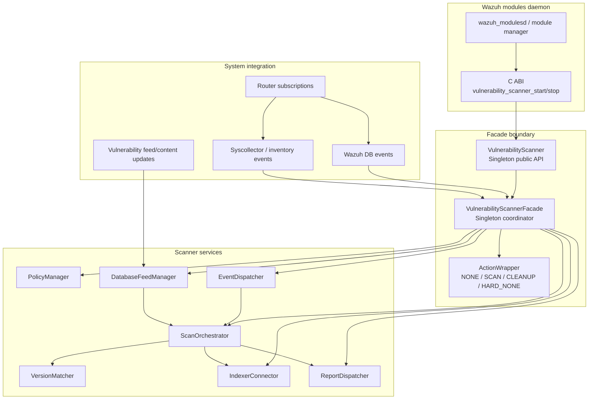
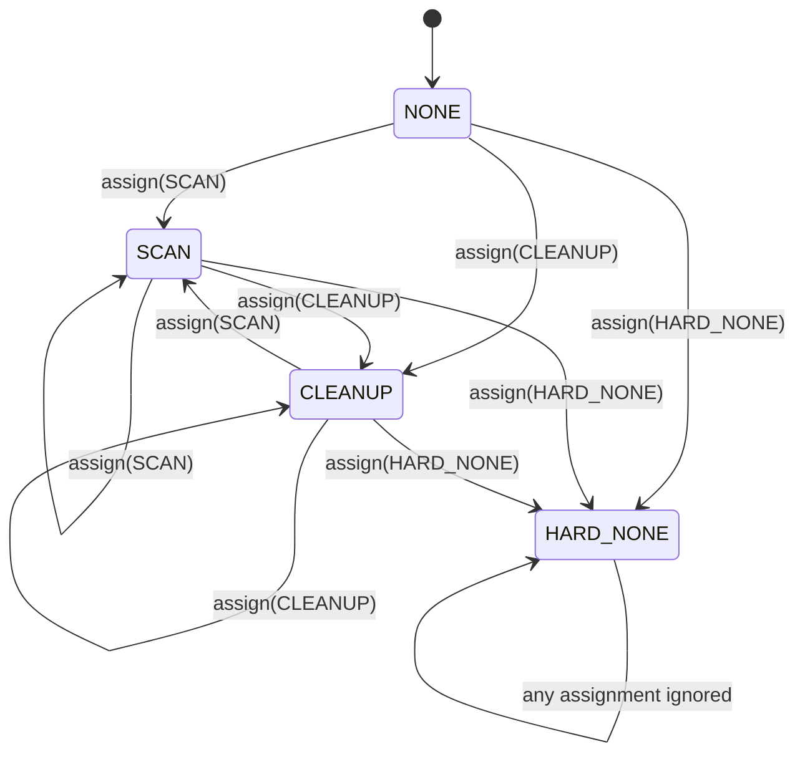
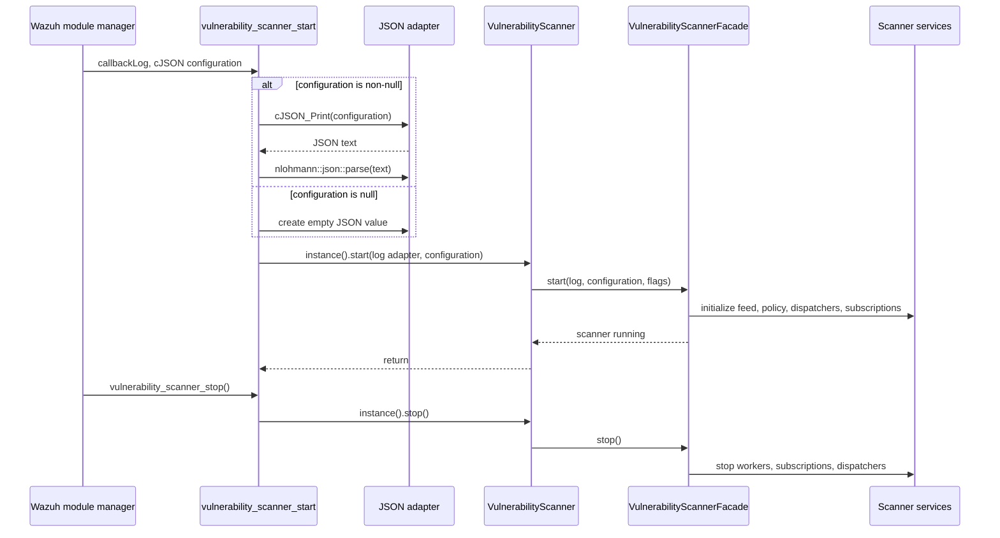
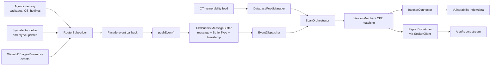
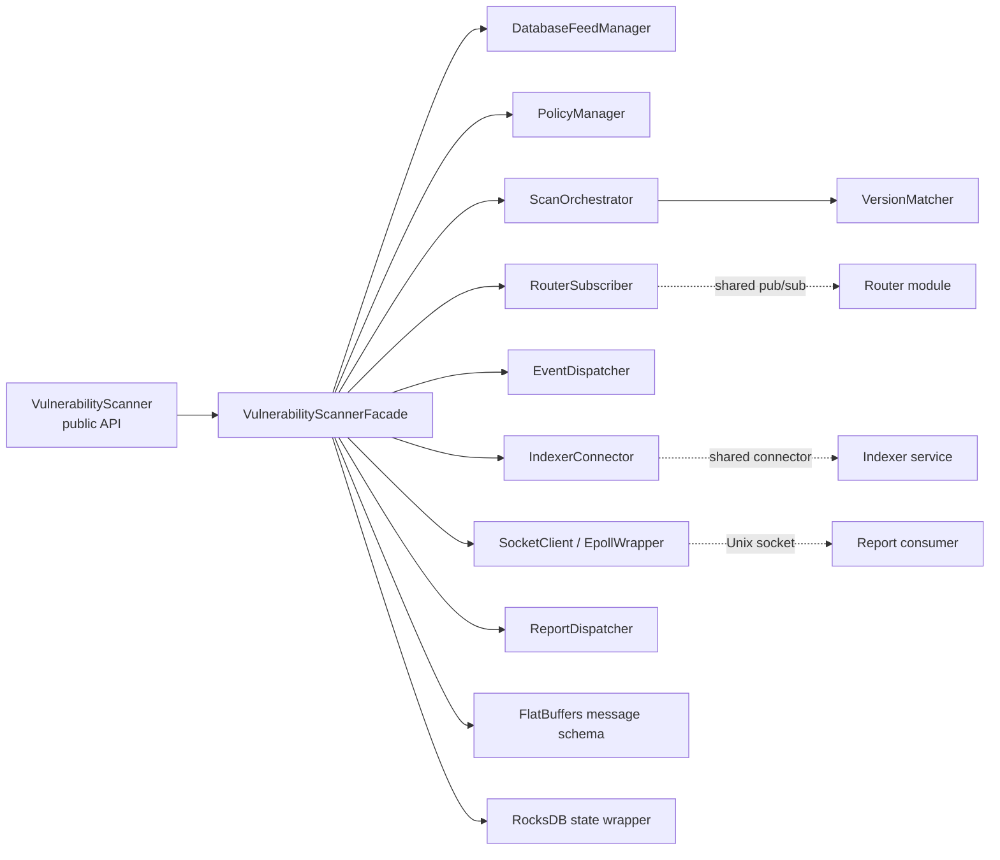

# Vulnerability Scanner Facade

## Introduction

The **Vulnerability Scanner Facade** is the process-facing orchestration boundary for Wazuh's C++ vulnerability-scanning subsystem. It exposes a small lifecycle API to the Wazuh modules daemon, converts the legacy C configuration/logging ABI into C++ types, and coordinates the scanner's feed, policy, event-subscription, scan, index, and report components.

The facade does not implement CVE matching or inventory harvesting itself. Those responsibilities are delegated to the database feed manager, scan orchestrator, version matcher, and inventory-related modules. The facade owns their lifetime and connects their inputs and outputs.

## Scope and responsibilities

| Responsibility | Main API or member | Role |
|---|---|---|
| Public scanner lifecycle | `VulnerabilityScanner::start/stop` | Stable singleton API for C++ callers |
| C ABI integration | `vulnerability_scanner_start/stop` | Entry points used by native Wazuh module infrastructure |
| Configuration conversion | `cJSON` → `nlohmann::json` | Adapts the daemon configuration representation |
| Component coordination | `VulnerabilityScannerFacade` | Creates and connects scanner services |
| Inventory/event ingestion | Router subscriptions and `EventDispatcher` | Delivers inventory and database changes to scanning |
| Feed and policy management | `DatabaseFeedManager`, `PolicyManager` | Maintains vulnerability content and scanner policy |
| Results and alerts | `IndexerConnector`, report socket/dispatcher | Publishes indexed findings and alert reports |
| Configuration-change actions | `ActionWrapper` | Resolves scan/cleanup/no-op actions while preserving hard stops |
| Shutdown coordination | `m_shouldStop`, threads, retry primitives | Stops background work and manages retry waits |

## Architecture overview



## Core components

### `VulnerabilityScanner`

File: `src/wazuh_modules/vulnerability_scanner/include/vulnerabilityScanner.hpp`

`VulnerabilityScanner` is an exported `Singleton<VulnerabilityScanner>`. It is the public C++ shell around the internal facade.

`start()` accepts:

- a logging callback;
- a JSON scanner configuration;
- `noWaitToStop`, controlling whether shutdown waits for running work;
- `reloadGlobalMapsStartup`, controlling startup reload of vendor and OS CPE maps;
- `initContentUpdater`, controlling content-updater initialization.

`stop()` forwards shutdown to the facade. The class intentionally contains no scanner workflow logic.

### `VulnerabilityScannerFacade`

File: `src/wazuh_modules/vulnerability_scanner/src/vulnerabilityScannerFacade.hpp`

The facade is another singleton and owns the integration objects used by the scanner. Its declared collaborators are:

- `DatabaseFeedManager`: vulnerability database/feed state and content processing;
- `PolicyManager`: scanner policy and cluster-policy changes;
- `ScanOrchestrator`: event-driven scanning and result processing;
- `IndexerConnector`: connection to the indexer used for vulnerability data/results;
- `RouterSubscriber` instances: subscriptions for syscollector deltas, rsync, Wazuh DB agent events, and Wazuh DB inventory events;
- `EventDispatcher`: queued event hand-off into scanner processing;
- `ReportDispatcher` and a `SocketClient`: report/alert delivery;
- worker threads and stop/retry synchronization primitives.

The public helper methods divide into four groups:

1. **Lifecycle:** `start()` and `stop()`.
2. **Initialization:** dispatcher and subscription initialization methods.
3. **Configuration reaction:** `vulnerabilityScanPolicyChange()`, `clusterConfigurationChange()`, and `handlePolicyChanges()`.
4. **Event transport:** `pushEvent()`, which wraps a raw message and `BufferType` in a FlatBuffers `MessageBuffer` with an epoch timestamp before queueing it.

### `ActionWrapper`

`ActionWrapper` is a small private state holder used for agent and manager actions. Its states are:

- `NONE`: no pending action;
- `SCAN`: request scanning;
- `CLEANUP`: request cleanup;
- `HARD_NONE`: terminal no-op state that cannot be overwritten.

Assignment changes the state only when it is not already `HARD_NONE`. This is important when several configuration or cluster signals are processed: a hard-disabled action cannot be accidentally replaced by a later scan or cleanup request.



## Public entry points and lifecycle

The native daemon calls the C ABI. The implementation safely handles a null configuration by passing an empty JSON object to the C++ layer. When configuration is present, it prints the `cJSON` tree, parses the resulting text as `nlohmann::json`, and then starts the singleton.



The C++ path is direct:

```text
VulnerabilityScanner::start(...)
    -> VulnerabilityScannerFacade::instance().start(...)

VulnerabilityScanner::stop()
    -> VulnerabilityScannerFacade::instance().stop()
```

The facade's `m_noWaitToStop` member records the shutdown policy supplied at startup. The exact ordering of service teardown is implementation-defined by the facade implementation; callers should treat `stop()` as the lifecycle boundary and should not use scanner services after it returns.

## Event and data flow

The facade accepts several classes of asynchronous input. Router subscribers receive system inventory and Wazuh DB changes; feed/content handling updates the vulnerability database; the facade packages events for queued processing; and scan results are sent to the indexer and report dispatcher.



### `pushEvent()` contract

`pushEvent(const std::vector<char>& message, BufferType type)`:

1. Creates a `flatbuffers::FlatBufferBuilder`.
2. Stores the byte payload, event type, and current epoch seconds in `MessageBuffer`.
3. Finishes the FlatBuffers object.
4. Creates a `rocksdb::Slice` over the builder buffer.
5. Pushes the slice into `m_eventDispatcher`.

The method is a transport adapter, not a durable-storage operation. The event dispatcher must consume or copy the slice according to its own queue contract before the temporary builder storage is released.

## Subscription responsibilities

The four subscriber members represent distinct integration paths:

| Member | Input represented | Expected facade role |
|---|---|---|
| `m_syscollectorDeltasSubscription` | Incremental inventory changes | Trigger targeted package/OS/hotfix processing |
| `m_syscollectorRsyncSubscription` | Inventory synchronization | Reconcile inventory state, often after synchronization |
| `m_wdbAgentEventsSubscription` | Agent lifecycle/database events | React to agent additions, removals, or status changes |
| `m_wdbInventoryEventsSubscription` | Inventory database events | Process persisted inventory changes |

These subscribers connect the facade to the broader inventory and database paths documented in [syscollector_module.md](syscollector_module.md), [syscollector_module_native_daemon.md](syscollector_module_native_daemon.md), and [wazuh_db_fim_syscollector.md](wazuh_db_fim_syscollector.md). The facade coordinates their callbacks; it does not duplicate those modules' storage or collection logic.

## Policy and configuration-change flow

The facade exposes separate checks for scanner policy and cluster configuration, followed by a combined action handler. This separation allows state to be read first and actions to be applied only after both sources have been evaluated.

```mermaid
sequenceDiagram
    participant Loop as Manager/retry thread
    participant DB as RocksDB state database
    participant F as VulnerabilityScannerFacade
    participant P as PolicyManager
    participant A as ActionWrapper state
    participant O as ScanOrchestrator

    Loop->>F: vulnerabilityScanPolicyChange(stateDB)
    F->>DB: read policy/version state
    F->>P: inspect policy change
    P-->>F: requested agent/manager action
    F->>A: update m_agentsAction / m_managerAction
    Loop->>F: clusterConfigurationChange(stateDB)
    F->>DB: read cluster state
    F->>P: inspect cluster configuration
    P-->>F: requested action
    F->>A: merge action with hard-none rule
    Loop->>F: handlePolicyChanges()
    F->>O: execute scan or cleanup when required
```

The `stateDB` parameter is a `Utils::RocksDBWrapper`, so policy/configuration decisions can be persisted and compared across restarts. The precise keys and policy schema belong to `PolicyManager` and are outside the facade's declared core components.

## Dependency relationships



Related implementation boundaries are documented in [indexer_connector.md](indexer_connector.md), [router_pubsub.md](router_pubsub.md), [router_core.md](router_core.md), [content_manager_facade.md](content_manager_facade.md), and [wazuh_modules_core_native_bridges.md](wazuh_modules_core_native_bridges.md).

## Threading and ownership

The facade contains several concurrency primitives and ownership forms:

- `std::shared_ptr` owns shared service objects such as the feed manager, indexer connector, event dispatcher, and report dispatcher.
- `std::unique_ptr` owns each subscription, making subscription teardown explicit.
- `m_managerThread` and `m_rebootThread` represent background manager/reboot work.
- `m_shouldStop` provides an atomic stop signal.
- `m_internalMutex` protects internal shared state.
- `m_retryWait` and `m_retryMutex` coordinate retry delays without busy waiting.
- `ActionWrapper` members are mutable because configuration checks can update action state from logically const helper methods.

Maintainers should preserve these ownership and shutdown relationships. In particular, subscriptions and dispatchers must not outlive the services that consume their callbacks, and event producers must stop before their queues or targets are destroyed.

## Error and boundary considerations

The visible adapter has several important boundary behaviors:

- A null `cJSON` configuration is accepted and becomes an empty JSON configuration.
- Invalid non-null JSON would fail during `nlohmann::json::parse`; callers should validate configuration before invoking the C ABI if recovery is required.
- The legacy logging callback is captured and invoked with C strings and `va_list`; its lifetime and calling convention must remain compatible with `full_log_fnc_t`.
- `pushEvent()` assumes `m_eventDispatcher` has been initialized before events are submitted.
- `HARD_NONE` is intentionally irreversible through the assignment operator.
- `stop()` is the only supported shutdown entry point for the singleton facade.

## How the module fits into Wazuh

At system level, `wazuh-modulesd` owns the native module lifecycle. The vulnerability scanner consumes inventory generated by syscollector and persisted through Wazuh DB, enriches it with vulnerability-feed content, matches versions/CPEs, and publishes findings. The facade is the coordination point that keeps those independently implemented subsystems connected.

For adjacent concerns, follow these references rather than duplicating their details:

- Inventory collection and synchronization: [syscollector_module.md](syscollector_module.md), [inventory_harvester_module.md](inventory_harvester_module.md), [inventory_harvester_system_pipeline.md](inventory_harvester_system_pipeline.md).
- Wazuh DB inventory persistence: [wazuh_db_fim_syscollector.md](wazuh_db_fim_syscollector.md).
- Shared router and subscriptions: [router.md](router.md), [router_pubsub.md](router_pubsub.md).
- Indexer transport: [indexer_connector.md](indexer_connector.md).
- Native module bridge and daemon lifecycle: [wazuh_modules_core_native_bridges.md](wazuh_modules_core_native_bridges.md).
- Content update infrastructure: [content_manager_facade.md](content_manager_facade.md), [content_manager_orchestration.md](content_manager_orchestration.md).

## Source files

- `src/wazuh_modules/vulnerability_scanner/include/vulnerabilityScanner.hpp` — exported singleton API and scanner constants.
- `src/wazuh_modules/vulnerability_scanner/src/vulnerabilityScanner.cpp` — C++ forwarding methods and C ABI adapters.
- `src/wazuh_modules/vulnerability_scanner/src/vulnerabilityScannerFacade.hpp` — facade interface, subscriptions, dispatchers, state, and `ActionWrapper`.

