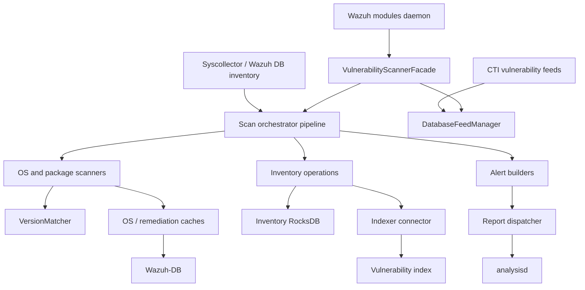
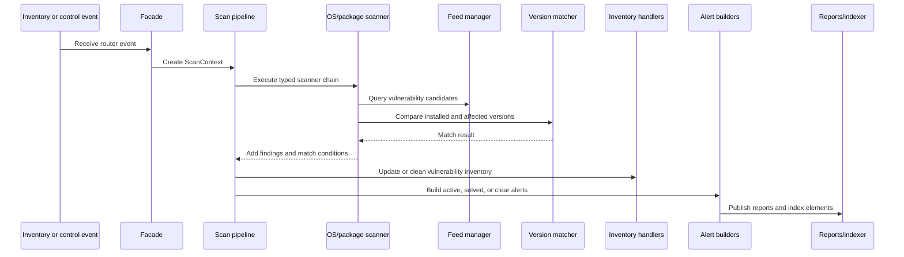

# Vulnerability Scanner Module

## Purpose

The `vulnerability_scanner_module` provides Wazuh’s agent vulnerability-detection workflow. It ingests vulnerability feeds and inventory events, matches installed operating systems and packages against CVE data, tracks vulnerability state in inventory storage, builds alerts, and publishes results to the indexer and analysisd.

The module is located at:

`src/wazuh_modules/vulnerability_scanner`

## Architecture

The facade owns the scanner lifecycle and coordinates feed management, scanning, version matching, inventory synchronization, alert construction, caching, and result publication.



Scanning is organized as typed handler chains. Each event is converted into a `ScanContext`, processed by scanners and inventory handlers, enriched with alert data, and then forwarded to reporting and indexing stages.



## Core components

- [Vulnerability Scanner Facade](vulnerability_scanner_facade.md) — lifecycle boundary and coordinator for scanner services, event subscriptions, configuration, and shutdown.
- [Database Feed Manager](database_feed_manager.md) — ingests and persists vulnerability feeds in RocksDB, maintains global maps, and provides candidate, description, and remediation lookups.
- [Version Matcher](version_matcher.md) — parses and compares CalVer, PEP 440, MajorMinor, SemVer, DPKG, and RPM version formats.
- [Scan Orchestrator Pipeline](scan_orchestrator_pipeline.md) — converts events into `ScanContext` objects and assembles the processing chains.
- [Scan Orchestrator Scanners](scan_orchestrator_scanners.md) — evaluates OS and package inventory using CPE, CNA, feed, remediation, and version-matching data.
- [Scan Orchestrator Inventory Operations](scan_orchestrator_inventory_ops.md) — maintains vulnerability inventory records and synchronizes indexer state.
- [Scan Orchestrator Alert Builders](scan_orchestrator_alert_builders.md) — converts findings and feed metadata into normalized vulnerability alerts.
- [Scan Orchestrator Data Caches](scan_orchestrator_data_caches.md) — provides bounded, thread-safe caches for OS metadata and installed Windows hotfixes.

## Module structure

```text
src/wazuh_modules/vulnerability_scanner/
├── vulnerabilityScannerFacade
├── databaseFeedManager
├── scanOrchestrator/
│   ├── versionMatcher/
│   ├── alert builders
│   ├── inventory operations
│   ├── scanners
│   ├── data caches
│   └── pipeline and handler assembly
```

The module depends on inventory collection from the inventory harvester, persistence through Wazuh-DB and RocksDB, feed content updates, and shared reporting/indexing infrastructure.