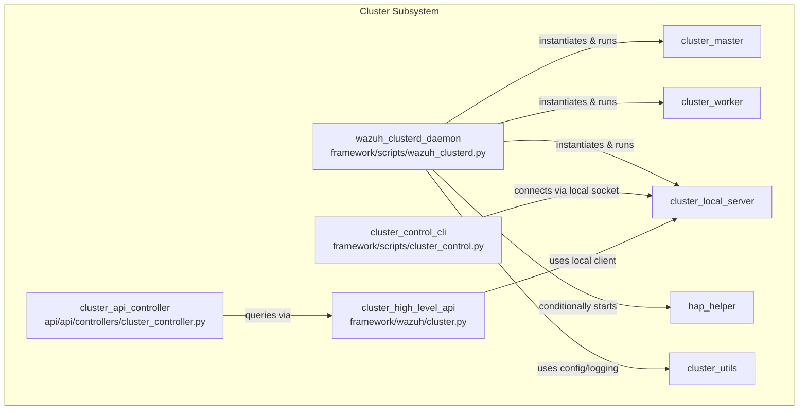
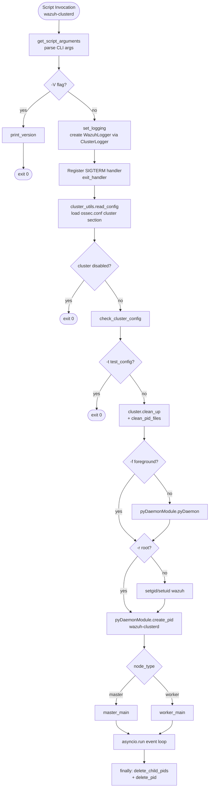
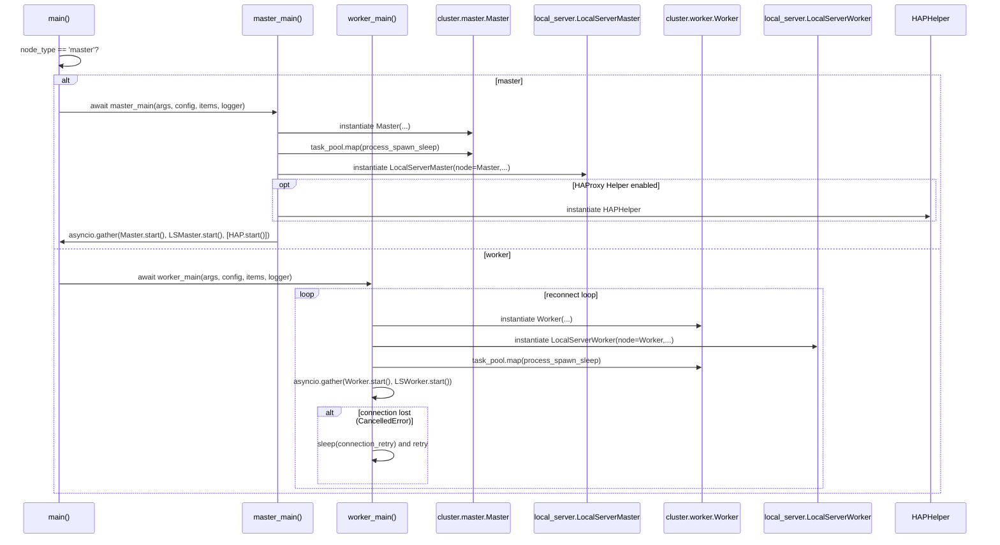
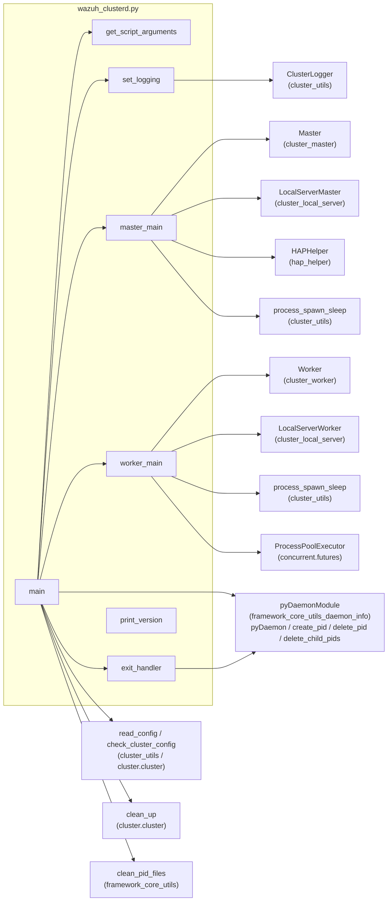
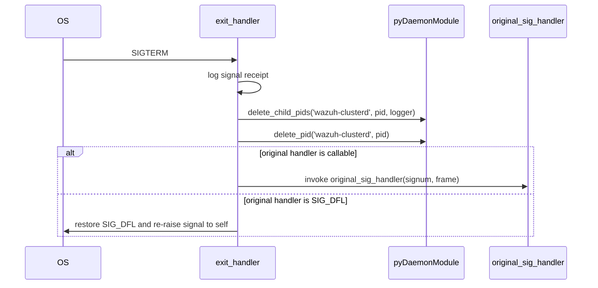

# Wazuh Clusterd Daemon

## Introduction

The **Wazuh Clusterd Daemon** module (`framework/scripts/wazuh_clusterd.py`) is the **entry-point process** that bootstraps and supervises the Wazuh cluster subsystem. It is the executable script installed as `wazuh-clusterd`, responsible for:

- Parsing command-line arguments and daemon configuration.
- Setting up the dedicated cluster logger.
- Determining whether the local node should run as a **master** or **worker** node.
- Launching the appropriate asyncio event loop with the corresponding cluster server/client components.
- Managing the daemon lifecycle: daemonization, privilege dropping, PID file management, and graceful shutdown on signals.

This module does not implement the cluster protocol itself — it is a thin orchestration layer that wires together the lower-level cluster components (master, worker, local server, HAP Helper, etc.) documented in their own modules. Understanding this daemon is key to understanding **how** and **when** those components are instantiated and run in production.

---

## Role in the Overall System

The Wazuh Clusterd Daemon sits at the top of the **cluster subsystem** hierarchy. It is one of several sibling modules under the broader clustering functionality:

For details on the individual pieces this daemon orchestrates, see:
- [cluster_master.md](cluster_master.md) – `Master` / `MasterHandler` classes run when the node is a master.
- [cluster_worker.md](cluster_worker.md) – `Worker` / `WorkerHandler` classes run when the node is a worker.
- [cluster_local_server.md](cluster_local_server.md) – Unix-socket local server used by CLI tools and the API.
- [cluster_utils.md](cluster_utils.md) – Shared cluster utilities (`ClusterFilter`, `process_spawn_sleep`, `raise_if_exc`, config reading).
- [hap_helper.md](hap_helper.md) – Optional HAProxy Helper task, started only if configured.
- [cluster_control_cli.md](cluster_control_cli.md) – CLI tool that talks to the daemon via the local server.
- [cluster_api_controller.md](cluster_api_controller.md) – REST API layer that exposes cluster status/administration endpoints, ultimately backed by data this daemon's components produce.
- [framework_core_utils_daemon_info.md](framework_core_utils_daemon_info.md) – `pyDaemonModule` utilities (`spawn_process_pool_worker`, PID file management) used to daemonize and manage child processes.

---

## Core Responsibilities

| Responsibility | Function(s) |
|---|---|
| CLI argument parsing | `get_script_arguments` |
| Logger initialization | `set_logging` |
| Version banner | `print_version` |
| Signal handling / graceful shutdown | `exit_handler` |
| Master node bootstrap | `master_main` |
| Worker node bootstrap | `worker_main` |
| Overall daemon lifecycle (daemonize, drop privileges, PID files, run loop) | `main` |

---

## Architecture Overview

---

## Startup & Configuration Flow

1. **Argument parsing** (`get_script_arguments`): supports operational flags (`-f` foreground, `-d` debug, `-V` version, `-r` root, `-t` test-config, `-c` config file path) plus hidden developer/test flags (`--performance_test`, `--concurrency_test`, `--string`, `--file`) used for internal benchmarking of the cluster communication layer.

2. **Logger setup** (`set_logging`): builds a `ClusterLogger` (a `WazuhLogger` subclass, see [framework_core_communication_logging.md](framework_core_communication_logging.md)) that writes to `logs/cluster.log`, tagging entries with the `%(tag)s`/`%(subtag)s` context populated by `ClusterFilter` (see [cluster_utils.md](cluster_utils.md)).

3. **Signal registration**: `SIGTERM` is bound to `exit_handler` at import/module level, ensuring that even before `main()` executes, a clean shutdown path exists. `exit_handler` terminates child processes (`pyDaemonModule.delete_child_pids`), removes PID files, and re-invokes the original signal handler/behavior.

4. **Configuration loading & validation**: `cluster_utils.read_config` loads the cluster stanza; `wazuh.core.cluster.cluster.check_cluster_config` validates it. If `disabled: true` or `-t` (test-config) is set, the process exits early without starting network components.

5. **Process hygiene**: `clean_up()` removes stale cluster artifacts, and `clean_pid_files('wazuh-clusterd')` from [framework_core_utils.md](framework_core_utils.md) removes orphaned PID files from previous crashes.

6. **Daemonization & privilege drop**: Unless `-f` (foreground) is passed, `pyDaemonModule.pyDaemon()` forks into the background. Unless `-r` (root) is passed, the process drops privileges to the `wazuh` user/group via `setgid`/`setuid`.

7. **PID file creation**: `pyDaemonModule.create_pid('wazuh-clusterd', pid)` records the daemon's PID for external management/monitoring.

---

## Master vs. Worker Bootstrap

The daemon branches based on `cluster_configuration['node_type']`:

### Master Path (`master_main`)
- Sets `cluster_utils.context_tag` to `'Master'` for log tagging.
- Instantiates `Master` (see [cluster_master.md](cluster_master.md)), passing performance/concurrency test flags, SSL flag, configuration, logger, and cluster items.
- If the `Master`'s process pool exists, forces all workers to spawn immediately via `process_spawn_sleep` (from [cluster_utils.md](cluster_utils.md)), ensuring each child process creates its own PID file up front.
- Instantiates `LocalServerMaster` (see [cluster_local_server.md](cluster_local_server.md)) to expose the local Unix-socket API consumed by `cluster_control` CLI and the DAPI (`cluster_dapi`).
- Conditionally adds `HAPHelper` (see [hap_helper.md](hap_helper.md)) to the task list if `haproxy_helper.disabled` is `false` in configuration.
- Runs all tasks concurrently with `asyncio.gather`.

### Worker Path (`worker_main`)
- Sets `cluster_utils.context_tag` to `'Worker'`.
- Creates a dedicated `ProcessPoolExecutor` (`max_workers=1`) for offloading CPU-bound work; gracefully degrades (sets `task_pool=None`) if `/dev/shm` is inaccessible, logging a warning about reduced performance improvements introduced since Wazuh 4.3.0.
- Enters an infinite reconnect loop: instantiates `Worker` and `LocalServerWorker` (see [cluster_worker.md](cluster_worker.md) and [cluster_local_server.md](cluster_local_server.md)) each iteration, runs them concurrently, and on `asyncio.CancelledError` (connection to master lost) sleeps for the configured `connection_retry` interval before retrying.

---

## Component Interaction Diagram

---

## Dependencies

| Dependency | Purpose | Documentation |
|---|---|---|
| `wazuh.core.cluster.utils` (`cluster_utils`) | Config reading (`read_config`), logging filter (`ClusterFilter`), process pool warm-up (`process_spawn_sleep`), constants (`HAPROXY_HELPER`, `HAPROXY_DISABLED`) | [cluster_utils.md](cluster_utils.md) |
| `wazuh.core.cluster.master` | `Master` class implementing the master-node cluster protocol | [cluster_master.md](cluster_master.md) |
| `wazuh.core.cluster.worker` | `Worker` class implementing the worker-node cluster protocol | [cluster_worker.md](cluster_worker.md) |
| `wazuh.core.cluster.local_server` | `LocalServerMaster` / `LocalServerWorker`, Unix-socket servers for local CLI/API communication | [cluster_local_server.md](cluster_local_server.md) |
| `wazuh.core.cluster.hap_helper.hap_helper` | `HAPHelper`, optional HAProxy integration task | [hap_helper.md](hap_helper.md) |
| `wazuh.core.cluster.cluster` | `check_cluster_config`, `clean_up` — configuration validation and workspace cleanup | referenced within [cluster_core_utilities.md](cluster_core_utilities.md) |
| `wazuh.core.common` | Shared paths/constants (`OSSEC_CONF`, `WAZUH_PATH`, `wazuh_uid`, `wazuh_gid`) | [framework_core_utils_paths_config.md](framework_core_utils_paths_config.md) |
| `wazuh.core.configuration` | `get_internal_options_value`, used to read the `wazuh_clusterd.debug` internal option | [framework_core_utils_paths_config.md](framework_core_utils_paths_config.md) |
| `wazuh.core.pyDaemonModule` | Daemonization helpers: `pyDaemon`, `create_pid`, `delete_pid`, `delete_child_pids`, `spawn_process_pool_worker` | [framework_core_utils_daemon_info.md](framework_core_utils_daemon_info.md) |
| `wazuh.core.utils` | `clean_pid_files`, generic PID housekeeping | [framework_core_utils_query_engine.md](framework_core_utils_query_engine.md) |
| `wazuh.core.wlogging` | `WazuhLogger` base class | [framework_core_communication_logging.md](framework_core_communication_logging.md) |

---

## Signal Handling & Shutdown

`exit_handler` is registered **before** any cluster components are started (at module import time), guaranteeing that even early-stage failures (e.g., configuration errors) can be interrupted cleanly. It also preserves and eventually delegates to whatever signal handler was previously installed (`original_sig_handler`), maintaining compatibility with external process managers (e.g., systemd).

---

## Operational Notes

- **Foreground vs. Daemon mode**: The `-f` flag is primarily used for debugging/manual runs and container deployments where the process must stay attached to the parent's PID namespace.
- **Root execution**: By default the daemon drops privileges after binding to `wazuh:wazuh`. The `-r` flag is intended for controlled/administrative scenarios and should be used cautiously.
- **Hidden test flags**: `--performance_test`, `--concurrency_test`, `--string`, and `--file` are developer-only options for benchmarking synchronization/communication throughput between nodes; they are not intended for production use and are hidden from `--help` output (`argparse.SUPPRESS`).
- **Debug level resolution order**: `main` block at script invocation attempts to read the debug level from the internal options file (`wazuh_clusterd.debug`) via `get_internal_options_value`, falling back to the `-d` CLI flag, and finally to `0` if both are unavailable.
- **/dev/shm dependency (worker only)**: The worker's dedicated process pool relies on `/dev/shm` being accessible to the `wazuh` user. If unavailable, the daemon logs a warning and continues without the Wazuh 4.3.0+ performance optimizations rather than crashing.

---

## Related Modules Reference

| Module | Relationship |
|---|---|
| [cluster_master.md](cluster_master.md) | Instantiated and driven by `master_main` |
| [cluster_worker.md](cluster_worker.md) | Instantiated and driven by `worker_main` |
| [cluster_local_server.md](cluster_local_server.md) | Local Unix-socket servers started alongside master/worker |
| [cluster_utils.md](cluster_utils.md) | Configuration reading, logging filters, process pool helpers |
| [hap_helper.md](hap_helper.md) | Optional HAProxy Helper task started by the master |
| [cluster_control_cli.md](cluster_control_cli.md) | CLI client that communicates with this daemon via the local server |
| [cluster_api_controller.md](cluster_api_controller.md) | REST API surface built on top of data this daemon's components expose |
| [cluster_high_level_api.md](cluster_high_level_api.md) | High-level Python API (`framework/wazuh/cluster.py`) used by the REST API to query cluster state |
| [framework_core_utils_daemon_info.md](framework_core_utils_daemon_info.md) | Daemonization and PID management primitives |
| [framework_core_communication_logging.md](framework_core_communication_logging.md) | `WazuhLogger` base class used for cluster logging |
