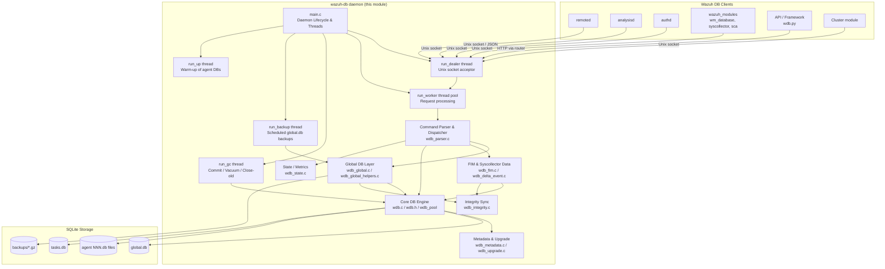
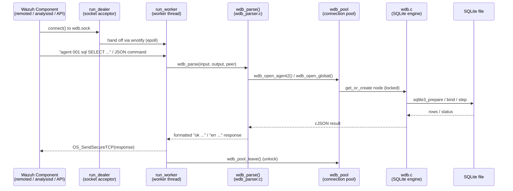

# Wazuh DB Module

## 1. Introduction and Purpose

**Wazuh DB** (`wazuh-db`) is the Wazuh manager daemon responsible for all persistent SQLite storage used by the
manager. It centralizes:

- The **global database** (`global.db`): agent inventory, agent groups, connection status, labels and
  cluster-related synchronization metadata.
- Per-agent databases (`queue/db/<agent_id>.db`): FIM (File Integrity Monitoring) baselines, syscollector
  inventories (packages, processes, ports, network, hardware, hotfixes, OS info, users, groups), SCA
  (Security Configuration Assessment) checks, CIS-CAT results and rootcheck findings.
- The **task database** (`.wazuh-db/tasks.db`): tracking of long-running asynchronous tasks such as agent
  upgrades.

Other Wazuh components — `remoted`, `analysisd`, `authd`, the Cluster module, the API framework, and the
agent-side `wazuh_modules` (syscollector, SCA, FIM) — never touch these SQLite files directly. Instead they
communicate with `wazuh-db` through a lightweight text/JSON request-response protocol carried over a local
Unix socket, and this daemon executes the required SQL safely, applies caching/pooling and enforces
concurrency guarantees.

This module also exposes helper C libraries (`wdb_global_helpers`) that are statically linked into other
daemons (e.g. `wazuh_modules/wm_database.c`, `remoted`) so that they can query global.db through the same
socket protocol without duplicating parsing logic.

## 2. Architecture Overview

### Request Flow

## 3. High-level Functionality by Sub-module

The module is organized into the following functional areas. Each is documented in its own file:

| Sub-module | Responsibility | Documentation |
|---|---|---|
| **Daemon Core** | Process startup, CLI options, privilege drop, signal handling, thread pool orchestration (dealer/worker/gc/backup/up threads), router-based HTTP API registration. | [wazuh_db_daemon_core.md](wazuh_db_daemon_core.md) |
| **DB Engine & Connection Pool** | Low-level SQLite lifecycle: opening/creating global, agent and task databases, prepared-statement caching, transactions, VACUUM/fragmentation management, and the thread-safe database pool (`wdb_pool`). | [wazuh_db_engine.md](wazuh_db_engine.md) |
| **Command Parser & Dispatcher** | Text/JSON protocol parsing for `agent`, `global`, `wazuhdb` and `task` actors; routes each command to the correct handler and tracks per-command statistics. | [wazuh_db_command_parser.md](wazuh_db_command_parser.md) |
| **Global Database Layer** | All operations on `global.db`: agent CRUD, groups, labels, connection status, synchronization with cluster workers, and backup/restore of the global database. Includes the reusable `wdb_global_helpers` client library used by other daemons. | [wazuh_db_global.md](wazuh_db_global.md) |
| **FIM & Syscollector Data** | Agent-specific inventory persistence: FIM entries (files/registry) and syscollector "dbsync" delta processing (packages, processes, ports, hardware, OS info, users, groups, etc.) driven by table-metadata-based dynamic SQL generation. | [wazuh_db_fim_syscollector.md](wazuh_db_fim_syscollector.md) |
| **Integrity Synchronization** | Generic checksum-based synchronization engine used by FIM and Syscollector to detect and resolve discrepancies between agent and manager state, plus the global-group-hash cache. | [wazuh_db_integrity.md](wazuh_db_integrity.md) |
| **Metadata & Schema Upgrade** | Database metadata key/value access, schema-version detection and the migration pipeline (`wdb_upgrade`) that safely evolves `global.db` and agent databases across releases, including automatic backups on upgrade failure. | [wazuh_db_metadata_upgrade.md](wazuh_db_metadata_upgrade.md) |
| **State & Metrics** | Runtime statistics collection (query counters and timings per command) exposed as JSON, consumed by the `getconfig`/`getstate` cluster and monitoring endpoints. | [wazuh_db_state.md](wazuh_db_state.md) |

## 4. Relationship to Other Modules

- **[framework_core_communication_wdb](framework_core_communication_wdb.md)** — The Python side (`wdb.py`,
  `wdb_http.py`) implements the client used by the framework/API layer (`WazuhDBConnection`,
  `AsyncWazuhDBConnection`) to talk to this daemon over the same Unix-socket protocol described here.
- **`Wazuh_Modules_Daemon`** (`wm_database.c`) — Uses the `wdb_global_helpers` API (see
  [wazuh_db_global.md](wazuh_db_global.md)) to synchronize agent keys and groups.
- **`cluster_module`** — Workers and masters synchronize agent info/groups through the `sync-agent-info-*`
  and `sync-agent-groups-*` commands implemented in the Global Database Layer.
- **`Agent_&_Manager_Native_Daemons_(C)`** (`remoted`, `authd`) — Query and update agent connection status,
  keys, and keepalives via the Command Parser & Dispatcher.
- **`syscheckd`/`syscollector` wazuh_modules** — Send FIM and syscollector delta/dbsync payloads that are
  ultimately persisted by the FIM & Syscollector Data sub-module.

## 5. Protocol Summary

`wazuh-db` listens on a local Unix stream socket (`WDB_LOCAL_SOCK`) and, once a message is fully received,
dispatches it based on a leading **actor** keyword:

| Actor | Target Database | Example Commands |
|---|---|---|
| `agent <id> ...` | Per-agent DB (`NNN.db`) | `fim_file`, `fim_registry`, `sca`, `syscollector_*`, `rootcheck`, `sql`, `begin`/`commit`/`close`, `vacuum` |
| `global ...` | `global.db` | `insert-agent`, `update-agent-data`, `get-agent-info`, `sync-agent-groups-get`, `backup` |
| `wazuhdb ...` | Cross-agent maintenance | `remove` (bulk agent DB removal) |
| `task ...` | `tasks.db` | `upgrade`, `upgrade_get_status`, `upgrade_result`, `set_timeout` |

Requests starting with `{` are treated as pure JSON and routed through `wdbcom_dispatch` (used for
lightweight status/config queries), while all other requests follow the legacy space-delimited grammar
handled by `wdb_parse()`.

Responses always start with a status token: `ok`, `ok N` (single-row/simple confirmations), `due` (chunked
results with more data pending) or `err <message>`.
