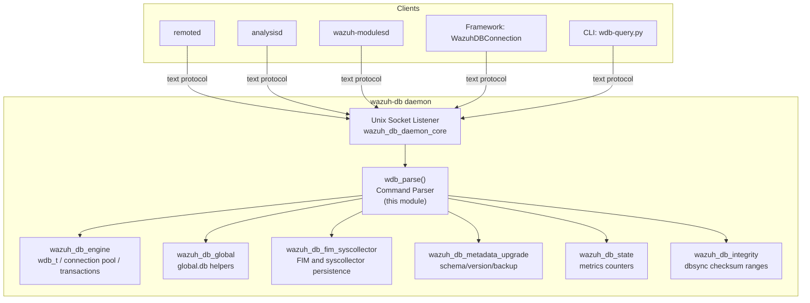
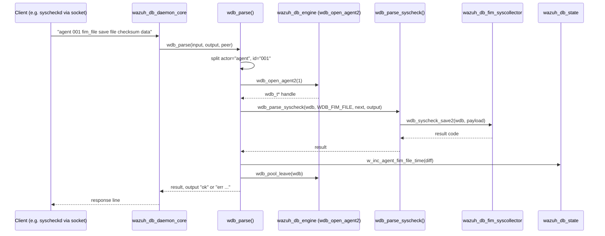
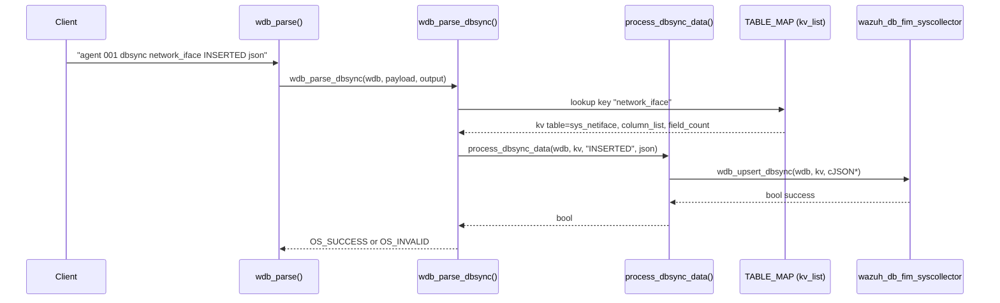
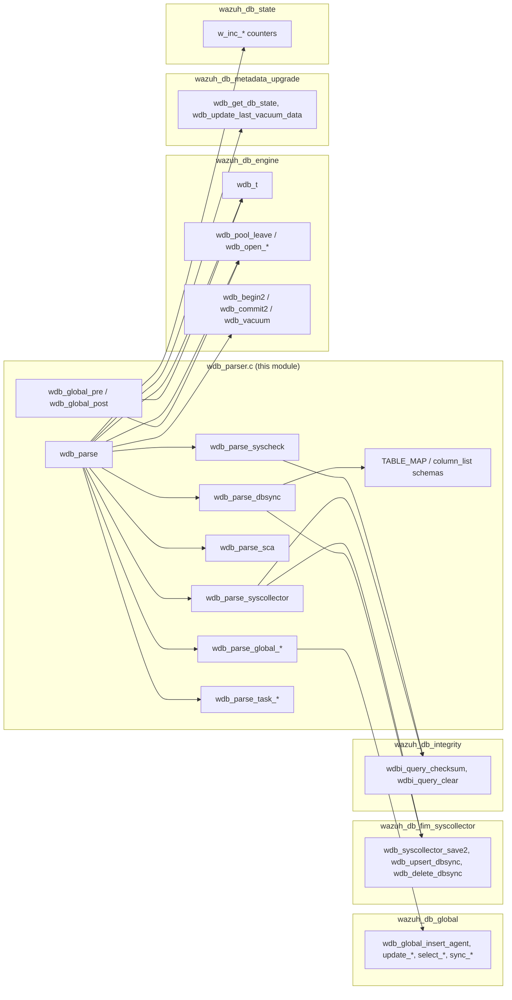

# Wazuh DB Command Parser

## Introduction

The **Wazuh DB Command Parser** is the central request-dispatch layer of the `wazuh-db` daemon. It is implemented almost entirely in a single translation unit, `src/wazuh_db/wdb_parser.c`, and is responsible for taking the raw, line-oriented text commands that arrive over the `wazuh-db` Unix socket (from `wazuh-modulesd`, `remoted`, `analysisd`, the RESTful API framework, and various CLI utilities) and routing them to the correct per-domain handler function (agent FIM, syscollector, SCA, rootcheck, CIS-CAT, task management, global database operations, etc.).

This module does not own persistent state or SQL logic itself — it is a **protocol/dispatch layer** that sits between the raw socket listener (`wazuh_db_daemon_core`) and the various domain-specific query implementations (`wazuh_db_global`, `wazuh_db_fim_syscollector`, `wazuh_db_metadata_upgrade`, etc.). It also feeds per-query timing/counter telemetry into the `wazuh_db_state` module.

Because `wdb_parser.c` is large and multi-purpose, this document focuses on its architecture, control flow, and how it collaborates with sibling modules of `wazuh_db`, rather than re-describing SQL schema details that belong to other modules.

---

## 1. Purpose & Scope

| Aspect | Description |
|---|---|
| **Primary responsibility** | Parse the plain-text wire protocol used by `wazuh-db` clients and dispatch to the appropriate query handler |
| **Entry point** | `wdb_parse()` — called by the daemon's connection-handling loop in [`wazuh_db_daemon_core`](wazuh_db_daemon_core.md) |
| **Consumers** | `agent`, `wazuhdb`, `global`, and `task` command "actors" (see below) |
| **Collaborators** | [`wazuh_db_engine`](wazuh_db_engine.md) (transaction/connection primitives), [`wazuh_db_global`](wazuh_db_global.md) (global.db helpers), [`wazuh_db_fim_syscollector`](wazuh_db_fim_syscollector.md) (FIM/syscollector persistence), [`wazuh_db_metadata_upgrade`](wazuh_db_metadata_upgrade.md) (schema/version helpers), [`wazuh_db_state`](wazuh_db_state.md) (metrics) |
| **Not responsible for** | Opening/closing sockets (handled by `wazuh_db_daemon_core`), SQLite connection pooling (handled by `wazuh_db_engine`'s `wdb_pool_*` APIs), schema definition (handled by `wazuh_db_metadata_upgrade`) |

---

## 2. Position in the System

`wazuh-db` is the centralized SQLite persistence daemon used across the Wazuh manager. Many other subsystems — the [Agent & Manager Native Daemons](wazuh_modules_core.md)-adjacent daemons (`remoted`, `analysisd`, `wazuh-modulesd`), the [API & Management Framework](agent_module.md) (via `WazuhDBConnection` / `AsyncWazuhDBConnection`), and CLI utilities — all communicate with `wazuh-db` through a simple textual protocol over a Unix domain socket. The Command Parser is the code that turns that protocol into concrete C function calls.



For details on the socket/connection lifecycle, see [`wazuh_db_daemon_core`](wazuh_db_daemon_core.md). For the underlying SQLite abstractions (`wdb_t`, `wdb_begin2`, `wdb_pool_leave`, etc.), see [`wazuh_db_engine`](wazuh_db_engine.md).

---

## 3. Core Components

### 3.1 `wdb_parse()` — Top-level dispatcher

The main entry point. It:

1. Trims leading whitespace from the input line.
2. Splits off the first token, the **actor**, which determines which of four command families the request belongs to:
   - `agent` — per-agent database operations (FIM, syscollector, SCA, rootcheck, CIS-CAT, raw SQL, transaction control, vacuum, sleep, remove)
   - `wazuhdb` — cross-agent maintenance operations (currently `remove` for bulk agent DB deletion)
   - `global` — operations against the manager's `global.db` (agent registry, groups, sync, backups, vacuum)
   - `task` — operations against `tasks.db` (agent upgrade task lifecycle)
3. Opens/validates the relevant `wdb_t` handle (`wdb_open_agent2`, `wdb_open_global`, `wdb_open_tasks`) via the [`wazuh_db_engine`](wazuh_db_engine.md).
4. Dispatches to a second-level sub-command parser based on the next token.
5. Records timing metrics for (almost) every sub-command using `w_inc_*`/`w_inc_*_time` counters exposed by [`wazuh_db_state`](wazuh_db_state.md).
6. Releases the `wdb_t` handle back to the pool via `wdb_pool_leave()` before returning.
7. Writes an `"ok ..."` or `"err ..."` response string into the `output` buffer, following the `wazuh-db` wire protocol convention.

### 3.2 Domain sub-parsers

`wdb_parse()` delegates to a family of `wdb_parse_<domain>()` functions, each handling one logical area of functionality:

| Function | Domain | Notes |
|---|---|---|
| `wdb_parse_syscheck` | Legacy/streamlined FIM (`fim_file`, `fim_registry`, `fim_registry_key/value`, integrity checks) | Also handles `integrity_check_*` / `integrity_clear` via `wdbi_query_checksum` / `wdbi_query_clear` (see [`wazuh_db_integrity`](wazuh_db_integrity.md)) |
| `wdb_parse_syscollector` | Dispatch for the 11 syscollector sub-tables (processes, packages, hotfixes, ports, network *, hwinfo, osinfo, users, groups) | Delegates persistence to `wdb_syscollector_save2()` in [`wazuh_db_fim_syscollector`](wazuh_db_fim_syscollector.md) |
| `wdb_parse_sca` | Security Configuration Assessment (query/update/insert/delete of SCA checks, policies, compliance, rules, scan info) | |
| `wdb_parse_netinfo` / `wdb_parse_netproto` / `wdb_parse_netaddr` | **Deprecated** legacy syscollector network tables (pipe-delimited positional fields) | Superseded by `dbsync`-based syscollector sync (`wdb_parse_dbsync`) |
| `wdb_parse_osinfo` | Legacy OS info get/set (delegates to `wdb_parse_agents_get_sys_osinfo` / `wdb_parse_agents_set_sys_osinfo`) | |
| `wdb_parse_hardware` | Legacy hardware-info save (pipe-delimited) | |
| `wdb_parse_ports` | Legacy port-table save/delete (pipe-delimited) | |
| `wdb_parse_packages` / `wdb_parse_hotfixes` | Modern token-based (`strtok_r`) save/delete/get for packages & hotfixes | Updates dbsync attempt/completion state via `wdbi_update_attempt` / `wdbi_update_completion` |
| `wdb_parse_processes` | Legacy process-table save/delete (pipe-delimited, largest field list) | |
| `wdb_parse_ciscat` | CIS-CAT benchmark scan result save | |
| `wdb_parse_rootcheck` | Rootcheck PM tuple save/delete | See [`wazuh_db_global`](wazuh_db_global.md) sibling `rootcheck` table helpers |
| `wdb_parse_dbsync` | Generic **DBSync delta** ingestion (`INSERTED` / `MODIFIED` / `DELETED`) driving the modern syscollector/FIM sync pipeline via `process_dbsync_data()` and the static `TABLE_MAP` | Central to the current (non-legacy) syscollector data flow |
| `wdb_parse_global_*` (many) | All `global` actor sub-commands: insert/update/delete agent, groups, labels, connection status, sync-agent-groups-get/set, sync-agent-info-get/set, groups integrity, backups, vacuum, fragmentation | See [`wazuh_db_global`](wazuh_db_global.md) for the underlying `wdb_global_*()` implementations |
| `wdb_parse_task_*` (many) | All `task` actor sub-commands: upgrade, upgrade_custom, upgrade_get_status, upgrade_update_status, upgrade_result, upgrade_cancel_tasks, set_timeout, delete_old | Delegates to `wdb_task_*()` functions (task-manager persistence, not shown in this module) |

### 3.3 Static Schema Descriptors (`TABLE_MAP`)

A significant portion of the file is static data: `column_list` arrays (`TABLE_HOTFIXES`, `TABLE_PROCESSES`, `TABLE_NETIFACE`, `TABLE_NETPROTO`, `TABLE_NETADDR`, `TABLE_PORTS`, `TABLE_PACKAGES`, `TABLE_OS`, `TABLE_HARDWARE`, `TABLE_USERS`, `TABLE_GROUPS`) that describe, field-by-field, the schema of each syscollector table (SQL type, primary-key flag, "can be null" flag, JSON key mapping, default value, "is text-key" flag). These are aggregated into a single linked list, `TABLE_MAP` (`struct kv_list`), which maps a wire-protocol table name (e.g. `"network_iface"`) to its SQLite table name (`"sys_netiface"`) and column descriptor array.

`TABLE_MAP` is consumed exclusively by `wdb_parse_dbsync()` / `process_dbsync_data()` to generically UPSERT or DELETE rows based on JSON deltas, without needing a hand-written SQL statement per table. This is the mechanism that powers the modern (non-legacy) syscollector and FIM data pipeline, and it is shared conceptually with the field-binding logic in `wazuh_db_fim_syscollector` (`wdb_upsert_dbsync`, `wdb_delete_dbsync`, `wdb_dbsync_stmt_bind_from_json`).

### 3.4 Connection Lifecycle Helpers

- **`wdb_global_pre()`** — Opens (or reuses from the pool) the `global.db` handle, validates it is enabled, and begins a transaction if one isn't already active. Used by callers outside `wdb_parse` that need `global.db` access with the same guarantees.
- **`wdb_global_post()`** *(core component)* — The paired cleanup function; simply calls `wdb_pool_leave()` to return the `wdb_t` handle to the connection pool. This pre/post pair encapsulates the "acquire → use → release" pattern that the parser applies uniformly across all three database domains (agent, global, task).

---

## 4. Wire Protocol & Command Grammar

The protocol is a single line of space/pipe-delimited tokens. High level grammar (informal EBNF):

```
request      := actor SP payload
actor        := "agent" | "wazuhdb" | "global" | "task"

agent_req    := agent_id SP agent_query
agent_query  := "fim_file"|"fim_registry"|"fim_registry_key"|"fim_registry_value"
              | "sca" | "netinfo" | "netproto" | "netaddr" | "osinfo" | "hardware"
              | "port" | "package" | "hotfix" | "process" | "dbsync" | "ciscat"
              | "rootcheck" | "sql" | "remove" | "begin" | "commit" | "close"
              | "syscollector_*" | "vacuum" | "get_fragmentation" | "sleep"

global_req   := global_query
global_query := "sql" | "insert-agent" | "update-agent-name" | "update-agent-data"
              | "get-labels" | "update-keepalive" | "update-connection-status"
              | "update-status-code" | "delete-agent" | "select-agent-name"
              | "select-agent-group" | "find-agent" | "find-group"
              | "insert-agent-group" | "select-group-belong" | "get-group-agents"
              | "delete-group" | "select-groups" | "sync-agent-groups-get"
              | "set-agent-groups" | "sync-agent-info-get" | "sync-agent-info-set"
              | "get-groups-integrity" | "recalculate-agent-group-hashes"
              | "disconnect-agents" | "get-all-agents" | "get-distinct-groups"
              | "get-agent-info" | "reset-agents-connection"
              | "get-agents-by-connection-status" | "backup" | "vacuum"
              | "get_fragmentation" | "sleep"

wazuhdb_req  := "remove" SP agent_id_list

task_req     := task_query SP json_parameters
task_query   := "upgrade" | "upgrade_custom" | "upgrade_get_status"
              | "upgrade_update_status" | "upgrade_result" | "upgrade_cancel_tasks"
              | "set_timeout" | "delete_old" | "sql"
```

### Response Convention

All responses begin with a status token:
- `"ok"` (optionally followed by a JSON payload or plain text)
- `"ok no_data"` / `"ok checksum_fail"` (integrity check specific)
- `"err <message>"`

---

## 5. Sequence: A Typical Agent FIM Query



---

## 6. Sequence: DBSync Delta Ingestion (Modern Syscollector/FIM Path)



---

## 7. Component Interaction Overview



---

## 8. Key Design Notes

1. **Textual, positional protocol**: Most sub-commands rely on manual `strchr`/`wstr_chr` tokenization with `'|'` or `' '` delimiters, rather than a structured format. Newer commands (`global` actor, `task` actor, `dbsync`) increasingly use JSON payloads parsed with `cJSON_ParseWithOpts`, reflecting an evolution toward more structured, less fragile parsing.
2. **Legacy vs. modern duality**: Several parsing functions (`wdb_parse_netinfo`, `wdb_parse_netproto`, `wdb_parse_netaddr`, `wdb_parse_hardware`, `wdb_parse_ports`, `wdb_parse_processes`) are marked internally as legacy/deprecated syscollector paths, kept for backward compatibility while `wdb_parse_dbsync` + `TABLE_MAP` represent the current, generic approach.
3. **Per-query telemetry**: Nearly every branch wraps its work in `gettimeofday()`/`timersub()` and calls a corresponding `w_inc_*`/`w_inc_*_time()` function. This produces the fine-grained metrics consumed by [`wazuh_db_state`](wazuh_db_state.md) and surfaced through `wazuh-db`'s stats reporting (also used by the [`stats_module`](stats_module.md) at the framework level).
4. **Resource safety**: Every code path that opens a `wdb_t` via `wdb_open_agent2`/`wdb_open_global`/`wdb_open_tasks` is paired with a `wdb_pool_leave()` call before returning, including on error paths, to avoid leaking pooled connections back to [`wazuh_db_engine`](wazuh_db_engine.md).
5. **Self-healing on corruption**: When an agent or global query returns `OS_INVALID`, the parser checks whether the underlying `.db` file still exists on disk (`w_is_file`) and forces a `wdb_close()` if not, allowing the database to be transparently recreated on the next request.
6. **Router integration**: `wdb_parse_global_delete_agent` optionally publishes a `deleteAgent` event through the shared `router_provider_send` mechanism (see [`router_core`](router_core.md)) so that other consumers (e.g., inventory harvester) are notified of agent removal.

---

## 9. Related Modules

| Module | Relationship |
|---|---|
| [`wazuh_db_daemon_core`](wazuh_db_daemon_core.md) | Owns the socket accept loop and invokes `wdb_parse()` for every received line |
| [`wazuh_db_engine`](wazuh_db_engine.md) | Provides `wdb_t`, connection pooling (`wdb_pool_leave`), and transaction primitives (`wdb_begin2`, `wdb_commit2`, `wdb_vacuum`) used throughout the parser |
| [`wazuh_db_global`](wazuh_db_global.md) | Implements the actual `wdb_global_*()` logic invoked by all `wdb_parse_global_*` functions |
| [`wazuh_db_fim_syscollector`](wazuh_db_fim_syscollector.md) | Implements FIM (`wdb_fim_*`) and syscollector (`wdb_*_save`, `wdb_upsert_dbsync`, `wdb_delete_dbsync`) persistence invoked from this parser |
| [`wazuh_db_integrity`](wazuh_db_integrity.md) | Provides checksum-range synchronization (`wdbi_query_checksum`, `wdbi_query_clear`) used by FIM/syscollector integrity sub-commands |
| [`wazuh_db_metadata_upgrade`](wazuh_db_metadata_upgrade.md) | Provides fragmentation/vacuum metadata functions (`wdb_get_db_state`, `wdb_update_last_vacuum_data`) called from the `vacuum`/`get_fragmentation` sub-commands |
| [`wazuh_db_state`](wazuh_db_state.md) | Receives all per-query timing/count metrics emitted by the parser |
| [`router_core`](router_core.md) | Receives agent-deletion events published from `wdb_parse_global_delete_agent` |
| [`framework_core_communication_wdb`](framework_core_communication_wdb.md) | The Python-side client (`WazuhDBConnection`/`AsyncWazuhDBConnection`) that constructs requests understood by this parser |

---

## 10. Summary

The Wazuh DB Command Parser is the protocol adapter and dispatch hub of `wazuh-db`. It translates a flat, evolving textual/JSON wire protocol into calls against the database engine, per-agent FIM/syscollector persistence, the manager-wide `global.db` API, and the asynchronous task subsystem, while uniformly enforcing connection lifecycle discipline and emitting detailed performance telemetry. Understanding this module is the fastest way to trace how any `wazuh-db` client command ultimately reaches SQLite.
