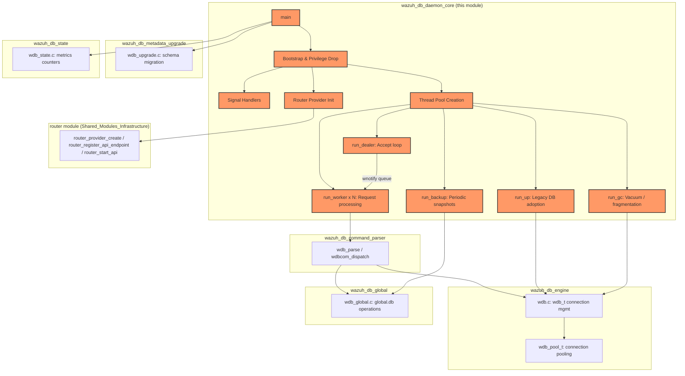
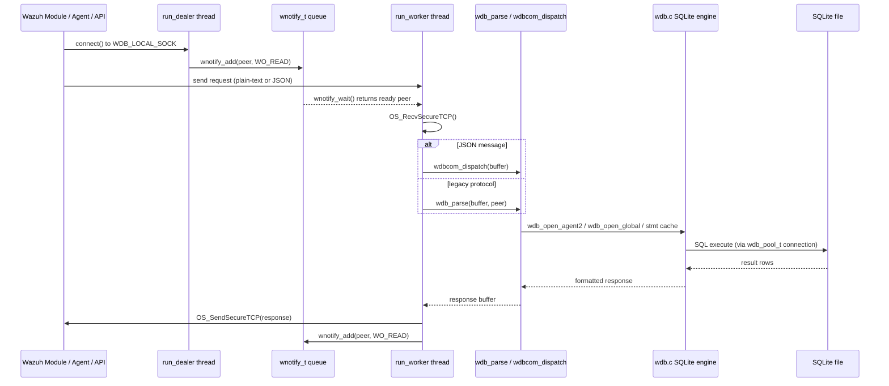
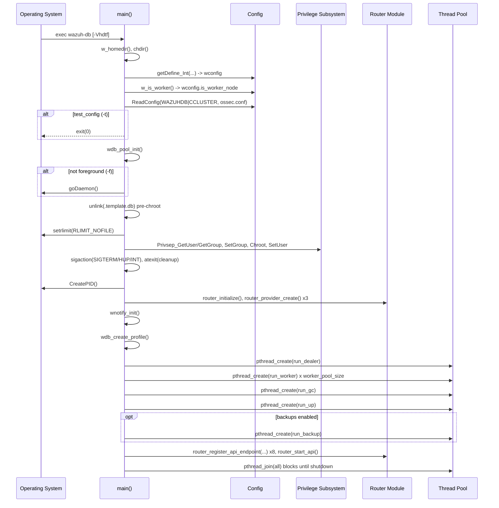
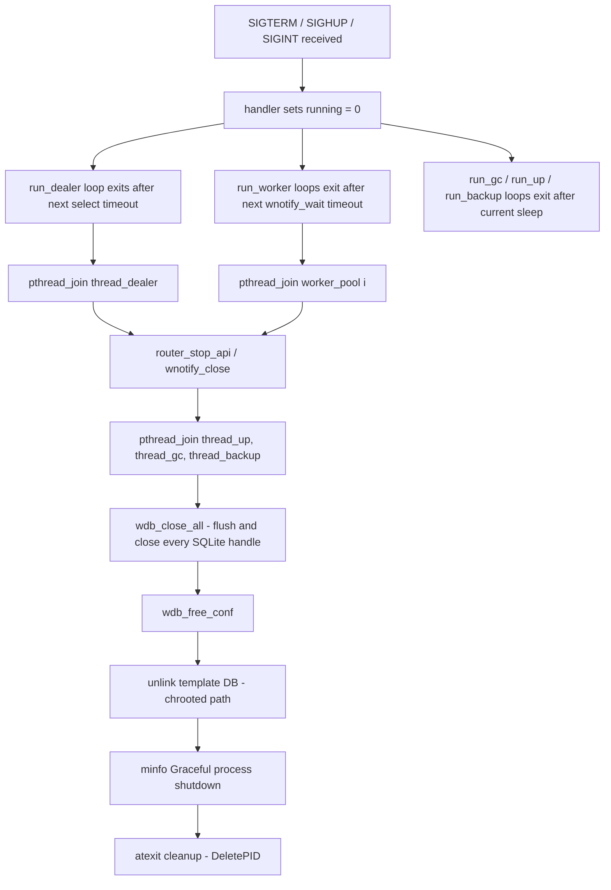
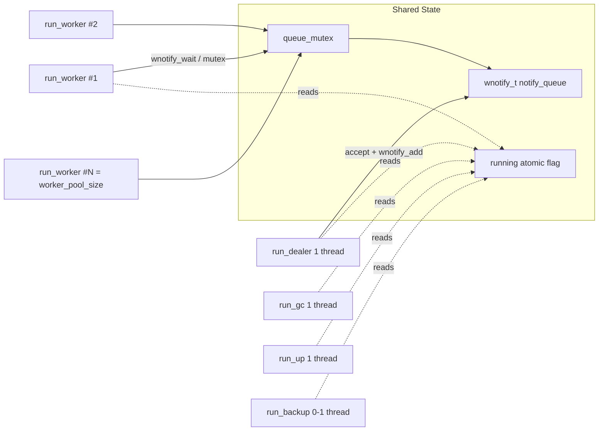

# Wazuh DB Daemon Core (`wazuh_db_daemon_core`)

## Introduction

The **Wazuh DB Daemon Core** module implements the **process entry point and runtime lifecycle** of `wazuh-db`, the central database daemon of the Wazuh manager. `wazuh-db` is the single service responsible for owning and serializing access to all of the manager's SQLite databases — the `global.db` (agent inventory/metadata), each agent's individual database (FIM baseline, syscollector, SCA, rootcheck data, etc.), and the `tasks.db` — so that every other Wazuh component (API, framework, cluster, remoted, other wazuh-modules) interacts with persisted data through a single, serialized, well-defined protocol instead of touching SQLite files directly.

This module (`src/wazuh_db/main.c`) contains **only the daemon bootstrap and thread-orchestration logic**: argument parsing, privilege drop, signal handling, thread-pool creation, and the top-level thread routines that dispatch requests to the rest of the `wazuh_db` codebase. It deliberately does **not** implement the SQL logic, the wire protocol parsing, or the state/metrics counters — those live in sibling modules (see [Related Modules](#related-modules)) that this core wires together and drives.

---

## Purpose and Responsibilities

| Responsibility | Description |
|---|---|
| **Daemon bootstrap** | Parses CLI flags (`-V`, `-h`, `-d`, `-t`, `-f`), reads internal options (`internal_options.conf`) and `ossec.conf` (`<wazuh_db>` / cluster blocks), sets debug level, and optionally runs as a foreground process for testing (`-t`, `-f`). |
| **Privilege separation** | Changes working directory to the Wazuh home, sets file-descriptor `rlimit`, chroots into the Wazuh home directory, and drops privileges to the configured `wazuh`/unprivileged user & group before serving any client. |
| **Signal handling** | Installs handlers for `SIGTERM`/`SIGHUP`/`SIGINT` to flip a `running` atomic flag for graceful shutdown, and ignores `SIGPIPE`. Registers a `cleanup()` `atexit` hook that removes the daemon's PID file. |
| **Socket/thread orchestration** | Creates the local UNIX socket (`WDB_LOCAL_SOCK`) and dispatches connections through a **notify (epoll/select) queue** shared by a configurable **worker thread pool** (`run_dealer` + N × `run_worker`). |
| **Background maintenance threads** | Spawns dedicated threads for garbage collection / fragmentation checks (`run_gc`), stale/legacy per-agent DB adoption (`run_up`), and periodic database backups (`run_backup`, when enabled). |
| **HTTP/router integration** | Initializes the internal `router` module logging, creates router "providers" for FIM/agent/inventory event topics, and registers/­starts an HTTP-like API (`wdb-http.sock`) exposing global-DB endpoints (agent ids, groups, sync, summary, restart info). |
| **Template DB management** | Creates/removes the `.template.db` profile used to seed new per-agent databases, both before chroot (with home prefix) and after shutdown (chrooted path). |

---

## Architecture Overview

---

## Component Breakdown

### `main()`
The single entry point of the `wazuh-db` executable. Performs, in order:

1. **Working directory & CLI parsing** — resolves the Wazuh home directory (`w_homedir`), `chdir`s into it, and parses `-V/-h/-d/-t/-f` via `getopt`.
2. **Internal options** — loads tunables from `internal_options.conf` into the global `wconfig` (`wdb_config`, see [wazuh_db_engine.md](wazuh_db_engine.md)): worker pool size, commit-time bounds, open-DB limit, `rlimit_nofile`, and fragmentation/vacuum thresholds.
3. **Cluster role detection** — sets `wconfig.is_worker_node` via `w_is_worker()` (from `cluster_utils`, part of the [cluster_module](cluster_module.md)) so downstream logic (e.g., backup scheduling, sync behavior) can distinguish master/worker nodes.
4. **Configuration loading** — calls `ReadConfig()` with `WAZUHDB | CCLUSTER` modules against `ossec.conf` (see [Wazuh_DB_Config](Wazuh_DB_Config.md)).
5. **Daemonization** — unless `-f`, calls `goDaemon()`/`nowDaemon()` (shared library, see [shared_lib](shared_lib.md)).
6. **Resource limits & privilege drop** — applies `setrlimit(RLIMIT_NOFILE, ...)`, resolves `Privsep_GetUser/GetGroup`, `chroot`s, and switches UID/GID.
7. **Signal & exit handlers** — installs `handler()` for termination signals and registers `cleanup()` via `atexit()`.
8. **PID file & startup log** — `CreatePID()`, then logs `STARTUP_MSG`.
9. **Router integration** — calls `router_initialize()` and `router_provider_create()` for three topics (`wdb-agent-events`, `wdb-fim-events`, `wdb-inventory-events`) that other Wazuh modules (`inventory_harvester`, `vulnerability_scanner`) subscribe to via the shared [router](router.md) module.
10. **Notification queue** — creates the `wnotify_t` used by `run_dealer`/`run_worker` for scalable non-blocking I/O.
11. **Database template creation** — `wdb_create_profile()` builds the `.template.db` used as the seed schema for new per-agent databases (delegated to [wazuh_db_engine](wazuh_db_engine.md)).
12. **Thread spawning** — starts `run_dealer`, a pool of `wconfig.worker_pool_size` `run_worker` threads, `run_gc`, `run_up`, and conditionally `run_backup` (if `wdb_check_backup_enabled()` returns true).
13. **HTTP API registration** — registers global-DB REST-like endpoints on `wdb-http.sock` (agent IDs, groups, sync, summary, restart info), each backed by pre/post handlers implemented in [wazuh_db_global](wazuh_db_global.md).
14. **Shutdown sequence** — joins all threads in order, stops the HTTP API, closes all open DB connections (`wdb_close_all()`), frees configuration, and removes the template DB again (now under the chrooted path).

### `run_dealer()`
Accept-loop thread. Binds a UNIX domain stream socket (`OS_BindUnixDomain`) at `WDB_LOCAL_SOCK`, then loops on `select()` to accept new peer connections and registers each accepted file descriptor with the shared `wnotify_t` queue for read-readiness (`WO_READ`). This decouples connection acceptance from request processing, allowing the worker pool to scale independently of the number of concurrent clients.

### `run_worker()`
The request-processing thread routine, replicated `wconfig.worker_pool_size` times. Each worker:
1. Waits on the shared `wnotify_t` (protected by `queue_mutex`) for a ready peer.
2. Reads a request via `OS_RecvSecureTCP()`.
3. Dispatches to either:
   - `wdbcom_dispatch()` if the message is JSON (`{`-prefixed) — administrative/config commands, see [wazuh_db_command_parser](wazuh_db_command_parser.md).
   - `wdb_parse()` otherwise — the legacy plain-text wire protocol used by agents/modules for FIM, syscollector, global-DB and task queries (also in [wazuh_db_command_parser](wazuh_db_command_parser.md)).
4. Sends the response back with `OS_SendSecureTCP()` and re-registers the peer for the next read.

### `run_gc()`
Garbage-collection / maintenance loop: periodically commits pending transactions (`wdb_commit_old()`), checks and (if needed) triggers `VACUUM` based on fragmentation thresholds (`wdb_check_fragmentation()`, throttled by `wconfig.check_fragmentation_interval`), and closes idle DB handles (`wdb_close_old()`). All of the underlying primitives live in [wazuh_db_engine](wazuh_db_engine.md).

### `run_up()`
One-shot-per-file legacy adoption loop: walks the `queue/db/` directory, and for each per-agent DB file not already following the current dotted `id.db` naming scheme, opens it via `wdb_open_agent2()` to trigger lazy migration/registration in the connection pool.

### `run_backup()`
Periodic backup thread (started only if enabled via configuration — see [Wazuh_DB_Config](Wazuh_DB_Config.md)). Tracks the last global-DB backup timestamp and, once the configured interval elapses, calls `wdb_global_create_backup()` (implemented in [wazuh_db_global](wazuh_db_global.md)) to snapshot `global.db`.

### `handler()` / `cleanup()`
- `handler(int signum)` — sets the module-level `_Atomic(int) running` flag to `0` on `SIGTERM`/`SIGHUP`/`SIGINT`, allowing all threads' loops to exit cleanly.
- `cleanup()` — removes the daemon's PID file on exit (registered via `atexit`).

---

## Data Flow: Client Request Lifecycle

---

## Startup Sequence (Detailed)

---

## Shutdown Sequence

---

## Threading Model

The worker pool size, GC, adoption, and backup threads are all independent OS threads coordinated only through the `running` atomic flag and the mutex-protected notification queue — there is no shared SQL transaction state at this layer; that concern is fully delegated to the connection-pooling layer in [wazuh_db_engine](wazuh_db_engine.md) (`wdb_pool_t`), which guarantees exclusive per-database access.

---

## Related Modules

This core module is intentionally thin; it depends heavily on sibling modules within the `wazuh_db` parent module and on shared infrastructure:

| Module | Relationship |
|---|---|
| [wazuh_db_engine](wazuh_db_engine.md) | Provides `wdb_t`, `wdb_config`, `wdb_pool_t`, and the low-level SQLite transaction/connection functions (`wdb_open_agent2`, `wdb_open_global`, `wdb_commit_old`, `wdb_close_old`, `wdb_check_fragmentation`, `wdb_create_profile`, `wdb_close_all`) invoked directly from `main.c`'s thread routines. |
| [wazuh_db_command_parser](wazuh_db_command_parser.md) | Implements `wdb_parse()` and `wdbcom_dispatch()`, the two protocol handlers dispatched from `run_worker()`. |
| [wazuh_db_global](wazuh_db_global.md) | Implements `global.db` operations (agent CRUD, groups, sync, backups) exposed both through the legacy protocol and the HTTP API endpoints registered in `main()`. |
| [wazuh_db_metadata_upgrade](wazuh_db_metadata_upgrade.md) | Schema migration logic invoked lazily when databases are opened/adopted (`run_up`). |
| [wazuh_db_state](wazuh_db_state.md) | Global metrics/counters (`wdb_state`) updated throughout request processing; `wdb_state.uptime` is initialized directly in `main()`. |
| [wazuh_db_fim_syscollector](wazuh_db_fim_syscollector.md) | FIM/syscollector delta-event processing invoked via the parsed protocol, and correlated with the `wdb-fim-events`/`wdb-inventory-events` router topics created in `main()`. |
| [wazuh_db_integrity](wazuh_db_integrity.md) | Integrity/checksum synchronization logic (`wdbi_*`) used during agent group and data sync flows. |
| [router](router.md) (Shared_Modules_Infrastructure) | Supplies `router_initialize`, `router_provider_create`, `router_register_api_endpoint`, and `router_start_api`/`router_stop_api`, used to publish events and expose the HTTP-like global-DB API. |
| [Wazuh_DB_Config](Wazuh_DB_Config.md) | Defines the `<wazuh_db>` configuration block (parsed via `eval_bool`-style helpers) read by `ReadConfig()` in `main()`. |
| [cluster_module](cluster_module.md) | `w_is_worker()` (C counterpart of `framework/wazuh/core/cluster/utils.py`, backed by `cluster_utils.c`) determines `wconfig.is_worker_node`, influencing backup and sync behavior. |
| [framework_core_communication](framework_core_communication.md) | The Python-side `WazuhDBConnection`/`AsyncWazuhDBConnection` classes are the primary clients that connect to the `WDB_LOCAL_SOCK` UNIX socket served by this daemon. |
| [wazuh_modules_core](wazuh_modules_core.md) / [syscheckd_core](syscheckd_core.md) | Native C clients (`wm_database.c`, FIM daemon) that communicate with `wazuh-db` over the same socket protocol dispatched by `run_worker()`. |

---

## Configuration Surface

`main()` reads the following tunables (via `getDefine_Int` from `internal_options.conf`) into the shared `wdb_config` struct (defined in `wazuh_db_engine`):

| Option | Range | Purpose |
|---|---|---|
| `worker_pool_size` | 1–32 | Number of `run_worker` threads processing client requests concurrently. |
| `commit_time_min` / `commit_time_max` | 1–3600s | Bounds for adaptive transaction commit scheduling. |
| `open_db_limit` | 1–4096 | Maximum number of simultaneously open per-agent SQLite handles (pool ceiling). |
| `rlimit_nofile` | 1024–1,048,576 | Process file-descriptor limit (`setrlimit`). |
| `fragmentation_threshold` / `fragmentation_delta` / `free_pages_percentage` / `max_fragmentation` | 0–100 | Drive the `run_gc` fragmentation/vacuum decision logic. |
| `check_fragmentation_interval` | 1–30,758,400s | How often `run_gc` re-evaluates fragmentation. |

Additionally, `<wazuh_db>` and cluster-related XML blocks in `ossec.conf` are parsed via `ReadConfig(WAZUHDB | CCLUSTER, ...)` — see [Wazuh_DB_Config](Wazuh_DB_Config.md) for the schema definition.

---

## Key Design Notes

- **Single daemon, many databases.** `wazuh-db` centralizes access to `global.db`, every agent's `<id>.db`, and `tasks.db`, avoiding concurrent-writer corruption that would occur if multiple processes wrote SQLite directly.
- **UNIX domain socket + notify queue** (rather than one-thread-per-connection) allows a small, bounded worker pool to service a large number of agents/modules efficiently.
- **Dual protocol support**: the same worker loop transparently distinguishes legacy plain-text (`wdb_parse`) versus JSON administrative (`wdbcom_dispatch`) requests based on the first byte of the payload.
- **Graceful degradation on privilege drop failures**: any failure in `chroot`/`setuid`/`setgid` calls `merror_exit()`, preventing the daemon from running with unintended privileges.
- **Router integration is best-effort**: failures to create router providers (`wdb-agent-events`, etc.) are logged at `mdebug2` level and do not abort startup, since these are used for optional event-forwarding paths (e.g., to `inventory_harvester`).
- **Template database lifecycle**: the `.template.db` profile is deleted twice — once pre-chroot at startup (in case of stale state from crash) and once post-chroot at clean shutdown — ensuring a consistent seed schema is always regenerated by `wdb_create_profile()`.
