# Wazuh DB Engine

## Introduction

The **Wazuh DB Engine** (`src/wazuh_db/wdb.c`, `src/wazuh_db/wdb.h`, `src/wazuh_db/wdb_pool.h`) is the low-level SQLite
persistence engine that powers `wazuh-db`, the Wazuh manager daemon responsible for centralizing all agent, FIM,
syscollector, rootcheck, SCA, task and RBAC-adjacent state into per-purpose SQLite databases
(`global.db`, `<agent_id>.db`, `tasks.db`).

This module does **not** parse the wire protocol nor implement business logic for specific tables (that is done by
sibling modules such as `wazuh_db_command_parser`, `wazuh_db_global`, `wazuh_db_fim_syscollector`,
`wazuh_db_integrity`, `wazuh_db_metadata_upgrade` and `wazuh_db_state` — see [wazuh_db_command_parser.md](wazuh_db_command_parser.md),
[wazuh_db_global.md](wazuh_db_global.md), [wazuh_db_fim_syscollector.md](wazuh_db_fim_syscollector.md),
[wazuh_db_integrity.md](wazuh_db_integrity.md), [wazuh_db_metadata_upgrade.md](wazuh_db_metadata_upgrade.md) and
[wazuh_db_state.md](wazuh_db_state.md)). Instead, it provides the **foundational engine primitives** that all of
those modules rely on:

- Opening/creating/closing SQLite database files and connections (`wdb_t`).
- A centralized, versioned catalog of every prepared SQL statement used across the whole `wazuh-db` daemon
  (`SQL_STMT[]`, `wdb_stmt` enumeration).
- Transaction lifecycle management (`BEGIN`/`COMMIT`/`ROLLBACK`) with automatic commit-on-idle and commit-on-timeout
  policies.
- Statement caching (both indexed via `wdb_stmt` and dynamic via a linked list, `stmt_cache_list`).
- Generic helpers to execute a prepared statement and serialize its result set to `cJSON`, either fully in memory,
  size-bounded, or streamed directly to a peer socket.
- Database fragmentation monitoring and automatic `VACUUM` execution.
- Foreign-key enforcement, WAL journaling mode, and synchronous mode configuration.

It is the C-level analog of the Python `WazuhDBConnection` / `AsyncWazuhDBConnection` classes found in
`framework/wazuh/core/wdb.py` (see [framework_core_communication.md](framework_core_communication.md)), which are
the client-side counterpart used by the API/Framework layer to talk to `wazuh-db` over its Unix socket.

## Position in the System

`wazuh_db_engine` is a child module of the broader **`wazuh_db`** component group, which is the manager-side daemon
that centralizes all SQLite state. The parent group also includes:

- `wazuh_db_daemon_core` — the daemon's `main()`, socket accept loop and dispatcher (`src/wazuh_db/main.c`).
- `wazuh_db_command_parser` — translates the wire-protocol commands into calls against this engine
  (`src/wazuh_db/wdb_parser.c`).
- `wazuh_db_global` — global agent/group business logic built on top of this engine (`src/wazuh_db/wdb_global.c`,
  `helpers/wdb_global_helpers.c`).
- `wazuh_db_fim_syscollector` — FIM and syscollector delta-sync logic (`wdb_fim.c`, `wdb_delta_event.c`).
- `wazuh_db_integrity` — Merkle-like checksum synchronization protocol (`wdb_integrity.c`).
- `wazuh_db_metadata_upgrade` — schema versioning/migration and backup creation (`wdb_metadata.c`, `wdb_upgrade.c`).
- `wazuh_db_state` — runtime metrics/statistics collection (`wdb_state.c`, `wdb_state.h`).

Clients of `wazuh-db` include:

- The **API & Management Framework (Python)**, via `WazuhDBConnection` / `AsyncWazuhDBConnection`
  (`framework/wazuh/core/wdb.py`) — see [framework_core_communication.md](framework_core_communication.md).
- **Native C daemons** (`remoted`, `logcollector`, `monitord`, `os_auth`) via `wazuhdb_op.c` helpers
  (see [Agent_&_Manager_Native_Daemons_(C).md](Agent_&_Manager_Native_Daemons_(C).md)).
- The **`wazuh_modules` daemon** (database sync module `wm_database.c`) — see
  [Wazuh_Modules_Daemon_(C).md](Wazuh_Modules_Daemon_(C).md).
- The **`syscheckd`/FIM daemon** and **`vulnerability_scanner`/`inventory_harvester`** shared modules that write
  through `wazuh-db` sockets.

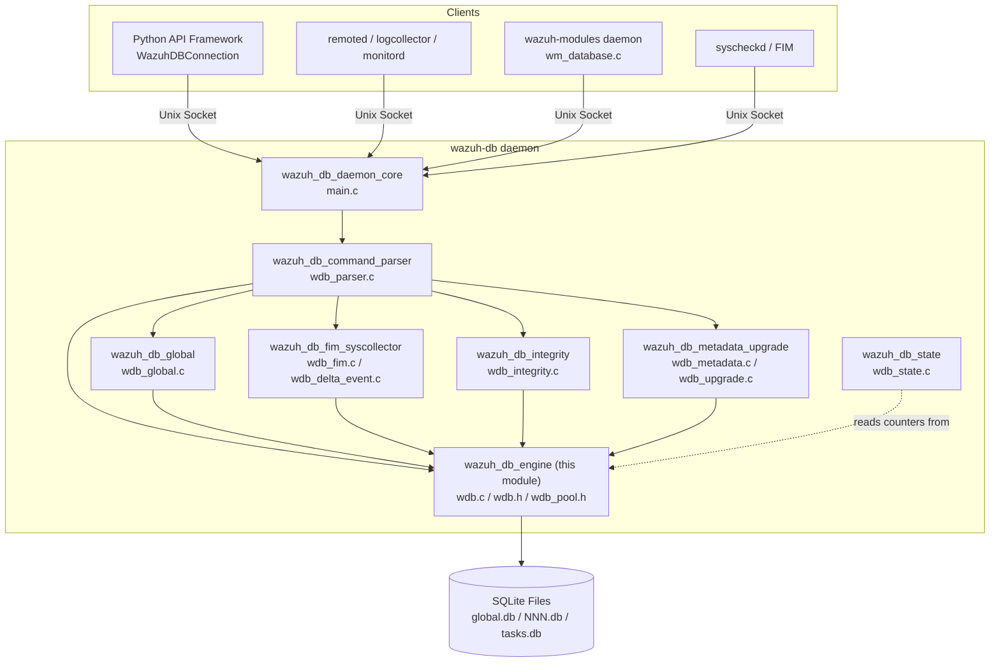

## Core Data Structures

### `wdb_t` — Database Connection Handle

`wdb_t` (defined in `wdb.h`) is the central handle representing one open SQLite database (one per agent, plus one
for `global.db` and one for `tasks.db`). It is reference-counted and pool-managed (see `wdb_pool_t` below).

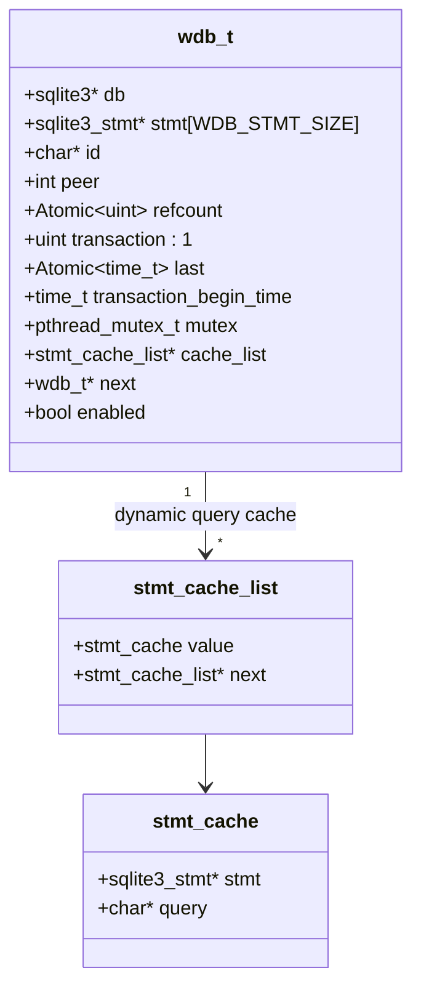

Key fields:

| Field | Purpose |
|---|---|
| `db` | Underlying `sqlite3*` handle (NULL when the database is closed/not yet opened). |
| `stmt[WDB_STMT_SIZE]` | Fixed-size array of pre-compiled statement handles indexed by the `wdb_stmt` enum — the primary statement cache. |
| `id` | Logical database identifier: `"global"`, `"task"`, or a zero-padded agent ID (e.g. `"003"`). |
| `refcount` | Atomic reference counter; the pool will not physically close a database while `refcount > 0`. |
| `transaction` | Boolean flag indicating an open `BEGIN` transaction. |
| `last` | Timestamp of the last query, used to decide when to auto-commit (idle timeout). |
| `transaction_begin_time` | Timestamp of `BEGIN`, used to decide when to force-commit (max transaction duration). |
| `cache_list` | Linked list (`stmt_cache_list`) of ad-hoc prepared statements, keyed by raw SQL text (used by dynamic/dbsync queries not covered by the static `wdb_stmt` catalog). |
| `mutex` | Per-database lock; every access to a `wdb_t` must be done while holding this mutex (acquired via the pool). |

### `wdb_pool_t` — Connection Pool

Declared in `wdb_pool.h`, `wdb_pool_t` is a red-black-tree-backed registry of all `wdb_t` nodes currently known to
the daemon (open or recently closed).

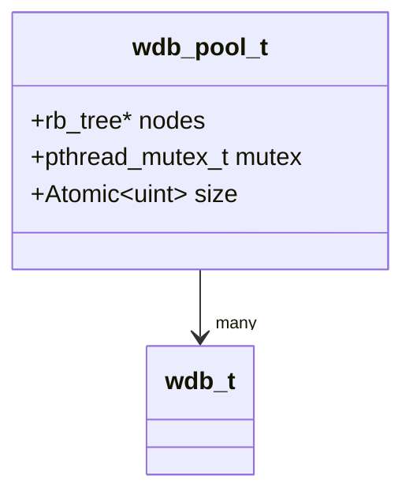

Pool API surface (implemented in the sibling `wdb_pool.c`, declared here):

- `wdb_pool_init()` — initializes the global pool singleton.
- `wdb_pool_get(name)` — look up an existing node by ID; increments refcount and locks its mutex if found.
- `wdb_pool_get_or_create(name)` — same as above, but creates the `wdb_t` node if missing.
- `wdb_pool_leave(node)` — releases the node's mutex and decrements the refcount.
- `wdb_pool_keys()` — snapshot of all identifiers currently in the pool.
- `wdb_pool_clean()` — removes nodes whose underlying `sqlite3*` has been closed and `refcount == 0`.
- `wdb_pool_size()` — current number of pool entries.

This pool is the backbone of concurrency control: every `wdb_open_*()` function in `wdb.c` (`wdb_open_global`,
`wdb_open_agent2`, `wdb_open_tasks`) goes through `wdb_pool_get_or_create()`, guaranteeing a single, mutex-protected
`wdb_t` per logical database across all threads of the daemon (worker pool, see the daemon core module).

### Statement Catalog (`wdb_stmt` + `SQL_STMT[]`)

`wdb.h` declares the `wdb_stmt` enum — an exhaustive, ordered list of every parameterized SQL statement used anywhere
in `wazuh-db` (FIM, syscollector deltas, OS/hardware/network/user/group inventory, CIS-CAT, SCA, rootcheck, global
agent/group tables, task manager, sync/checksum bookkeeping, and PRAGMA statements). `wdb.c` defines the matching
`SQL_STMT[]` array of literal SQL text, indexed by the enum. This design provides:

- **O(1) statement lookup and reuse** via `wdb_stmt_cache(wdb, index)`, which prepares (once) or resets/rebinds
  (on subsequent calls) `wdb->stmt[index]`.
- **Single source of truth** for the whole schema's DML, avoiding scattered/duplicated SQL strings across the
  code base.
- Clear separation between **legacy row-by-row style statements** (`WDB_STMT_*_INSERT`) and the newer
  **checksum/delta-sync statements** (`WDB_STMT_*_SELECT_CHECKSUM(_RANGE)`, `*_DELETE_AROUND`, `*_DELETE_RANGE`,
  `*_DELETE_BY_PK`, `*_CLEAR`) used by the integrity-sync protocol (see
  [wazuh_db_integrity.md](wazuh_db_integrity.md)).

For statements that don't fit the static enum (mainly `dbsync` UPSERT/DELETE built dynamically from `struct kv`
metadata — see below), `wdb_get_cache_stmt(wdb, query)` provides an equivalent dynamic cache keyed by the raw SQL
text, backed by `wdb->cache_list` (a `stmt_cache_list` linked list).

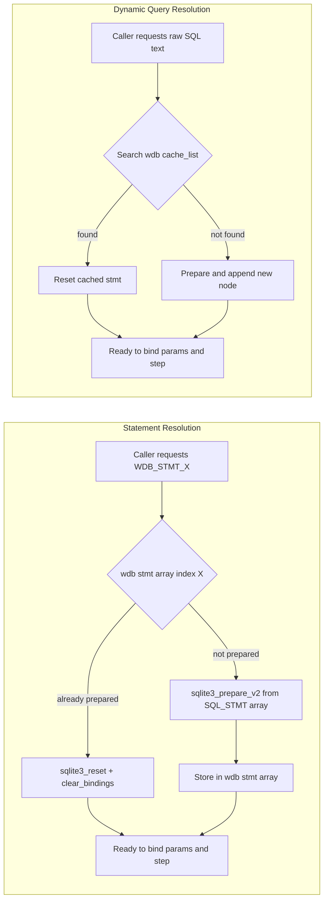

### Metadata / Delta-Sync Structures (`field`, `column_list`, `kv`, `kv_list`)

These structures describe table schemas generically so that a single pair of generic functions —
`wdb_upsert_dbsync()` and `wdb_delete_dbsync()` (implemented in the sibling `wdb_delta_event.c`, see
[wazuh_db_fim_syscollector.md](wazuh_db_fim_syscollector.md)) — can build parameterized INSERT/REPLACE and DELETE
statements for **any** syscollector table from a JSON delta payload, instead of one hand-written function per table.

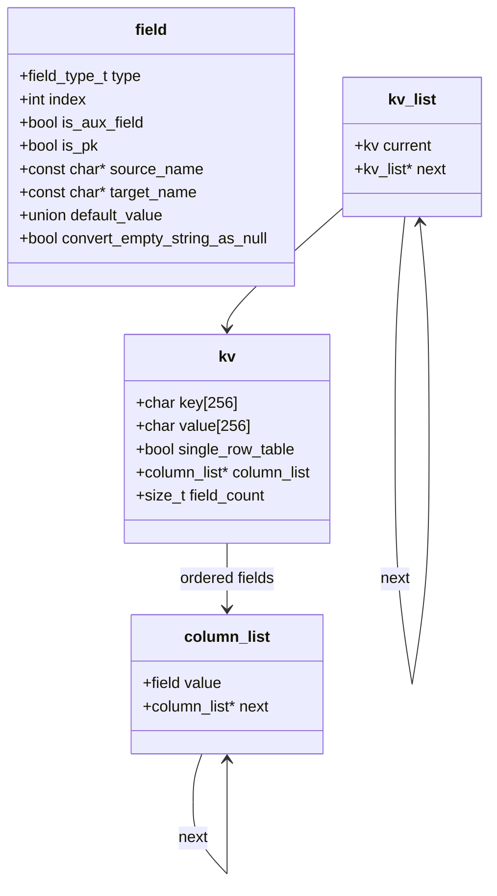

### `agent_info_data` / `os_data` / `user_record_t`

- `os_data` — normalized OS attributes (name, version, major/minor, codename, platform, build, uname, arch) used
  when updating an agent's version info.
- `agent_info_data` — full agent context (id, `os_data*`, version, checksums, manager/node names, IP, labels,
  connection/sync status, `agent_status_code_t`) used by `wdb_global_sync_agent_info_set()` in
  [wazuh_db_global.md](wazuh_db_global.md).
- `user_record_t` — flat representation of one row for the `sys_users` syscollector table (all fields required by
  `WDB_STMT_USER_INSERT(2)`), used by `wdb_users_save`/`wdb_users_insert` in
  [wazuh_db_fim_syscollector.md](wazuh_db_fim_syscollector.md).

## Engine Responsibilities in Detail

### 1. Database Lifecycle

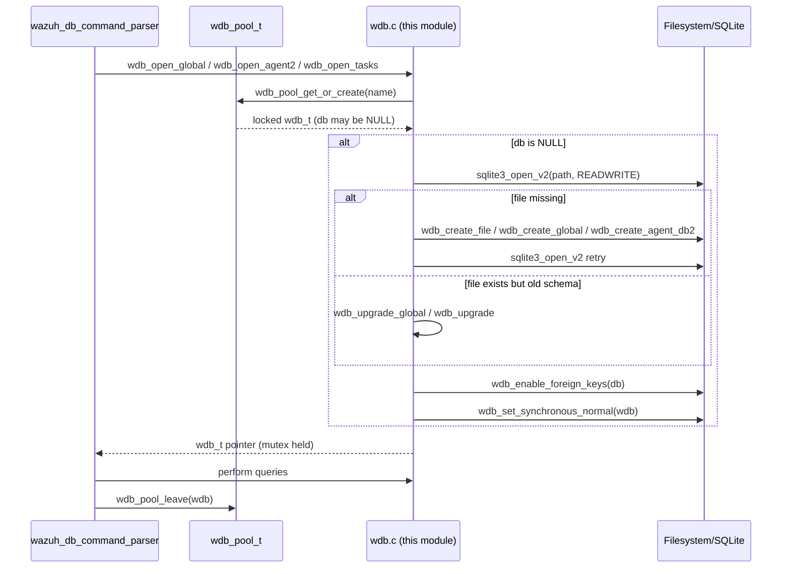

Key functions:

- `wdb_open_global()` / `wdb_open_agent2(agent_id)` / `wdb_open_tasks()` — lazily open (creating + upgrading the
  schema if necessary) and return a locked `wdb_t*` from the pool.
- `wdb_create_global(path)` — bootstraps `global.db` from `schema_global_sql` and inserts the
  `openssl_support` info row.
- `wdb_create_agent_db2(agent_id)` — instantiates a new per-agent database by copying the `WDB_PROF_PATH` profile
  template (creating the profile itself via `wdb_create_profile()` if missing).
- `wdb_create_file(path, source)` — generic routine that executes an arbitrary SQL script (schema) against a brand
  new SQLite file and fixes ownership/permissions (root:wazuh, `0640`).
- `wdb_close(wdb, commit)` — optionally commits a pending transaction, finalizes every cached statement
  (`wdb_finalize_all_statements`), and calls `sqlite3_close_v2`.
- `wdb_close_old()` — periodic housekeeping that closes the least-recently-used databases once the pool exceeds
  `wconfig.open_db_limit`, then calls `wdb_pool_clean()`.
- `wdb_close_all()` — closes every currently open database (used at daemon shutdown).
- `wdb_remove_database(agent_id)` / `wdb_remove_multiple_agents(list)` — deletes agent DB files from disk after
  closing them cleanly.

### 2. Transaction Management

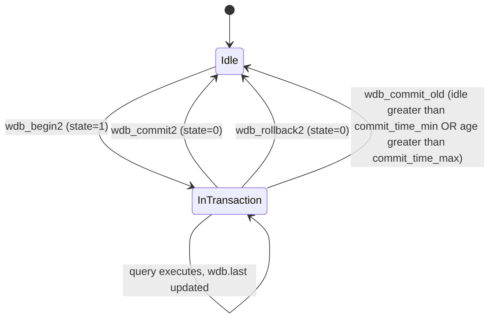

- `wdb_begin(wdb)` / `wdb_commit(wdb)` / `wdb_rollback(wdb)` — thin wrappers around `wdb_any_transaction()` that
  execute the literal `BEGIN;`, `COMMIT;`, `ROLLBACK;` statements.
- `wdb_begin2` / `wdb_commit2` / `wdb_rollback2` — state-aware variants (`wdb_write_state_transaction`) that avoid
  redundant `BEGIN`/`COMMIT` calls by checking/flipping `wdb->transaction`, and record `transaction_begin_time`.
- `wdb_init_stmt_in_cache(wdb, index)` — convenience helper used throughout the higher-level modules: opens a
  transaction if needed (`wdb_begin2`) and returns a ready-to-bind cached statement (`wdb_stmt_cache`).
- `wdb_commit_old()` — invoked periodically by the daemon's maintenance thread; scans the pool and commits any
  database whose transaction has been idle longer than `wconfig.commit_time_min` or open longer than
  `wconfig.commit_time_max`.

### 3. Fragmentation Monitoring & Vacuum

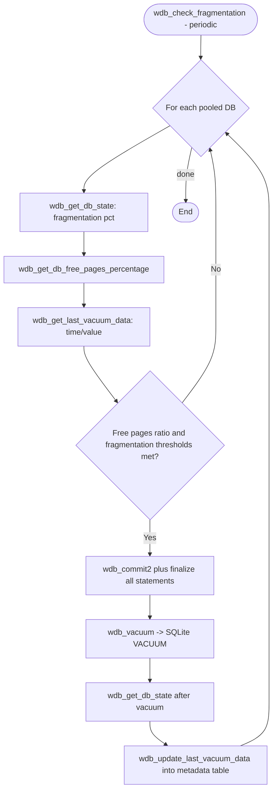

- `wdb_get_db_state(wdb)` — measures fragmentation (0–100) by building a temp table of `dbstat` page numbers and
  computing sequential-page adjacency via SQL.
- `wdb_get_db_free_pages_percentage(wdb)` — ratio of `freelist_count` to `page_count`.
- `wdb_get_last_vacuum_data` / `wdb_update_last_vacuum_data` — persist/retrieve the last vacuum's timestamp and
  resulting fragmentation value in the `metadata` table, used to avoid vacuuming too frequently (delta threshold).
- `wdb_vacuum(wdb)` — executes SQLite's `VACUUM;`.
- `wdb_check_fragmentation()` — orchestrates the whole cycle above across every pooled database, guarded by
  `wconfig` thresholds (`fragmentation_threshold`, `fragmentation_delta`, `free_pages_percentage`,
  `max_fragmentation`, `check_fragmentation_interval`).

### 4. Generic Statement Execution & JSON Serialization

The engine exposes a family of "exec" helpers used by virtually every higher-level query handler
(`wazuh_db_command_parser`, `wazuh_db_global`, etc.) to turn SQLite rows into JSON responses without duplicating
stepping/serialization logic:

| Function | Behavior |
|---|---|
| `wdb_exec(db, sql)` | One-shot: prepares raw SQL text, executes it, returns full `cJSON` array, finalizes. |
| `wdb_exec_stmt(stmt)` | Executes an already-prepared statement to completion, returns full `cJSON` array. |
| `wdb_exec_row_stmt(stmt, status, column_mode)` | Executes **one** step; dispatches to single- or multi-column variants. |
| `wdb_exec_row_stmt_single_column` | One step, returns a scalar JSON value (used for array-of-values responses). |
| `wdb_exec_row_stmt_multi_column` | One step, returns a JSON object keyed by column name. |
| `wdb_exec_stmt_sized(stmt, max_size, status, column_mode)` | Accumulates rows into a JSON array **while it fits** under `max_size`; leaves the statement steppable for the next chunk — the mechanism used for socket-response pagination (`due` continuation). |
| `wdb_exec_stmt_silent(stmt)` | Executes without building any JSON (fire-and-forget DML). |
| `wdb_exec_stmt_send(stmt, peer)` | Streams each row directly over a TCP peer socket, one `due {row}` message at a time, respecting `WDB_BLOCK_SEND_TIMEOUT_S`. |
| `wdb_sql_exec(wdb, sql_exec)` | Runs a full SQL script via `sqlite3_exec` (no row extraction) — used for schema/PRAGMA execution. |

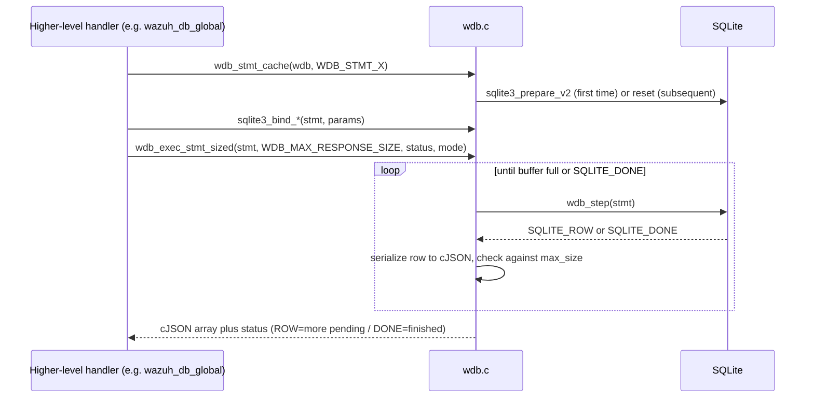

### 5. Database Pragmas

- `wdb_journal_wal(db)` — sets `PRAGMA journal_mode=WAL;` (enabled on every freshly opened `global.db`/agent DB for
  concurrent read/write access).
- `wdb_enable_foreign_keys(db)` — sets `PRAGMA foreign_keys=ON;`.
- `wdb_set_synchronous_normal(wdb)` — sets `PRAGMA synchronous=1;` (NORMAL) to balance durability vs. write
  throughput.

### 6. Configuration (`wdb_config`)

`wdb_config` (populated at daemon startup, exposed globally as `wconfig`) governs the engine's operational
thresholds:

| Field | Purpose |
|---|---|
| `worker_pool_size` | Number of worker threads processing the wazuh-db socket queue. |
| `commit_time_min` / `commit_time_max` | Idle / max-age thresholds for auto-commit (`wdb_commit_old`). |
| `open_db_limit` | Max simultaneously open agent databases before LRU eviction (`wdb_close_old`). |
| `fragmentation_threshold`, `fragmentation_delta`, `free_pages_percentage`, `max_fragmentation` | Vacuum decision thresholds (`wdb_check_fragmentation`). |
| `check_fragmentation_interval` | Period between fragmentation checks. |
| `wdb_backup_settings[WDB_LAST_BACKUP]` | Per-database (`WDB_GLOBAL_BACKUP`) backup policy: `enabled`, `interval`, `max_files` — consumed by [wazuh_db_metadata_upgrade.md](wazuh_db_metadata_upgrade.md). |
| `is_worker_node` | Whether the local node is a cluster worker (affects sync behavior in `wazuh_db_global`). |

`wdb_get_internal_config()` and `wdb_get_config()` expose these values as JSON for the `getconfig` wazuh-db command
(handled by [wazuh_db_command_parser.md](wazuh_db_command_parser.md) via `wdbcom_dispatch`).

## Component Interaction Overview

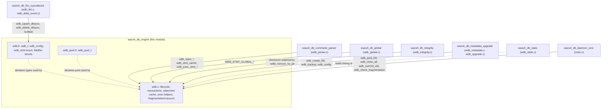

## Relationship to the Python Client Layer

Although implemented independently in C, this engine's semantics are mirrored on the client side by
`framework/wazuh/core/wdb.py`'s `WazuhDBConnection` (sync) and `AsyncWazuhDBConnection` (async) classes — see
[framework_core_communication.md](framework_core_communication.md). Both speak the same length-prefixed,
space-delimited wire protocol (`<agent|global|task> [id] sql <query>`) and understand the `ok`/`due`/`err` status
prefixes that this engine's `wdb_exec_stmt_send`/`wdb_exec_stmt_sized` helpers produce when paginating large result
sets (mirrored client-side by `WazuhDBConnection.execute()`'s slice-doubling/halving retry logic against
`MAX_SOCKET_BUFFER_SIZE`).

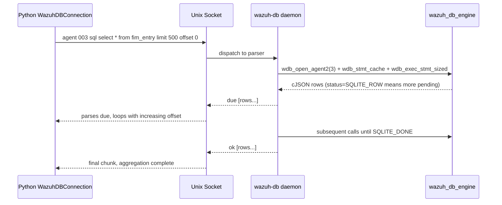

## Threading & Concurrency Model

- Every `wdb_t` has its own `pthread_mutex_t`; callers must hold it (acquired transparently via
  `wdb_pool_get`/`wdb_pool_get_or_create`, released via `wdb_pool_leave`) for the entire duration of any operation
  on that database.
- The pool itself (`wdb_pool_t.mutex`) is only locked briefly, while looking up/inserting/removing tree nodes — it
  is not held while a query executes, allowing high concurrency across *different* agent databases.
- `refcount` (atomic) prevents a database from being physically closed by `wdb_close_old()` while another thread
  still holds a reference.
- `wdb->last` and `wdb->transaction_begin_time` are used by the periodic maintenance thread
  (`wdb_commit_old`, `wdb_close_old`, `wdb_check_fragmentation` — invoked from the daemon core) to make time-based
  decisions without needing to hold the per-database mutex continuously.

## Key Constants & Limits

| Constant | Value/Meaning |
|---|---|
| `BUSY_SLEEP` / `MAX_ATTEMPTS` | Retry policy for `SQLITE_BUSY` in `wdb_prepare`/`wdb_step` (busy-wait loop). |
| `WDB_MAX_COMMAND_SIZE` | `512` — reserved header budget out of `OS_MAXSTR`. |
| `WDB_MAX_RESPONSE_SIZE` / `WDB_MAX_QUERY_SIZE` | `OS_MAXSTR - WDB_MAX_COMMAND_SIZE` — max payload size for responses/queries. |
| `WDB_BLOCK_SEND_TIMEOUT_S` | `1` second — timeout applied to socket writes in `wdb_exec_stmt_send`. |
| `WDB_GROUP_HASH_SIZE` | `8` — size of the group-membership hash used for group integrity sync. |
| `SYSCOLLECTOR_LEGACY_CHECKSUM_VALUE` | `"legacy"` — sentinel checksum marking rows from agents that don't support checksum-based sync. |

## Related Documentation

- [wazuh_db_daemon_core.md](wazuh_db_daemon_core.md) — process entry point, socket accept loop, and periodic
  maintenance thread that drives this engine's lifecycle/vacuum/commit routines.
- [wazuh_db_command_parser.md](wazuh_db_command_parser.md) — translates the wire protocol into calls against this
  engine.
- [wazuh_db_global.md](wazuh_db_global.md) — agent/group business logic built on the `WDB_STMT_GLOBAL_*` statements.
- [wazuh_db_fim_syscollector.md](wazuh_db_fim_syscollector.md) — FIM and syscollector delta-sync logic using
  `kv`/`field`/`column_list` metadata and `wdb_upsert_dbsync`/`wdb_delete_dbsync`.
- [wazuh_db_integrity.md](wazuh_db_integrity.md) — checksum-range synchronization protocol built on the
  checksum/delete statements.
- [wazuh_db_metadata_upgrade.md](wazuh_db_metadata_upgrade.md) — schema migrations and backup/restore, relying on
  `wdb_create_file`, `wdb_backup`, and `wdb_config` backup settings.
- [wazuh_db_state.md](wazuh_db_state.md) — runtime statistics collection observing this engine's operations.
- [framework_core_communication.md](framework_core_communication.md) — Python-side socket client
  (`WazuhDBConnection`/`AsyncWazuhDBConnection`) that consumes this engine's wire protocol.
- [Agent_&_Manager_Native_Daemons_(C).md](Agent_&_Manager_Native_Daemons_(C).md) — `wazuhdb_op.c`, the shared C
  helper used by `remoted`/`logcollector`/`monitord`/`os_auth` to talk to `wazuh-db`.
