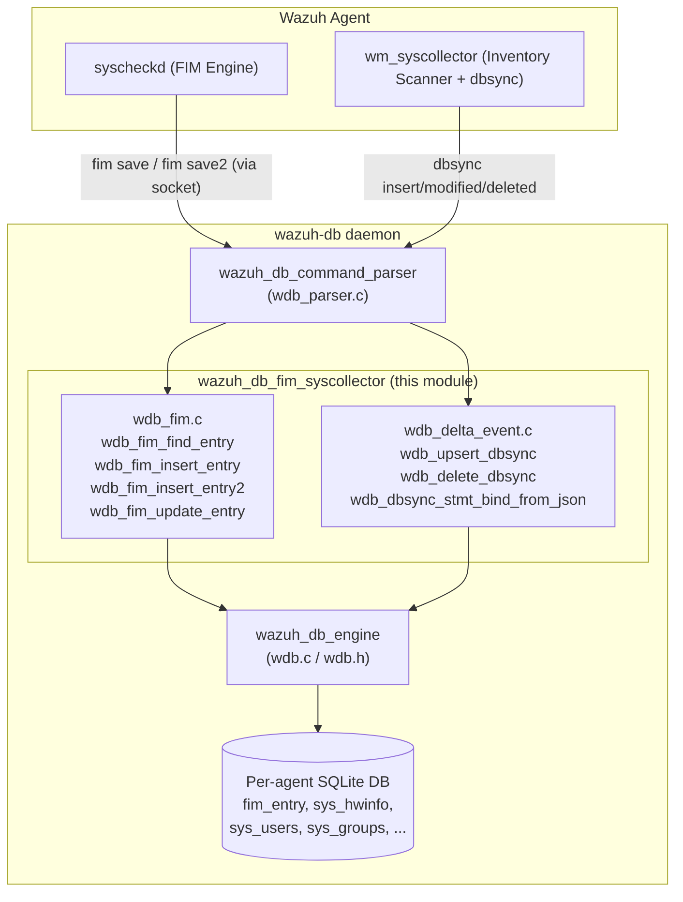
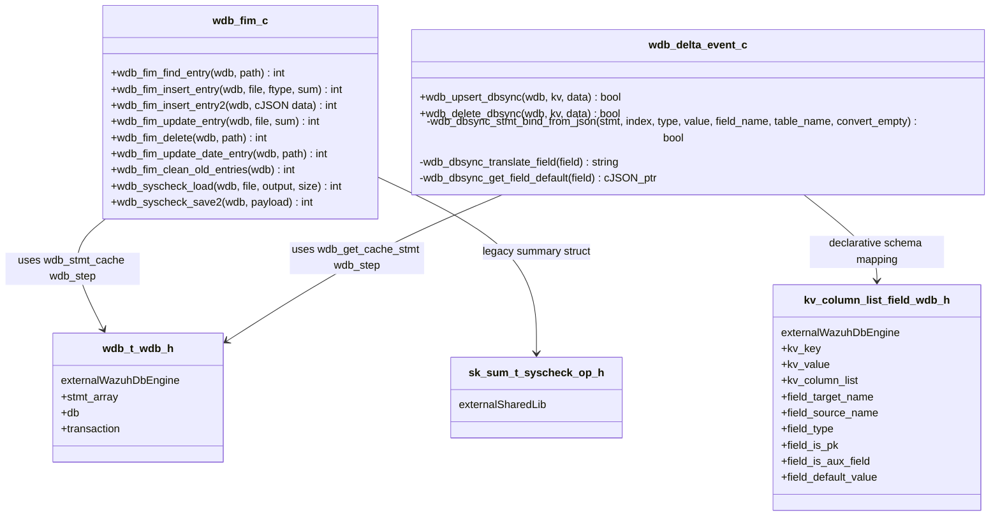
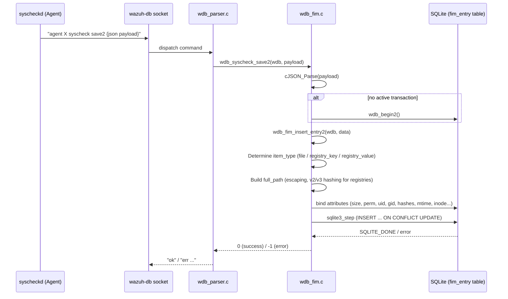
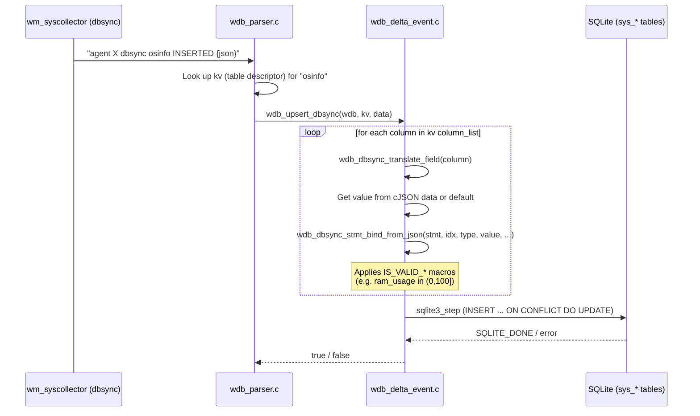
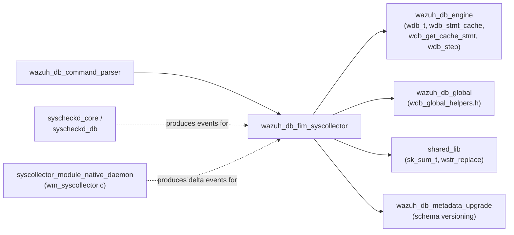

# Wazuh DB — FIM & Syscollector Data Persistence Module

## Introduction

The **wazuh_db_fim_syscollector** module is a focused subsystem of the `wazuh-db` daemon responsible for
persisting **File Integrity Monitoring (FIM)** events and **Syscollector delta/synchronization events**
into the per-agent SQLite databases managed by Wazuh DB. It implements the low-level SQL binding and
statement-execution logic that translates JSON payloads received from agents (via `wazuh-modulesd`'s
`syscollector` module and `syscheckd`) into `INSERT`/`UPDATE`/`DELETE` operations on the `fim_entry`,
`sys_hwinfo`, `sys_users`, `sys_groups`, and related syscollector tables.

This module sits at the intersection of two major data-producing subsystems:

- **Syscheck/FIM daemon** (`syscheckd`), which detects filesystem and Windows registry changes and sends
  FIM events to `wazuh-db` for storage.
- **Syscollector wazuh-module** (`wm_syscollector`, part of `wazuh-modulesd`), which periodically scans the
  host inventory (hardware, users, groups, processes, packages, network, ports) and pushes **delta events**
  (row-level change notifications produced by the `dbsync` shared library) to `wazuh-db`.

It does **not** implement the socket protocol, command parsing, or transaction/connection management —
those responsibilities belong to sibling modules (see [Dependencies](#dependencies)). Instead, this
module provides the reusable, low-level primitives that the `wazuh_db_command_parser` invokes once it has
identified an incoming `fim` or `dbsync` command.

## Purpose & Core Functionality

| Concern | Component |
|---|---|
| Locate an existing FIM entry by path | `wdb_fim_find_entry` |
| Insert a new legacy (pre-JSON) FIM entry | `wdb_fim_insert_entry` |
| Insert a new FIM entry (JSON/v4+ format, files & registries) | `wdb_fim_insert_entry2` |
| Update an existing legacy FIM entry | `wdb_fim_update_entry` |
| Bind arbitrary JSON delta fields to a prepared SQLite statement, honoring per-field type & validity rules | `wdb_dbsync_stmt_bind_from_json` |
| Generate and execute a generic `INSERT ... ON CONFLICT DO UPDATE` (upsert) statement for any syscollector table, driven by a declarative column list (`kv`/`column_list`/`field`) | `wdb_upsert_dbsync` |
| Generate and execute a generic `DELETE` statement keyed by primary-key columns for any syscollector table | `wdb_delete_dbsync` |

The two files that make up this module work together:

- **`wdb_fim.c`** — FIM-specific logic. Handles both the legacy `sk_sum_t`-based summary format (used by
  agents prior to the JSON-based FIM protocol) and the modern JSON payload format (`wdb_fim_insert_entry2`),
  which supports files, registry keys, and registry values (including hashed "v3" full-path indexing for
  Windows registry items).
- **`wdb_delta_event.c`** — Generic, table-agnostic syscollector delta persistence engine. It defines the
  `column_list`/`field`/`kv` metadata structures (declared in `wdb.h`, consumed here) that describe how a
  cJSON delta object maps onto SQL columns, and implements value validation macros
  (`IS_VALID_HWINFO_VALUE`, `IS_VALID_USERS_VALUE`, `IS_VALID_GROUPS_VALUE`) to reject semantically invalid
  data before it reaches the database (e.g., a `ram_usage` percentage above 100 is treated as `NULL`).

## Architecture Overview

## Component Relationships

## Data Flow: FIM Event Persistence

## Data Flow: Syscollector Delta Persistence (Generic Upsert/Delete)

## Key Design Details

### 1. Legacy vs. Modern FIM Formats
- `wdb_fim_insert_entry` / `wdb_fim_update_entry` / `wdb_syscheck_load` operate on the **legacy** `sk_sum_t`
  structure (defined in `src/headers/syscheck_op.h`, part of the shared library and syscheck-config
  headers), used for backward compatibility with older agent versions and the `syscheck save` command.
- `wdb_fim_insert_entry2` / `wdb_syscheck_save2` handle the modern JSON-based protocol, supporting:
  - **Files**: straightforward path-keyed entries.
  - **Registry keys/values (v2)**: `full_path` built by escaping backslashes/colons and concatenating
    architecture, path, and (for values) value name.
  - **Registry keys/values (v3)**: `full_path` is a pre-computed hash (the `index` field) supplied directly
    by the agent, avoiding on-the-fly string construction.
  - Synchronization messages lacking a `version` field for `registry_*` types are silently ignored (return 0)
    rather than treated as errors, since RSync-driven full-sync messages may omit this field.

### 2. Declarative Schema-Driven Upsert/Delete (`wdb_delta_event.c`)
Rather than hand-writing SQL per syscollector table (hardware, OS info, packages, ports, processes, network
interfaces, users, groups, hotfixes), this module builds `INSERT ... ON CONFLICT DO UPDATE` and
`DELETE ... WHERE <pk>=?` statements dynamically from a `kv` (key-value table descriptor) structure whose
`column_list` enumerates `field` records with:
- `target_name` / `source_name` — SQL column vs. JSON field name (`wdb_dbsync_translate_field`).
- `type` — one of `FIELD_TEXT`, `FIELD_INTEGER`, `FIELD_INTEGER_LONG`, `FIELD_REAL`.
- `is_pk` — whether the column participates in `WHERE`/conflict-resolution clauses.
- `is_aux_field` — auxiliary/derived fields that always use their `default_value` instead of JSON input.
- `convert_empty_string_as_null` — normalizes empty strings to SQL `NULL`.

These `kv`/`field` metadata definitions live in `wdb.h` (part of the wazuh_db engine module) and are
referenced, not owned, by this module.

### 3. Field-Level Value Validation
The `IS_VALID_HWINFO_VALUE`, `IS_VALID_USERS_VALUE`, and `IS_VALID_GROUPS_VALUE` macros enforce
domain-specific sanity constraints (e.g., CPU cores/MHz must be `> 0`, RAM usage percentage must be within
`(0, 100]`, user/group IDs must be `>= 0`). Values failing these checks are bound as `NULL` instead of being
rejected outright, preventing corrupt inventory data from silently propagating into dashboards/reports while
still allowing the row to be stored.

### 4. Type-Coercive Binding
`wdb_dbsync_stmt_bind_from_json` accepts JSON values that may arrive either as native numbers or as strings
(a quirk of some agent-side serializers) and coerces them appropriately per the target SQL column type,
including safe integer parsing (`strtol`/`strtoll`/`strtod` with `endptr` validation) to avoid binding
garbage on malformed numeric strings.

## Dependencies

- **wazuh_db_engine** — Supplies `wdb_t`, connection/transaction primitives (`wdb_begin2`), and statement
  caching (`wdb_stmt_cache`, `wdb_get_cache_stmt`, `wdb_step`) used throughout this module.
- **wazuh_db_command_parser** — The entry point that receives `fim`/`dbsync` commands over the wazuh-db
  socket and calls into this module's functions.
- **wazuh_db_global** — Provides `wdb_global_helpers.h`, included by `wdb_fim.c`, for agent-context helper
  functions.
- **wazuh_db_metadata_upgrade** — Defines and migrates the SQL schema (`fim_entry`, `sys_*` tables) that
  this module's SQL statements target.
- **shared_lib** — Supplies `sk_sum_t` (legacy checksum summary struct) and string utilities like
  `wstr_replace` used for permission/path escaping.
- **syscheckd_core** / **syscheckd_db** — The agent-side FIM engine that produces the JSON payloads
  consumed by `wdb_fim_insert_entry2`.
- **syscollector_module_native_daemon** and `wm_syscollector.c` (Wazuh Modules Daemon) — The agent-side
  inventory collector whose `dbsync` delta events (insert/modified/deleted) are persisted via
  `wdb_upsert_dbsync`/`wdb_delete_dbsync`.

## Testing

Unit tests for this module reside under **Unit_Tests_-_Wazuh_DB**:
- `test_wdb_fim` — covers `wdb_fim_insert_entry2` across files, registry keys/values (v2 and v3), edge cases
  (null attributes, null path, large inodes, JSON-formatted permissions), and `wdb_syscheck_save2`.
- `test_wdb_delta_event` — covers `wdb_dbsync_stmt_bind_from_json` type coercion (integer/real/text/long,
  string-to-number conversions, null handling), field validation macros for hardware/users/groups tables,
  and `wdb_upsert_dbsync`/`wdb_delete_dbsync` success/failure paths (cache miss, bind failure, step failure).

## Summary

The `wazuh_db_fim_syscollector` module is a narrow but critical persistence layer within `wazuh-db`. It
bridges the gap between two independent agent-side data producers — FIM and Syscollector — and the shared
per-agent SQLite storage engine, encapsulating all format-specific parsing, path-normalization, type
coercion, and value-validation logic required to safely and correctly store integrity-monitoring and
inventory-synchronization data. Consumers wishing to understand *how* wazuh-db physically stores FIM/
inventory data should start here; for *how commands reach this module*, see the `wazuh_db_command_parser`
documentation; for the underlying connection/statement infrastructure, see the `wazuh_db_engine`
documentation.
