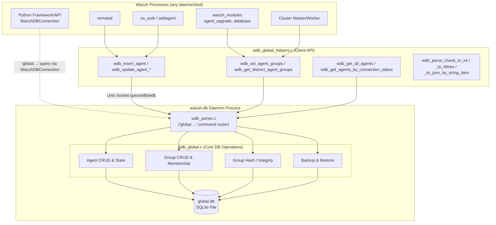
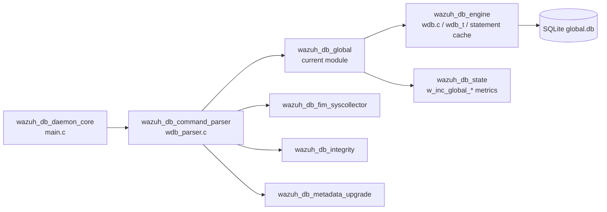
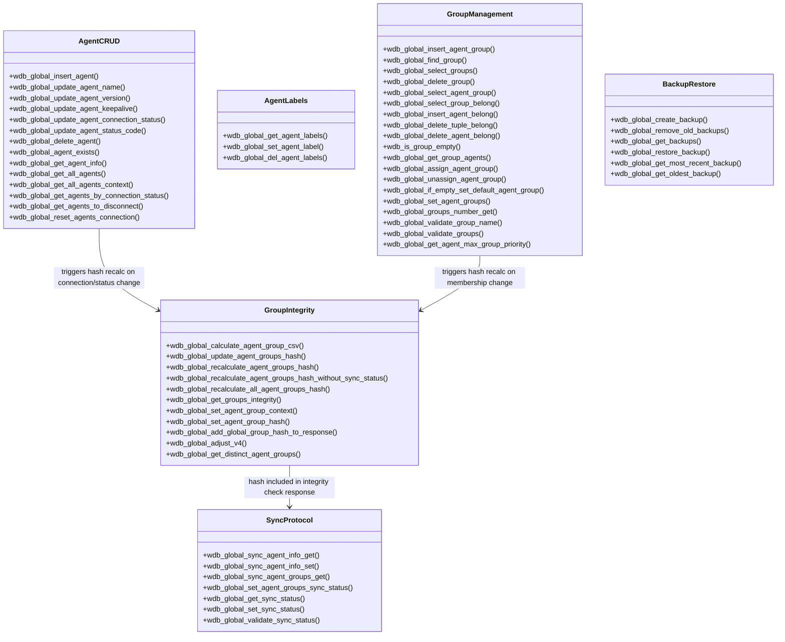
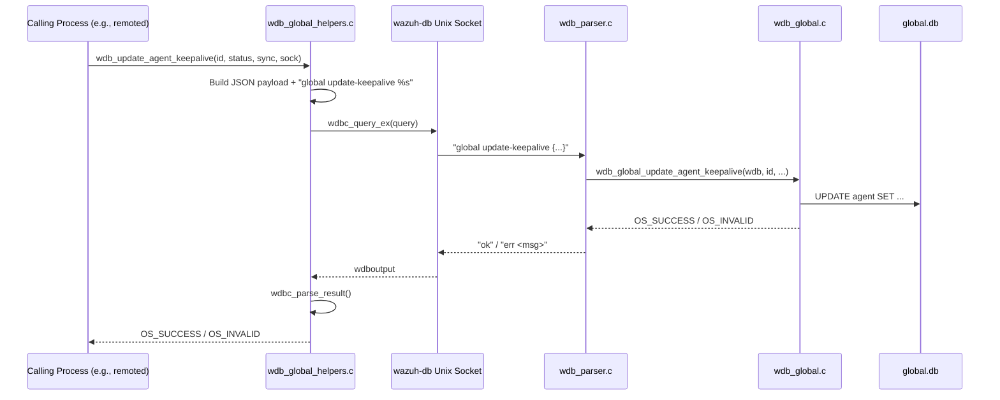
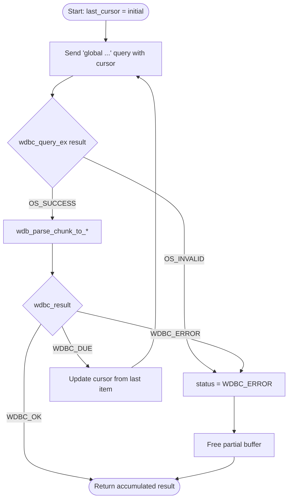
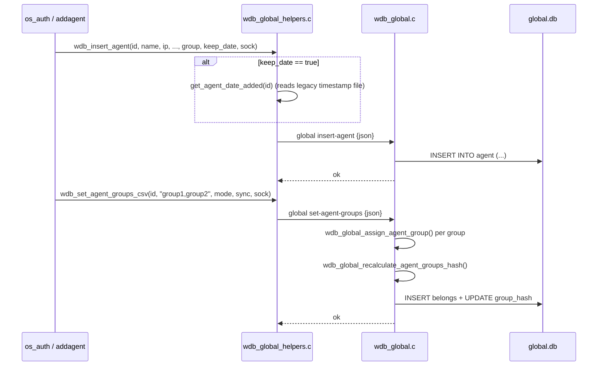
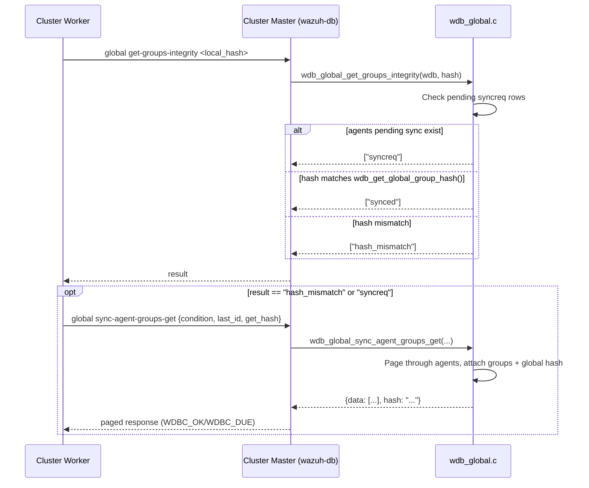

# Wazuh DB Global Module

## Introduction

The **`wazuh_db_global`** module implements the core data-access layer for the **`global.db`** SQLite database — the single source of truth for agent inventory, agent group membership, and agent connection/synchronization state in a Wazuh deployment. It is a sub-component of the [wazuh_db](wazuh_db.md) daemon and is split into two cooperating layers:

| Layer | File | Role |
|---|---|---|
| **Server-side DB layer** | `src/wazuh_db/wdb_global.c` | Executes prepared SQLite statements against `global.db`: agent CRUD, group CRUD/membership, connection-status tracking, group-hash integrity, and backup/restore. Runs **inside** the `wazuh-db` daemon process. |
| **Client-side helper layer** | `src/wazuh_db/helpers/wdb_global_helpers.c` | Thin JSON-RPC style wrappers that other Wazuh processes (`remoted`, `authd`, `wazuh-modulesd`, cluster code, CLI tools) use to talk to `wazuh-db` over its Unix socket. Handles query building, chunked/paginated response parsing, and legacy filesystem-based group synchronization. |

Together these two files answer the question *"what does the manager know about its agents and their groups?"* for virtually every other Wazuh component — the C daemons, the Python Framework/API, and the Cluster subsystem all ultimately read and write this data through this module.

---

## 1. Purpose & Core Functionality

`wazuh_db_global` owns all persistent state related to:

1. **Agent lifecycle** — insertion, renaming, deletion, existence checks, full/paginated listing.
2. **Agent runtime state** — keepalive timestamps, connection status (`active`/`disconnected`/`never_connected`/`pending`), status codes, OS/version metadata, sync status flags.
3. **Agent labels** — arbitrary key/value metadata attached to an agent.
4. **Groups & group membership** — creating/deleting groups, assigning/removing agents from groups (single or multi-group), computing per-agent comma-separated group lists and SHA-256 **group hashes** used for fast integrity comparison between manager and worker nodes.
5. **Cluster/API synchronization protocols** — chunked "get pending changes" queries (`sync_agent_info_get`, `sync_agent_groups_get`) that support the `WDBC_OK / WDBC_DUE / WDBC_ERROR` pagination protocol used throughout `wazuh-db`.
6. **Database maintenance** — VACUUM-based backup creation/compression, backup rotation, and restore (including automatic "pre-restore" snapshotting).

---

## 2. Architecture

### 2.1 Layered Component View

The **helper layer never touches SQLite directly**. It formats a `global <command> <json>` request string, sends it through `wdbc_query_ex()`/`wdbc_query_parse_json()` over the `wazuh-db` Unix socket, and parses the textual response (`ok ...`, `due ...`, `err ...`). The **core layer** (`wdb_global.c`) is only reachable from inside the `wazuh-db` process, invoked by the command parser described in [wazuh_db_command_parser](wazuh_db_command_parser.md).

### 2.2 Position within the `wazuh_db` daemon

* [wazuh_db_engine](wazuh_db_engine.md) supplies the generic `wdb_t` handle, transaction control (`wdb_begin2`/`wdb_commit2`), and the statement-cache mechanism (`wdb_stmt_cache`, `wdb_init_stmt_in_cache`) that every function in `wdb_global.c` relies on.
* [wazuh_db_state](wazuh_db_state.md) records latency/count metrics (`w_inc_global_agent_*`) around most of these operations, though the increment calls themselves live in the calling code, not in this file.
* [wazuh_db_command_parser](wazuh_db_command_parser.md) is the only caller of the core-layer functions; it decodes the `global <verb> <json>` protocol and dispatches to the appropriate `wdb_global_*` function.

---

## 3. Core-Layer Function Groups (`wdb_global.c`)

### Key implementation details

* **Transaction management**: virtually every function begins with `if (!wdb->transaction && wdb_begin2(wdb) < 0)`, deferring to the shared engine in [wazuh_db_engine](wazuh_db_engine.md) rather than managing transactions itself.
* **Statement caching**: prepared statements are identified by `WDB_STMT_GLOBAL_*` enum values and cached via `wdb_stmt_cache()` / `wdb_init_stmt_in_cache()`, avoiding repeated `sqlite3_prepare_v2` calls.
* **Paginated queries**: functions such as `wdb_global_get_all_agents`, `wdb_global_get_agents_by_connection_status`, `wdb_global_sync_agent_info_get`, and `wdb_global_sync_agent_groups_get` use `wdb_exec_stmt_sized()` bounded by `WDB_MAX_RESPONSE_SIZE` and return a `wdbc_result` (`WDBC_OK`, `WDBC_DUE`, `WDBC_ERROR`) so callers can page through large agent fleets.
* **Group hash integrity**: `wdb_global_update_agent_groups_hash()` computes a SHA-256 (truncated to `WDB_GROUP_HASH_SIZE`) over an agent's comma-separated group list; `wdb_global_get_groups_integrity()` compares a caller-provided hash against `wdb_get_global_group_hash()` to short-circuit synchronization when nothing changed — this is the mechanism the [cluster_module](cluster_module.md) uses to avoid re-sending full agent-group data between master and worker nodes.
* **Group validation**: `wdb_global_validate_group_name()` rejects `.`/`..`, oversized names, and names with illegal characters; `wdb_global_validate_groups()` enforces `MAX_GROUPS_PER_MULTIGROUP` per agent.
* **Backup/restore**: `wdb_global_create_backup()` uses SQLite's `VACUUM INTO` to produce a consistent snapshot, then gzip-compresses it (`w_compress_gzfile`) and prunes old backups per `wconfig.wdb_backup_settings[WDB_GLOBAL_BACKUP]`. `wdb_global_restore_backup()` optionally takes a pre-restore snapshot before swapping the live database file.

---

## 4. Client Helper Layer (`wdb_global_helpers.c`)

This layer is linked into **every process that needs agent/group data without embedding SQLite**, including `remoted`, `os_auth`/`addagent`, `wazuh-modulesd` (agent-upgrade, database module), and cluster components.

### 4.1 Request/Response Flow

### 4.2 Chunked/Paginated Response Parsers

Several "get" helpers must handle responses that don't fit in a single socket message. Three generic parsers implement this pattern:

| Parser | Used By | Output |
|---|---|---|
| `wdb_parse_chunk_to_int()` | `wdb_get_all_agents`, `wdb_get_agents_by_connection_status`, `wdb_disconnect_agents`, `wdb_get_agents_ids_of_current_node` | Dynamically-grown `int*` array, `-1`-terminated |
| `wdb_parse_chunk_to_rbtree()` | `wdb_get_all_agents_rbtree` | Red-black tree keyed by zero-padded agent ID (`rb_tree`) |
| `wdb_parse_chunk_to_json_by_string_item()` | `wdb_get_distinct_agent_groups` | Accumulated `cJSON` array, tracking last string-valued item (e.g., `group_hash`) for the next page's cursor |

All three loop while `wdbc_result == WDBC_DUE`, re-issuing the query with an updated cursor (`last_id`, `last_hash`, etc.) until `WDBC_OK` or `WDBC_ERROR`.

### 4.3 Group Filesystem Synchronization

`wdb_update_groups(dirname, sock)` bridges the **legacy filesystem-based group model** (`/var/ossec/etc/shared/<group>/`) with the database:
1. Fetches all DB groups (`global select-groups`).
2. For each DB group without a matching directory under `dirname`, calls `wdb_remove_group_db()`.
3. Walks `dirname` and calls `wdb_insert_group()` for any directory not yet present in the DB (skipping `.`/`..`).

This function is the integration point used by the [agent_module](agent_module.md) (`framework/wazuh/core/agent.py::get_groups`) and legacy group-management scripts to keep `global.db` consistent with `/etc/shared`.

### 4.4 Agent Enrollment Data Flow

---

## 5. Data Flow: Master/Worker Group Synchronization

The group-hash integrity mechanism is central to how the [cluster_module](cluster_module.md) keeps agent-group assignments consistent across nodes without transferring the full dataset on every sync cycle.

---

## 6. Notable Design Patterns

* **Command-string protocol**: Every helper function builds a fixed-format string from `global_db_commands[]` (an array indexed by a `wdb_command` enum) and a `cJSON`-serialized payload — this mirrors the pattern used by [wazuh_db_command_parser](wazuh_db_command_parser.md) on the receiving end.
* **Socket ownership flexibility**: Nearly all public helper functions accept an optional `int *sock` parameter; if `NULL`, the function opens (`wdbc_query_ex` internally) and closes (`wdbc_close`) a private connection, but callers doing many sequential calls (e.g., group sync loops) can pass a persistent socket to avoid reconnect overhead.
* **Graceful degradation on cache lookups**: `wdb_global_validate_sync_status()` falls back to accepting the caller's requested sync status if the current status can't be read, preferring forward progress over blocking.
* **Default group safety net**: `wdb_global_if_empty_set_default_agent_group()` is invoked whenever a group removal could leave an agent with zero groups, automatically reassigning it to the `default` group — this guarantees the system invariant that every agent belongs to at least one group.

---

## 7. Related Modules

| Module | Relationship |
|---|---|
| [wazuh_db](wazuh_db.md) | Parent module; overall `wazuh-db` daemon architecture. |
| [wazuh_db_command_parser](wazuh_db_command_parser.md) | Decodes `global <verb> <json>` requests and dispatches into this module's core layer. |
| [wazuh_db_engine](wazuh_db_engine.md) | Provides the `wdb_t` connection/transaction/statement-cache primitives used throughout `wdb_global.c`. |
| [wazuh_db_state](wazuh_db_state.md) | Collects per-query latency/count metrics for global-DB operations. |
| [wazuh_db_integrity](wazuh_db_integrity.md) | Generic checksum/sync-tree infrastructure that complements the group-hash integrity check described above. |
| [agent_module](agent_module.md) | Python Framework layer (`framework/wazuh/agent.py`, `core/agent.py`) that ultimately issues `global` queries via `WazuhDBConnection`. |
| [cluster_module](cluster_module.md) | Consumes `sync-agent-groups-get` / `get-groups-integrity` to replicate agent-group state between master and worker nodes. |
| [framework_core_communication](framework_core_communication.md) | Contains `WazuhDBConnection`/`AsyncWazuhDBConnection`, the Python-side socket client analogous to the C helper layer described here. |
| [security_rbac_module](security_rbac_module.md) | Independent ORM-based database (`rbac/orm.py`), not part of `global.db`, but conceptually parallel as another "global state" store in the manager. |
