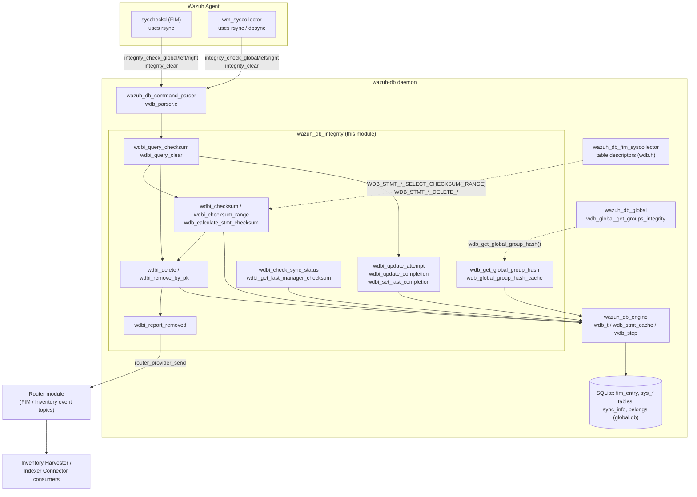
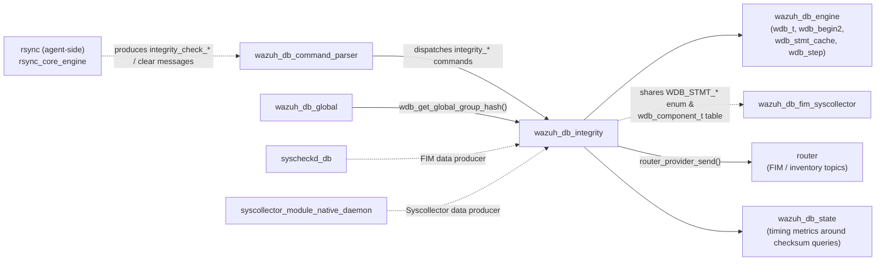
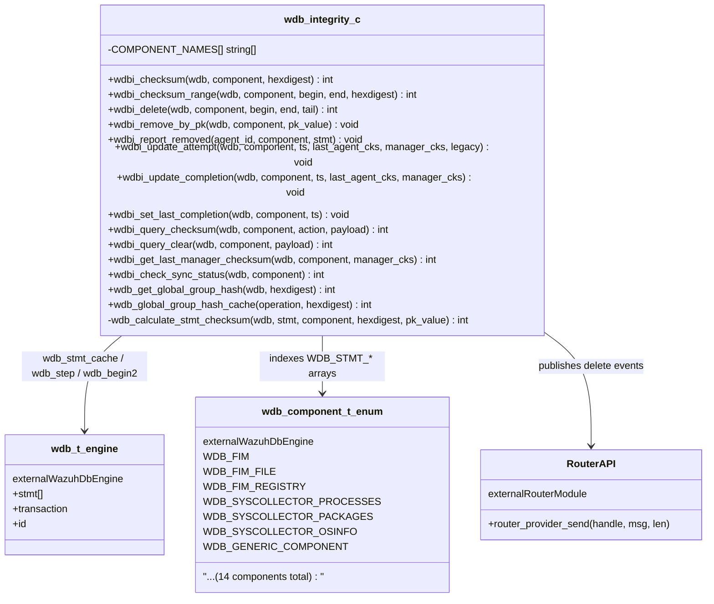
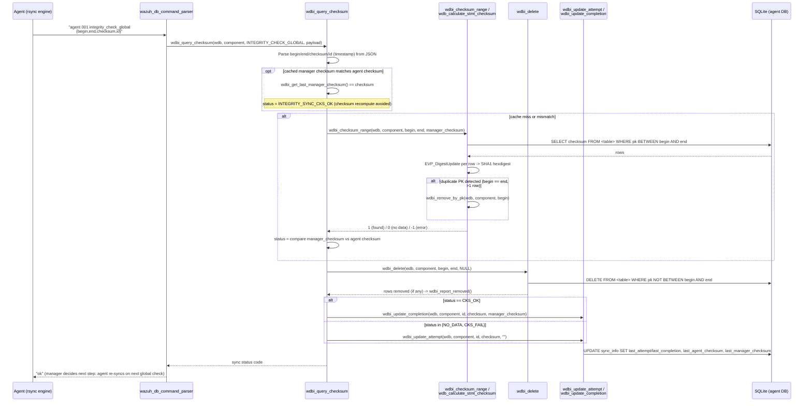
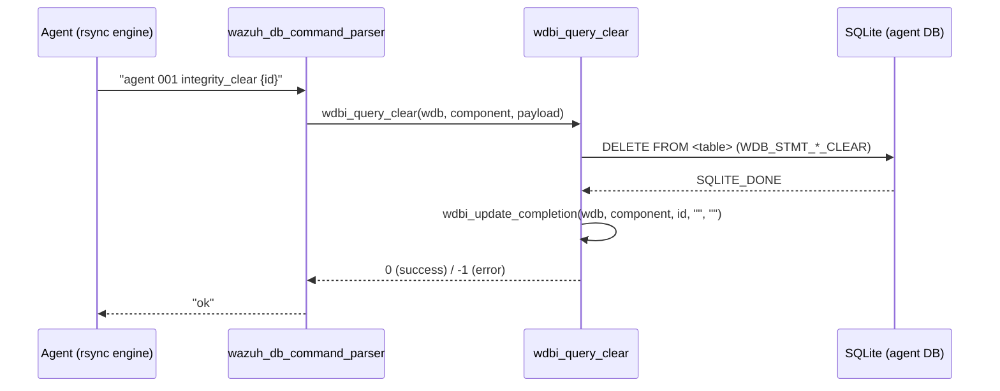
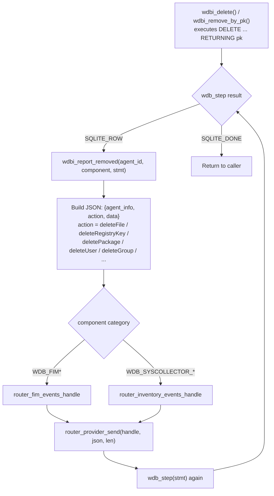
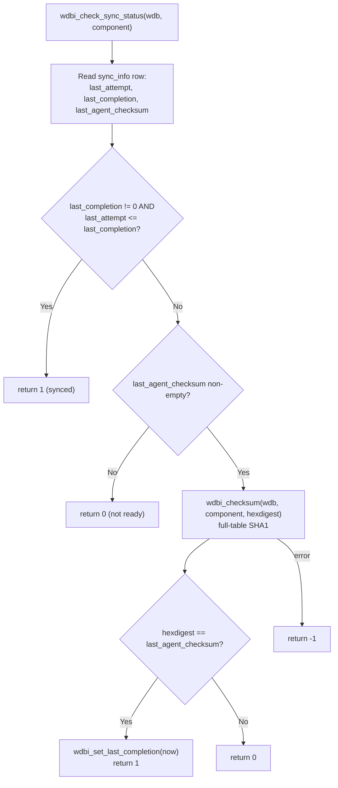
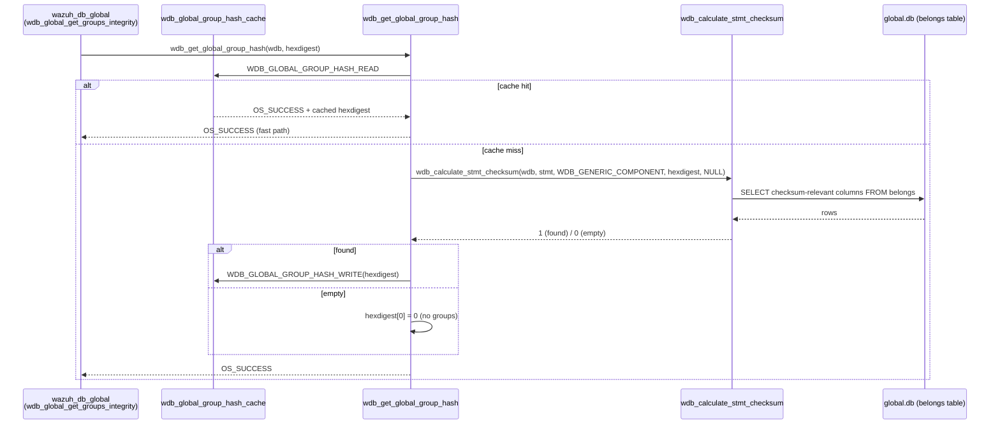

# Wazuh DB Integrity Synchronization Module

## Introduction

The **`wazuh_db_integrity`** module implements the **checksum-based data-synchronization protocol** used by
`wazuh-db` to reconcile the state of per-agent tables (FIM baselines, Syscollector inventories, and the
`global.db` agent-group hash) between an agent and the manager. It is implemented entirely in a single
translation unit, **`src/wazuh_db/wdb_integrity.c`**, and is a direct sibling of the other `wazuh_db`
sub-modules described in [wazuh_db.md](wazuh_db.md).

Conceptually, this module is the **server-side (manager) counterpart** of the agent-embedded
[`rsync`](rsync.md) library ([rsync_core_engine.md](rsync_core_engine.md)): the agent computes SHA-1
checksums over ranges of its local FIM/Syscollector data using `rsync`, sends `integrity_check_*` messages
to `wazuh-db`, and this module recomputes the equivalent checksum **inside the manager's SQLite database**
to decide whether the two sides agree, need a partial re-sync, or need the manager to discard stale rows.

The module does **not** own any table schema or business logic for *what* a FIM entry or a Syscollector
package looks like — that is the responsibility of
[wazuh_db_fim_syscollector](wazuh_db_fim_syscollector.md). Instead, `wazuh_db_integrity` provides a
**generic, table-agnostic synchronization primitive** driven by a `wdb_component_t` enumeration
(`WDB_FIM`, `WDB_FIM_FILE`, `WDB_FIM_REGISTRY`, `WDB_SYSCOLLECTOR_*`, …) and a matching array of prepared
statement indexes, so the same checksum/delete/report logic works uniformly across every synchronized
table.

It also implements a small, independent feature: the **global agent-group hash cache**
(`wdb_get_global_group_hash` / `wdb_global_group_hash_cache`), which memoizes the SHA-1 digest of the
`belongs` table so that [wazuh_db_global](wazuh_db_global.md)'s cluster-integrity checks
(`wdb_global_get_groups_integrity`) avoid recomputing an expensive full-table checksum on every request.

## Purpose & Core Functionality

| Concern | Function(s) |
|---|---|
| Compute a SHA-1 checksum over an entire synchronized table | `wdbi_checksum` |
| Compute a SHA-1 checksum over a `[begin, end]` primary-key range of a table | `wdbi_checksum_range` |
| Execute the checksum SQL and aggregate row checksums into a single digest (shared helper) | `wdb_calculate_stmt_checksum` |
| Detect and remove duplicate rows sharing the same primary key | `wdbi_remove_by_pk` |
| Delete rows outside/inside a synchronized range that the agent no longer reports | `wdbi_delete` |
| Publish a "deleted" event to the [router](router.md) so FIM/Inventory consumers (indexer harvesters) see the removal | `wdbi_report_removed` |
| Record a synchronization attempt (checksum mismatch/no-data) | `wdbi_update_attempt` |
| Record a successful synchronization completion | `wdbi_update_completion`, `wdbi_set_last_completion` |
| Top-level dispatch for `integrity_check_global` / `integrity_check_left` / `integrity_check_right` | `wdbi_query_checksum` |
| Top-level dispatch for `integrity_clear` | `wdbi_query_clear` |
| Read/write the cached manager-side checksum from `sync_info` | `wdbi_get_last_manager_checksum` |
| Determine whether an agent's component data is fully synchronized | `wdbi_check_sync_status` |
| Compute/read/write the cached global agent-group hash | `wdb_get_global_group_hash`, `wdb_global_group_hash_cache` |

## Architecture Overview

`wazuh_db_integrity` sits between the [wazuh_db_command_parser](wazuh_db_command_parser.md) (which decodes
the `integrity_check_*`/`integrity_clear` wire commands) and the [wazuh_db_engine](wazuh_db_engine.md)
(which supplies `wdb_t`, prepared-statement caching, and transaction control). It is invoked for both FIM
data (produced by `syscheckd`, see [syscheckd_db](syscheckd_db.md)) and Syscollector data (produced by the
[syscollector_module_native_daemon](syscollector_module_native_daemon.md) via the `dbsync`/`rsync` shared
libraries), and it re-uses [wazuh_db_fim_syscollector](wazuh_db_fim_syscollector.md)'s delete/upsert
primitives indirectly through the shared `wdb_component_t` table descriptors declared in `wdb.h`.

## Relationship to Other Modules

- **[wazuh_db_engine](wazuh_db_engine.md)** — Supplies the `wdb_t` connection handle, `wdb_begin2()`
  transaction management, and the statement-cache infrastructure (`wdb_stmt_cache`, `wdb_step`,
  `wdb_exec_stmt`) that every function in this module relies on to talk to SQLite.
- **[wazuh_db_command_parser](wazuh_db_command_parser.md)** — The sole caller of the public entry points
  `wdbi_query_checksum()` and `wdbi_query_clear()`; it decodes the `integrity_check_global`,
  `integrity_check_left`, `integrity_check_right`, and `integrity_clear` wire commands and forwards the
  parsed `dbsync_msg` action plus JSON payload to this module.
- **[wazuh_db_fim_syscollector](wazuh_db_fim_syscollector.md)** — Defines (in `wdb.h`) the
  `WDB_STMT_*_SELECT_CHECKSUM`, `WDB_STMT_*_SELECT_CHECKSUM_RANGE`, `WDB_STMT_*_DELETE_AROUND/RANGE`, and
  `WDB_STMT_*_DELETE_BY_PK` prepared-statement indexes that this module looks up per `wdb_component_t`. The
  two modules are tightly coupled through this shared table-descriptor convention but remain physically
  separate files with distinct responsibilities (business-logic INSERT/UPDATE vs. generic
  checksum/delete/report).
- **[wazuh_db_global](wazuh_db_global.md)** — Calls `wdb_get_global_group_hash()` from
  `wdb_global_get_groups_integrity()` to compare a worker node's local agent-group hash against the
  master's, using this module's checksum engine and its group-hash cache to avoid recomputation.
- **[router](router.md)** — `wdbi_report_removed()` publishes a `delete*` JSON event
  (`deleteFile`, `deleteRegistryKey`, `deletePackage`, `deleteUser`, …) through
  `router_provider_send()` on the `router_fim_events_handle` or `router_inventory_events_handle` topics
  whenever a row disappears from a synchronized range, so that downstream consumers (e.g. the
  [inventory_harvester_module](inventory_harvester_module.md) / Indexer Connector) can keep their indices
  consistent without polling SQLite.
- **[rsync](rsync.md)** / **[rsync_core_engine](rsync_core_engine.md)** — The agent-side library that
  produces the `integrity_check_global`, `integrity_check_left`, `integrity_check_right`, and `clear`
  messages this module consumes. Both sides implement the same Merkle-like range-checksum algorithm
  independently (C++ on the agent, C here on the manager) but must remain semantically compatible.
- **[syscheckd_db](syscheckd_db.md)** and **[syscollector_module_native_daemon](syscollector_module_native_daemon.md)**
  — The two agent-side subsystems whose data this module keeps in sync; they are the ultimate producers of
  the checksum-range messages routed here via `wazuh-db`'s socket protocol.
- **`wazuh_db_state`** — Query latency around checksum computation is measured by the calling code in
  `wdbi_query_checksum` (via `gettime`/`time_diff`) and logged; broader per-command metrics are aggregated
  by the state module described in the parent [wazuh_db.md](wazuh_db.md) documentation.

## Component Relationships

## Data Flow: `integrity_check_global` / `left` / `right`

This is the primary synchronization exchange, mirroring `rsync`'s range-checksum protocol. It runs once per
synchronized `wdb_component_t` (e.g. `fim_file`, `syscollector-packages`) each time the agent's `rsync`
engine finishes computing (or re-verifying) a checksum range.

For `integrity_check_left` / `integrity_check_right` (the two half-range messages `rsync` sends when a
`global` mismatch is detected), the flow is identical except:
- No `wdbi_get_last_manager_checksum` short-circuit is attempted (only `INTEGRITY_CHECK_GLOBAL` uses the
  cache).
- `wdbi_delete()` is invoked with the message's `tail` field, deleting the **range between `end` and
  `tail`** instead of "everything outside `[begin, end]`" — i.e., surgically removing the rows the agent no
  longer reports between two adjacent, already-matching sub-ranges.
- No `sync_info` update occurs (only `INTEGRITY_CHECK_GLOBAL` updates attempt/completion timestamps).

## Data Flow: `integrity_clear`

Used when the agent decides to fully reset a table's synchronization state (e.g. after a first sync,
version change, or explicit reset).

## Row-Removal & Router Event Publication

Whenever `wdbi_delete()` or `wdbi_remove_by_pk()` actually removes one or more rows, the corresponding
`DELETE ... RETURNING <pk columns>` statement yields `SQLITE_ROW` results, and `wdbi_report_removed()` is
invoked to translate each removed row into a structured delete event published on the
[router](router.md)'s FIM or Inventory topic — decoupling "data left the manager's DB" from "downstream
indices/dashboards must be updated".

## Synchronization Status Check (`wdbi_check_sync_status`)

Used by other subsystems (and exposed indirectly through `wazuh-db`'s `sync-status`/health-check style
queries) to answer "is component X for this agent currently synchronized?" without forcing a full
checksum recomputation unless necessary.

## Global Agent-Group Hash Cache

A lightweight, process-local memoization layer used exclusively by
[wazuh_db_global](wazuh_db_global.md)'s cluster group-integrity check. Because the global group hash is a
checksum over the *entire* `belongs` table (potentially large), recomputing it on every
`get-groups-integrity` request from every worker node would be wasteful; this cache avoids that as long as
no group membership has changed since the last computation (the cache is invalidated externally via
`WDB_GLOBAL_GROUP_HASH_CLEAR` whenever `wazuh_db_global` mutates group membership).

## Key Design Details

### 1. Table-Agnostic, Enum-Indexed Dispatch
Every public function (`wdbi_checksum`, `wdbi_checksum_range`, `wdbi_delete`, `wdbi_remove_by_pk`,
`wdbi_query_clear`) uses a local `const int INDEXES[]` array, indexed by `wdb_component_t`, to resolve the
correct pre-declared `WDB_STMT_*` prepared-statement enum value at runtime. This means adding a new
synchronized table only requires: (1) adding a `wdb_component_t` value, (2) adding matching
`WDB_STMT_*_SELECT_CHECKSUM[_RANGE]`/`_DELETE_*`/`_CLEAR` entries in `wdb.h`/`wdb.c`'s SQL statement catalog
(owned by [wazuh_db_engine](wazuh_db_engine.md)), and (3) extending these `INDEXES[]` arrays and the
`COMPONENT_NAMES[]` string table — no new checksum/delete algorithm code is needed.

### 2. Duplicate-PK Self-Healing
`wdb_calculate_stmt_checksum()` detects the special case where a range query for a *single* primary key
(`begin == end`) returns more than one row — an integrity violation that should never legitimately happen
but can occur due to historical bugs or race conditions. Rather than failing the sync, it proactively calls
`wdbi_remove_by_pk()` to delete the offending duplicates and logs a warning, allowing the next
synchronization cycle to insert a clean single row.

### 3. Checksum Caching to Avoid Redundant Work
`wdbi_query_checksum()` short-circuits full checksum recomputation for `INTEGRITY_CHECK_GLOBAL` messages
when the previously stored manager checksum (`wdbi_get_last_manager_checksum`) already matches the agent's
reported checksum — a common case when nothing has changed between two consecutive global-check cycles.

### 4. Range vs. Point Deletion Semantics
`wdbi_delete()` has two SQL statement families per component: `*_DELETE_AROUND` (used for
`integrity_check_global`, deletes everything **outside** `[begin, end]`) and `*_DELETE_RANGE` (used for
`integrity_check_left`/`right`, deletes everything strictly **between** `end` and `tail`). The choice is
made purely based on whether a `tail` parameter was supplied.

### 5. Legacy vs. Current `sync_info` Schema
`wdbi_update_attempt()` accepts a `legacy` boolean to select between `WDB_STMT_SYNC_UPDATE_ATTEMPT` and
`WDB_STMT_SYNC_UPDATE_ATTEMPT_LEGACY`, supporting older per-agent database schemas that predate certain
`sync_info` columns — this ties into the schema-versioning work owned by the metadata/upgrade sub-module of
`wazuh_db`.

### 6. Testability via `WAZUH_UNIT_TESTING`
The file conditionally removes the `static` qualifier and replaces `assert()` with `mock_assert()` under
`WAZUH_UNIT_TESTING`, allowing unit tests to intercept internal (otherwise file-scoped) functions and
assertions — a pattern consistent across the native C Wazuh codebase.

## Testing

Unit tests for this module reside under **Unit_Tests_-_Wazuh_DB** → `test_wdb_integrity`
(`src/unit_tests/wazuh_db/test_wdb_integrity.c`), covering:
- `wdbi_checksum` / `wdbi_checksum_range` success, no-data, and cache-failure paths.
- `wdb_calculate_stmt_checksum` including the duplicate-entry self-healing path.
- `wdbi_delete` for both "around" and "range" (with `tail`) deletion modes.
- `wdbi_query_checksum` for `global`/`left`/`right` actions, including hash-match short-circuiting and
  begin/end/checksum/id payload validation failures.
- `wdbi_query_clear` success and failure (missing `id`, cache/statement errors).
- `wdbi_check_sync_status` across "never synced", "checksum valid/invalid", and "in-progress" states.
- `wdbi_update_attempt` / `wdbi_update_completion` SQL execution and error handling.
- `wdbi_remove_by_pk` bind/step failure paths.
- `wdbi_report_removed` for every supported `wdb_component_t` (groups, hotfixes, network interfaces,
  network protocol, OS info, packages, users), including multi-row reporting.
- `wdb_get_global_group_hash` / cache read-write-clear round trips.

## Summary

`wazuh_db_integrity` is the manager-side implementation of Wazuh's Merkle-like, range-checksum data
synchronization protocol. It provides a single, reusable engine — driven by a declarative
`wdb_component_t` → prepared-statement mapping — that keeps every FIM and Syscollector table (and the
`global.db` agent-group hash) consistent between agents and the manager, while publishing structured
deletion events through the [router](router.md) so downstream consumers stay up to date without polling.
For the wire-protocol dispatch that invokes this module, see
[wazuh_db_command_parser](wazuh_db_command_parser.md); for the underlying SQLite connection and statement
infrastructure, see [wazuh_db_engine](wazuh_db_engine.md); for the business logic that actually writes the
rows this module checksums, see [wazuh_db_fim_syscollector](wazuh_db_fim_syscollector.md) and
[wazuh_db_global](wazuh_db_global.md).
