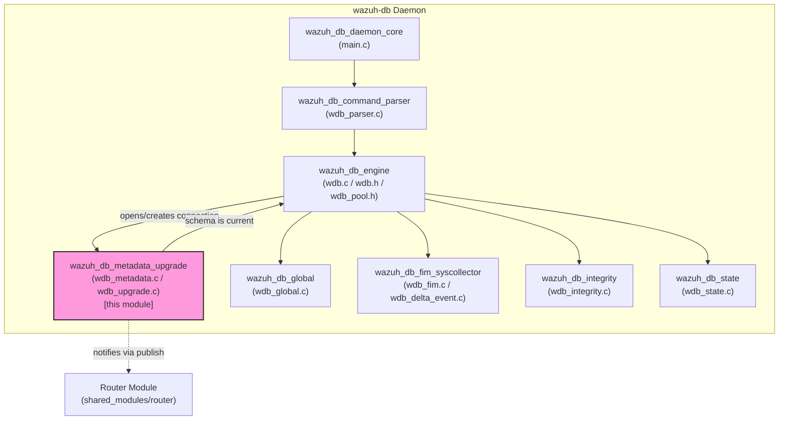
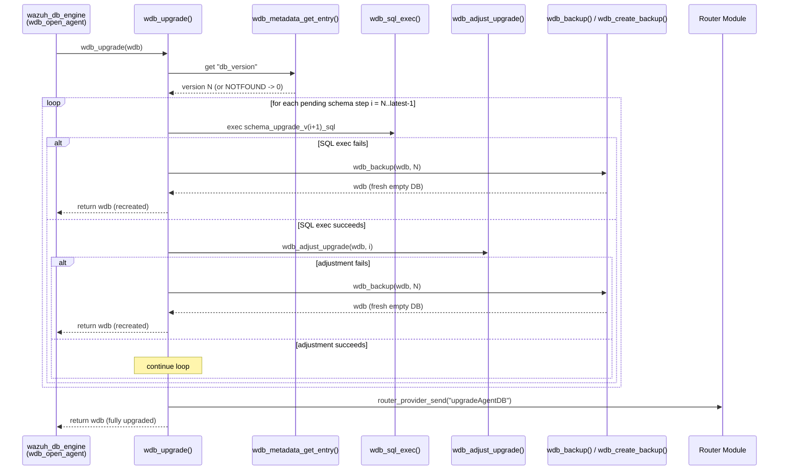
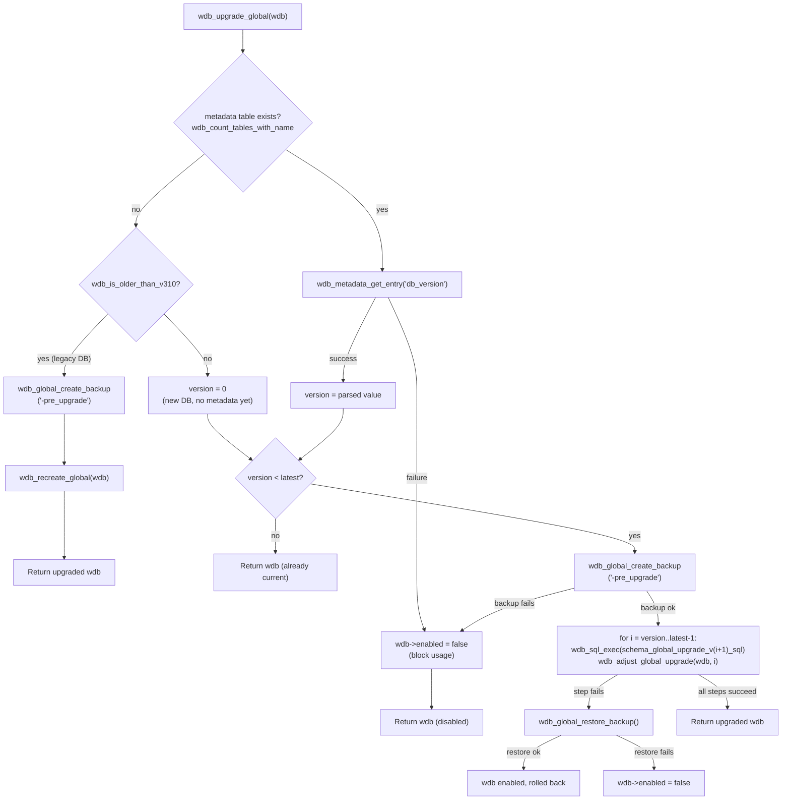
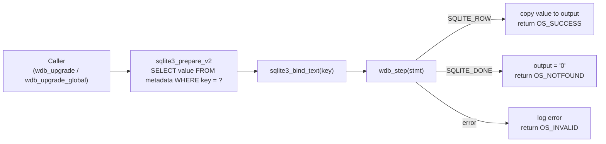
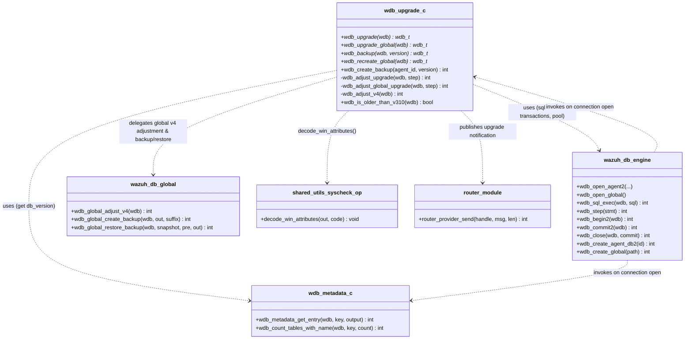

# Wazuh DB — Metadata & Schema Upgrade Module

## Introduction

The **`wazuh_db_metadata_upgrade`** module is a small but critical subsystem inside the **`wazuh_db`** daemon (see [wazuh_db_engine.md](wazuh_db_engine.md) for the parent runtime). It is responsible for:

1. **Reading and writing database metadata** — the `metadata` table that every SQLite database managed by `wazuh-db` (per-agent databases and the `global.db`) uses to record its current schema version and other key/value settings.
2. **Driving schema migrations** — walking a database forward through the ordered list of SQL migration scripts (`schema_upgrade_vN_sql` / `schema_global_upgrade_vN_sql`) until it reaches the latest known schema version, including any non-SQL data transformations that a particular version step requires.
3. **Protecting data during migration** — creating on-disk backups before destructive operations and recreating/restoring databases when a migration fails or when a database is found to be in an unsupported, pre-3.10 state.

This module is implemented in two C source files:

| File | Core responsibility |
|------|----------------------|
| `src/wazuh_db/wdb_metadata.c` | Low-level key/value access to the `metadata` table and generic table-existence checks. |
| `src/wazuh_db/wdb_upgrade.c` | Orchestrates the upgrade path for agent databases and `global.db`, including backup/restore and version-specific data adjustments. |

Because `wazuh-db` opens one SQLite connection per agent (plus one for `global.db` and one for `tasks.db`), this module is invoked **every time** a database handle is opened for the first time in a given `wazuh-db` process lifetime — making it one of the most frequently executed code paths in the daemon's startup/connection logic.

---

## 1. Role in the System

`wazuh_db_metadata_upgrade` sits between the **connection pooling layer** (`wazuh_db_engine`, see [wazuh_db_engine.md](wazuh_db_engine.md)) and the **schema-specific logic** modules (`wazuh_db_global`, `wazuh_db_fim_syscollector`, `wazuh_db_integrity`, see [wazuh_db_global.md](wazuh_db_global.md)). Whenever a new SQLite connection (`wdb_t`) is created or reused, the engine calls into this module to ensure the underlying schema is current *before* any query for agent, FIM, syscollector, or task data is executed.

The module has no HTTP/API surface of its own; it is purely an internal library used by [wazuh_db_engine.md](wazuh_db_engine.md) (`wdb_open_*` family of functions defined in `wdb.c`) and by [wazuh_db_global.md](wazuh_db_global.md) for the `global.db`-specific upgrade path.

---

## 2. Core Components

### 2.1 `wdb_metadata.c` — Metadata Table Access

| Function | Purpose |
|----------|---------|
| `wdb_metadata_get_entry(wdb_t *wdb, const char *key, char *output)` | Reads a single value from the `metadata` key/value table (e.g. `db_version`). Returns `OS_SUCCESS` if found, `OS_NOTFOUND` if the table exists but the key doesn't (defaults `output` to `"0"`), or `OS_INVALID` on SQL error. |
| `wdb_count_tables_with_name(wdb_t *wdb, const char *key, int *count)` | Queries `sqlite_master` to check whether a table with a given name exists. Used to detect whether the `metadata` table itself exists, which distinguishes brand-new/legacy databases from properly versioned ones. |

Both functions rely on a small, file-local prepared-statement table (`SQL_METADATA_STMT`) and the shared `wdb_step()` helper from [wazuh_db_engine.md](wazuh_db_engine.md) for stepping through SQLite results with built-in busy/retry handling.

### 2.2 `wdb_upgrade.c` — Schema Migration Orchestration

| Function | Purpose |
|----------|---------|
| `wdb_upgrade(wdb_t *wdb)` | Entry point for **agent database** upgrades. Reads `db_version` via `wdb_metadata_get_entry`, then iterates the `UPDATES[]` array of embedded SQL migration scripts (`schema_upgrade_v1_sql` … `schema_upgrade_v16_sql`), executing each one with `wdb_sql_exec` and applying any required post-SQL adjustment via `wdb_adjust_upgrade`. On success it may publish an `upgradeAgentDB` event through the Router module. On failure it calls `wdb_backup` to preserve data and recreate a clean database. |
| `wdb_upgrade_global(wdb_t *wdb)` | Entry point for the **`global.db`** upgrade. Similar loop logic to `wdb_upgrade`, but uses `schema_global_upgrade_vN_sql` scripts, calls `wdb_adjust_global_upgrade`, and — critically — creates a full pre-upgrade backup (`wdb_global_create_backup`) before applying any migration, restoring it (`wdb_global_restore_backup`) automatically if a step fails. |
| `wdb_adjust_upgrade(wdb_t *wdb, int upgrade_step)` *(core component)* | Dispatch table for agent-DB, version-specific, non-SQL data transformations. Currently only step `3` (i.e., moving to schema v4) triggers `wdb_adjust_v4`. |
| `wdb_adjust_global_upgrade(wdb_t *wdb, int upgrade_step)` *(core component)* | Equivalent dispatch table for `global.db`; step `3` triggers `wdb_global_adjust_v4` (implemented in [wazuh_db_global.md](wazuh_db_global.md)). |
| `wdb_adjust_v4(wdb_t *wdb)` | Concrete data migration for schema v4: decodes the numeric Windows file-attribute codes stored in the FIM table into their human-readable bitmask string form (`decode_win_attributes`), row by row, inside a transaction (`wdb_begin2` / `wdb_commit2`). |
| `wdb_is_older_than_v310(wdb_t *wdb)` | Heuristic check used only for `global.db`: looks for a sentinel "manager" agent row (`id = 0`) with `last_keepalive = 253402300799` (a magic "infinite" timestamp used before v3.10). If absent, the database predates the `metadata` table concept entirely. |
| `wdb_backup(wdb_t *wdb, int version)` | Used for **agent** databases: closes the current connection, calls `wdb_create_backup` to copy the `.db` file aside, deletes the original, recreates an empty schema via `wdb_create_agent_db2`, and reopens it. |
| `wdb_recreate_global(wdb_t *wdb)` | Used for **`global.db`** when it is detected to be older than v3.10 (no salvageable schema): closes, deletes, and recreates a brand-new `global.db` via `wdb_create_global`. |
| `wdb_create_backup(const char *agent_id, int version)` *(core component)* | Low-level file-copy utility: streams the current `<agent_id>.db` file into a timestamped `.db-oldv<version>-<timestamp>` sibling file, setting `0640` permissions. Used by `wdb_backup` for agent databases. |

---

## 3. Data Flow & Process Diagrams

### 3.1 Agent Database Open & Upgrade Sequence

### 3.2 `global.db` Upgrade Sequence (with Backup/Restore Safety Net)

### 3.3 Metadata Read Path (`wdb_metadata_get_entry`)

---

## 4. Component Interaction Overview

Key external dependencies (documented in their respective module pages):

- **`wazuh_db_engine`** ([wazuh_db_engine.md](wazuh_db_engine.md)) — supplies the `wdb_t` connection object, `wdb_step`, `wdb_sql_exec`, `wdb_begin2`/`wdb_commit2` transaction helpers, and the functions that create fresh databases (`wdb_create_agent_db2`, `wdb_create_global`).
- **`wazuh_db_global`** ([wazuh_db_global.md](wazuh_db_global.md)) — implements the `global.db`-specific backup/restore/adjustment functions (`wdb_global_create_backup`, `wdb_global_restore_backup`, `wdb_global_adjust_v4`) that this module calls during the `global.db` upgrade path.
- **Shared C library** (`shared_lib_string_validation` / `syscheck_op.c`, part of *Agent_&_Manager_Native_Daemons_(C)*) — provides `decode_win_attributes`, used by `wdb_adjust_v4` to migrate FIM Windows attribute encodings.
- **Router module** (`router_core`, part of *Shared_Modules_Infrastructure_(C++)*) — receives the optional `upgradeAgentDB` notification published after a successful agent DB upgrade, via `router_provider_send`.

---

## 5. Design Notes & Failure Handling

- **Idempotent version checks**: Every upgrade path starts by reading `db_version` from the `metadata` table. If the table is missing (`OS_NOTFOUND`/table-count = 0), the module falls back to heuristics (`wdb_is_older_than_v310`) to decide between "brand-new database, start migrating from step 0" and "unsupported legacy database, must be recreated."
- **Fail-safe backups**:
  - For **agent** databases, failure at any migration step causes the *entire* database file to be renamed aside (`wdb_create_backup`) and a fresh, empty schema to be created in its place (`wdb_backup`). This favors availability over historical data retention for a single agent.
  - For **`global.db`**, because it holds fleet-wide inventory, the module takes a **full snapshot before any changes** (`wdb_global_create_backup`) and performs an automatic **restore** (`wdb_global_restore_backup`) if any migration step fails, rather than discarding data.
- **Per-version adjustments**: Not all schema changes can be expressed purely in SQL (e.g., re-encoding binary/text data). The `wdb_adjust_upgrade` / `wdb_adjust_global_upgrade` dispatch functions provide an extension point keyed by the *zero-based upgrade step index*, allowing custom C logic (such as `wdb_adjust_v4`) to run immediately after the corresponding SQL script.
- **Transactional adjustments**: `wdb_adjust_v4` wraps its row-by-row updates in a single transaction (`wdb_begin2`/`wdb_commit2`) to avoid partial migrations if the process is interrupted mid-way.
- **Event notification**: After a successful agent DB upgrade, if the process has an active Router handle (`router_agent_events_handle`), a JSON event (`action: "upgradeAgentDB"`) containing the old and new schema versions is published — allowing other subsystems (e.g., cluster synchronization) to react to schema changes.

---

## 6. Related Documentation

- [wazuh_db_engine.md](wazuh_db_engine.md) — Connection pooling, low-level SQLite wrappers (`wdb_step`, `wdb_sql_exec`, transactions), and database file creation used by this module.
- [wazuh_db_global.md](wazuh_db_global.md) — Implements `global.db`-specific backup, restore, and v4 adjustment logic invoked from `wdb_upgrade_global`.
- [wazuh_db_command_parser.md](wazuh_db_command_parser.md) — The command dispatch layer that triggers connection opens (and therefore upgrades) in response to `wazuh-db` socket requests.
- [wazuh_db_fim_syscollector.md](wazuh_db_fim_syscollector.md) — Consumer of the FIM schema whose v4 attribute encoding is migrated by `wdb_adjust_v4`.
- [wazuh_db_state.md](wazuh_db_state.md) — Collects timing/usage statistics for database operations, including those triggered during upgrade.
- [router.md](router.md) — Publish/subscribe infrastructure used to broadcast the `upgradeAgentDB` notification.
