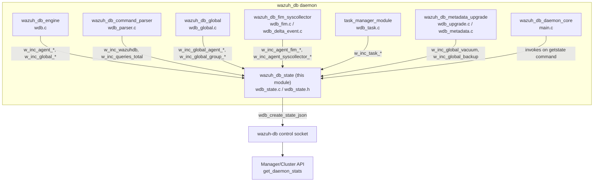
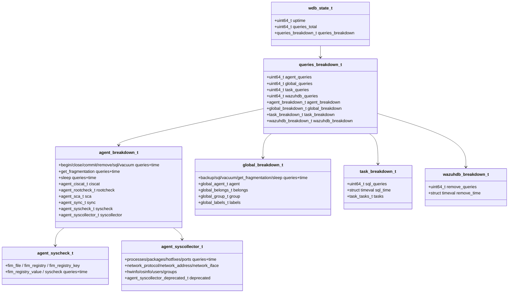
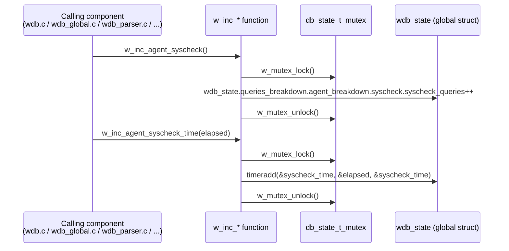
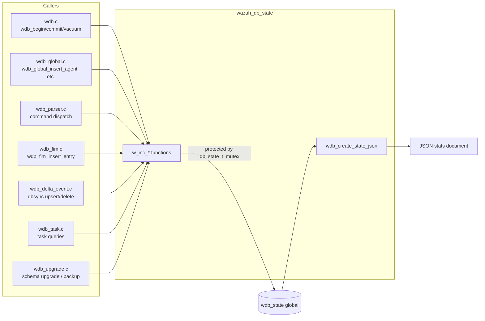
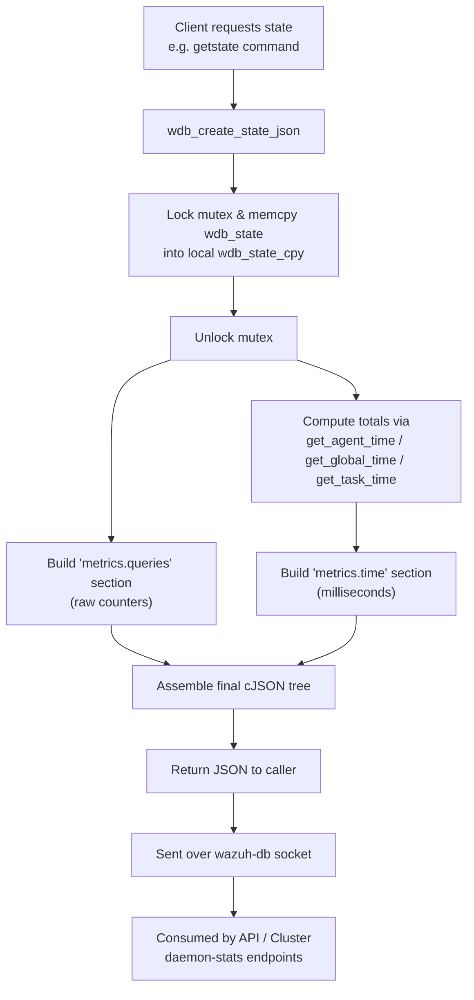

# Wazuh DB State Module

## Introduction

The **`wazuh_db_state`** module is the telemetry and statistics subsystem of the `wazuh-db` daemon. It provides a thread‑safe counters/timers infrastructure that instruments every category of query handled by `wazuh-db` (agent DB operations, global DB operations, task DB operations, and generic wazuh‑db socket commands), and exposes the aggregated results as a single JSON document that can be requested through the `wazuh-db` control socket (the `getstate` command family used across Wazuh daemons).

This module does not process any business logic itself — it is a **cross‑cutting concern** consumed by virtually every other component of the [`wazuh_db`](wazuh_db.md) daemon (SQL execution engine, global DB helpers, command parser, FIM/Syscollector persistence, and task management) to record how many queries of each kind were executed and how long they took. The resulting statistics are ultimately surfaced to operators through the Wazuh API/Cluster daemon stats endpoints (see [`manager_module`](manager_module.md) and [`stats_module`](stats_module.md)), in the same way `remoted`, `logcollector`, and `monitord` expose their own internal state files.

## Purpose and Responsibilities

| Responsibility | Description |
|---|---|
| **Counter tracking** | Increment atomic-like (mutex-protected) counters for every query type processed by `wazuh-db` (e.g., `insert-agent`, `sync-agent-info-get`, `fim_file`, `upgrade`, etc.). |
| **Timing accumulation** | Accumulate the elapsed `struct timeval` execution time for each query type, enabling average/latency analysis. |
| **Hierarchical breakdown** | Organize metrics into a hierarchy: `queries_breakdown` → `{agent, global, task, wazuhdb}_breakdown` → per-table/per-operation counters. |
| **Thread safety** | Guard all read/modify/write operations on the global `wdb_state` structure with a single mutex (`db_state_t_mutex`), since `wazuh-db` is a multi-threaded daemon (one worker thread per connected client). |
| **JSON serialization** | Build a complete, nested `cJSON` report (`wdb_create_state_json`) combining both raw counts and computed total execution times per category, ready to be sent over the control socket or dumped to a state file. |

## Position in the Overall System

`wazuh_db_state` is one of the internal building blocks of the `wazuh-db` daemon (see the parent module tree). It sits alongside:

- [`wazuh_db_engine`](wazuh_db.md) – the low-level SQLite/SQL execution engine (`wdb.c`) that performs the actual queries and measures elapsed time before calling into `wazuh_db_state`.
- [`wazuh_db_command_parser`](wazuh_db.md) – parses incoming socket commands (`wdb_parser.c`) and calls `wazuh_db_state` increment functions per dispatched command.
- [`wazuh_db_global`](wazuh_db.md) – global database operations (`wdb_global.c`) that record agent/group/label statistics.
- [`wazuh_db_fim_syscollector`](wazuh_db.md) – FIM and Syscollector persistence (`wdb_fim.c`, `wdb_delta_event.c`) that record per-table sync statistics.
- [`wazuh_db_metadata_upgrade`](wazuh_db.md) – schema upgrade and metadata operations.
- [`wazuh_db_daemon_core`](wazuh_db.md) – the daemon's main loop (`main.c`) which owns the socket that ultimately serves the `getstate`/statistics command using `wdb_create_state_json()`.



## Architecture

### Data Model

The module's data model is a static, deeply nested tree of plain structs (all declared in `wdb_state.h`) rooted at the single global instance `wdb_state_t wdb_state`. Every leaf node is a pair of `(uint64_t query_count, struct timeval elapsed_time)`.



### Thread-Safety Model

All mutation and read access to the singleton `wdb_state` global variable is protected by a single global mutex `db_state_t_mutex`. Every `w_inc_*` function follows the same pattern:



This coarse-grained locking strategy trades some contention for extreme simplicity and correctness guarantees, which is acceptable given that increment operations are O(1) and held for a very short critical section.

## Metric Categories

The counters are grouped into four top-level breakdowns, mirroring the four kinds of commands that `wazuh-db`'s [command parser](wazuh_db.md) (`wdb_parser.c`) dispatches:

1. **Agent breakdown** (`agent_breakdown_t`) — per-agent SQLite database operations:
   - DB lifecycle: `begin`, `close`, `commit`, `remove`, `sql`, `vacuum`, `get_fragmentation`, `sleep`.
   - Table-specific: `ciscat`, `rootcheck`, `sca`, `sync` (dbsync), `syscheck` (FIM file/registry), `syscollector` (processes, packages, hotfixes, ports, network, hardware, OS info, users, groups — plus a `deprecated` sub-tree for legacy syscollector tables).

2. **Global breakdown** (`global_breakdown_t`) — operations on the single `global.db`:
   - DB lifecycle: `backup`, `sql`, `vacuum`, `get_fragmentation`, `sleep`.
   - `agent` table operations: insert/update/delete/select/sync/reset-connection/get-groups-integrity/recalculate-group-hashes, etc.
   - `belongs` table operations (agent-group membership).
   - `group` table operations.
   - `labels` table operations.

3. **Task breakdown** (`task_breakdown_t`) — operations against the task management database, used by the [`task_manager_module`](wazuh_db.md) / [`agent_upgrade_module`](wazuh_db.md): `set_timeout`, `delete_old`, `upgrade`, `upgrade_custom`, `upgrade_get_status`, `upgrade_update_status`, `upgrade_result`, `upgrade_cancel_tasks`.

4. **WazuhDB breakdown** (`wazuhdb_breakdown_t`) — generic wazuh-db-level commands not tied to a specific database, currently just `remove`.

## Component Interaction

Other `wazuh_db` components call into this module's increment API immediately before/after executing a query, following a consistent "count + time" pattern. The diagram below shows representative call sites (see [`wazuh_db` module documentation](wazuh_db.md) for details on each caller):



## Reporting: `wdb_create_state_json`

When a client (typically the manager's internal stats collector, or the Cluster/API daemon-stats endpoint) requests the current wazuh-db statistics, `wdb_create_state_json()` is invoked. It:

1. Takes a **mutex-protected snapshot** (`memcpy`) of the entire `wdb_state` struct to avoid holding the lock while building the (potentially large) JSON tree.
2. Builds a `metrics.queries.received` / `metrics.queries.received_breakdown` section with the raw per-category counters.
3. Builds a `metrics.time.execution` / `metrics.time.execution_breakdown` section with computed total milliseconds per category, using internal helper functions `get_agent_time`, `get_global_time`, `get_task_time`, and `get_time_total` (all `STATIC`, testable via `WAZUH_UNIT_TESTING`).
4. Converts every `struct timeval` to milliseconds using the `timeval_to_milis` macro.
5. Returns a single `cJSON*` object ready for serialization.



### Output JSON Shape (simplified)

```json
{
  "uptime": 12345,
  "timestamp": 1717000000,
  "name": "wazuh-db",
  "metrics": {
    "queries": {
      "received": 1000,
      "received_breakdown": {
        "agent": 500,
        "agent_breakdown": { "db": {...}, "tables": {...} },
        "global": 400,
        "global_breakdown": { "db": {...}, "tables": {...} },
        "task": 90,
        "task_breakdown": { "db": {...}, "tables": {...} },
        "wazuhdb": 10,
        "wazuhdb_breakdown": { "db": {...} }
      }
    },
    "time": {
      "execution": 3210,
      "execution_breakdown": {
        "agent": 1500,
        "agent_breakdown": {...},
        "global": 1400,
        "global_breakdown": {...},
        "task": 300,
        "task_breakdown": {...},
        "wazuhdb": 10,
        "wazuhdb_breakdown": {...}
      }
    }
  }
}
```

## Key APIs

| Function | Purpose |
|---|---|
| `w_inc_queries_total()` | Increments the global received-queries counter. |
| `w_inc_agent()` / `w_inc_global()` / `w_inc_task()` / `w_inc_wazuhdb()` | Increment the top-level per-category counters. |
| `w_inc_agent_<op>()`, `w_inc_agent_<op>_time(timeval)` | Increment count/time for a specific agent-DB operation (e.g., `w_inc_agent_syscheck`, `w_inc_agent_syscheck_time`). |
| `w_inc_global_<table>_<op>()`, `w_inc_global_<table>_<op>_time(timeval)` | Increment count/time for a specific global-DB operation (e.g., `w_inc_global_agent_insert_agent`). |
| `w_inc_task_<op>()`, `w_inc_task_<op>_time(timeval)` | Increment count/time for task-DB operations. |
| `w_inc_agent_syscollector_times(timeval, type)` | Generic dispatcher that routes a timing sample to the correct syscollector sub-counter based on an enum `type` (processes, packages, hotfixes, ports, netproto, netaddress, netinfo, hwinfo, osinfo, groups, users). |
| `wdb_create_state_json()` | Builds and returns the full JSON statistics report (public entry point used by the daemon and tested directly by unit tests). |

*(Internal/static helpers `get_agent_time`, `get_global_time`, `get_task_time`, `get_time_total` compute aggregate execution times per category and are exposed without the `static` qualifier only under `WAZUH_UNIT_TESTING` for test coverage.)*

## Testing

Unit test coverage for this module lives under `Unit_Tests_-_Wazuh_DB` → `test_wazuh_db_state`:
- `src/unit_tests/wazuh_db/test_wazuh_db_state.c` — verifies `wazuhdb_create_state_json` (JSON structure/content correctness).

Additionally, virtually every other `wazuh_db` unit test suite (`test_wdb.c`, `test_wdb_global.c`, `test_wdb_parser.c`, `test_wdb_task.c`, `test_wdb_syscollector.c`, `test_wdb_fim.c`) uses the `wdb_state_wrappers` mocks (`src/unit_tests/wrappers/wazuh/wazuh_db/wdb_state_wrappers.c`) to stub out all `w_inc_*` calls, confirming that this module's API is invoked consistently across the codebase whenever a database operation completes.

## Related Modules

- [`wazuh_db`](wazuh_db.md) — Parent module; covers the SQLite execution engine, command parser, global DB operations, FIM/Syscollector persistence, integrity checking, and schema upgrade logic that all feed metrics into this module.
- [`manager_module`](manager_module.md) — Exposes daemon statistics (including wazuh-db's) through the Manager API (`get_daemon_stats`, `get_stats_*` endpoints).
- [`stats_module`](stats_module.md) — Framework-level Python code (`framework/wazuh/stats.py`) that aggregates and paginates daemon statistics retrieved from sockets such as wazuh-db's.
- [`cluster_module`](cluster_module.md) — Cluster API controller (`get_daemon_stats_node`) that retrieves per-node daemon statistics, including wazuh-db state, across a distributed deployment.
- [`framework_core_communication`](framework_core_communication.md) — `WazuhDBConnection`/`AsyncWazuhDBConnection` classes used by the Python framework to query the wazuh-db socket, including state/statistics commands.
