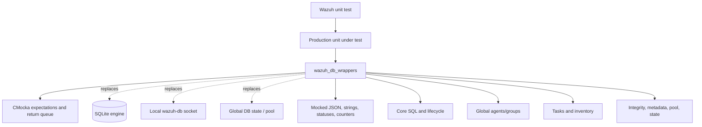
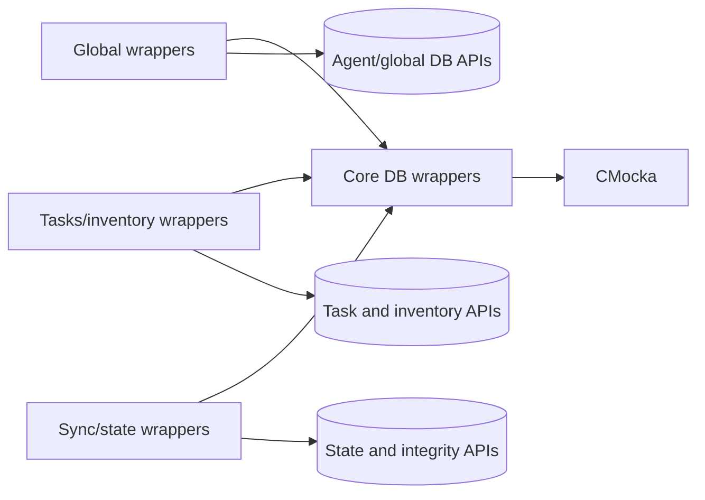
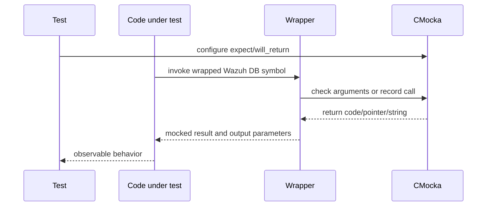

# `wazuh_db_wrappers`

## Purpose

`wazuh_db_wrappers` is the CMocka test-double layer for Wazuh’s database subsystem. It contains link-time wrappers used by unit tests under `src/unit_tests/wrappers/wazuh/wazuh_db`. The wrappers intercept calls into Wazuh DB, SQLite, the local wazuh-db socket protocol, inventory persistence, task persistence, synchronization, and database metrics.

They deliberately contain little business logic: arguments are checked, output parameters are populated with mocked values, calls are recorded, and return values come from the active test.

## Architecture overview

## Sub-modules

| Documentation | Scope |
|---|---|
| [wazuh_db_wrappers_core](wazuh_db_wrappers_core.md) | Low-level handles, transactions, SQLite statements, socket queries, FIM/syscheck, packages, hotfixes, SCA, and maintenance. |
| [wazuh_db_wrappers_global](wazuh_db_wrappers_global.md) | Manager-level agent, group, label, backup, pagination, connection, and synchronization operations. |
| [wazuh_db_wrappers_tasks_inventory](wazuh_db_wrappers_tasks_inventory.md) | Upgrade tasks, package/hotfix queries, OS inventory, and DBSync delta events. |
| [wazuh_db_wrappers_sync_state](wazuh_db_wrappers_sync_state.md) | Integrity checks, metadata/migration seams, named DB pools, and operation/timing counters. |

## Component relationships

## Typical execution path

## CMocka contract

The wrapper layer uses four recurring mechanisms:

- `check_expected(value)` validates scalar or pointer arguments.
- `check_expected_ptr` validates pointer identity when required.
- `function_called()` records a call with no value comparison.
- `mock()` and `mock_ptr_type(type)` obtain test-configured results.

Several wrappers also write output parameters, including JSON pointers, strings, result enums, timestamps, and next-timeout values. Tests must configure compatible `will_return` values and release dynamically copied outputs where required.

## System fit

Production callers such as the Wazuh DB daemon, API/framework database services, agent management, syscollector, task manager, cluster synchronization, and FIM tests depend on the real database interfaces. This module sits below those callers only in test builds. It makes failure injection possible at the same boundaries used in production—transaction begin/commit, statement stepping, socket response parsing, synchronization, and persistence—without changing production modules.

## Maintenance guidance

When a production database signature changes, update the matching wrapper and its header, then review all `check_expected` calls and output ownership. Keep wrapper behavior deterministic and narrow; business rules belong in the production implementation or the test that configures the wrapper.
