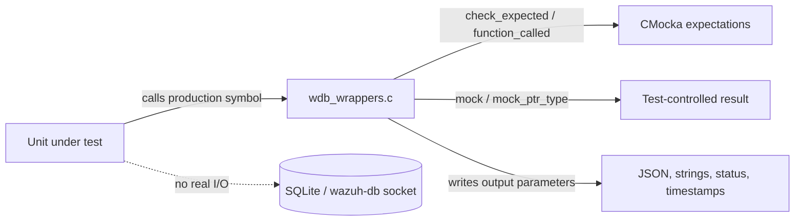

# Wazuh DB Core Wrappers

This sub-module documents `wdb_wrappers.c`, the broad low-level wrapper set used by Wazuh DB unit tests. It replaces database lifecycle, SQLite execution, statement caching, socket query, FIM/syscheck, package/hotfix, SCA, and vacuum operations with controllable CMocka behavior.

## Responsibilities

- Supply mock return values for opaque handles (`wdb_t *`, SQLite statements, JSON objects, and configuration objects).
- Validate selected arguments with `check_expected` so tests can verify SQL, identifiers, query lengths, peers, and statement indexes.
- Populate output parameters with deterministic test data, including JSON payloads, strings, status codes, and vacuum values.
- Model success and failure without opening a real database or Unix socket.

The wrappers are not production database logic. They are link-time seams around production functions from `src/wazuh_db` and shared database client code.

## Main wrapper families

| Family | Examples | Test effect |
|---|---|---|
| Lifecycle and pool | `__wrap_wdb_open_global`, `__wrap_wdb_open_agent2`, `__wrap_wdb_close`, `__wrap_wdb_leave`, `__wrap_wdb_pool_append` | Controls ownership and cleanup paths. |
| Transactions and SQLite | `__wrap_wdb_begin2`, `__wrap_wdb_commit2`, `__wrap_wdb_step`, `__wrap_wdb_sql_exec`, `__wrap_wdb_exec_stmt_silent` | Drives transaction, statement, and SQL error branches. |
| Socket/query protocol | `__wrap_wdbc_query_ex`, `__wrap_wdbc_query_parse`, `__wrap_wdbc_parse_result`, `__wrap_wdbc_connect_with_attempts` | Simulates wazuh-db IPC responses and malformed payloads. |
| Inventory and checks | `__wrap_wdb_package_save`, `__wrap_wdb_hotfix_save`, `__wrap_wdb_syscheck_save2`, `__wrap_wdb_sca_find` | Isolates persistence of package, hotfix, FIM, and SCA data. |
| Integrity and maintenance | `__wrap_wdbi_query_checksum`, `__wrap_wdbi_check_sync_status`, `__wrap_wdb_vacuum`, `__wrap_wdb_get_db_state` | Tests synchronization, checksums, fragmentation, and maintenance. |

## Interaction flow

## Important conventions

Most wrappers return `mock()` or `mock_ptr_type(...)`; the test must provide the corresponding `will_return`. Output buffers are filled with fixed or mocked content. `__wrap_wdbc_connect_with_attempts` explicitly fails a test when the attempt count is non-positive, preserving an API precondition even in a mock.

## Related documentation

- [wazuh_db_wrappers_global](wazuh_db_wrappers_global.md) — global agent and group operations.
- [wazuh_db_wrappers_tasks_inventory](wazuh_db_wrappers_tasks_inventory.md) — task, package, hotfix, OS inventory, and delta-event seams.
- [wazuh_db_wrappers_sync_state](wazuh_db_wrappers_sync_state.md) — pool, integrity, metadata, and metrics wrappers.
