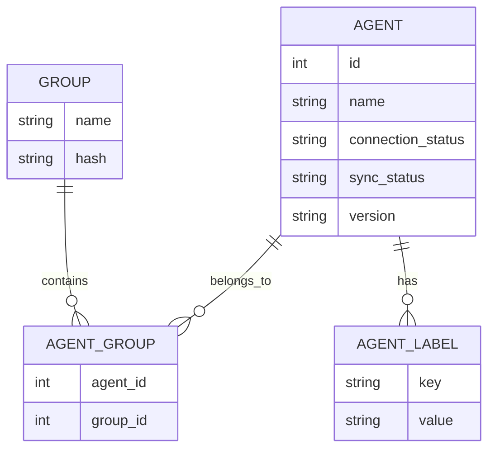
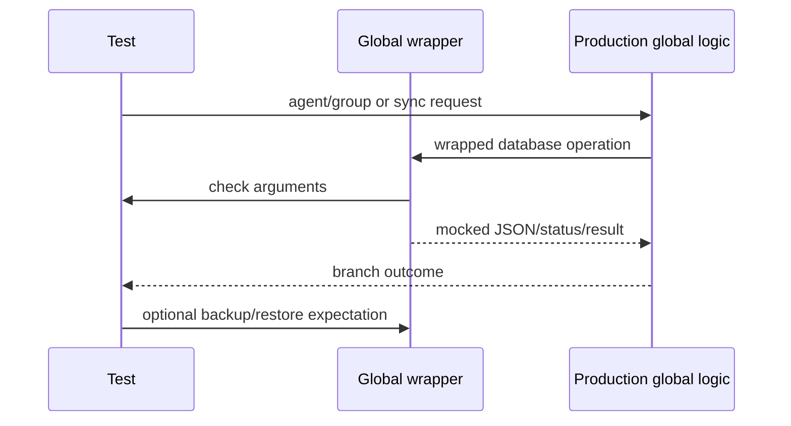

# Wazuh DB Global Wrappers

This sub-module covers `wdb_global_helpers_wrappers.c` and `wdb_global_wrappers.c`. Together they isolate manager-level agent, group, label, backup, synchronization, and connection-state behavior.

## Global helper wrappers

`wdb_global_helpers_wrappers.c` wraps the socket-facing helper API. It verifies lookup keys and state transitions such as agent ID, name, IP, connection status, sync status, keepalive, status code, group mode, and registration metadata. Pointer-returning functions provide mock JSON, integer arrays, red-black trees, or strings.

Representative seams include:

- Agent lookup and lifecycle: `__wrap_wdb_find_agent`, `__wrap_wdb_insert_agent`, `__wrap_wdb_remove_agent`, `__wrap_wdb_remove_agent_db`.
- Agent state: `__wrap_wdb_update_agent_keepalive`, `__wrap_wdb_update_agent_connection_status`, `__wrap_wdb_update_agent_status_code`, `__wrap_wdb_update_agent_data`.
- Groups and labels: `__wrap_wdb_set_agent_groups`, `__wrap_wdb_set_agent_groups_csv`, `__wrap_wdb_get_agent_group`, `__wrap_wdb_get_agent_labels`.

## Global database wrappers

`wdb_global_wrappers.c` wraps the `wdb_t`-oriented implementation. It covers CRUD for agents and groups, agent/group relationships, paginated reads, group integrity hashes, synchronization batches, backups, and database restoration. Functions that expose `wdbc_result` write a mocked result into the caller’s status output, allowing tests to distinguish success, end-of-data, and failures.

The wrapper also serializes JSON inputs with `cJSON_PrintUnformatted` before checking expectations. This makes tests assert semantic payloads without depending on pointer identity.

## Agent/group relationship model

## Backup and synchronization flow

## Test design notes

Conditional `check_expected` calls mirror nullable production arguments. For example, optional version, group, node, snapshot, and error strings are only checked when present. This lets one wrapper support both minimal and fully populated request paths while still catching incorrect values when they matter.
