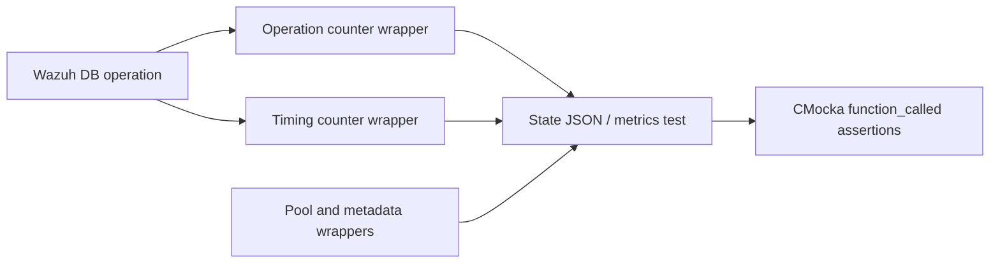

# Wazuh DB Synchronization, Metadata, Pool, and State Wrappers

This sub-module documents `wdb_integrity_wrappers.c`, `wdb_metadata_wrappers.c`, `wdb_pool_wrappers.c`, and `wdb_state_wrappers.c`.

## Integrity and metadata

`__wrap_wdbi_remove_by_pk` validates the database component and optional primary-key value for cleanup operations. Metadata wrappers control table counts, metadata lookup output, and legacy-version detection. These are used by migration, upgrade, and schema compatibility tests.

## Pool lifecycle

`wdb_pool_wrappers.c` abstracts named database handles:

- `__wrap_wdb_pool_get` and `__wrap_wdb_pool_get_or_create` return mocked nodes after checking the database name.
- `__wrap_wdb_pool_leave` and `__wrap_wdb_pool_clean` record lifecycle calls.
- `__wrap_wdb_pool_keys` returns a mocked key array.

This prevents tests from sharing real global pool state and makes cleanup assertions deterministic.

## State and observability

`wdb_state_wrappers.c` replaces state JSON construction and the full counter surface. Counters are organized as total, global database, agent, group, belongs, and labels metrics. Each operation has an invocation counter and, where applicable, a timing counterpart accepting `struct timeval`.

The wrappers use `function_called()` rather than implementing metrics. Tests can therefore assert that a code path increments exactly the expected operation and timing metric. `__wrap_wdb_create_state_json` returns a mock JSON object for response-building tests.

## Observability model

## Why these wrappers matter

The production state implementation spans many database operations. Centralizing the seams here keeps unit tests focused on the caller’s behavior while still allowing precise assertions for counters, timing, metadata compatibility, pool cleanup, and integrity transitions.
