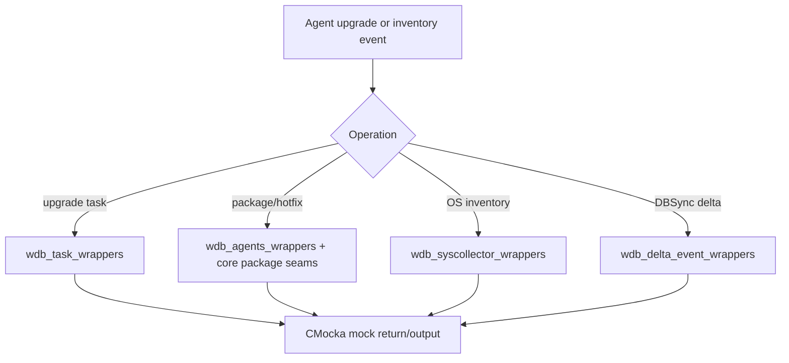

# Wazuh DB Tasks and Inventory Wrappers

This sub-module documents wrappers for task management, system inventory, agent package queries, and delta synchronization.

## Task wrappers

`wdb_task_wrappers.c` controls upgrade-task persistence and scheduling:

- `__wrap_wdb_task_insert_task` validates agent, node, module, and command.
- `__wrap_wdb_task_get_upgrade_task_status` returns a mocked status string.
- `__wrap_wdb_task_get_upgrade_task_by_agent_id` fills node, module, command, status, error, creation time, and update time.
- `__wrap_wdb_task_update_upgrade_task_status` and `__wrap_wdb_task_cancel_upgrade_tasks` drive mutation results.
- `__wrap_wdb_task_set_timeout_status` writes the next timeout; `__wrap_wdb_task_delete_old_entries` controls cleanup.

These seams are consumed by task-manager and agent-upgrade code and are useful for testing pending, completed, timeout, cancellation, and database-error paths.

## Package, hotfix, and OS inventory

`wdb_agents_wrappers.c` mocks package discovery and hotfix/package retrieval sent through the agent-facing database interface. `wdb_syscollector_wrappers.c` wraps `__wrap_wdb_osinfo_save`, checking every non-null OS attribute and the `replace` flag. The large signature intentionally mirrors the inventory schema so tests can detect field loss or incorrect normalization.

The core wrappers additionally cover package and hotfix save, update, and delete operations. They validate scan IDs, timestamps, package metadata, sizes, checksums, and replacement behavior.

## Delta-event wrappers

`wdb_delta_event_wrappers.c` provides two narrow seams:

- `__wrap_wdb_upsert_dbsync`
- `__wrap_wdb_delete_dbsync`

Both mark invocation with `function_called()` and return `mock()`. The shared `kv` type is declared through `wdb_delta_event_wrappers.h`, which includes the production Wazuh DB definitions.

## Data flow

## Boundary behavior

The wrappers do not allocate or free production records on behalf of the caller except for mocked output strings copied with `os_strdup`. Tests remain responsible for cleaning returned JSON and strings according to the production ownership contract.
