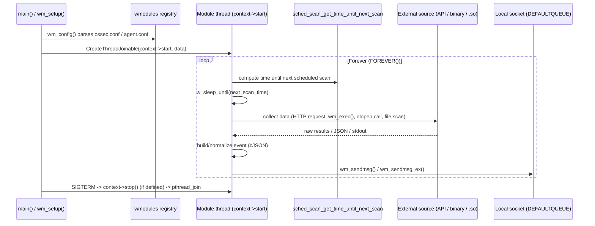

# Wazuh Modules Core (`wazuh-modulesd`)

## 1. Purpose and Overview

`wazuh_modules_core` is the C source tree that implements the **`wazuh-modulesd`** daemon — the process
responsible for running Wazuh's collection of pluggable background modules ("wodles"). Each wodle is a
self-contained unit that periodically (or continuously) collects data from an external source (a cloud
provider API, a compliance-scanning tool, a native shared library, etc.) and forwards normalized events to
the Wazuh analysis pipeline through the local message queue (`ossec/queue/sockets/queue`).

The module is the direct implementation for the parent taxonomy node **`Wazuh_Modules_Daemon_(C)`**; its
siblings `agent_upgrade_module` and `task_manager_module` are documented separately and are **not** part of
this module's scope, although they are registered into the same daemon at start-up
(`wm_initialize_default_modules` in `wmodules.c`).

Architecturally, `wazuh_modules_core` provides:

1. **The daemon skeleton** — argument parsing, daemonizing, signal handling, the module registry
   (linked list of `wmodule`), thread orchestration, and a generic, reusable process-execution
   subsystem (`wm_exec`).
2. **A large family of "wodle" implementations**, each exposing a common `wm_context` interface
   (`start`, `destroy`, `dump`, `sync`, `stop`, `query`) so the core daemon can treat every module
   uniformly regardless of what it actually does internally.

## 2. Architecture Overview

```mermaid
graph TB
    subgraph "wazuh-modulesd process"
        MAIN["main.c<br/>Entry point, signal handling"]
        WMCORE["wmodules.c / wmodules_def.h<br/>Module registry & framework"]
        EXEC["wm_exec.c<br/>Process execution & child pool"]
        MAIN --> WMCORE
        WMCORE --> EXEC
    end

    subgraph "Cloud & SaaS Integrations"
        AWS["wm_aws"]
        AZURE["wm_azure"]
        GITHUB["wm_github"]
        MSGRAPH["wm_ms_graph"]
        OFFICE365["wm_office365"]
        GCP["wm_gcp (header only, py-driven)"]
    end

    subgraph "Compliance & Security Scanners"
        CISCAT["wm_ciscat"]
        OSCAP["wm_oscap"]
        SCA["wm_sca"]
    end

    subgraph "System Management & Local Collection"
        COMMAND["wm_command"]
        CONTROL["wm_control"]
        DATABASE["wm_database"]
        DOCKER["wm_docker"]
        DOWNLOAD["wm_download"]
        OSQUERY["wm_osquery_monitor"]
    end

    subgraph "Native Shared-Library Bridges"
        ROUTER["wm_router"]
        CONTENTMGR["wm_content_manager"]
        HARVESTER["wm_harvester"]
        SYSCOLLECTOR["wm_syscollector"]
        VULNSCAN["wm_vulnerability_scanner"]
    end

    WMCORE -->|"CreateThreadJoinable(context->start)"| AWS
    WMCORE --> AZURE
    WMCORE --> GITHUB
    WMCORE --> MSGRAPH
    WMCORE --> OFFICE365
    WMCORE --> CISCAT
    WMCORE --> OSCAP
    WMCORE --> SCA
    WMCORE --> COMMAND
    WMCORE --> CONTROL
    WMCORE --> DATABASE
    WMCORE --> DOCKER
    WMCORE --> DOWNLOAD
    WMCORE --> OSQUERY
    WMCORE --> ROUTER
    WMCORE --> CONTENTMGR
    WMCORE --> HARVESTER
    WMCORE --> SYSCOLLECTOR
    WMCORE --> VULNSCAN

    AWS -.->|wm_exec / wm_sendmsg| QUEUE[("Local socket<br/>DEFAULTQUEUE")]
    AZURE -.-> QUEUE
    GITHUB -.-> QUEUE
    MSGRAPH -.-> QUEUE
    OFFICE365 -.-> QUEUE
    CISCAT -.-> QUEUE
    OSCAP -.-> QUEUE
    SCA -.-> QUEUE
    COMMAND -.-> QUEUE
    DOCKER -.-> QUEUE
    OSQUERY -.-> QUEUE
    SYSCOLLECTOR -.-> QUEUE

    ROUTER -->|"dlopen"| ROUTER_SO["libroute.so<br/>(Shared_Modules_Infrastructure)"]
    CONTENTMGR -->|"dlopen"| CM_SO["libcontent_manager.so"]
    HARVESTER -->|"dlopen"| HARV_SO["libinventory_harvester.so"]
    SYSCOLLECTOR -->|"dlopen"| SYS_SO["libsyscollector.so"]
    VULNSCAN -->|"dlopen"| VULN_SO["libvulnerability_scanner.so"]

    QUEUE --> ANALYSISD["wazuh-analysisd / agentd"]
```

## 3. The `wm_context` Contract

Every wodle registers a static `wm_context` structure (defined in `wmodules_def.h`) that the core daemon
uses polymorphically:

| Field | Purpose |
|---|---|
| `name` | Unique module identifier used for logging, PID/state files and CLI queries. |
| `start` | Main routine, run on its own thread (`CreateThreadJoinable`). Usually contains an infinite scheduling loop. |
| `destroy` | Frees the module's configuration structure. |
| `dump` | Serializes the current configuration to `cJSON` (used by `GET /manager/configuration` and `wazuh-modulesd -t`). |
| `sync` | Optional command-response hook used by modules that expose a request socket (e.g. `syscollector`). |
| `stop` | Optional graceful-shutdown hook, invoked from the daemon's signal handler. |
| `query` | Optional ad-hoc query interface (`wm_module_query`). |

This contract is what allows `main.c` to iterate `wmodules` (a linked list) and start/stop every module the
same way, independent of the wildly different things each one does (talking to AWS APIs vs. loading a
`.so` file).

## 4. High-Level Functionality by Sub-module

| Sub-module documentation | Scope |
|---|---|
| [wazuh_modules_core_lifecycle.md](wazuh_modules_core_lifecycle.md) | Daemon bootstrap (`main.c`), the module registry/framework (`wmodules.c`, `wmodules_def.h`) and the shared process-execution/child-process-pool engine (`wm_exec.c`) used by almost every other wodle to run external commands safely and with timeouts. |
| [wazuh_modules_core_cloud_integrations.md](wazuh_modules_core_cloud_integrations.md) | Wodles that pull logs/events from cloud & SaaS providers: AWS S3/services/subscribers (`wm_aws`), Azure Log Analytics/Graph/Storage (`wm_azure`), GitHub audit logs (`wm_github`), Microsoft Graph API (`wm_ms_graph`), Office 365 Management API (`wm_office365`), and the Google Cloud wodle configuration header (`wm_gcp`, implemented mostly in Python — see [Wodles_-_Cloud_Integration_Services_(Python)](Wodles_-_Cloud_Integration_Services_(Python).md)). |
| [wazuh_modules_core_compliance_scanners.md](wazuh_modules_core_compliance_scanners.md) | Security/compliance evaluation engines: CIS-CAT (`wm_ciscat`), OpenSCAP (`wm_oscap`), and the native Security Configuration Assessment engine (`wm_sca`), which parses YAML policies and evaluates file/registry/process/command rules. |
| [wazuh_modules_core_system_management.md](wazuh_modules_core_system_management.md) | Local system-oriented wodles: arbitrary command execution (`wm_command`), agent primary-IP reporting (`wm_control`), SQLite/`global.db` synchronization (`wm_database`), Docker event listener supervisor (`wm_docker`), generic file downloader socket service (`wm_download`), and the `osqueryd` supervisor/log-follower (`wm_osquery_monitor`). |
| [wazuh_modules_core_native_bridges.md](wazuh_modules_core_native_bridges.md) | Thin C wrapper wodles that dynamically load Wazuh's C++ shared libraries and expose them as modules: message router (`wm_router`), CTI/content updater (`wm_content_manager`), inventory harvester/indexer bridge (`wm_harvester`), syscollector inventory scanner (`wm_syscollector`), and vulnerability scanner (`wm_vulnerability_scanner`). |

## 5. Data Flow (Typical Wodle Execution Cycle)

## 6. Relationship to Other Modules

* **Sibling wodles not covered here**: `agent_upgrade_module` (WPK-based agent upgrade orchestration) and
  `task_manager_module` (generic async task tracking) live under the same `Wazuh_Modules_Daemon_(C)` parent
  but have their own documentation.
* **Shared C/C++ infrastructure**: `wm_exec.c` reuses the shared/logging utilities documented under
  `Agent_&_Manager_Native_Daemons_(C)`. The `wm_router`, `wm_content_manager`, `wm_harvester`,
  `wm_syscollector`, and `wm_vulnerability_scanner` wodles are thin bridges into the C++ libraries
  documented under `Shared_Modules_Infrastructure_(C++)`, `Advanced_Security_Modules_(C++_Inventory_&_Vulnerability)`,
  and the native `syscollector` daemon under `Wazuh_Modules_Daemon_(C)::syscollector_module_native_daemon`.
* **Python-side collaborators**: several cloud wodles (`wm_aws`, `wm_azure`, `wm_gcp`) launch external
  Python scripts (documented in `Wodles_-_Cloud_Integration_Services_(Python)`) via `wm_exec()`/`wpopenl()`
  rather than implementing the collection logic in C directly.
* **Configuration**: XML parsing of `<wodle>` blocks (the `wm_*_read()` functions referenced by each
  module) is implemented alongside the C configuration parsers documented in
  `Configuration_Data_Structures_(C_Headers)::Wmodules_Config`.
* **Database layer**: `wm_database` and `wm_sca`/`wm_syscollector` synchronize state with `wazuh-db`
  through the helpers documented in `Unit_Tests_-_Wazuh_DB`'s corresponding production code
  (`framework/wazuh/core/wdb.py` equivalents in C, `wdb_global_helpers.c`).

## 7. Key Cross-Cutting Concepts

* **Scheduling**: Nearly every wodle uses `sched_scan_config` / `sched_scan_get_time_until_next_scan` /
  `sched_get_next_scan_time` to implement interval-, daily-, weekly- or monthly-based scheduling in a
  consistent way, persisting `next_time` in a per-module state file via `wm_state_io()`.
* **Message emission**: Modules format a `cJSON` payload and hand it to `wm_sendmsg()` /
  `wm_sendmsg_ex()`, which writes to the local queue with a per-event delay derived from
  `wm_max_eps` (maximum events per second), preventing message-queue flooding.
  `wm_sendmsg_ex()` additionally accepts a shutdown predicate so long-running senders (e.g.
  `wm_syscollector`) can abort cleanly during daemon shutdown.
* **Process execution**: `wm_exec()` (in `wm_exec.c`) is the single choke point used by `wm_ciscat`,
  `wm_oscap`, `wm_sca`, `wm_aws`, `wm_command`, `wm_osquery_monitor`, etc. to run external
  binaries/scripts with a timeout, capturing stdout, and registering the child's PID/process-group in a
  global pool (`wm_children_pool_init`, `wm_append_sid`/`wm_remove_sid`) so `wm_kill_children()` can
  terminate everything cleanly on shutdown.
* **Dynamic loading**: `wm_router`, `wm_content_manager`, `wm_harvester`, `wm_syscollector`, and
  `wm_vulnerability_scanner` do not implement business logic themselves; they call `so_get_module_handle()`
  / `so_get_function_sym()` to `dlopen` a companion shared library and forward a Wazuh logging callback
  (`mtLoggingFunctionsWrapper` / `taggedLogFunction`) into it.

## 8. Sub-module Index

- [wazuh_modules_core_lifecycle.md](wazuh_modules_core_lifecycle.md) — Daemon bootstrap, module registry, process-execution engine.
- [wazuh_modules_core_cloud_integrations.md](wazuh_modules_core_cloud_integrations.md) — AWS, Azure, GitHub, Microsoft Graph, Office 365, GCP wodles.
- [wazuh_modules_core_compliance_scanners.md](wazuh_modules_core_compliance_scanners.md) — CIS-CAT, OpenSCAP, SCA.
- [wazuh_modules_core_system_management.md](wazuh_modules_core_system_management.md) — Command, Control, Database, Docker, Download, Osquery monitor.
- [wazuh_modules_core_native_bridges.md](wazuh_modules_core_native_bridges.md) — Router, Content Manager, Inventory Harvester, Syscollector, Vulnerability Scanner.
