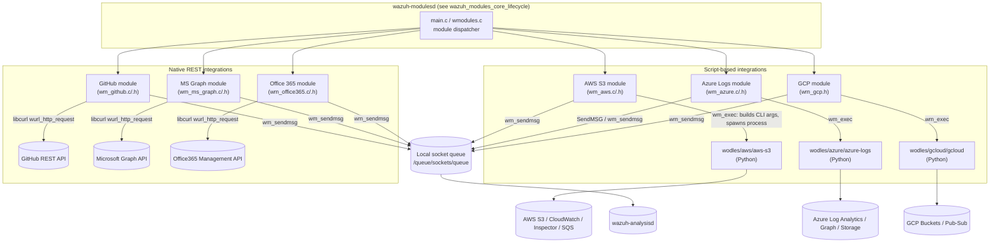
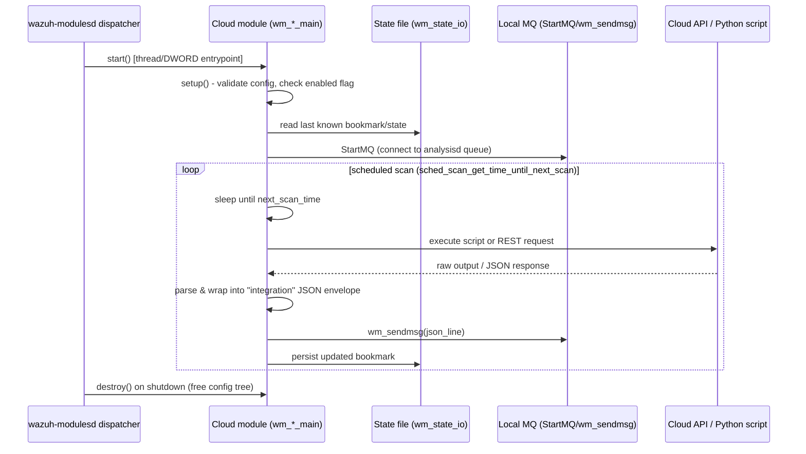

# Wazuh Modules Core – Cloud Integrations

## 1. Purpose

This module is the **C-language front-end** for all cloud-provider log/event
integrations that run inside the `wazuh-modulesd` daemon (see
[wazuh_modules_core_lifecycle](wazuh_modules_core_lifecycle.md) for the daemon
that loads and schedules it). It implements six independent Wazuh modules,
one per cloud provider/service:

| Module | Config tag | Provider | Mechanism |
|---|---|---|---|
| **AWS S3** | `<aws-s3>` | Amazon Web Services | Wraps and executes a Python script (`wodles/aws/aws-s3`) |
| **Azure Logs** | `<azure-logs>` | Microsoft Azure (Log Analytics, Graph, Storage) | Wraps and executes a Python script (`wodles/azure/azure-logs`) |
| **GCP** | `<gcp-pubsub>` / `<gcp-bucket>` | Google Cloud Platform | Wraps and executes a Python script (`wodles/gcloud/gcloud`) |
| **GitHub** | `<github>` | GitHub Enterprise/Cloud audit log | Native C REST client (libcurl) |
| **Microsoft Graph** | `<ms-graph>` | Microsoft Graph API (Intune, Identity Protection, etc.) | Native C REST client (libcurl) |
| **Office 365** | `<office365>` | Microsoft Office 365 Management Activity API | Native C REST client (libcurl) |

All six modules share the same overall pattern used by every Wazuh module: a
`wm_context` structure (`start`, `destroy`, `dump` function pointers) that is
registered with the generic module dispatcher in
[wazuh_modules_core_lifecycle](wazuh_modules_core_lifecycle.md), a scheduling
configuration (`sched_scan_config`), a persisted running **state** (bookmark
timestamps) read/written via `wm_state_io`, and delivery of parsed events to
`analysisd` through the local queue (`wm_sendmsg` / `SendMSG` on
`DEFAULTQUEUE`).

## 2. Architecture Overview

Two different integration strategies coexist in this module, driven mostly by
historical reasons (AWS/Azure/GCP predate the native-C approach) and by SDK
availability (AWS/Azure/GCP publish official Python SDKs; GitHub/MS
Graph/Office 365 only need simple REST calls).

The Python wodles referenced above are documented in detail in
[Wodles_-_Cloud_Integration_Services_(Python)](Wodles_-_Cloud_Integration_Services_(Python).md);
this document focuses exclusively on the **C orchestration layer**.

## 3. Common Lifecycle Pattern

Every sub-module in this document follows the same skeleton, defined by the
generic `wm_context` contract consumed by
[wazuh_modules_core_lifecycle](wazuh_modules_core_lifecycle.md):

Key shared idioms:
- **Configuration structures** (`wm_aws`, `wm_azure_t`, `wm_github`,
  `wm_ms_graph`, `wm_office365`, `wm_gcp_bucket_base`/`wm_gcp_pubsub`) are
  linked lists of accounts/tenants/subscriptions/buckets, allowing a single
  module instance to monitor many cloud accounts concurrently.
- **`cJSON *wm_*_dump(...)`** functions expose the active configuration for
  the `GET /manager/config` API and `wazuh-control info` output — mirrors the
  pattern used across all `wazuh_modules_core_*` sub-modules
  (see [wazuh_modules_core_compliance_scanners](wazuh_modules_core_compliance_scanners.md)
  and [wazuh_modules_core_system_management](wazuh_modules_core_system_management.md)).
- **State/bookmark persistence** via `wm_state_io()` prevents re-processing
  the same events across daemon restarts and enables the `only_future_events`
  / `only_logs_after` semantics common to all providers.
- **Failure back-off & alerting**: GitHub and Office 365 maintain an
  in-memory per-tenant/organization failure counter
  (`wm_github_fail` / `wm_office365_fail`) and only emit an internal error
  event to `analysisd` after `RETRIES_TO_SEND_ERROR` (3) consecutive
  failures, to avoid alert flooding on transient network errors.

## 4. Sub-modules

| Sub-module | Description | Documentation |
|---|---|---|
| AWS S3 Integration | Builds and executes the `aws-s3` Python wodle for buckets, services (Inspector, CloudWatch Logs) and SQS subscribers | [wazuh_modules_core_cloud_integrations_aws](wazuh_modules_core_cloud_integrations_aws.md) |
| Azure Logs Integration | Builds and executes the `azure-logs` Python wodle for Log Analytics, Graph and Storage sources; includes an embedded regex-based log-capture bridge | [wazuh_modules_core_cloud_integrations_azure](wazuh_modules_core_cloud_integrations_azure.md) |
| GCP Integration | Configuration model (`wm_gcp_bucket`/`wm_gcp_pubsub`) for the `gcloud` Python wodle, covering Storage buckets and Pub/Sub subscriptions | [wazuh_modules_core_cloud_integrations_gcp](wazuh_modules_core_cloud_integrations_gcp.md) |
| GitHub Audit Log Integration | Native C REST client polling the GitHub organization audit log API | [wazuh_modules_core_cloud_integrations_github](wazuh_modules_core_cloud_integrations_github.md) |
| Microsoft Graph Integration | Native C REST client for OAuth2 client-credentials auth and generic resource/relationship polling against Microsoft Graph (Intune, Identity Protection, etc.) | [wazuh_modules_core_cloud_integrations_ms_graph](wazuh_modules_core_cloud_integrations_ms_graph.md) |
| Office 365 Integration | Native C REST client managing Office 365 Management Activity API subscriptions and content-blob retrieval | [wazuh_modules_core_cloud_integrations_office365](wazuh_modules_core_cloud_integrations_office365.md) |

## 5. Relationship to Other Modules

- **[wazuh_modules_core_lifecycle](wazuh_modules_core_lifecycle.md)** – hosts
  `main.c`/`wmodules.c`, which instantiates the `wm_context` for each module
  documented here and drives their thread lifecycle (`wm_exec`, `wm_destroy`,
  signal handling).
- **[Wodles_-_Cloud_Integration_Services_(Python)](Wodles_-_Cloud_Integration_Services_(Python).md)** –
  implements the actual AWS/Azure/GCP collection logic invoked by the AWS,
  Azure and GCP sub-modules documented here through `wm_exec`.
- **[wazuh_modules_core_compliance_scanners](wazuh_modules_core_compliance_scanners.md)**
  and **[wazuh_modules_core_system_management](wazuh_modules_core_system_management.md)** –
  sibling modules within `wazuh_modules_core` that follow the same
  `wm_context`/scheduling conventions but target compliance scanning and
  local system management tasks respectively, rather than cloud APIs.
- **[wazuh_modules_core_native_bridges](wazuh_modules_core_native_bridges.md)** –
  sibling module hosting the C++ inventory/vulnerability/router bridges that
  receive and forward data via the shared `router` and `content_manager`
  infrastructure, unlike the direct queue-based delivery used here.
- **`framework_core_communication`** (Python API layer) consumes the events
  these modules emit indirectly through `wazuh-analysisd` and the Wazuh
  indexer, but has no direct code dependency on this module.

## 6. Configuration & Extensibility Notes

- Every module defines a `WM_<NAME>_SCRIPT_PATH` or REST endpoint constant
  and a set of `WM_<NAME>_DEFAULT_*` constants controlling default interval,
  timeout, and buffer sizes — see each sub-module document for details.
- `wm_*_read()` (not shown in the core components above, implemented in the
  corresponding `wmodules-*.c` parser and not part of this module's core code
  set) is responsible for building the linked-list configuration structures
  from `ossec.conf`/`agent.conf` XML; this document covers only the runtime
  execution (`_main`, `_setup`, `_run_*`, `_dump`, `_destroy`) side.
- All modules are conditionally compiled for `WIN32`, `__linux__` and
  `__MACH__` (except AWS, which is POSIX/Windows-agnostic through
  `wm_exec`), reflecting that the manager (and, for some integrations, the
  agent) can run these wodles cross-platform.
