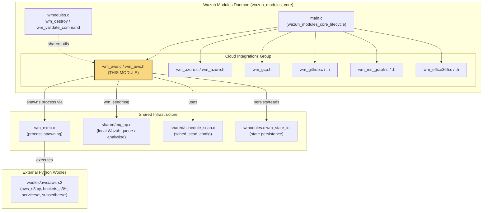
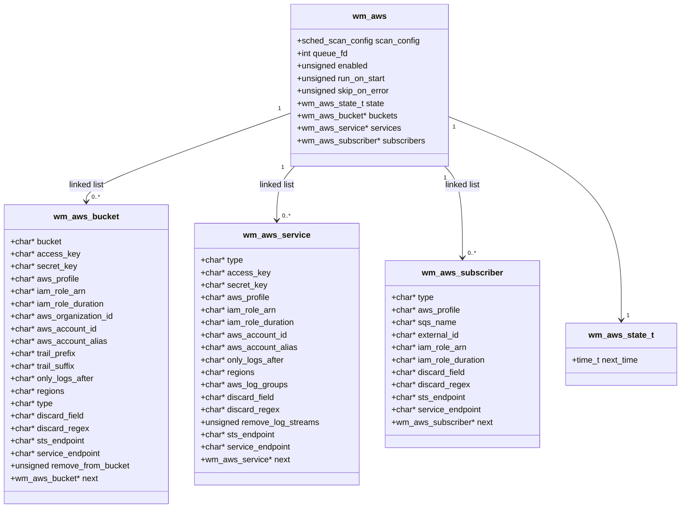
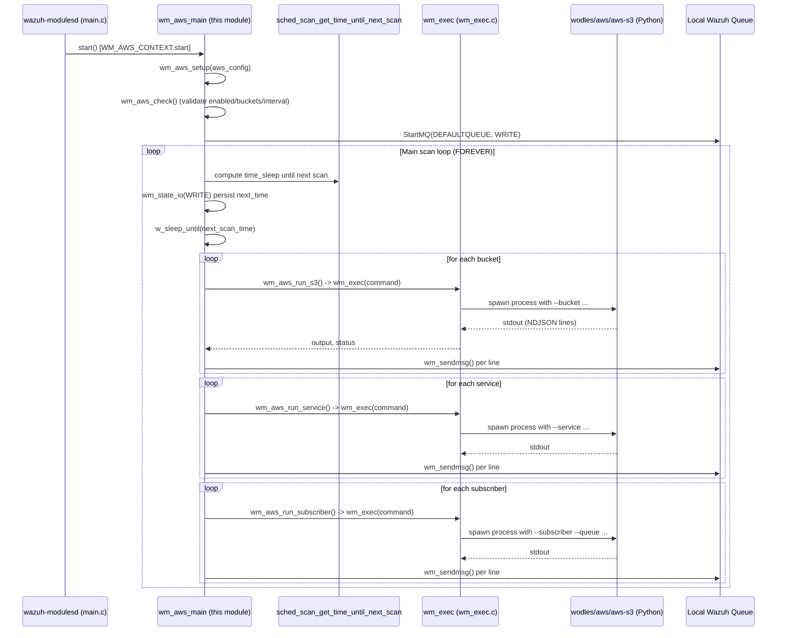
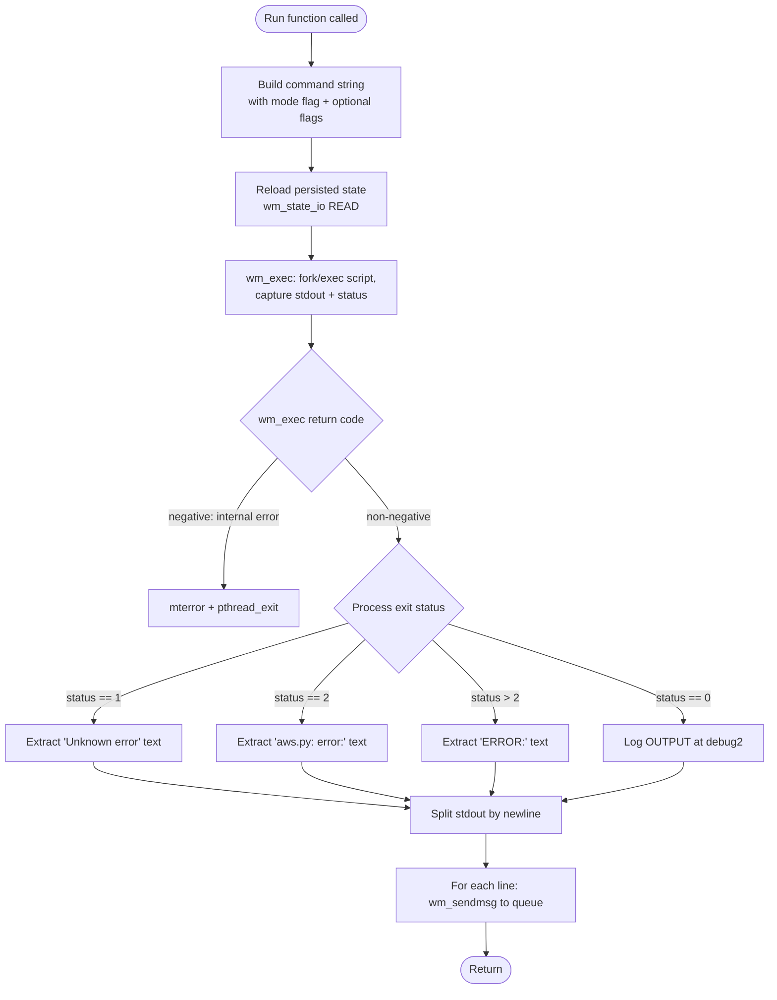

# AWS Cloud Integration Module (`wazuh_modules_core_cloud_integrations_aws`)

## Introduction

The **AWS Cloud Integration Module** is the native C component of the Wazuh Modules Daemon (`wmodules`) responsible for orchestrating the collection of security-relevant data from Amazon Web Services. It acts as a lightweight scheduler and process-launcher: rather than talking to AWS APIs directly, this module builds command-line invocations of the Python-based `aws-s3` wodle (see [Wodles_-_Cloud_Integration_Services_(Python)](wodles_-_cloud_integration_services_(python).md)) and periodically executes them to pull logs from S3 buckets, poll AWS service APIs (e.g., Inspector, CloudWatch Logs), or consume messages from SQS-based subscribers (e.g., Security Lake, Security Hub).

This module is one of several **cloud integration siblings** inside the Wazuh Modules Daemon, alongside Azure, GCP, GitHub, Office 365, and Microsoft Graph integrations. All of these siblings share the same architectural pattern: a small C "shell" module that manages scheduling, configuration, and inter-process communication, delegating the actual API/protocol work to an external script or binary.

This document covers:
1. The module's purpose and responsibilities within the larger Wazuh Modules Daemon
2. Internal architecture and data structures
3. Execution flow for buckets, services, and subscribers
4. Interaction with other Wazuh components (queue, scheduling, exec framework)
5. Configuration dump / serialization behavior

---

## 1. Purpose & Scope

The module (`WM_AWS_CONTEXT`, name `"aws-s3"`) is registered with the main Wazuh Modules Daemon runtime (see [Wazuh_Modules_Daemon_(C)](wazuh_modules_daemon_(c).md)) as one of the many pluggable `wmodule` instances. Its responsibilities are strictly:

- Parse and hold the in-memory configuration for AWS **buckets**, **services**, and **subscribers** (parsed elsewhere via `wm_aws_read`, not included in this component set, but declared in `wm_aws.h`).
- On a schedule (interval-based, cron-like, or `run_on_start`), iterate over all configured buckets/services/subscribers and invoke the external Python script `wodles/aws/aws-s3` with the appropriate CLI flags.
- Capture the script's stdout, split it into lines, and forward each line to the local Wazuh queue (`ossec/queue`) so it can be ingested by the analysis engine.
- Persist minimal running state (`wm_aws_state_t.next_time`) across daemon restarts.
- Expose the current configuration via `wm_aws_dump` for the `GET /manager/config` type API queries (used by the [manager_module](manager_module.md) / [cluster_module](cluster_module.md) configuration endpoints).

This module does **not** talk to AWS itself — no AWS SDK, no HTTP calls. All cloud communication logic lives in the Python wodle (`wodles/aws/*`), keeping the native C footprint small and delegating complex, frequently-changing API logic to a scripting layer that is easier to update.

---

## 2. Position in the System



Related documentation:
- Parent group: [Wazuh_Modules_Daemon_(C)](wazuh_modules_daemon_(c).md) — covers `main.c`, `wmodules.c`, `wm_exec.c`, and the overall module registration/lifecycle pattern shared by all `wm_*` modules.
- Sibling modules: `wazuh_modules_core_cloud_integrations_azure`, `_gcp`, `_github`, `_ms_graph`, `_office365` — same architecture, different cloud provider.
- Python implementation: [Wodles_-_Cloud_Integration_Services_(Python)](wodles_-_cloud_integration_services_(python).md) — the actual AWS API logic (`aws_s3.py`, `buckets_s3/`, `services/`, `subscribers/`).
- Configuration parsing (XML → struct): defined in `wm_aws_read` (declared in `wm_aws.h`, implemented outside this component set, typically in a `wm_aws_config.c` file not included here).
- Log ingestion pipeline downstream: [Agent_&_Manager_Native_Daemons_(C)](agent_&_manager_native_daemons_(c).md) (`shared/mq_op.c`), and eventually the [Wazuh_Engine_Core_(C++)](wazuh_engine_core_(c++).md) for parsing/decoding.

---

## 3. Data Model

The module's configuration is represented by four core structures declared in `wm_aws.h`:



Key design points:
- **Three independent linked lists** (`buckets`, `services`, `subscribers`) allow a single `<wodle name="aws-s3">` XML block to declare multiple heterogeneous data sources simultaneously (e.g., one CloudTrail bucket, one Inspector service poll, and one Security Hub SQS subscriber).
- Every entity carries its own AWS authentication context (`access_key`/`secret_key`, `aws_profile`, or `iam_role_arn` + `iam_role_duration`), enabling per-source credential isolation — important for multi-account AWS Organizations setups (`aws_organization_id`).
- `discard_field` / `discard_regex` provide a generic log-filtering mechanism applied inside the Python layer.
- `sts_endpoint` / `service_endpoint` allow redirecting AWS API calls through VPC endpoints (for private-network deployments).
- `wm_aws_state_t` is minimal — only a `next_time` timestamp — since actual per-bucket "last processed" bookkeeping is delegated to the Python wodle's own SQLite database (see `wazuh_integration.py::WazuhAWSDatabase`).

---

## 4. Execution Flow

### 4.1 Module Lifecycle



### 4.2 Command Construction Pattern

All three run functions (`wm_aws_run_s3`, `wm_aws_run_service`, `wm_aws_run_subscriber`) follow an identical pattern:

1. Start from the fixed script path `WM_AWS_SCRIPT_PATH` (`"wodles/aws/aws-s3"`).
2. Append a **mode selector flag** (`--bucket`, `--service`, or `--subscriber` + `--queue`).
3. Conditionally append every populated optional field as a `--flag value` pair (credentials, filters, endpoints, debug level, `--skip_on_error`).
4. Invoke `wm_exec()` (from [Wazuh_Modules_Daemon_(C)](wazuh_modules_daemon_(c).md) → `wm_exec.c`) to fork/exec the command synchronously, capturing combined stdout and exit status.
5. Interpret the exit status:
   - `0`: success, process output normally.
   - `1`: unknown/generic error — attempt to extract a friendly message from output.
   - `2`: argument parsing error (`aws.py: error:` pattern extracted).
   - other non-zero: generic `ERROR:` pattern extraction.
   - negative return from `wm_exec` itself: internal execution failure → `pthread_exit(NULL)` (kills the whole module thread).
6. Split output into lines and forward each line individually to the local queue via `wm_sendmsg()`, using a per-message throttle (`usec = 1000000 / wm_max_eps`) to respect the configured events-per-second cap.



---

## 5. Configuration Dump (`wm_aws_dump`)

The module implements the standard `dump` callback of the `wm_context` interface, used whenever the manager API needs to render the currently-loaded configuration as JSON (e.g., `GET /manager/configuration?section=wodle`). See [manager_module](manager_module.md) for the API-facing side of this mechanism.

`wm_aws_dump` builds a JSON object containing:
- Top-level scheduling info via `sched_scan_dump()` (shared helper — see `Agent_&_Manager_Native_Daemons_(C)::shared_lib_system_utils_config_scheduling`).
- `disabled`, `run_on_start`, `skip_on_error` flags.
- Three optional arrays: `buckets`, `services`, `subscribers` — each populated only if the corresponding linked list is non-empty, mirroring the field sets described in Section 3.

This ensures the API always reflects exactly what the running module holds in memory, including any credentials configured in the XML (note: this dump includes `access_key`/`secret_key` values as-is, matching upstream behavior of other cloud wodles).

---

## 6. Integration with the `wm_context` Interface

Like every module in [Wazuh_Modules_Daemon_(C)](wazuh_modules_daemon_(c).md), the AWS module registers itself through a static `wm_context` descriptor:

```c
const wm_context WM_AWS_CONTEXT = {
    .name = "aws-s3",
    .start = (wm_routine)wm_aws_main,
    .destroy = (void(*)(void *))wm_aws_destroy,
    .dump = (cJSON * (*)(const void *))wm_aws_dump,
    .sync = NULL,
    .stop = NULL,
    .query = NULL,
};
```

| Callback | Purpose | Notes |
|---|---|---|
| `start` | Entry point of the module's dedicated thread (`wm_aws_main`) | Platform-conditional signature (`DWORD WINAPI` on Windows vs `void*` on POSIX) |
| `destroy` | Frees the `wm_aws` configuration struct | Called by `wmodules.c::wm_destroy` during daemon shutdown |
| `dump` | Serializes config to JSON | Used by manager API / `wazuh-modulesd -t` config test |
| `sync`, `stop`, `query` | Unused | This module has no cross-node sync, no graceful async stop, and no runtime query interface (unlike, e.g., `task_manager_module`) |

This uniform interface is what allows `main.c` (in `wazuh_modules_core_lifecycle`) to manage a heterogeneous list of `wmodule` structs (a linked list — see `wmodules_def.h::wmodule.next`) without needing per-module-type logic.

---

## 7. Error Handling & Resilience

- **`wm_aws_check()`** performs pre-flight validation at startup: if the module is disabled, or has zero buckets/services/subscribers configured, the module thread exits immediately via `pthread_exit(NULL)` rather than looping uselessly.
- **`skip_on_error`**: when set, the constructed command includes `--skip_on_error`, telling the Python script to continue processing other sources instead of aborting the whole run when one bucket/service fails.
- **Fatal vs. recoverable errors**: a negative return from `wm_exec()` (meaning the fork/exec itself failed, not that the script returned an error) is treated as fatal to the whole module thread. A non-zero *script* exit status is only logged as a warning — the loop continues processing remaining buckets/services/subscribers.
- **State persistence**: `wm_state_io()` (shared helper in `wmodules.c`) is used both to persist `next_time` (so schedule survives restarts) and to reload it before each individual run — mirroring the pattern in other cloud modules.

---

## 8. Relationship to Similar Modules

The AWS module is best understood by comparison with its siblings, all children of `wazuh_modules_core_cloud_integrations`:

| Module | Data model complexity | Backing script/binary | Auth mechanisms |
|---|---|---|---|
| **AWS (this module)** | 3 linked lists (bucket/service/subscriber) | `wodles/aws/aws-s3` (Python) | access/secret keys, profile, IAM role, org ID |
| Azure (`wm_azure.c`) | log_analytics / graph / storage configs | `wodles/azure/azure_services/*` (Python) | app registration secrets |
| GCP (`wm_gcp.h`) | bucket / pubsub configs | `wodles/gcloud/*` (Python) | service account credentials file |
| GitHub (`wm_github.c`) | single config with orgs list | Internal C HTTP client (via `shared/url.c`) | PAT/App auth |
| MS Graph (`wm_ms_graph.c`) | relationships/resources | Internal C HTTP client | OAuth2 client credentials |
| Office 365 (`wm_office365.c`) | subscriptions | Internal C HTTP client | OAuth2 client credentials |

Notably, AWS (like Azure and GCP) delegates to an **external Python process**, whereas GitHub, MS Graph, and Office 365 perform HTTP calls natively in C. This affects operational characteristics: the AWS module's resource usage is dominated by process-spawn overhead (`wm_exec`) rather than in-process HTTP handling, and its behavior can be modified by updating the Python wodle without recompiling the daemon.

---

## 9. Key Files Reference

| File | Role |
|---|---|
| `src/wazuh_modules/wm_aws.c` | Module thread (`wm_aws_main`), setup, per-source execution, JSON dump |
| `src/wazuh_modules/wm_aws.h` | Data structures (`wm_aws`, `wm_aws_bucket`, `wm_aws_service`, `wm_aws_subscriber`, `wm_aws_state_t`) and context declaration |
| `wodles/aws/aws_s3.py` | Python entry point invoked by this module |
| `wodles/aws/buckets_s3/*.py` | Bucket-type-specific log parsers (CloudTrail, Config, GuardDuty, VPC Flow, WAF, etc.) |
| `wodles/aws/services/*.py` | AWS service API pollers (Inspector, CloudWatch Logs) |
| `wodles/aws/subscribers/*.py` | SQS-based subscriber handlers (S3 log handler, Security Lake) |

For details on the Python-side implementation, see [Wodles_-_Cloud_Integration_Services_(Python)](wodles_-_cloud_integration_services_(python).md). For the broader native daemon lifecycle (main loop, signal handling, module registration), see [Wazuh_Modules_Daemon_(C)](wazuh_modules_daemon_(c).md).
