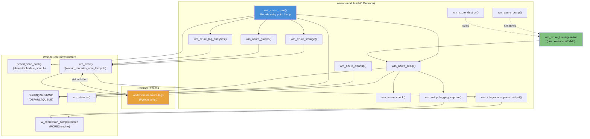
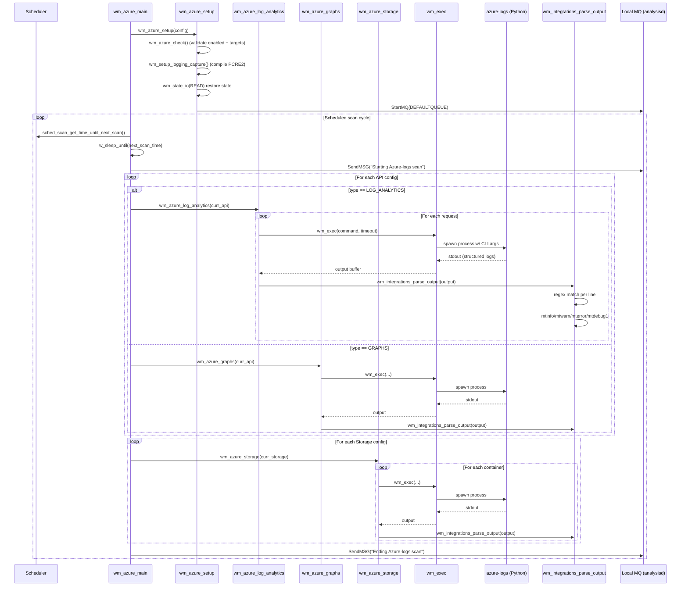
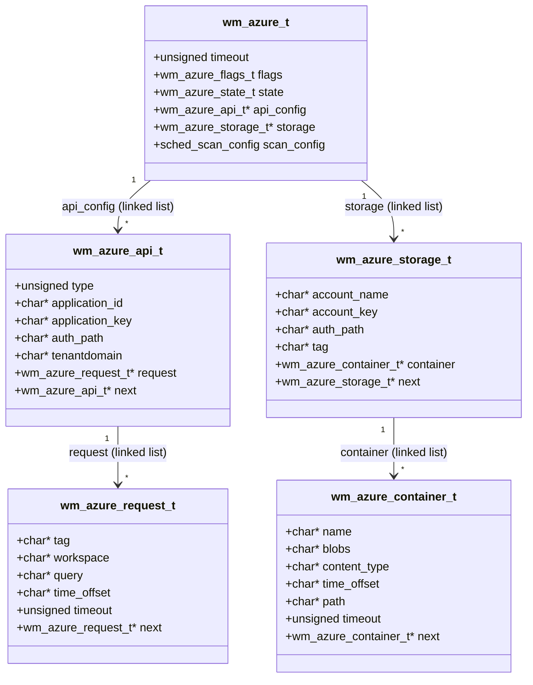
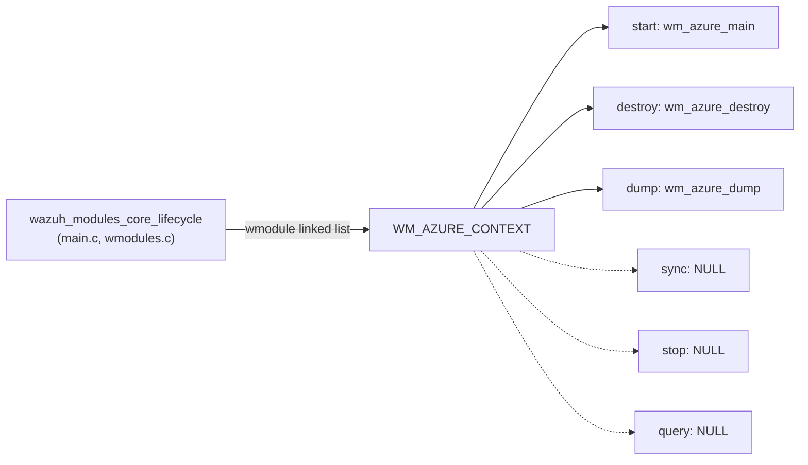

# Wazuh Modules Core — Cloud Integrations: Azure (`wazuh_modules_core_cloud_integrations_azure`)

## Introduction

The **Azure Integration Module** (`wm_azure`) is a native Wazuh Manager/Agent daemon module (part of `wazuh-modulesd`) that periodically collects security and audit data from Microsoft Azure services. It acts as a thin C orchestration layer that schedules and invokes an external Python script (`wodles/azure/azure-logs`), captures its structured log output, and forwards status/health information into the Wazuh analysis pipeline via the analysisd queue.

The module supports three distinct Azure data sources:
- **Log Analytics** — runs KQL queries against Azure Log Analytics workspaces.
- **Graph** — runs queries against the Microsoft Graph API (e.g., Azure AD sign-in/audit logs).
- **Storage** — retrieves blobs (e.g., diagnostic logs) from Azure Storage containers.

This module is a sibling of the AWS (`wm_aws`), GCP (`wm_gcp`), GitHub (`wm_github`), Microsoft Graph (`wm_ms_graph`), and Office365 (`wm_office365`) cloud integration modules, all grouped under `wazuh_modules_core_cloud_integrations`. It follows the same architectural pattern used across these modules: a lightweight C wrapper drives an external script/tool that performs the actual API communication and outputs pre-formatted log lines that the C code parses for its own logging, while the actual security events are written directly to disk/queue by the invoked script for pickup by `ossec-logcollector` or `analysisd`.

## Purpose and Core Functionality

`wm_azure` is responsible for:

1. **Scheduling** — Using the shared scheduling subsystem (`sched_scan_config`) to determine when to run (interval-based or calendar-based: daily time, day of week, day of month).
2. **Configuration management** — Holding parsed XML configuration (`wm_azure_t`) describing one or more API/storage targets and their associated requests/containers.
3. **Command construction & execution** — Building a command line invocation of the external Python script `wodles/azure/azure-logs` with the appropriate CLI flags per request type, then executing it via `wm_exec()` with a configurable timeout.
4. **Output capture & re-logging** — Parsing the script's structured stdout/stderr (lines matching a `DATE azure: LEVEL: message` pattern) via a compiled PCRE2 regular expression, and re-emitting them through the Wazuh logging macros (`mtinfo`, `mtwarn`, `mterror`, `mtdebug1`) tagged with `WM_AZURE_LOGTAG`.
5. **Health signaling** — Sending `rootcheck`-tagged start/end scan markers to the local Wazuh queue (`DEFAULTQUEUE`) so that scan progress is visible in the analysis engine.
6. **State persistence** — Reading/writing running state (`wm_azure_state_t`) via `wm_state_io()` so the module can track scheduling continuity across restarts.
7. **Configuration introspection** — Exposing the entire parsed configuration as JSON via `wm_azure_dump()`, used by the Wazuh API (`GET /manager/config` and similar endpoints) and `wazuh-control` diagnostics.

## Architecture Overview



## Core Components

| Component | Type | Responsibility |
|---|---|---|
| `wm_azure_t` | struct | Top-level module configuration: timeout, flags, running state, linked lists of API and storage configs, scheduling config |
| `wm_azure_flags_t` | struct (bitfield) | `enabled` / `run_on_start` flags |
| `wm_azure_state_t` | struct | Persisted state — `next_time` for scheduling continuity |
| `wm_azure_api_t` | struct | One Log Analytics or Graph API target (tenant, credentials, list of requests) |
| `wm_azure_request_t` | struct | A single query definition (tag, workspace, KQL/Graph query, time offset, per-request timeout) |
| `wm_azure_storage_t` | struct | One Storage account target (credentials, list of containers) |
| `wm_azure_container_t` | struct | A single blob container definition (name, blob filter, content type, time offset, path prefix, timeout) |
| `wm_azure_setup()` | function | Initializes module: validates config, sets up log-capture regex, restores state, connects to the local message queue |
| `wm_azure_log_analytics()` | function | Iterates Log Analytics requests, builds CLI args, invokes the script |
| `wm_azure_graphs()` | function | Iterates Graph requests, builds CLI args, invokes the script |
| `wm_azure_storage()` | function | Iterates Storage containers, builds CLI args, invokes the script |
| `wm_azure_cleanup()` | function | Closes the queue file descriptor on exit (registered via `atexit`) |
| `wm_azure_destroy()` | function | Frees all dynamically allocated configuration structures and the compiled regex |
| `wm_azure_dump()` | function | Serializes the full configuration tree to a `cJSON` object |

## Data Flow / Execution Sequence



## Configuration Model

The configuration is parsed from the `<azure-logs>` block in `ossec.conf` (parsing entry point `wm_azure_read`, declared in `wm_azure.h` but implemented elsewhere in the config subsystem) into the `wm_azure_t` structure tree:



Key configuration semantics:
- `type` in `wm_azure_api_t` distinguishes `LOG_ANALYTICS` (0) from `GRAPHS` (1); each type maps to a different set of CLI flags (`--log_analytics` vs `--graph`).
- Authentication can be supplied either as an `auth_path` (external credentials file) or inline `application_id`/`application_key` (Log Analytics/Graph) or `account_name`/`account_key` (Storage).
- Each request/container may override the global `timeout` with its own value; otherwise the module-level `default_timeout` (copied from `wm_azure_t.timeout`, default `WM_AZURE_DEF_TIMEOUT` = 3600s) applies.
- `content_type` in `wm_azure_container_t` controls how the script emits blob contents (`json_file` or `json_inline`).

## Command Construction Pattern

All three collection functions (`wm_azure_log_analytics`, `wm_azure_graphs`, `wm_azure_storage`) share an identical pattern:

1. Allocate/build a command-line string starting with the script path `WM_AZURE_SCRIPT_PATH` (`wodles/azure/azure-logs`).
2. Append a type-specific main flag (`--log_analytics`, `--graph`, `--storage`).
3. Append authentication flags — either `--*_auth_path <file>` or explicit ID/key pairs.
4. Append tenant/tag/query/workspace/container-specific flags built from the linked-list node currently being processed.
5. Optionally append `--debug <level>` if `isDebug()` is set.
6. Invoke `wm_exec(command, &output, &status, timeout, NULL)`.
7. Branch on the result:
   - `0`: success → parse `output` via `wm_integrations_parse_output()`.
   - `WM_ERROR_TIMEOUT`: log a timeout error and continue with the next item.
   - any other value: log an internal error and terminate the thread (`pthread_exit(NULL)`).

This pattern is effectively identical to the sibling modules (`wm_github`, `wm_ms_graph`, `wm_office365`), all of which invoke Python wodles under `wazuh_modules_core_cloud_integrations`.

## Output Parsing / Log Re-emission

`wm_setup_logging_capture()` compiles a PCRE2 pattern:
```
^\d{4}/\d{2}/\d{2} \d{2}:\d{2}:\d{2} azure: (DEBUG|INFO|WARNING|ERROR): 
```
`wm_integrations_parse_output()` then tokenizes the script's captured stdout by newline, applies the regex to each line via `w_expression_match()`, and re-emits the trailing message payload using the matching Wazuh log level macro. This lets the Python script's internal logging surface consistently inside `ossec.log`/`wazuh-modulesd.log` under the `WM_AZURE_LOGTAG` tag, without the C module needing to understand the semantic content of Azure API responses.

This regex-based bridging mechanism (`w_calloc_expression_t`, `w_expression_compile`, `w_expression_match`, `w_free_expression_match`) is a shared idiom from expression utilities also used elsewhere in the native daemon codebase (see `src/headers/expression.h`).

## Lifecycle & Module Context

`wm_azure` registers itself into the generic Wazuh Modules Daemon framework via the `WM_AZURE_CONTEXT` structure (of type `wm_context`, shared with all wodules — see `wazuh_modules_core_lifecycle`):



- **start**: `wm_azure_main` — runs as its own thread, loops forever (`FOREVER()`) executing scheduled scans.
- **destroy**: `wm_azure_destroy` — invoked at daemon shutdown to free the configuration tree.
- **dump**: `wm_azure_dump` — invoked by the configuration API/CLI to render current config as JSON (consumed indirectly by `manager_module`/`api_core_infrastructure` endpoints such as `GET /manager/configuration`).
- **sync/stop/query**: unused (`NULL`) — Azure module has no inter-process sync, explicit stop hook, or on-demand query interface, unlike modules such as `task_manager_module` or `wazuh_modules_core_native_bridges` components.

## Relationship to Other Modules

- **Parent**: `wazuh_modules_core_cloud_integrations` groups all cloud-provider wodules (AWS, Azure, GCP, GitHub, MS Graph, Office365) sharing this exec-and-parse architecture.
- **Sibling modules**:
  - `wazuh_modules_core_cloud_integrations_aws` (`wm_aws`) — same pattern for AWS S3/CloudWatch/Inspector.
  - `wazuh_modules_core_cloud_integrations_gcp` (`wm_gcp`) — Google Cloud Storage/PubSub.
  - `wazuh_modules_core_cloud_integrations_github` (`wm_github`) — GitHub audit log API.
  - `wazuh_modules_core_cloud_integrations_ms_graph` (`wm_ms_graph`) — a newer, native-C (non-script) Microsoft Graph integration; contrasts with `wm_azure`'s external-script model for its own Graph support.
  - `wazuh_modules_core_cloud_integrations_office365` (`wm_office365`) — Office 365 Management Activity API.
- **Companion Python implementation**: The actual Azure Log Analytics/Graph/Storage API logic lives in the `wodles/azure/*` Python package, documented under **`Wodles_-_Cloud_Integration_Services_(Python)`** (see `azure_services`, `azure_utils`, and `azure_db` sub-modules). `wm_azure.c` is purely an orchestration/wrapper layer around `wodles/azure/azure_utils.py::get_script_arguments` and the service starters (`start_log_analytics`, `start_graph`, `start_storage`).
- **Shared native daemon infrastructure**:
  - Scheduling: `sched_scan_config` / `sched_scan_dump` / `sched_scan_get_time_until_next_scan` (from `src/shared/schedule_scan.c`, part of `shared_lib_system_utils_config_scheduling`).
  - Process execution: `wm_exec()` (from `wazuh_modules_core_lifecycle`, `src/wazuh_modules/wm_exec.c`).
  - Messaging: `StartMQ`/`SendMSG` (from `shared_lib_networking`, `src/shared/mq_op.c`).
  - State persistence: `wm_state_io()` (from `wazuh_modules_core_lifecycle`, `src/wazuh_modules/wmodules.c`).
  - Regex/expression engine: `w_expression_*` functions (`src/headers/expression.h`, shared engine utilities).
- **Configuration surface**: Parsed via the general Wazuh XML configuration reader (`OS_XML`, see `os_xml` component group) and exposed through the standard manager configuration API described in `manager_module`.

## Threading & Concurrency Model

- `wm_azure_main` runs as a single dedicated thread spawned by the Wazuh Modules Daemon core (`wazuh_modules_core_lifecycle`), one per configured `<azure-logs>` block.
- All work within a scan cycle (Log Analytics → Graphs → Storage) is executed **sequentially** on this single thread — there is no internal parallelism for concurrent API calls; overlap between different Azure API types or containers is achieved solely through the granularity of per-request/per-container timeouts.
- Fatal internal errors from `wm_exec()` cause the thread to terminate via `pthread_exit(NULL)`, effectively disabling further Azure collection until `wazuh-modulesd` is restarted.

## Health / Observability

- Scan boundaries are signaled to the analysis engine via plain-text `rootcheck`-tagged messages (`"Starting Azure-logs scan."` / `"Ending Azure-logs scan."`) sent through `SendMSG()` to `DEFAULTQUEUE` — this provides a lightweight heartbeat visible in Wazuh's internal event pipeline (see `remoted`/`analysisd` correlation, out of scope for this module but consumed downstream).
- All script activity is captured and logged with severity levels preserved (`DEBUG`/`INFO`/`WARNING`/`ERROR`) using `WM_AZURE_LOGTAG`, enabling standard `ossec.log` grep-based troubleshooting.
- Running state (`wm_azure_state_t.next_time`) is persisted through `wm_state_io()` so that a manager restart does not cause an immediate re-scan burst; the next scheduled time is honored across restarts.

## Related Documentation

- `wazuh_modules_core_cloud_integrations_aws.md` — sibling AWS integration module.
- `wazuh_modules_core_cloud_integrations_ms_graph.md` — native C Microsoft Graph implementation.
- `wazuh_modules_core_cloud_integrations_office365.md` — Office 365 integration module.
- `wazuh_modules_core_lifecycle.md` — shared wodules daemon lifecycle (`main.c`, `wmodules.c`, `wm_exec.c`).
- `manager_module.md` — API/CLI surface that exposes `wm_azure_dump()` output for configuration inspection.
- `wodles_cloud_integration_services_python.md` — the external Python implementation (`wodles/azure/*`) invoked by this module.
