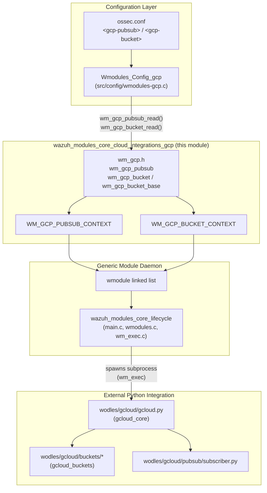
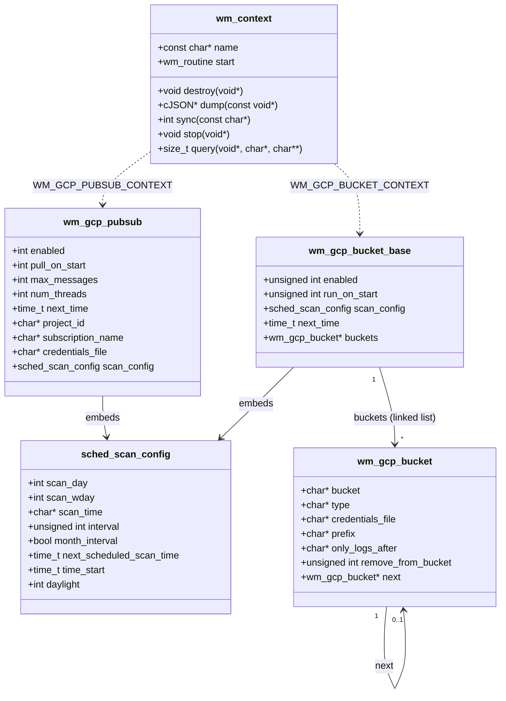
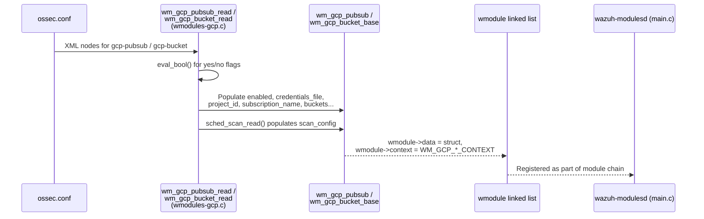
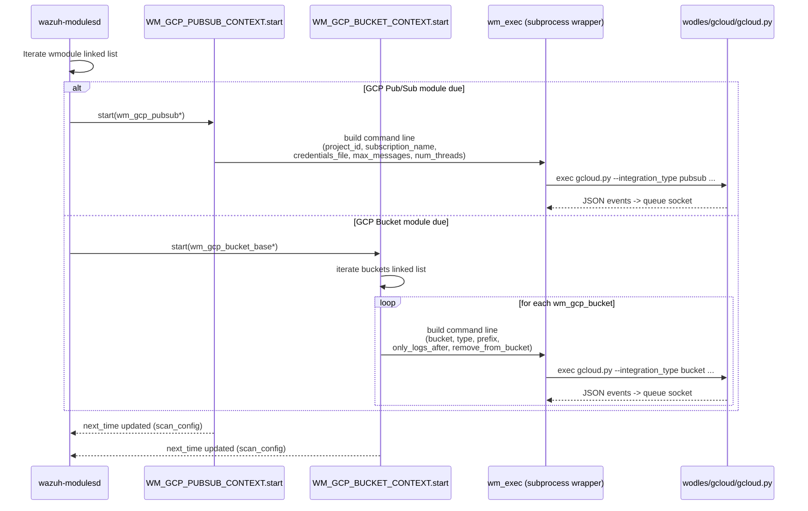
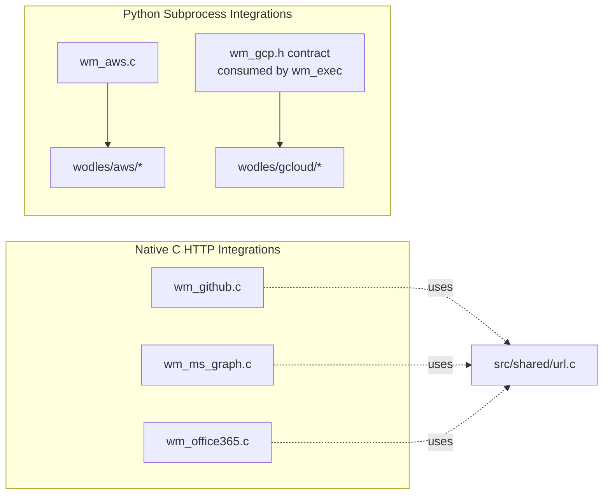

# Wazuh Modules Core — Cloud Integrations: GCP

## Introduction

The **`wazuh_modules_core_cloud_integrations_gcp`** module defines the C-level data model that the Wazuh Manager's `wazuh-modulesd` daemon uses to run the **Google Cloud Platform (GCP)** integrations. It is a very small, header-only module — `src/wazuh_modules/wm_gcp.h` — that declares the configuration structures and the public entry points consumed by the module manager (`wazuh-modulesd`) to schedule and execute two independent GCP-related sub-modules:

1. **GCP Pub/Sub** — pulls messages from a Google Cloud Pub/Sub subscription.
2. **GCP Bucket** — downloads and parses logs stored in Google Cloud Storage buckets (Access Transparency logs, general bucket logs, etc.).

This module is purely a **configuration/data-contract layer**: it does not implement the actual pulling/downloading logic (that logic lives in the Python wodle `wodles/gcloud`), nor does it implement the XML parsing (that lives in `src/config/wmodules-gcp.c`). Instead, it is the **glue structure** shared between:

- The XML configuration reader (`wm_gcp_pubsub_read`, `wm_gcp_bucket_read`), declared here and implemented in `src/config/wmodules-gcp.c`.
- The generic Wazuh modules daemon (`wazuh_modules_core` / `wazuh_modules_core_lifecycle`), which invokes the module through the standard `wm_context` interface.
- The external Python integration scripts (`wodles/gcloud/gcloud.py`) invoked as a subprocess by the module's `start` routine.

Because this module sits at the intersection of the C module-manager framework, the C configuration subsystem, and the Python cloud wodle scripts, this document also explains how these three layers interact.

---

## 1. Purpose and Core Functionality

| Responsibility | Description |
|---|---|
| **Configuration modeling** | Defines `wm_gcp_pubsub` and `wm_gcp_bucket_base` / `wm_gcp_bucket` structs that hold all settings read from `ossec.conf` (`<gcp-pubsub>` and `<gcp-bucket>` blocks). |
| **Module contract** | Exposes `WM_GCP_PUBSUB_CONTEXT` and `WM_GCP_BUCKET_CONTEXT`, two `wm_context` instances that plug into the generic `wmodule` linked-list managed by `wazuh-modulesd`. |
| **Configuration entry points** | Declares `wm_gcp_pubsub_read()` and `wm_gcp_bucket_read()`, the XML-to-struct parsing functions invoked while reading `ossec.conf`. |
| **Scheduling metadata** | Embeds `sched_scan_config` (shared scheduling primitive) to support interval-based and calendar-based (day/time/weekday) scheduling for both sub-modules. |
| **Bucket list management** | Models multiple `<bucket>` entries as a singly linked list (`wm_gcp_bucket.next`) rooted at `wm_gcp_bucket_base.buckets`, allowing a single `<gcp-bucket>` block to monitor several GCS buckets. |

This module does **not**:
- Parse XML directly (delegated to `Wmodules_Config_gcp` — `src/config/wmodules-gcp.c`).
- Execute the GCP API calls (delegated to the Python wodle scripts under `wodles/gcloud`, documented in `gcloud_core.md` and `gcloud_buckets.md`).
- Manage process spawning/lifecycle beyond exposing the standard `wm_context.start` routine (delegated to `wazuh_modules_core_lifecycle`, e.g. `wm_exec.c`).

---

## 2. Architecture Overview

### 2.1 Position in the System



### 2.2 Data Structures



**Key notes on the data model:**

- `wm_gcp_pubsub` represents a single Pub/Sub subscription poller — there is exactly one configuration instance per `<gcp-pubsub>` block.
- `wm_gcp_bucket_base` is the *module-level* configuration for GCS bucket monitoring, holding common scheduling settings (`enabled`, `run_on_start`, `scan_config`) plus a **linked list** of `wm_gcp_bucket` entries — one per `<bucket>` sub-element inside `<gcp-bucket>`. This mirrors the AWS bucket module's design (`wm_aws_bucket` in `wazuh_modules_core_cloud_integrations_aws`), allowing several buckets/prefixes to be monitored under a single module instance.
- Both top-level structs reuse the shared `sched_scan_config` primitive (declared in `src/headers/schedule_scan.h`) for interval- or calendar-based scheduling, consistent with every other scheduled wodle (`wm_aws`, `wm_azure`, `wm_oscap`, `wm_ciscat`, etc. — see `wazuh_modules_core_compliance_scanners` and the AWS/Azure cloud-integration modules for structurally similar examples).

---

## 3. Component Interaction & Data Flow

### 3.1 Configuration Loading Sequence



### 3.2 Runtime Execution Sequence



Both flows ultimately deliver parsed GCP log events to the local Wazuh queue (`ossec/queue/sockets/queue`), from which they proceed through `analysisd`/the **Wazuh Engine** for rule matching, exactly like any other log source. See the Engine and Router documentation for downstream processing.

---

## 4. Relationship to Sibling Cloud Integrations

`wazuh_modules_core_cloud_integrations_gcp` is one of several sibling modules under `wazuh_modules_core_cloud_integrations`, all following the same architectural pattern (C struct + `wm_context` + external script/subprocess):

| Sibling Module | Struct file | External runner |
|---|---|---|
| AWS | `wm_aws.h` (`wazuh_modules_core_cloud_integrations_aws`) | `wodles/aws/aws_s3.py` |
| Azure | `wm_azure.h` (`wazuh_modules_core_cloud_integrations_azure`) | Azure Python wodle (`wodles/azure`) |
| GitHub | `wm_github.h` (`wazuh_modules_core_cloud_integrations_github`) | Built into `wm_github.c` (native HTTP calls) |
| MS Graph | `wm_ms_graph.h` (`wazuh_modules_core_cloud_integrations_ms_graph`) | Built into `wm_ms_graph.c` |
| Office 365 | `wm_office365.h` (`wazuh_modules_core_cloud_integrations_office365`) | Built into `wm_office365.c` |
| **GCP** (this module) | `wm_gcp.h` | `wodles/gcloud/gcloud.py` |

Unlike GitHub, MS Graph, and Office 365 — which perform HTTP calls natively in C using `src/shared/url.c` — **GCP and AWS delegate the actual cloud-provider interaction to external Python scripts**, invoked as subprocesses via `wm_exec()` (see `wazuh_modules_core_lifecycle`). This is because the official Google Cloud and AWS SDKs used for authentication (`google-cloud-pubsub`, `google-cloud-storage`, `boto3`) are Python libraries without first-class C bindings maintained by Wazuh.



---

## 5. Configuration Reference (XML to Struct Mapping)

The structures declared in `wm_gcp.h` are populated by `wm_gcp_pubsub_read()` and `wm_gcp_bucket_read()` (implemented in `src/config/wmodules-gcp.c`, see `Wmodules_Config_gcp` documentation for parsing details). The table below summarizes the mapping.

### `<gcp-pubsub>` maps to `wm_gcp_pubsub`

| XML tag | Struct field | Notes |
|---|---|---|
| `enabled` | `enabled` | Parsed via `eval_bool()` |
| `pull_on_start` | `pull_on_start` | Parsed via `eval_bool()` |
| `max_messages` | `max_messages` | Integer |
| `num_threads` | `num_threads` | Integer |
| `project_id` | `project_id` | String |
| `subscription_name` | `subscription_name` | String |
| `credentials_file` | `credentials_file` | Path to GCP service-account JSON key |
| `interval` / `day` / `wday` / `time` | `scan_config` | Delegated to `sched_scan_read()` (shared scheduling utility) |

### `<gcp-bucket>` maps to `wm_gcp_bucket_base` (plus nested `<bucket>` entries mapping to `wm_gcp_bucket`)

| XML tag | Struct field | Notes |
|---|---|---|
| `enabled` | `enabled` (base) | Parsed via `eval_bool()` |
| `run_on_start` | `run_on_start` (base) | Parsed via `eval_bool()` |
| `bucket` (repeatable element) | new `wm_gcp_bucket` node appended to `buckets` list | |
| `name` / attribute inside `bucket` | `bucket` | GCS bucket name |
| `type` attribute inside `bucket` | `type` | Bucket log type (e.g. access logs) |
| `credentials_file` inside `bucket` | `credentials_file` | Per-bucket credentials override |
| `path` / `prefix` inside `bucket` | `prefix` | Path/prefix filter within the bucket |
| `only_logs_after` inside `bucket` | `only_logs_after` | Date filter `YYYY-MMM-DD` |
| `remove_from_bucket` inside `bucket` | `remove_from_bucket` | Boolean bitfield |
| `interval` / `day` / `wday` / `time` | `scan_config` (base) | Shared across all buckets in the block |

Unit test coverage for this configuration parsing lives in `src/unit_tests/wazuh_modules/gcp/test_wmodules_gcp.c` (see the `gcp_wmodules` test suite under `Unit_Tests_-_Wazuh_Modules_(Cloud_Misc)`), and runtime/module behavior tests live in `src/unit_tests/wazuh_modules/gcp/test_wm_gcp.c` (the `gcp` test suite).

---

## 6. Constants and Defaults

| Constant | Value | Purpose |
|---|---|---|
| `WM_GCP_PUBSUB_LOGTAG` | `ARGV0 ":gcp-pubsub"` | Log tag prefix for Pub/Sub module messages |
| `WM_GCP_BUCKET_LOGTAG` | `ARGV0 ":gcp-bucket"` | Log tag prefix for Bucket module messages |
| `WM_GCP_SCRIPT_PATH` | `"wodles/gcloud/gcloud"` | Relative path to the Python integration entry point invoked via `wm_exec` |
| `WM_GCP_LOGGING_TOKEN` | `":gcloud_wodle:"` | Token used to identify/parse log lines emitted by the Python subprocess |
| `WM_GCP_DEF_INTERVAL` | `3600` (seconds) | Default polling interval (1 hour) when none is configured |

---

## 7. Public API Surface

```c
extern const wm_context WM_GCP_PUBSUB_CONTEXT;
extern const wm_context WM_GCP_BUCKET_CONTEXT;

int wm_gcp_pubsub_read(xml_node **nodes, wmodule *module);
int wm_gcp_bucket_read(const OS_XML *xml, xml_node **nodes, wmodule *module);
```

- **`WM_GCP_PUBSUB_CONTEXT` / `WM_GCP_BUCKET_CONTEXT`**: Statically-defined `wm_context` instances (implemented alongside this header, conceptually part of `wazuh_modules_core_cloud_integrations`) that plug the GCP `start`, `destroy`, and `dump` routines into the generic module dispatch table used by `wazuh_modules_core_lifecycle` (`main.c`, `wmodules.c`).
- **`wm_gcp_pubsub_read`**: Invoked by the configuration reader while parsing `ossec.conf`; returns a populated `wm_gcp_pubsub` attached to the `wmodule` being constructed.
- **`wm_gcp_bucket_read`**: Same role for the bucket module; note it additionally receives the full `OS_XML` document (`xml`) because bucket entries may require re-inspecting sibling XML nodes for nested `<bucket>` elements.

---

## 8. Related Documentation

- **Parent/sibling modules:**
  - `wazuh_modules_core_cloud_integrations_aws.md` — structurally closest analog (Python-subprocess model, bucket linked-list).
  - `wazuh_modules_core_cloud_integrations_azure.md`
  - `wazuh_modules_core_cloud_integrations_github.md`
  - `wazuh_modules_core_cloud_integrations_ms_graph.md`
  - `wazuh_modules_core_cloud_integrations_office365.md`
  - `wazuh_modules_core_lifecycle.md` — generic module daemon lifecycle (`main.c`, `wmodules.c`, `wm_exec.c`) that hosts and schedules this module.
- **Configuration parsing:**
  - `Wmodules_Config_gcp.md` — XML parsing implementation (`src/config/wmodules-gcp.c`) that populates the structs defined here.
  - `Global_Config_Core.md` — top-level `ossec.conf` parsing entry point.
- **External Python integration:**
  - `gcloud_core.md` — `wodles/gcloud/gcloud.py`, `integration.py`, `pubsub/subscriber.py`.
  - `gcloud_buckets.md` — `wodles/gcloud/buckets/access_logs.py`, `bucket.py`.
  - `wodles_utils.md` — shared helper utilities used by all Python wodles.
- **Shared scheduling primitive:**
  - `shared_lib_system_utils_config_scheduling.md` — `sched_scan_config` and `schedule_scan.c` shared by every scheduled module.
- **Downstream processing:**
  - `Wazuh_Engine_Core_(C++).md` / `Router.md` — how ingested GCP log events are subsequently parsed, decoded, and matched against rules once delivered to the analysis pipeline.
- **Testing:**
  - The `gcp` and `gcp_wmodules` unit test suites (`Unit_Tests_-_Wazuh_Modules_(Cloud_Misc).md`) cover both runtime behavior and configuration parsing for this module.
