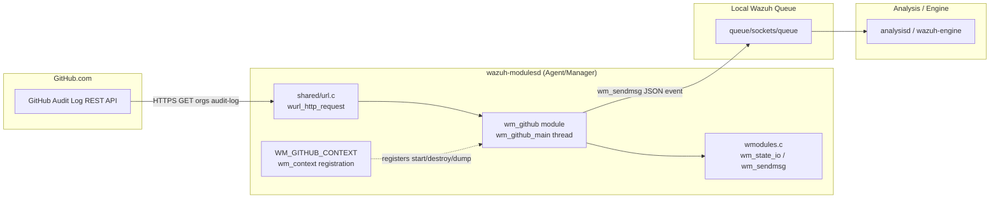
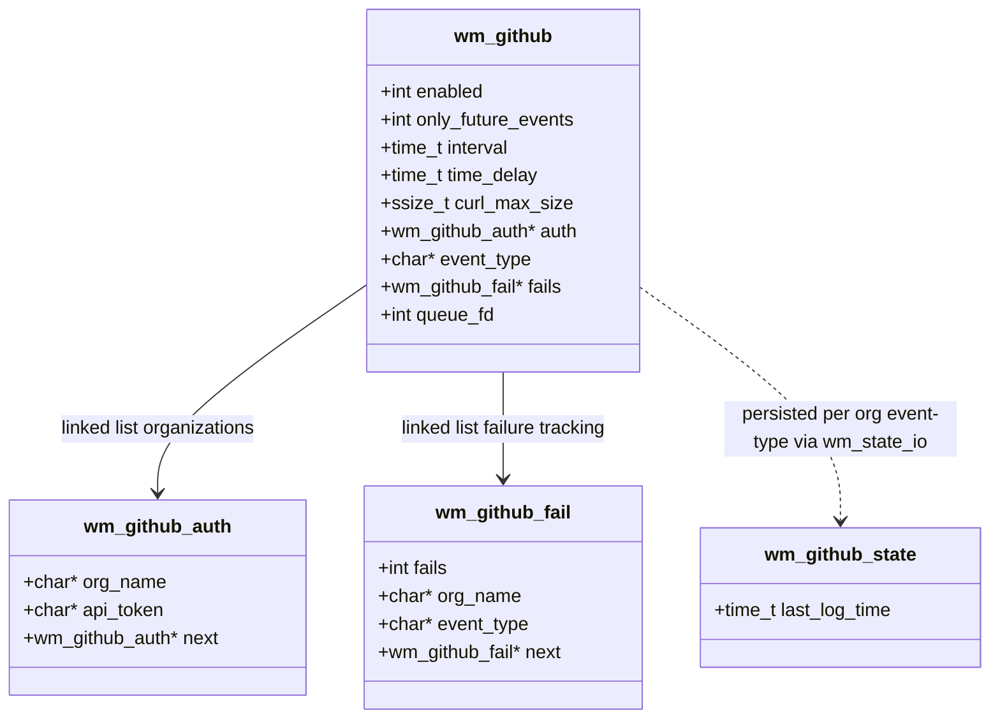
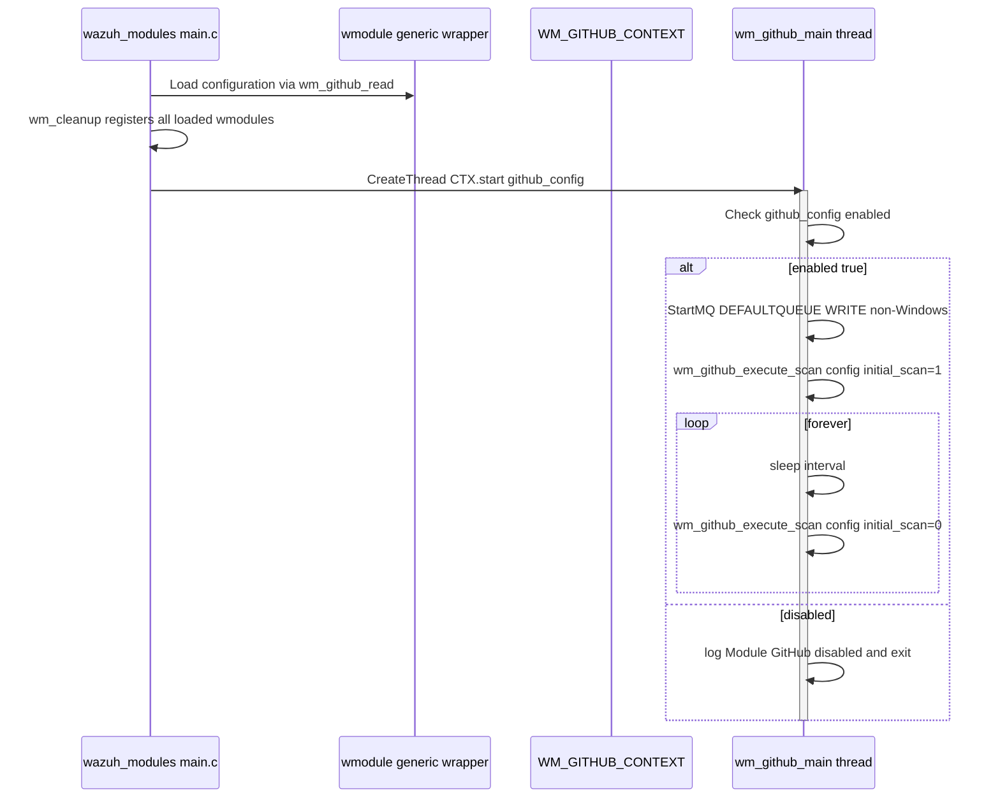
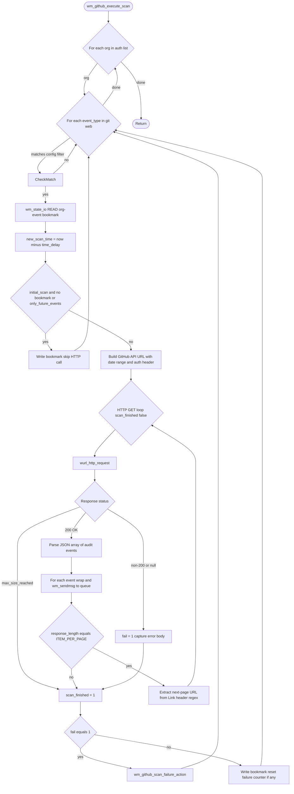
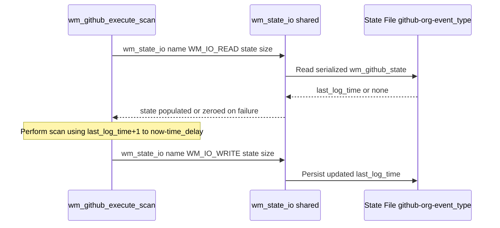
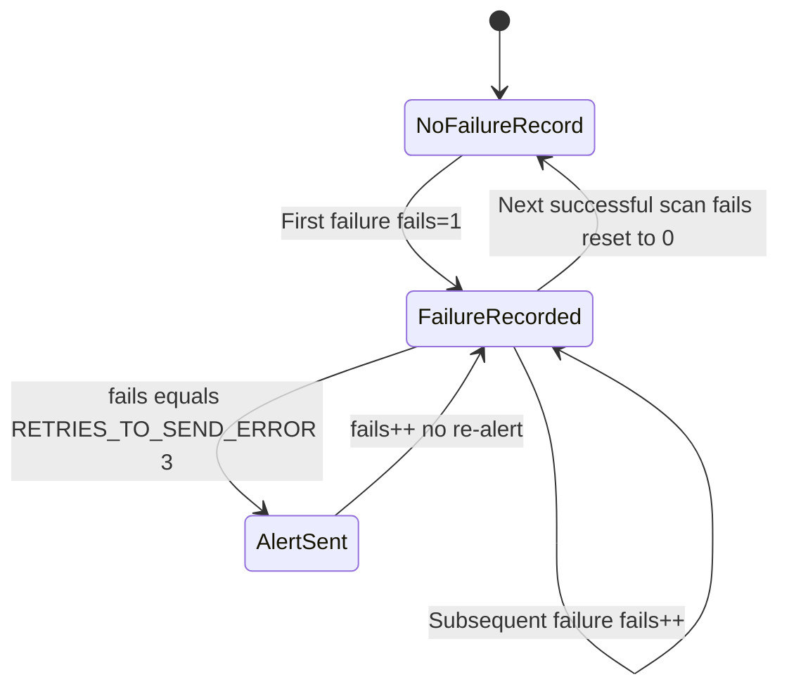
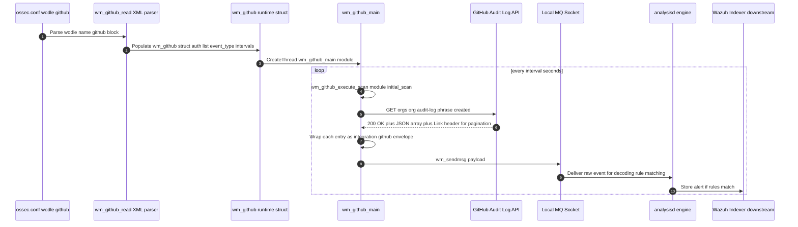

# Wazuh Modules Core — Cloud Integrations: GitHub

## Introduction

The **GitHub Integration Module** (`wm_github`) is a native C wodle (Wazuh module) embedded in the `wazuh-modulesd` daemon. It periodically polls the [GitHub Audit Log REST API](https://docs.github.com/en/organizations/keeping-your-organization-secure/reviewing-the-audit-log-for-your-organization) for one or more GitHub organizations, converts the retrieved audit events into Wazuh-formatted JSON messages, and forwards them to the local Wazuh queue (`ossec/queue/sockets/queue`) for ingestion, correlation, and alerting by the Wazuh analysis engine.

This module follows the same architectural pattern as its sibling cloud-integration modules (AWS, Azure, GCP, Office 365, MS Graph) that live under `wazuh_modules_core_cloud_integrations`. It is implemented entirely in C (unlike the Python-based `wodles/` cloud connectors), runs as a thread inside `wazuh-modulesd`, and is configured through the `<github>` block of `ossec.conf`.

---

## 1. Purpose and Core Functionality

| Capability | Description |
|---|---|
| **Multi-organization scanning** | Supports scanning an arbitrary number of GitHub organizations, each with its own API token (`wm_github_auth` linked list). |
| **Event type filtering** | Can restrict collection to `git` events, `web` events, or `all` (both), per the `event_type` configuration option. |
| **Incremental/bookmarked scanning** | Persists a per-organization, per-event-type timestamp bookmark (`wm_github_state`) via `wm_state_io`, so each scan only requests events created after the last successfully processed timestamp. |
| **Pagination handling** | Automatically follows GitHub's `Link` response header (`rel="next"`) to fetch multi-page audit log results using a configurable page size (`ITEM_PER_PAGE`). |
| **Failure tracking & alerting** | Tracks consecutive failures per organization/event-type pair (`wm_github_fail`) and emits an internal Wazuh alert once a configurable retry threshold (`RETRIES_TO_SEND_ERROR`) is reached. |
| **Size-bounded HTTP requests** | Uses `wurl_http_request` with a configurable maximum response size (`curl_max_size`) to avoid unbounded memory growth. |
| **Only-future-events mode** | On the first run, can be configured to skip historical data and start bookmarking from "now" (`only_future_events`). |

### Where it fits in the system



---

## 2. Component Architecture

### 2.1 Files and Core Components

| File | Core Components | Role |
|---|---|---|
| `src/wazuh_modules/wm_github.c` | `tm` (local `struct tm` usage for timestamp formatting) + module logic functions | Implements the module's runtime behavior: scanning loop, HTTP interaction, state persistence, failure handling |
| `src/wazuh_modules/wm_github.h` | `wm_github`, `wm_github_auth`, `wm_github_state` (+ `wm_github_fail`) | Defines the module's configuration and runtime data structures and default constants |

> The XML configuration parser (`wm_github_read`, declared in `wm_github.h`) is implemented in a separate compilation unit (not included in the core component set analyzed here) but is referenced as the entry point invoked by the main Wazuh configuration reader (`framework`/`src/config`) when parsing `<wodle name="github">` blocks.

### 2.2 Key Data Structures



- **`wm_github`**: The top-level module configuration/runtime context. One instance exists per `wazuh-modulesd` process; it is passed to `wm_github_main` as the thread argument and is registered globally through `WM_GITHUB_CONTEXT`.
- **`wm_github_auth`**: A linked list node representing one organization's credentials (`org_name` + `api_token`). Populated from the `<api_auth>` blocks in `ossec.conf`.
- **`wm_github_state`**: A small, serializable struct persisted to disk (via `wm_state_io`, defined in the `wazuh_modules_core_lifecycle` group) that stores the bookmark (`last_log_time`) for a specific `{organization, event_type}` pair. The state filename is built as `<module_name>-<org_name>-<event_type>`.
- **`wm_github_fail`**: A linked list node tracking consecutive scan failures for a given `{org_name, event_type}` pair, used to throttle/deduplicate failure alerts.

---

## 3. Module Lifecycle

### 3.1 Registration and Startup

The module exposes a `wm_context` structure (`WM_GITHUB_CONTEXT`) that plugs into the generic wodle framework defined in `wazuh_modules_core_lifecycle` (`src/wazuh_modules/wmodules_def.h`, `src/wazuh_modules/wmodules.c`, `src/wazuh_modules/main.c`):



- On **Windows**, `wm_github_main` is a `DWORD WINAPI` routine (matching the `wm_routine` thread signature used by the Windows thread pool); on POSIX systems, it is a plain `void*` thread function.
- The module connects to the local Wazuh queue socket using `StartMQ` (POSIX only — on Windows the queue write path goes through a different internal mechanism handled by `wm_sendmsg`).
- Under `WAZUH_UNIT_TESTING`, the infinite scanning loop is short-circuited after a single iteration (`break`) to make the routine testable.

### 3.2 Shutdown / Cleanup

`wm_github_destroy` is invoked by the generic wodle manager (`wm_destroy`, in `wazuh_modules_core_lifecycle`) during daemon shutdown. It:
1. Frees the `wm_github_auth` linked list (`wm_github_auth_destroy`).
2. Frees the `wm_github_fail` linked list (`wm_github_fail_destroy`).
3. Frees `event_type` and the top-level `wm_github` struct itself.

### 3.3 Configuration Dump

`wm_github_dump` produces a `cJSON` representation of the current configuration (used by the `GET /manager/config` / `GET /cluster/{node}/configuration` API endpoints exposed through `manager_module` and `cluster_api_controller`, and by the `wazuh-control status`/`getconfig` tooling). It serializes: `enabled`, `only_future_events`, `interval`, `time_delay`, `curl_max_size`, the `api_auth` array (org name/token pairs), and `event_type`.

---

## 4. Scan Execution Flow

The heart of the module is `wm_github_execute_scan`, invoked once per organization per scan cycle (initial scan + every `interval` seconds thereafter).



### 4.1 URL Construction

The GitHub Audit Log endpoint is built from the `GITHUB_API_URL` template:

```
https://api.github.com/orgs/%s/audit-log?phrase=created:%s..%s&include=%s&order=asc&per_page=%d
```

Parameters: organization name, last-scan ISO8601 timestamp, new-scan ISO8601 timestamp, event type (`git`/`web`), and page size (`ITEM_PER_PAGE = 100`).

### 4.2 Authentication

Each request carries an `Authorization: token <api_token>` HTTP header built per-organization from the corresponding `wm_github_auth` node.

### 4.3 Message Wrapping

Each individual audit log entry retrieved from GitHub is wrapped in a standard Wazuh integration envelope before being queued:

```json
{
  "integration": "github",
  "github": { "...original GitHub audit log entry..." }
}
```

This is sent via `wm_sendmsg` (shared helper in `wazuh_modules_core_lifecycle`) with a computed delay (`WM_GITHUB_MSG_DELAY = 1000000 / wm_max_eps`) to respect the configured events-per-second throttle.

### 4.4 Pagination

If the number of items returned equals `ITEM_PER_PAGE`, the module assumes there might be more results and extracts the "next" URL from the HTTP `Link` response header using the regex `GITHUB_NEXT_PAGE_REGEX = "<(\S+)>;\s*rel=\"next\""` via `wm_read_http_header_element` (a shared helper from `wazuh_modules_core_lifecycle`, `src/wazuh_modules/wmodules.c`). The loop continues until a short page is received or an error/size-limit occurs.

---

## 5. State Persistence and Bookmarking



- State filenames follow the pattern: `github-<org_name>-<event_type>` (built via `snprintf` with `WM_GITHUB_CONTEXT.name` as the module prefix).
- This ensures that scanning progress is independently tracked **per organization and per event type**, allowing partial failures in one org/event-type pair to not affect others.
- On the very first scan (`initial_scan == 1`) with no existing bookmark (or when `only_future_events` is enabled), the module writes an initial bookmark equal to `now - time_delay` **without** making an HTTP request, effectively "seeding" the state to avoid pulling all historical audit log data.

---

## 6. Failure Handling and Alerting



- `wm_github_get_fail_by_org_and_type` searches the `wm_github_fail` linked list for a matching `{org_name, event_type}` node.
- `wm_github_scan_failure_action` increments the failure counter; when it hits `RETRIES_TO_SEND_ERROR` (3), it constructs and sends an internal failure event to the Wazuh queue:

```json
{
  "integration": "github",
  "github": {
    "actor": "wazuh",
    "organization": "<org_name>",
    "event_type": "<event_type>",
    "response": "<original error body or 'Unknown error'>"
  }
}
```

- On the next successful scan for that org/event-type, the failure counter is reset to `0` and an info-level log ("connected successfully") is emitted.

---

## 7. Configuration Reference

Configured via the `<wodle name="github">` block in `ossec.conf` (parsed by `wm_github_read`, not included in the analyzed core components but declared in `wm_github.h`):

| Option | Field | Default | Description |
|---|---|---|---|
| `enabled` | `wm_github.enabled` | `1` (`WM_GITHUB_DEFAULT_ENABLED`) | Enables/disables the module |
| `only_future_events` | `wm_github.only_future_events` | `1` | Skip historical events on first run |
| `interval` | `wm_github.interval` | `60` (`WM_GITHUB_DEFAULT_INTERVAL`) | Seconds between scans |
| `time_delay` | `wm_github.time_delay` | `30` (`WM_GITHUB_DEFAULT_DELAY`) | Seconds subtracted from "now" as the scan window's upper bound (mitigates GitHub API eventual consistency) |
| `curl_max_size` | `wm_github.curl_max_size` | `1048576L` (`WM_GITHUB_DEFAULT_CURL_MAX_SIZE`) | Max HTTP response size in bytes |
| `event_type` | `wm_github.event_type` | — | `git`, `web`, or `all` |
| `<api_auth><org_name>` / `<api_token>` | `wm_github_auth` list | — | One block per organization to monitor |

---

## 8. Relationship to Other Modules

| Related Module | Relationship |
|---|---|
| [`wazuh_modules_core_cloud_integrations_aws`](wazuh_modules_core_cloud_integrations_aws.md) | Sibling native cloud-integration wodle; shares the same `wm_context` plug-in pattern |
| [`wazuh_modules_core_cloud_integrations_azure`](wazuh_modules_core_cloud_integrations_azure.md) | Sibling native cloud-integration wodle |
| [`wazuh_modules_core_cloud_integrations_gcp`](wazuh_modules_core_cloud_integrations_gcp.md) | Sibling native cloud-integration wodle |
| [`wazuh_modules_core_cloud_integrations_ms_graph`](wazuh_modules_core_cloud_integrations_ms_graph.md) | Sibling native cloud-integration wodle; also implements OAuth-token based scanning against a Microsoft cloud API, structurally similar (token refresh loop, per-resource bookmark) |
| [`wazuh_modules_core_cloud_integrations_office365`](wazuh_modules_core_cloud_integrations_office365.md) | Sibling native cloud-integration wodle for Office 365 Management Activity API |
| `wazuh_modules_core_lifecycle` | Provides the generic wodle plumbing this module depends on: `wmodule`/`wm_context` registration, `wm_destroy`, `wm_read_http_size`, `wm_validate_command`, and the `wm_exec`-based thread pool infrastructure |
| `Agent_&_Manager_Native_Daemons_(C)` → `shared_lib` | Supplies `url.c` (`wurl_http_request`, `wurl_free_response`), `mq_op.c` (`SendMSGtoSCK` used indirectly via `wm_sendmsg`), and `debug_op.c` logging macros (`mtinfo`, `mtdebug1`, `mterror`, etc.) used throughout this module |
| `wodles/aws`, `wodles/azure`, `wodles/gcloud` (Python) | Conceptually analogous cloud-log-ingestion connectors, but implemented as external Python scripts (`Wodles_-_Cloud_Integration_Services_(Python)`) rather than as in-process C wodles. GitHub does **not** have a Python-based wodle equivalent — it is implemented purely in C. |
| `framework/wazuh/manager.py` / `manager_module` | Exposes this module's configuration (via `wm_github_dump`) and status through the Wazuh REST API (`GET /manager/configuration`, `GET /manager/stats`) |
| `cluster_api_controller` | Exposes the same configuration/status data per cluster node |

---

## 9. Sequence: End-to-End Data Flow



---

## 10. Key Constants Summary

| Constant | Value | Purpose |
|---|---|---|
| `WM_GITHUB_LOGTAG` | `ARGV0 ":" GITHUB_WM_NAME` | Log tag prefix |
| `WM_GITHUB_DEFAULT_ENABLED` | `1` | Default enabled state |
| `WM_GITHUB_DEFAULT_ONLY_FUTURE_EVENTS` | `1` | Default only-future-events state |
| `WM_GITHUB_DEFAULT_INTERVAL` | `60` | Default scan interval (seconds) |
| `WM_GITHUB_DEFAULT_DELAY` | `30` | Default time delay (seconds) |
| `WM_GITHUB_MSG_DELAY` | `1000000 / wm_max_eps` | Micro-delay between queued messages (EPS throttling) |
| `WM_GITHUB_DEFAULT_CURL_MAX_SIZE` | `1048576L` | Default max HTTP response size (1 MB) |
| `WM_GITHUB_DEFAULT_CURL_REQUEST_TIMEOUT` | `60L` | HTTP request timeout (seconds) |
| `ITEM_PER_PAGE` | `100` | GitHub API page size |
| `RETRIES_TO_SEND_ERROR` | `3` | Consecutive-failure threshold before alerting |
| `GITHUB_NEXT_PAGE_REGEX` | `<(\S+)>;\s*rel="next"` | Regex to extract next-page URL from `Link` header |
| `GITHUB_API_URL` | see §4.1 | Audit log endpoint template |
| `EVENT_TYPE_ALL` / `EVENT_TYPE_GIT` / `EVENT_TYPE_WEB` | `"all"` / `"git"` / `"web"` | Supported event type filters |

---

## 11. Testing

Unit tests for this module live under `Unit_Tests_-_Wazuh_Modules_(Cloud_Misc)` → `github` (`src/unit_tests/wazuh_modules/github/test_wm_github.c`). They cover:
- Configuration reading/dumping (`test_read_configuration*`, `test_github_dump_*`)
- Interval parsing edge cases (`test_read_interval_d/h/m/s`)
- Scan execution and pagination (`test_github_execute_scan*`, `test_github_get_next_page_*`)
- Failure-action escalation (`test_github_scan_failure_action_1..4`, `_org_null`)
- Module enable/disable and `StartMQ` failure handling (`test_github_main_*`)

These tests rely on shared wrapper/mocks documented in `Unit_Test_Wrappers_&_Mocks` (notably `shared/url_wrappers.c` for mocking `curl` calls and `shared/mq_op_wrappers.c` for mocking queue sends).
