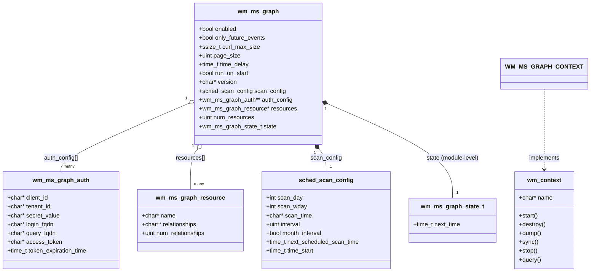
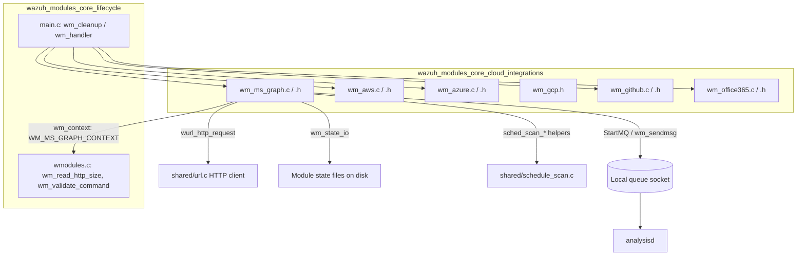
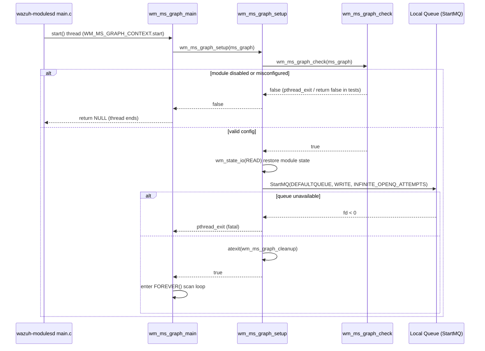
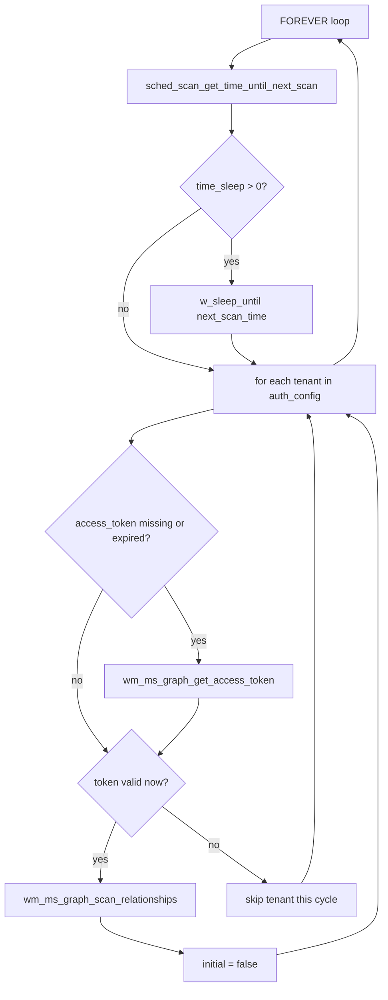
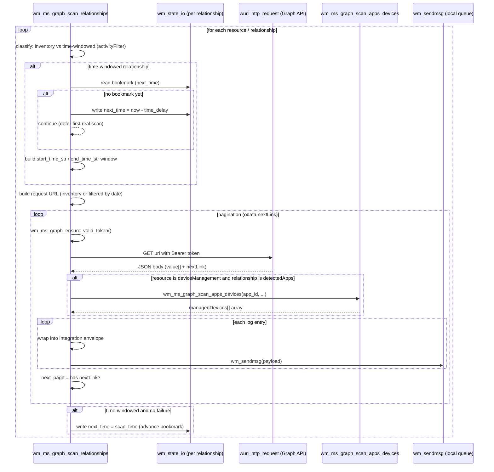

# Wazuh Modules Core – Cloud Integrations: Microsoft Graph (`wm_ms_graph`)

## Introduction

The **Microsoft Graph module** (`wm_ms_graph`) is a native Wazuh manager module, written in C, that integrates with the [Microsoft Graph API](https://learn.microsoft.com/en-us/graph/overview) to collect security and management telemetry from Microsoft 365 / Azure AD / Intune tenants. It periodically authenticates against Microsoft's OAuth2 endpoint, queries configured **resources** and their **relationships** (e.g. `deviceManagement/auditEvents`, `identityProtection/riskDetections`), and forwards each retrieved log entry to the Wazuh analysis pipeline via the local message queue.

This module is one of several **cloud integration wodles** that live inside the native `wazuh_modules` (`wmodules`) daemon alongside AWS, Azure, GCP, GitHub, and Office 365 integrations. It follows the same architectural pattern as its siblings: a `wm_context` descriptor registered with the generic Wazuh Modules daemon, a scheduling configuration, and a background thread that loops performing scan cycles.

This document covers:
1. Purpose and responsibilities of the module
2. Internal architecture and data structures
3. Runtime/process flow (authentication, pagination, event forwarding)
4. Integration points with the rest of the Wazuh Modules Daemon and shared subsystems
5. Relationships to sibling modules and other parts of the system

---

## 1. Purpose & Core Functionality

`wm_ms_graph` allows a Wazuh manager (or agent, on supported platforms) to:

- Authenticate to one or more Azure AD tenants via OAuth2 client-credentials flow (`WM_MS_GRAPH_ACCESS_TOKEN_URL`).
- Support all three Microsoft Graph API environments: **Global**, **GCC High**, and **DoD**, by selecting the appropriate login/query FQDNs.
- Query configurable **resources** (e.g. `deviceManagement`, `identityProtection`) and their **relationships** (sub-endpoints such as `auditEvents`, `riskDetections`, `detectedApps`, `managedDevices`).
- Distinguish between **inventory-style** relationships (no time-bookmarking, always full pull, e.g. `detectedApps`) and **event-style** relationships (time-windowed pulls using `createdDateTime`/`activityDateTime` filters and a persisted bookmark).
- Enrich `deviceManagement/detectedApps` entries with the associated `managedDevices` sub-collection via a secondary nested API call (`wm_ms_graph_scan_apps_devices`).
- Handle Microsoft Graph API pagination (`@odata.nextLink`) transparently.
- Refresh expired/soon-to-expire access tokens mid-scan without losing pagination state (`wm_ms_graph_ensure_valid_token`).
- Persist per-tenant/resource/relationship scan state (`wm_ms_graph_state_t`) to disk via `wm_state_io`, enabling resumable scans across daemon restarts.
- Forward each retrieved JSON log entry to the local Wazuh queue (`/queue/sockets/queue`) for ingestion by `analysisd`.
- Expose current configuration via `wm_ms_graph_dump` for the `GET /manager/configuration` / `GET /agents/:id/config` API endpoints.

## 2. Architecture

### 2.1 Component Overview

| File | Core Components | Responsibility |
|---|---|---|
| `src/wazuh_modules/wm_ms_graph.c` | `wm_ms_graph_main`, `wm_ms_graph_setup`, `wm_ms_graph_check`, `wm_ms_graph_get_access_token`, `wm_ms_graph_ensure_valid_token`, `wm_ms_graph_scan_relationships`, `wm_ms_graph_scan_apps_devices`, `wm_ms_graph_destroy`, `wm_ms_graph_cleanup`, `wm_ms_graph_dump` | Module lifecycle, HTTP calls, scan orchestration, event emission |
| `src/wazuh_modules/wm_ms_graph.h` | `wm_ms_graph`, `wm_ms_graph_auth`, `wm_ms_graph_resource`, `wm_ms_graph_state_t` | Configuration & runtime state data structures, API URL templates |

> Configuration XML parsing (`wm_ms_graph_read`) is declared in the header but implemented in a separate configuration-reader translation unit (not included in this component set); it populates the `wm_ms_graph` structure from `ossec.conf`.

### 2.2 Data Model

Notes:
- `wm_ms_graph_state_t` appears twice conceptually: once as the *module-level* "next scheduled scan" bookmark (`ms_graph->state`) persisted under the module name, and once **per tenant/resource/relationship** (`relationship_state_name = "wazuh-modulesd:ms-graph-<tenant>-<resource>-<relationship>"`), persisted separately via `wm_state_io`. This per-relationship granularity allows independent bookmarking of each Graph API pull.
- `wm_ms_graph_auth` supports **multiple tenants** simultaneously via a `NULL`-terminated array (`auth_config[]`), each with independent OAuth2 credentials and access tokens.

### 2.3 Position in the Wazuh Modules Daemon

The module registers itself through the `WM_MS_GRAPH_CONTEXT` (`wm_context`) structure — the same generic extension mechanism used by every wodle in [Wazuh_Modules_Daemon_(C)](Wazuh_Modules_Daemon_(C).md). The Wazuh Modules Daemon's `main.c` loads modules parsed from `ossec.conf` into a linked list of `wmodule` nodes and starts each one's `.start` routine (`wm_ms_graph_main`) as a POSIX thread.

For shared C infrastructure used by this module (queue push, string helpers, scheduling helpers, curl/URL wrapper), see:
- [Wazuh_Modules_Daemon_(C).md](Wazuh_Modules_Daemon_(C).md) – parent module tree, sibling cloud wodles (AWS, Azure, GCP, GitHub, Office365), generic module lifecycle.
- [Agent_&_Manager_Native_Daemons_(C).md](Agent_&_Manager_Native_Daemons_(C).md) – `shared/url.c` (`wurl_http_request`), `shared/mq_op.c`-based `wm_sendmsg`, `shared/schedule_scan.c`.

---

## 3. Process Flow

### 3.1 Module Startup

### 3.2 Main Scan Loop

For each scheduling tick (governed by `sched_scan_config`, supporting interval-based, daily, weekly, or monthly schedules — shared with other wodles via `sched_scan_get_time_until_next_scan`), the module iterates over every configured tenant (`auth_config[]`):

### 3.3 Access Token Retrieval

`wm_ms_graph_get_access_token` performs an HTTPS `POST` (client-credentials grant) to `WM_MS_GRAPH_ACCESS_TOKEN_URL` (`https://<login_fqdn>/<tenant_id>/oauth2/v2.0/token`), using `wurl_http_request` (shared URL/cURL wrapper). On success it parses `access_token` and `expires_in` from the JSON body and stores them in `wm_ms_graph_auth`. Failure modes (non-200 status, oversized response, malformed JSON, missing fields) are logged via `mtwarn`/`mterror` and leave the previous (possibly `NULL`) token untouched.

`wm_ms_graph_ensure_valid_token` is a defensive wrapper invoked immediately before each HTTP page-fetch during scanning: it treats a token as invalid if missing or expiring within `WM_MS_GRAPH_DEFAULT_TIMEOUT` (60s), triggers a renewal, and signals the caller (`token_changed`) so that the `Authorization` header can be rebuilt mid-pagination — this prevents long-running paginated scans from failing due to token expiry.

### 3.4 Relationship Scanning & Event Emission

Key behavioral details:
- **Inventory relationships** (e.g. `detectedApps` under `deviceManagement`) always perform a full pull each cycle — no time filter, no persisted bookmark — and each emitted event is stamped with a random `scan_id` shared across the whole scan cycle (mirrors syscollector/inventory-style modules elsewhere in the codebase).
- **Event relationships** use either `createdDateTime` or `activityDateTime` filters (`activityFilter` flag) depending on the resource/relationship, and advance a persisted `next_time` bookmark only if the entire paginated pull succeeded (`!fail`).
- On `initial_scan` with `only_future_events` enabled (or first-ever run), the module **seeds** the bookmark to "now minus `time_delay`" rather than scanning historical data, then defers actual log collection to the next cycle.
- Every emitted document has the structure `{"integration": "ms-graph", "ms-graph": {...fields..., "resource":..., "relationship":...}}`, forwarded to `analysisd` for parsing by the Wazuh ruleset/Engine decoders.

### 3.5 Shutdown & Introspection

- `wm_ms_graph_destroy` frees all dynamically allocated configuration (tenants, resources, relationships, version string) — invoked when the daemon reloads/unloads modules.
- `wm_ms_graph_cleanup` (registered via `atexit`) closes the message-queue socket and logs a shutdown message.
- `wm_ms_graph_dump` serializes the current configuration (including `secret_value` — the raw config as loaded) to `cJSON`, consumed by the manager/agent configuration API (see the framework's `GET /manager/configuration` handlers in `framework/wazuh/manager.py`, documented in the API module).

---

## 4. Integration Points

| Dependency | Direction | Purpose |
|---|---|---|
| `wm_context` / `wmodule` (`wmodules_def.h`) | Implements | Registers module lifecycle callbacks with the generic Wazuh Modules Daemon dispatcher |
| `sched_scan_config` (`schedule_scan.h`) | Uses | Shared cron-like scheduling (interval/day/week/month) reused by every wodle |
| `shared/mq_op.c` (`wm_sendmsg`) | Uses | Delivers each Graph API log entry into the local analysis queue |
| `shared/url.c` (`wurl_http_request`, `curl_response`) | Uses | Performs all outbound HTTPS calls (token + Graph API) with configurable `curl_max_size` guard |
| `wm_state_io` (module state persistence) | Uses | Persists per-tenant/resource/relationship scan bookmarks across restarts |
| `cJSON` | Uses | Parses Graph API JSON responses and builds outbound event payloads |
| `analysisd` (via queue) | Downstream consumer | Receives and decodes/normalizes the forwarded `ms-graph` events |
| Manager/Agent Configuration API (`framework/wazuh/manager.py`, `api/api/controllers/manager_controller.py`) | Downstream consumer | Surfaces `wm_ms_graph_dump()` output via REST API |

For the broader C daemon this module lives in, see **[Wazuh_Modules_Daemon_(C).md](Wazuh_Modules_Daemon_(C).md)**. For related cloud-integration siblings with near-identical architecture (OAuth2 + scheduled REST polling + queue forwarding), see the sibling module docs:
- `wazuh_modules_core_cloud_integrations_aws` (AWS S3/CloudWatch/Inspector polling)
- `wazuh_modules_core_cloud_integrations_azure` (Azure Storage/Log Analytics/Graph legacy)
- `wazuh_modules_core_cloud_integrations_office365` (Office 365 Management Activity API — structurally very close to this module, including the same `activity`/`created` time-window pattern and content-blob pagination concept)
- `wazuh_modules_core_cloud_integrations_github` (GitHub audit log polling)

For the generic shared C utilities used across all wodles (string/JSON/queue/network helpers), see **[Agent_&_Manager_Native_Daemons_(C).md](Agent_&_Manager_Native_Daemons_(C).md)** (`shared_lib_networking`, `shared_lib_logging`, `shared_lib_string_validation` subsections).

---

## 5. Configuration Summary

Configuration is declared in `ossec.conf` under `<ms-graph>` and parsed by `wm_ms_graph_read` (not included in this component set) into the `wm_ms_graph` structure. Key fields exposed via `wm_ms_graph_dump`:

| Field | Meaning |
|---|---|
| `enabled` | Master on/off switch |
| `only_future_events` | Skip historical backfill on first run |
| `curl_max_size` | Max HTTP response buffer (bytes) before aborting a request |
| `page_size` | `$top` page size sent to Graph API (`WM_MS_GRAPH_ITEM_PER_PAGE` default context) |
| `time_delay` | Seconds subtracted from "now" to define the scan window's end time (buffers for API log-availability latency) |
| `run_on_start` | Whether to scan immediately on daemon start vs. waiting for first scheduled tick |
| `version` | Graph API version segment (`v1.0`, `beta`, ...) |
| `api_auth[]` | One or more `{client_id, tenant_id, secret_value, api_type}` blocks (`api_type` in `global`/`gcc-high`/`dod`, mapping to distinct login/query FQDNs) |
| `resources[].relationships[]` | List of Graph resource/relationship pairs to poll (e.g. `deviceManagement`/`auditEvents`) |
| scheduling tags (`interval`, `day`, `wday`, `time`) | Standard shared scheduling block (`sched_scan_config`) |

## 6. Testing

Unit tests for this module reside in `src/unit_tests/wazuh_modules/ms_graph/test_wm_ms_graph.c` (see **wm_ms_graph_tests** in [Unit_Tests_-_Wazuh_Modules_(Cloud_Misc).md](Unit_Tests_-_Wazuh_Modules_(Cloud_Misc).md)), covering: configuration parsing edge cases, dump correctness for each API type, token acquisition/renewal (including mid-pagination renewal), and relationship scanning across initial/incremental/paginated/multi-resource scenarios.
