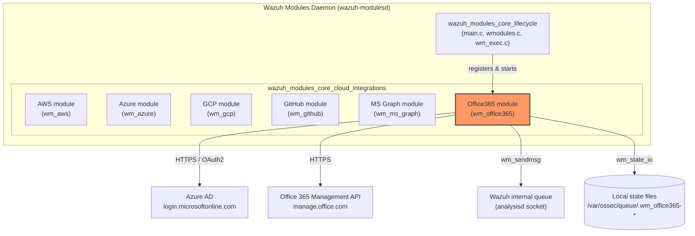
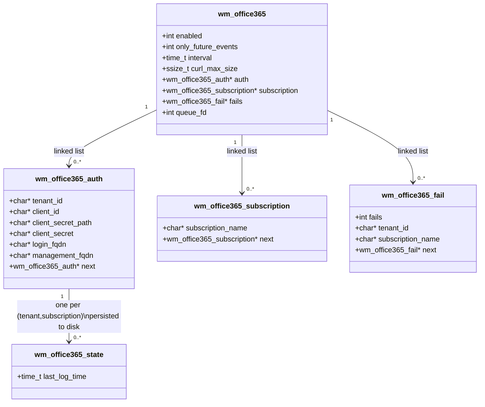
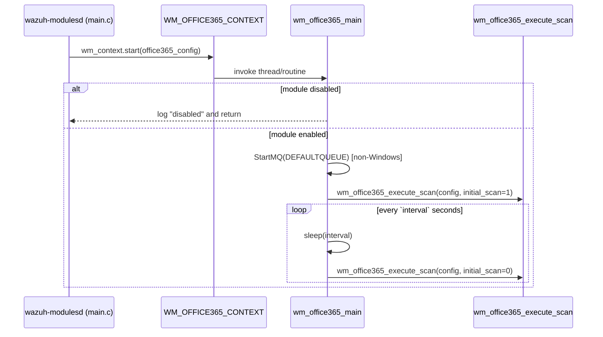
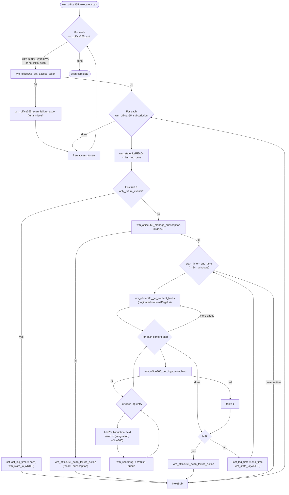
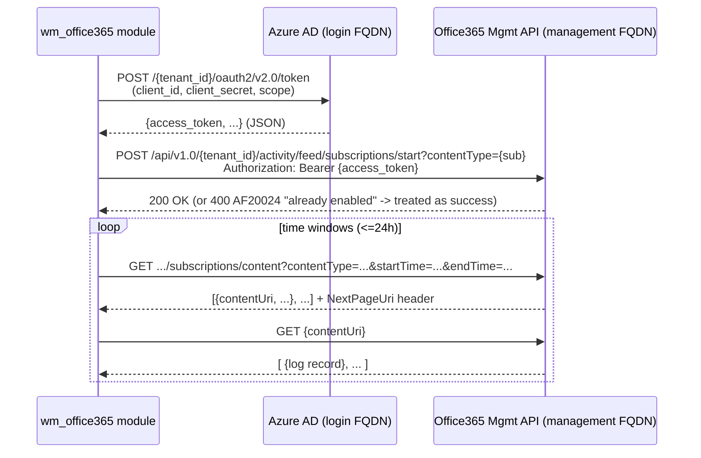
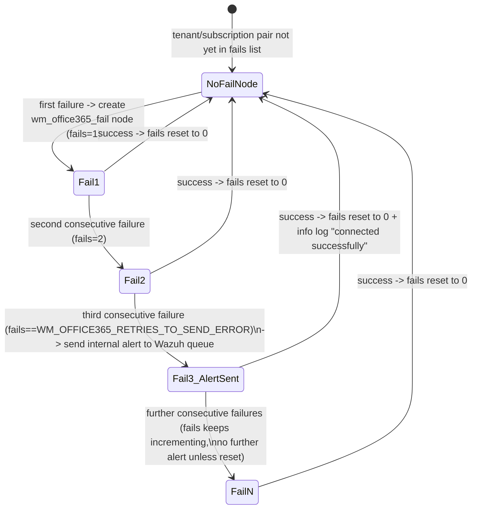

# Office365 Cloud Integration Module (`wazuh_modules_core_cloud_integrations_office365`)

## Introduction

The **Office365 module** is a native Wazuh module (written in C) that runs inside the `wazuh-modulesd` daemon and is responsible for pulling audit/activity logs from Microsoft's **Office 365 Management Activity API**. It authenticates against one or more Azure AD tenants, subscribes to the desired Office 365 audit content types (Exchange, SharePoint, Azure AD, DLP, etc.), periodically polls for new "content blobs," downloads the actual JSON log entries contained in those blobs, and forwards each log entry to the Wazuh analysis engine through the internal message queue.

This module is one of several **cloud log-collector integrations** that live side-by-side inside `wazuh-modulesd` (AWS, Azure, GCP, GitHub, Microsoft Graph, Office365). All of these modules share the same generic module lifecycle (`wm_context`, `wmodule`) and common infrastructure (HTTP client, message queue, state persistence) provided by the parent module.

This document focuses exclusively on the Office365-specific implementation found in:

- `src/wazuh_modules/wm_office365.c`
- `src/wazuh_modules/wm_office365.h`

For information about the generic module framework, the daemon lifecycle, and shared helpers (`wm_sendmsg`, `wm_state_io`, `wm_read_http_header_element`, `wmodule`/`wm_context`), see [wazuh_modules_core_lifecycle.md](wazuh_modules_core_lifecycle.md). For sibling cloud integrations, see [wazuh_modules_core_cloud_integrations_aws.md](wazuh_modules_core_cloud_integrations_aws.md), [wazuh_modules_core_cloud_integrations_azure.md](wazuh_modules_core_cloud_integrations_azure.md), [wazuh_modules_core_cloud_integrations_github.md](wazuh_modules_core_cloud_integrations_github.md), [wazuh_modules_core_cloud_integrations_ms_graph.md](wazuh_modules_core_cloud_integrations_ms_graph.md) and [wazuh_modules_core_cloud_integrations_gcp.md](wazuh_modules_core_cloud_integrations_gcp.md). Related Python-side collectors (used for other clouds, not Office365) live in [Wodles_-_Cloud_Integration_Services_(Python)](Wodles_-_Cloud_Integration_Services_(Python).md).

---

## 1. Purpose & Responsibilities

| Responsibility | Description |
|---|---|
| **Multi-tenant OAuth2 authentication** | Obtains an OAuth2 access token from Azure AD for each configured tenant/application (`wm_office365_get_access_token`). |
| **Subscription management** | Ensures the desired Office 365 audit content type subscription is active for each tenant before pulling data (`wm_office365_manage_subscription`). |
| **Content discovery (pagination)** | Lists available "content blobs" (batches of audit records) for a time window, following `NextPageUri` pagination headers (`wm_office365_get_content_blobs`). |
| **Log retrieval** | Downloads the actual JSON array of audit log records referenced by each content blob (`wm_office365_get_logs_from_blob`). |
| **Event forwarding** | Wraps each log record in a `{"integration":"office365","office365": {...}}` envelope and sends it to the Wazuh queue via `wm_sendmsg`. |
| **State/bookmark persistence** | Persists a `last_log_time` bookmark per tenant+subscription pair using `wm_state_io`, so that only new data is fetched between runs (and across daemon restarts). |
| **Failure tracking & alerting** | Tracks consecutive failures per tenant/subscription pair and emits an internal alert message to Wazuh after a threshold of retries (`wm_office365_scan_failure_action`). |
| **Configuration dump** | Exposes the effective configuration through `wm_office365_dump` for the `GET /manager/configuration` API and `agent_control`-style introspection. |

---

## 2. Position in the System



The module is compiled as part of `wazuh_modules_core` (the `wazuh-modulesd` binary). It is registered in the global module table (`wmodules_def.h::wmodule`) with the static context `WM_OFFICE365_CONTEXT`, and its configuration is parsed from `ossec.conf`/`agent.conf` via `wm_office365_read` (implemented in the corresponding config-reading `.c` file, not shown here, part of `Wmodules_Config`, see [Configuration_Data_Structures_(C_Headers)](Configuration_Data_Structures_(C_Headers).md)).

---

## 3. Data Model

### 3.1 Class / Struct Diagram



### 3.2 Key Fields

- **`wm_office365`** – top-level module configuration (singleton per module instance). Holds the polling `interval`, a per-request `curl_max_size` cap (to bound memory use of HTTP responses), and three linked lists: tenants (`auth`), subscribed content types (`subscription`), and the runtime failure tracker (`fails`).
- **`wm_office365_auth`** – one node per Azure AD **tenant** (multi-tenant support). Contains OAuth2 client credentials and both the *login* FQDN (`login.microsoftonline.com` / `.us` for GCC-High) and *management* FQDN (`manage.office.com`, `manage-gcc.office.com`, `manage.office365.us`) which together determine which Office365 API cloud (commercial / GCC / GCC-High) is targeted.
- **`wm_office365_subscription`** – one node per Office 365 **content type** to subscribe to (e.g., `Audit.Exchange`, `Audit.SharePoint`, `Audit.AzureActiveDirectory`, `Audit.General`, `DLP.All`). All configured subscriptions are polled for every configured tenant.
- **`wm_office365_state`** – ephemeral in-memory + on-disk structure (single `time_t`) representing the last successfully processed timestamp, persisted per `tenant-subscription` pair using the shared `wm_state_io` helper (state file name = `office365-<tenant_id>-<subscription_name>`).
- **`wm_office365_fail`** – runtime-only (not persisted) linked list used to count consecutive failures per tenant/subscription so that transient errors do not spam Wazuh with alerts; only after `WM_OFFICE365_RETRIES_TO_SEND_ERROR` (3) consecutive failures is an internal error event emitted.

---

## 4. Module Lifecycle



- On **Windows**, `wm_office365_main` runs as a `DWORD WINAPI` thread function (module threads on Windows use the Win32 threading API instead of POSIX threads).
- On **POSIX systems**, the module connects to the local Wazuh queue (`DEFAULTQUEUE`) using `StartMQ` before the first scan; on Windows the queue connection is handled elsewhere (via `wm_sendmsg`'s internal reconnect logic).
- `wm_office365_destroy` is invoked at daemon shutdown/reload to free all three linked lists (`auth`, `subscription`, `fails`).

---

## 5. Scan / Data-Flow Pipeline

The heart of the module is `wm_office365_execute_scan`, which performs a nested iteration: **for every tenant × for every subscription**, it manages the bookmark, ensures the subscription is active, and paginates through content blobs and their logs.



### Key implementation notes

- **Time windowing**: Each scan processes at most `DAY_SEC` (24h) per iteration to comply with Office 365 Management API constraints (error `AF20055` is raised by the API if the window exceeds 24h).
- **Pagination**: `wm_office365_get_content_blobs` extracts the `NextPageUri` value from the HTTP response headers using the regex `WM_OFFICE365_NEXT_PAGE_REGEX` via the shared `wm_read_http_header_element` helper.
- **Buffer-size protection**: All HTTP calls are made through `wurl_http_request` with a `curl_max_size` cap; if the response exceeds this size, `buffer_size_reached` is set and the failure is **not** counted as an API error (it is treated as a local configuration constraint rather than an Office365-side failure).
- **Idempotent bookmarks**: On the very first run (`initial_scan == 1`) with `only_future_events` enabled (default), the module does **not** fetch historical data — it simply bookmarks "now" and waits for the next interval, avoiding a potentially huge backfill.

---

## 6. Authentication & Subscription Management



- The client secret can be supplied either directly (`client_secret`) or via a file path (`client_secret_path`), which is read into a bounded buffer (`OS_SIZE_1024`) at token-request time — the secret is never persisted in memory longer than necessary for the request.
- Subscription "start" calls are **idempotent**: the Office365 API returns HTTP 400 with error code `AF20024` ("The subscription is already enabled") when a subscription already exists; the module treats this specific case as success (`OS_SUCCESS`) rather than an error.
- The **API flavor** (commercial / GCC / GCC-High) is entirely determined by which `management_fqdn`/`login_fqdn` pair is configured per tenant (`WM_OFFICE365_DEFAULT_API_MANAGEMENT_FQDN`, `WM_OFFICE365_GCC_API_MANAGEMENT_FQDN`, `WM_OFFICE365_GCC_HIGH_API_MANAGEMENT_FQDN`). `wm_office365_dump` reverse-maps the FQDN back to a human-readable `api_type` field for configuration introspection.

---

## 7. Failure Tracking & Alerting



- Failures are tracked **independently per (tenant_id, subscription_name) pair** — a `NULL` subscription name is used for tenant-level failures (e.g., token acquisition failures), which are distinct from per-subscription failures (e.g., subscription-start or content-fetch failures).
- Once the failure threshold (`WM_OFFICE365_RETRIES_TO_SEND_ERROR = 3`) is reached, an internal event is emitted through `wm_sendmsg` with the following shape:
  ```json
  {
    "integration": "office365",
    "office365": {
      "actor": "wazuh",
      "tenant_id": "...",
      "subscription_name": "...",
      "response": "<raw API error body or 'Unknown error'>"
    }
  }
  ```
  This allows Wazuh rules to alert operators about persistent connectivity or credential problems with a specific tenant/subscription.

---

## 8. Configuration Dump (`wm_office365_dump`)

`wm_office365_dump` serializes the effective in-memory configuration into a `cJSON` object consumed by the Wazuh Manager API (`GET /manager/configuration?section=office365`) and CLI tools. It reports:

- `enabled`, `only_future_events` (yes/no flags)
- `interval` (seconds) and `curl_max_size` (bytes)
- `api_auth[]` — array of tenant credential blocks, each annotated with a derived `api_type` (`commercial` / `gcc` / `gcc-high`) inferred from the configured management FQDN
- `subscriptions[]` — array of subscribed content type names

This dump function follows the same convention used by every other `wm_*_dump` function across the cloud integration modules (see sibling docs) and is registered in `WM_OFFICE365_CONTEXT.dump`.

---

## 9. Module Context Registration

```c
const wm_context WM_OFFICE365_CONTEXT = {
    .name  = OFFICE365_WM_NAME,
    .start = (wm_routine)wm_office365_main,
    .destroy = (void(*)(void *))wm_office365_destroy,
    .dump  = (cJSON * (*)(const void *))wm_office365_dump,
    .sync  = NULL,
    .stop  = NULL,
    .query = NULL,
};
```

This mirrors the generic `wm_context` contract defined in `wmodules_def.h` (see [wazuh_modules_core_lifecycle.md](wazuh_modules_core_lifecycle.md)). Office365 does not implement `sync`, `stop`, or `query` callbacks — it is a simple "start and loop forever" polling module with no on-demand query interface (unlike, e.g., `wm_control` or `wm_task_manager`, which expose local socket command dispatchers).

---

## 10. Relationship to Other Cloud Integration Modules

| Module | Auth mechanism | Data source | Distinguishing traits |
|---|---|---|---|
| **Office365** (this module) | OAuth2 client-credentials per tenant | Office 365 Management Activity API (blob + content URIs) | Explicit **subscription start/stop** lifecycle; per-tenant/subscription bookmarking; GCC/GCC-High/commercial cloud awareness |
| [Microsoft Graph](wazuh_modules_core_cloud_integrations_ms_graph.md) | OAuth2 client-credentials (shared pattern, different resource/scopes) | Microsoft Graph API relationships (e.g., signals, devices) | Token caching with expiry tracking (`ensure_valid_token`) |
| [Azure](wazuh_modules_core_cloud_integrations_azure.md) | Azure AD (Log Analytics/Graph) + Storage Account keys | Log Analytics, Azure Storage blobs, Graph | Three independent sub-services (`storage`, `log_analytics`, `graphs`) |
| [AWS](wazuh_modules_core_cloud_integrations_aws.md) | IAM access keys / roles | S3 buckets, CloudWatch, subscriber SQS/services | Bucket- and service-oriented plugin architecture |
| [GitHub](wazuh_modules_core_cloud_integrations_github.md) | Personal access token | GitHub audit log REST API | Simple cursor-based pagination |
| [GCP](wazuh_modules_core_cloud_integrations_gcp.md) | Service-account JSON credentials | GCS buckets / Pub/Sub | Bucket + Pub/Sub dual mode |

All modules share the same **queue-forwarding convention** (`wm_sendmsg` to the local Wazuh socket) and the same **state-persistence helper** (`wm_state_io`), which are part of the generic `wazuh_modules_core_lifecycle` infrastructure.

---

## 11. Testing

Unit tests for this module live under `src/unit_tests/wazuh_modules/office365/test_wm_office365.c` (see [Unit_Tests_-_Wazuh_Modules_(Cloud_Misc).md](Unit_Tests_-_Wazuh_Modules_(Cloud_Misc).md)) and exercise:

- Configuration parsing (`wm_office365_read`) — intervals in various units (`s`/`m`/`h`/`d`), `curl_max_size`, secret vs. secret-path mutual exclusion.
- `wm_office365_dump` output for both populated and empty auth/subscription lists.
- Access-token retrieval success/failure/timeout/oversized-response paths.
- Content-blob and log-blob retrieval, including the `AF20055` special-case and oversized-response handling.
- Subscription start success/`AF20024` idempotency handling.
- End-to-end `wm_office365_execute_scan` scenarios (initial scan with `only_future_events`, multi-page blob processing, failure-action escalation).

These tests rely on shared libc/network mocks documented in [Unit_Test_Wrappers_&_Mocks.md](Unit_Test_Wrappers_&_Mocks.md) (notably the cURL/URL wrappers and `wm_sendmsg`/`isDebug` wrappers).

---

## 12. Summary

The Office365 module is a self-contained, multi-tenant polling collector that bridges Microsoft's Office 365 Management Activity API and the Wazuh event pipeline. Its design emphasizes:

- **Resilience** — bounded HTTP buffers, per-entity failure counters, and threshold-based alerting instead of alert-storming on transient errors.
- **Efficiency** — bookmark-based incremental polling and an opt-out "future events only" mode to avoid expensive historical backfills.
- **Multi-cloud awareness** — first-class support for Microsoft's commercial, GCC, and GCC-High Office365 environments via configurable FQDNs.

It plugs into the broader `wazuh_modules_core_cloud_integrations` family documented in the sibling files linked above, all of which are orchestrated by the generic module lifecycle described in [wazuh_modules_core_lifecycle.md](wazuh_modules_core_lifecycle.md).
