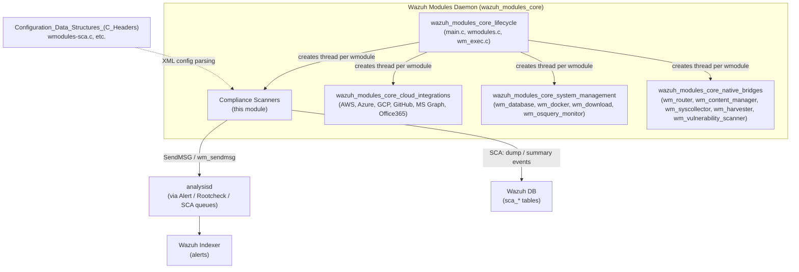
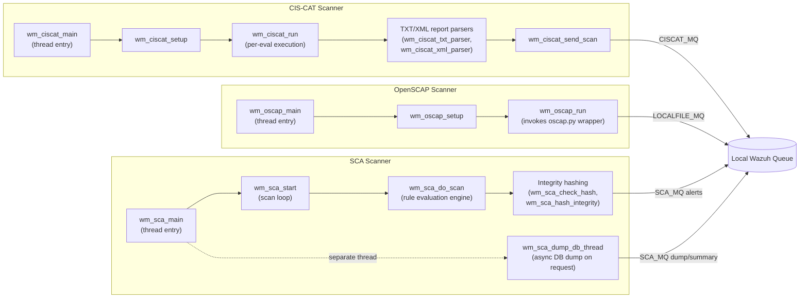
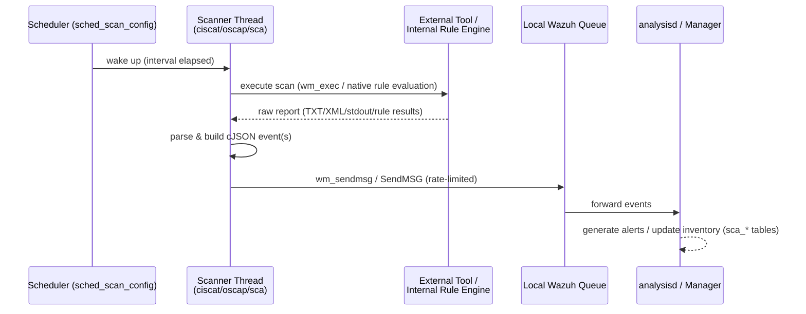

# Compliance Scanners Module (`wazuh_modules_core_compliance_scanners`)

## 1. Introduction and Purpose

The **Compliance Scanners** module groups together the three Wazuh agent/manager wodles (Wazuh Modules) that are responsible for **configuration and compliance assessment**:

| Scanner | Standard / Technology | Core File(s) |
|---|---|---|
| **CIS-CAT** | CIS Benchmarks (via the third-party CIS-CAT Pro/Assessor tool) | `wm_ciscat.c` / `wm_ciscat.h` |
| **OpenSCAP** | SCAP (XCCDF/OVAL) via the `oscap` command-line tool | `wm_oscap.c` / `wm_oscap.h` |
| **SCA** (Security Configuration Assessment) | Wazuh's native YAML-based policy engine | `wm_sca.c` / `wm_sca.h` |

All three scanners live inside the native **Wazuh Modules Daemon** (`wazuh_modules_core`, C language) and share the same architectural pattern used by every wodle in that daemon: they are registered as a `wm_context`, run on a dedicated thread spawned by `wmodules.c`, and communicate results to the rest of Wazuh through the analysis queue (`SendMSG`/`wm_sendmsg`) or (for SCA) directly to the manager via alerts and dump/sync events.

Despite being organizationally grouped in one module, **each scanner is functionally independent** — they do not call each other's code, only share the generic wodle infrastructure (`wmodules.h`, `wm_exec`, `sched_scan_config`, etc.) documented in [wazuh_modules_core_lifecycle.md](wazuh_modules_core_lifecycle.md).

## 2. Role in the Overall System

* **Trigger**: Each scanner is scheduled via the shared `sched_scan_config` mechanism (interval/day/time based), configured in `ossec.conf`/`agent.conf` and parsed by the corresponding `wm_*_read` functions (declared in the headers but implemented in separate config-reading files, not shown here).
* **Execution**: Runs on its own thread (`wm_ciscat_main`, `wm_oscap_main`, `wm_sca_main`), started by the generic wodle dispatcher in `main.c`/`wmodules.c` (see [wazuh_modules_core_lifecycle.md](wazuh_modules_core_lifecycle.md)).
* **Output**: Results are converted into JSON events and sent to the local `ossec` queue, from which `analysisd` (or the manager, for agents) picks them up, generating alerts and inventory data that eventually reach the Wazuh Indexer.
* **Dependencies**: All three scanners rely on generic wodle helpers such as `wm_exec` (process execution with timeout), `wm_sendmsg`/`SendMSG` (queue I/O), `sched_scan_config` (scheduling), and `OS_XML`/`cJSON` for parsing — all part of [wazuh_modules_core_lifecycle.md](wazuh_modules_core_lifecycle.md) and the [Shared_Modules_Infrastructure_(C++)](shared_utils.md) / [Agent_&_Manager_Native_Daemons_(C)](shared_lib_logging.md) ecosystem.

## 3. Architecture Overview

### Common design pattern

Each scanner file follows the same structure mandated by the wodle framework:

1. **`wm_context` definition** – exposes `start`, `destroy`, `dump` (config introspection), `sync`, `stop`, `query` function pointers, registered globally so the daemon can manage the module generically.
2. **Main thread function** (`wm_*_main`) – performs one-time setup (`wm_*_setup`), then loops forever using `sched_scan_get_time_until_next_scan` / `w_sleep_until` to respect the configured schedule.
3. **Execution routine** (`wm_*_run` / `wm_sca_start`) – invokes the external tool (CIS-CAT Java tool, `oscap` binary) or, for SCA, evaluates YAML policy rules natively in C.
4. **Result parsing & event building** – converts raw tool output (text/XML for CIS-CAT, plain text for OpenSCAP, structured cJSON for SCA) into normalized JSON events.
5. **Event dispatch** – sends events to the local Wazuh queue with rate limiting (`wm_max_eps`) via `wm_sendmsg`/`SendMSG`.
6. **`wm_*_dump`** – serializes the current configuration back to JSON for the `GET /manager/configuration` and `GET /agents/:id/config` API endpoints.
7. **`wm_*_destroy`** – frees all dynamically allocated configuration structures when the module is unloaded.

## 4. Sub-Modules

This module is split into three independent sub-module documents, one per scanner, since each represents a self-contained scanning engine with its own execution/parsing/reporting pipeline:

| Sub-module | Description | Documentation |
|---|---|---|
| **CIS-CAT Scanner** | Wraps the third-party CIS-CAT Pro/Assessor Java tool, parses its TXT/XML reports, and reports benchmark rule pass/fail results. | [wazuh_modules_core_compliance_scanners_ciscat.md](wazuh_modules_core_compliance_scanners_ciscat.md) |
| **OpenSCAP Scanner** | Wraps the `oscap` CLI tool (through a Python helper script) to run XCCDF/OVAL/Datastream content and stream raw results to the log collector queue. | [wazuh_modules_core_compliance_scanners_oscap.md](wazuh_modules_core_compliance_scanners_oscap.md) |
| **SCA (Security Configuration Assessment)** | Wazuh's native compliance engine: parses YAML policy files, evaluates file/registry/process/command/directory rules with an internal condition/regex engine, computes integrity hashes, and supports on-demand DB dump/sync with the manager. | [wazuh_modules_core_compliance_scanners_sca.md](wazuh_modules_core_compliance_scanners_sca.md) |

## 5. Data Flow Summary

## 6. Related Modules

- [wazuh_modules_core_lifecycle.md](wazuh_modules_core_lifecycle.md) — generic wodle daemon startup, `wm_exec`, `wm_sendmsg`, module registry (`wmodules_def.h`).
- [wazuh_modules_core_cloud_integrations.md](wazuh_modules_core_cloud_integrations.md) — sibling wodles for cloud log collection (AWS/Azure/GCP/etc.), sharing the same threading model.
- [wazuh_modules_core_system_management.md](wazuh_modules_core_system_management.md) — sibling wodles for local system/DB housekeeping (`wm_database`, `wm_docker`, `wm_download`, `wm_osquery_monitor`).
- [wazuh_modules_core_native_bridges.md](wazuh_modules_core_native_bridges.md) — sibling wodles bridging to C++ shared modules (Router, Content Manager, Syscollector, Vulnerability Scanner).
- **API layer**: `GET /sca/{agent_id}` and `GET /sca/{agent_id}/checks/{policy_id}` (`sca_module.md` in the API & Management Framework) expose SCA results collected by this module through Wazuh DB.
- **Configuration parsing**: `wmodules-sca.c` in [Configuration_Data_Structures_(C_Headers)](Wmodules_Config.md) parses the `<sca>` XML block into the `wm_sca_t` structure used here.
