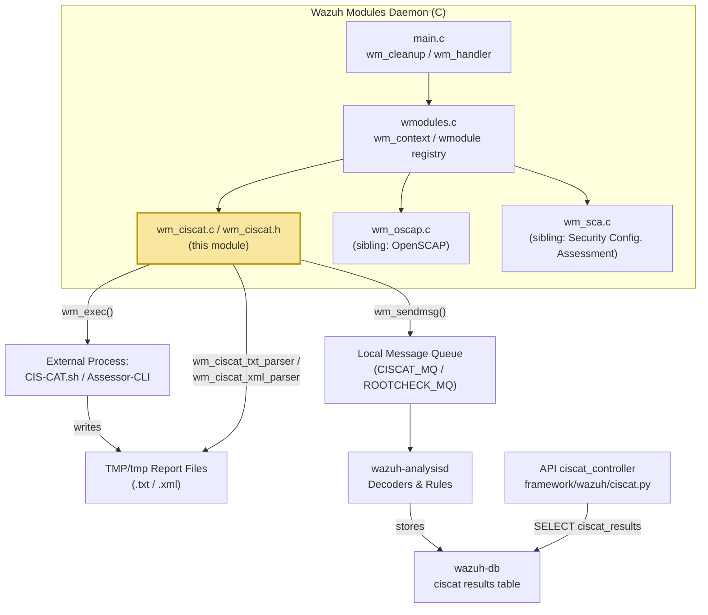
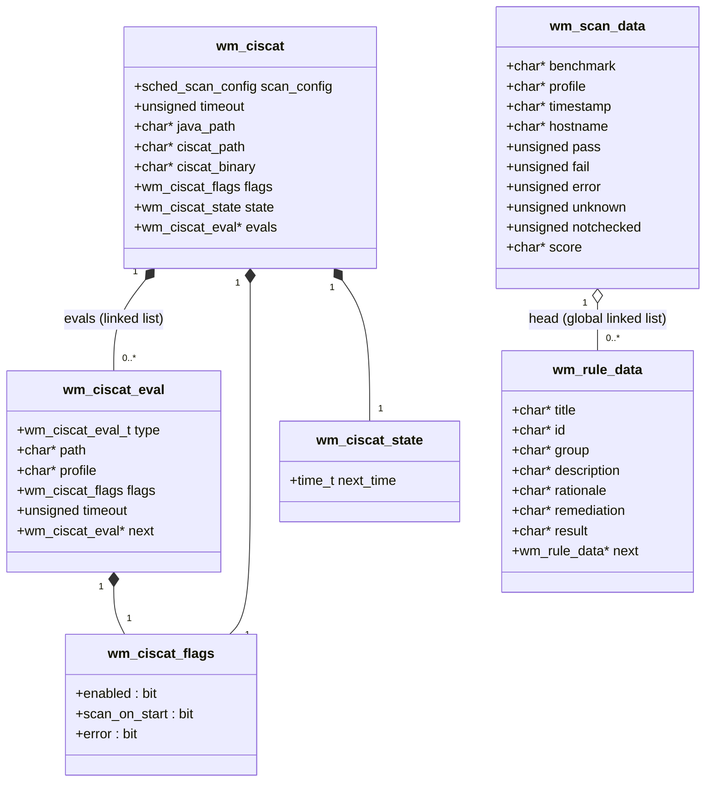
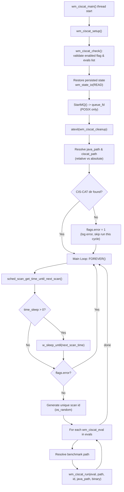
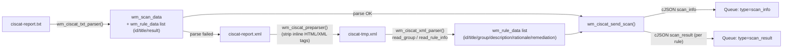

# CIS-CAT Compliance Scanner Module (`wazuh_modules_core_compliance_scanners_ciscat`)

## Introduction

The **CIS-CAT Compliance Scanner Module** is the Wazuh agent/manager component responsible for
integrating the **CIS-CAT Pro** (Center for Internet Security Configuration Assessment Tool)
into the Wazuh Modules Daemon (`wazuh-modulesd`). It is a native C module, compiled only when
`ENABLE_CISCAT` is defined, that periodically launches the external CIS-CAT Java tool against one
or more XCCDF benchmarks, parses the resulting text/XML reports, and forwards the compliance
results as JSON events to the Wazuh analysis pipeline.

This module lives inside the broader **Wazuh Modules Daemon (C)** subsystem, alongside its sibling
compliance scanners `wazuh_modules_core_compliance_scanners_oscap` and
`wazuh_modules_core_compliance_scanners_sca` — see
[wazuh_modules_daemon.md](wazuh_modules_daemon.md) for the parent module documentation and the
generic `wmodule`/`wm_context` plugin framework that hosts it.

## Purpose & Responsibilities

- Launch the CIS-CAT Pro assessor (v3 `CIS-CAT.sh`/`CIS-CAT.BAT` or v4
  `Assessor-CLI.sh`/`Assessor-CLI.bat`) against configured XCCDF benchmark files.
- Manage cross-platform execution differences (Windows vs. Unix), including path resolution,
  process forking, timeouts, and privilege handling.
- Parse the tool's generated **TXT** report (fast path) or, if that fails, pre-process and parse
  the **XML** report (rich path, providing description/rationale/remediation text per rule).
- Translate parsed results into two categories of JSON events — `scan_info` (summary) and
  `scan_result` (per-rule) — and publish them to the local message queue for consumption by
  `wazuh-analysisd`.
- Respect the module's configured schedule (interval, day/time based) via the shared
  `sched_scan_config` scheduling helper used across all wodles.
- Expose current configuration via `wm_ciscat_dump` for the `GET /manager|agents/.../config`
  API endpoints, and clean up gracefully on module shutdown.

## Relationship to the Rest of the System



For the API-facing read path of CIS-CAT results (`GET /experimental/ciscat/results`,
`framework/wazuh/ciscat.py`), see the `ciscat_module` group inside
[api_management_framework.md](api_management_framework.md). For the generic queue/socket
primitives (`wm_sendmsg`, `StartMQ`) shared by all wodles, see
[shared_lib.md](shared_lib.md) (`src/shared/mq_op.c`).

## Core Components

| Component | File | Description |
|---|---|---|
| `WM_CISCAT_CONTEXT` | `wm_ciscat.c` | `wm_context` descriptor registering the module (`name="cis-cat"`, `start`, `destroy`, `dump`) with the generic wodle framework. |
| `wm_ciscat_main` | `wm_ciscat.c` | Thread entry point (`DWORD WINAPI` on Windows / `void*` on POSIX). Runs the infinite scheduling loop. |
| `wm_ciscat_setup` | `wm_ciscat.c` | One-time setup: validates config (`wm_ciscat_check`), restores persisted state, opens the message queue, registers `atexit` cleanup. |
| `wm_ciscat_run` | `wm_ciscat.c` | Builds and executes the CIS-CAT command line for a single `wm_ciscat_eval`, waits for completion, and triggers report parsing. |
| `wm_ciscat_cleanup` | `wm_ciscat.c` | POSIX-only cleanup callback (closes the queue file descriptor) registered via `atexit`. |
| `wm_ciscat_txt_parser` / `wm_ciscat_xml_parser` | `wm_ciscat.c` | Parse the two possible report formats into `wm_scan_data` / `wm_rule_data` structures. |
| `wm_ciscat_send_scan` | `wm_ciscat.c` | Serializes parsed results into `scan_info` / `scan_result` cJSON events and publishes them. |
| `wm_ciscat_dump` | `wm_ciscat.c` | Serializes the live configuration to cJSON for API/CLI introspection. |
| `wm_ciscat_destroy` | `wm_ciscat.c` | Frees the `wm_ciscat` configuration tree (evals list + strings). |
| `wm_ciscat` | `wm_ciscat.h` | Root configuration/state struct for the module (paths, binary name, timeout, evals list, `wm_ciscat_state`). |
| `wm_ciscat_eval` | `wm_ciscat.h` | Linked-list node describing one benchmark to evaluate (path, profile, type, per-eval timeout/flags). |
| `wm_ciscat_flags` | `wm_ciscat.h` | Bitfield: `enabled`, `scan_on_start`, `error`. |
| `wm_ciscat_state` | `wm_ciscat.h` | Persisted state (`next_time`) used to resume scheduling across restarts. |
| `wm_scan_data` | `wm_ciscat.h` | Aggregated scan summary (benchmark, profile, hostname, timestamp, pass/fail/error/unknown/notchecked counts, score). |
| `wm_rule_data` | `wm_ciscat.h` | Linked-list node with per-rule compliance detail (id, title, group, description, rationale, remediation, result). |

## Data Model (Class Diagram)



`wm_ciscat_eval_t` is a simple enum distinguishing `WM_CISCAT_XCCDF` (supported) from
`WM_CISCAT_OVAL` (rejected at runtime with an error, since CIS-CAT only evaluates XCCDF content).

## Module Lifecycle / Process Flow



### `wm_ciscat_run` Execution Detail

```mermaid
sequenceDiagram
    participant Loop as wm_ciscat_main loop
    participant Run as wm_ciscat_run()
    participant Queue as Message Queue
    participant Child as CIS-CAT Process
    participant Parser as TXT/XML Parser

    Loop->>Run: wm_ciscat_run(eval, path, id, java_path, binary)
    Run->>Run: Build command line (-b path -p profile -r/-rd reports -x/-txt ...)
    Run->>Queue: SendMSG("Starting CIS-CAT scan...", ROOTCHECK_MQ)
    Run->>Child: wm_exec(command, timeout, java_path)
    alt Success (status == 0)
        Child-->>Run: exit code 0
    else Timeout
        Child-->>Run: WM_ERROR_TIMEOUT
        Run->>Run: flags.error = 1
    else Execution error
        Child-->>Run: status != 0
        Run->>Run: flags.error = 1 (log OUTPUT)
    end
    Run->>Parser: wm_ciscat_txt_parser()
    alt TXT parse OK
        Parser-->>Run: wm_scan_data + wm_rule_data list
    else TXT parse failed (flags.error)
        Run->>Parser: wm_ciscat_preparser() (strip tags)
        Run->>Parser: wm_ciscat_xml_parser() (read_group/read_rule_info)
        Parser-->>Run: wm_rule_data list (head)
    end
    Run->>Run: wm_ciscat_send_scan(scan_info, id)
    Run->>Queue: SendMSG("Ending CIS-CAT scan...", ROOTCHECK_MQ)
```

## Report Parsing Pipeline

CIS-CAT can emit two report formats; the module prefers the lightweight TXT report and only
falls back to the richer (but slower/fragile) XML report when the TXT parse fails:



Key parsing helpers:
- **`wm_ciscat_get_profile`** — extracts the evaluated profile name from the XML report when
  none was explicitly configured (`<Profile id=...>` / `<xccdf:Profile id=...>`).
- **`wm_ciscat_txt_parser`** — line-oriented state machine reading benchmark name, hostname,
  timestamp, pass/fail/error/unknown/notchecked counts, score, and per-rule result lines.
- **`wm_ciscat_preparser`** — a lightweight streaming pre-processor that inlines multi-line
  `<description>`, `<rationale>`, and `<fixtext>` blocks (also handling the `xccdf:` prefixed
  variants) into single lines, using `wm_ciscat_remove_tags` to strip embedded markup.
- **`wm_ciscat_xml_parser` / `read_group` / `read_rule_info`** — recursive XML tree walkers
  (built on `OS_XML`) that populate the `wm_rule_data` linked list with full compliance
  narrative text per rule.

## Event Output

Two JSON event types are emitted per scan, both wrapped in a `"cis"` object and tagged with the
shared `scan_id`:

| Type | Fields | Purpose |
|---|---|---|
| `scan_info` | `benchmark`, `profile`, `hostname`, `timestamp`, `pass`, `fail`, `error`, `unknown`, `notchecked`, `score` | One summary event per completed evaluation. |
| `scan_result` | `rule_id`, `rule_title`, `group`, `description`, `rationale`, `remediation`, `result` | One event per assessed rule (streamed until the `wm_rule_data` list is exhausted). |

Events are rate-limited via `wm_max_eps` and delivered through `wm_sendmsg()` to `CISCAT_MQ`
(module events). A companion plain-text `rootcheck` message marks the start/end of each scan
(`SendMSG(..., "rootcheck", ROOTCHECK_MQ)`), matching the historical Wazuh convention for
wodle activity notifications.

Downstream, `wazuh-analysisd` decodes these events and `wazuh-db` persists them for retrieval
through the REST API (`GET /experimental/ciscat/results`, see `ciscat_module` in
[api_management_framework.md](api_management_framework.md)).

## Platform-Specific Behavior

The module contains parallel Windows and POSIX implementations for process execution:

- **Windows** (`#ifdef WIN32`): resolves `GetCurrentDirectory`, builds a single-line command
  string, and executes it synchronously via `wm_exec` (no fork). Sends messages via
  `wm_sendmsg(usec, 0, ...)` (socket-based, no persistent `queue_fd`).
- **POSIX**: uses `fork()`/`setsid()`/`waitpid()` with `wm_append_sid`/`wm_remove_sid`
  bookkeeping (see `wm_exec.c` in the parent [wazuh_modules_daemon.md](wazuh_modules_daemon.md)),
  and maintains a persistent `queue_fd` opened once in `wm_ciscat_setup` via `StartMQ`.

Both variants support two binary generations:
- **CIS-CAT Pro v3** (`CIS-CAT.sh` / `CIS-CAT.BAT`): flags `-a -r <dir> -rn ciscat-report -x -t -n -y`.
- **CIS-CAT Pro v4** (`Assessor-CLI.sh` / `Assessor-CLI.bat`): flags
  `-rd <dir> -rp ciscat-report -nts -txt`.

## Configuration

Configuration is parsed elsewhere (declared as `wm_ciscat_read(...)` in `wm_ciscat.h`, part of
the shared `<wodle name="cis-cat">` XML block handled by the configuration subsystem — see
[configuration_data_structures.md](configuration_data_structures.md), `Wmodules_Config` group,
for the generic wodle XML parsing conventions). Relevant tags map directly to `wm_ciscat` /
`wm_ciscat_eval` fields:

| XML Tag | Struct Field | Notes |
|---|---|---|
| `<disabled>` | `flags.enabled` | Inverted boolean. |
| `<scan-on-start>` | `flags.scan_on_start` | Run immediately on module start. |
| `<java_path>` | `java_path` | Prepended to `PATH` for `wm_exec`. |
| `<ciscat_path>` | `ciscat_path` | Root install directory of CIS-CAT. |
| `<ciscat_binary>` (implicit via constants) | `ciscat_binary` | One of the 4 supported binary names. |
| `<timeout>` | `timeout` (default) / per-eval override | Falls back to `WM_DEF_TIMEOUT`. |
| `<content type="xccdf" path="..." profile="...">` | `wm_ciscat_eval` node | One node per benchmark; `type="oval"` is rejected at runtime. |
| Scheduling tags (`<interval>`, `<day>`, `<wday>`, `<time>`) | `scan_config` | Delegated to the shared `sched_scan_config` scheduler used by all wodles. |

`wm_ciscat_dump` exposes this same configuration back out as JSON, consumed by
`GET /manager/configuration?section=wmodules` and equivalent agent endpoints
(`manager_module` / `agent_module` groups in
[api_management_framework.md](api_management_framework.md)).

## Persisted State

`wm_ciscat_state.next_time` is loaded/saved through the generic `wm_state_io` helper
(shared across all wodles) so that scheduling survives daemon restarts — mirroring the pattern
used by sibling modules `wm_oscap` and `wm_sca`.

## Error Handling Summary

| Condition | Behavior |
|---|---|
| Module disabled (`flags.enabled == 0`) | `wm_ciscat_check` calls `pthread_exit` immediately. |
| No `<content>` evals configured | `wm_ciscat_check` logs a warning and exits the thread. |
| CIS-CAT install directory not found | `flags.error = 1`; subsequent scan cycles are skipped until fixed (module keeps sleeping/rescheduling). |
| `type="oval"` content | Logged as an invalid content type; that thread exits (Windows) / eval is skipped (POSIX `flags.error`). |
| `wm_exec` timeout | `WM_ERROR_TIMEOUT` → `flags.error = 1`, no report parsing attempted. |
| TXT parse failure | Falls back automatically to `wm_ciscat_preparser` + `wm_ciscat_xml_parser`. |
| XML parse failure (malformed report) | Logged via `mterror`, function returns early without sending events. |

## Related Documentation

- [wazuh_modules_daemon.md](wazuh_modules_daemon.md) — parent `wazuh_modules_core` daemon,
  generic `wmodule`/`wm_context` plugin architecture, `wm_exec`, and lifecycle management shared
  by every wodle including this one.
- Sibling compliance scanners (same parent group `wazuh_modules_core_compliance_scanners`):
  `wm_oscap.c` (OpenSCAP) and `wm_sca.c` (Security Configuration Assessment) — structurally
  analogous modules (scheduling loop, external tool execution, report parsing, JSON event
  emission).
- [api_management_framework.md](api_management_framework.md) — `ciscat_module` group
  (`api/api/controllers/ciscat_controller.py`, `framework/wazuh/ciscat.py`) exposing scan results
  stored by `wazuh-db` to REST API consumers, plus `manager_module`/`agent_module` for
  configuration retrieval endpoints that surface `wm_ciscat_dump` output.
- [shared_lib.md](shared_lib.md) — `mq_op.c` (`SendMSG`, `StartMQ`) and process-execution
  primitives (`wm_exec` internals) used to talk to the queue and spawn the external Java tool.
- [wazuh_db.md](wazuh_db.md) — persistence layer that ultimately stores decoded CIS-CAT
  `scan_info`/`scan_result` events for API retrieval.
