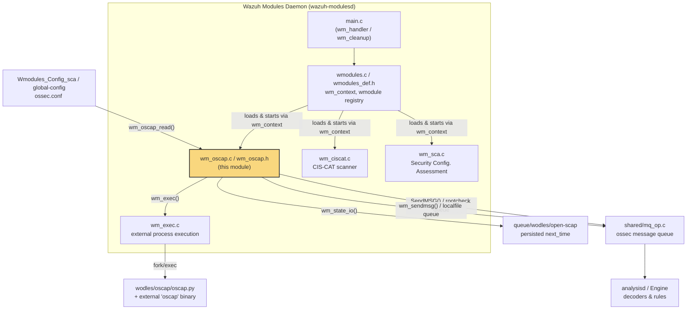
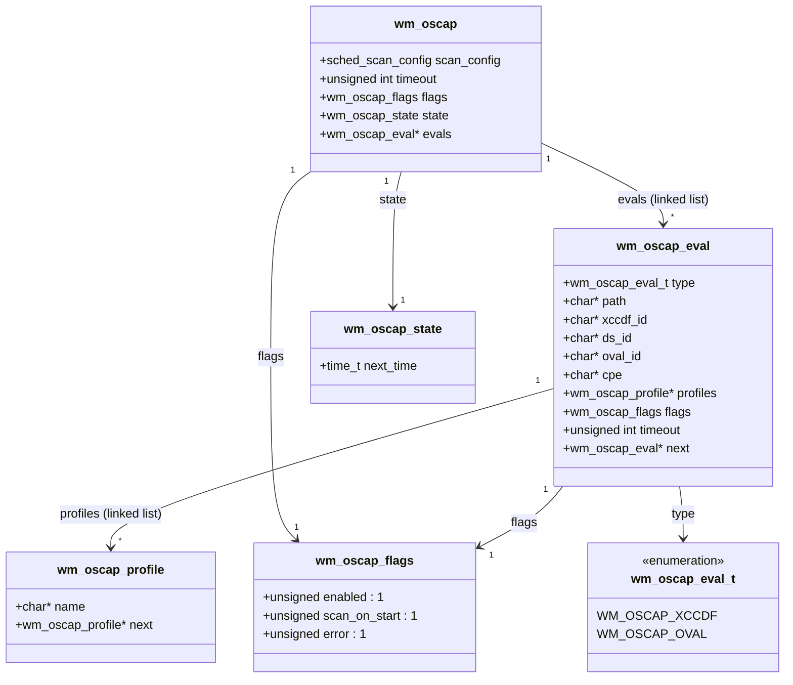
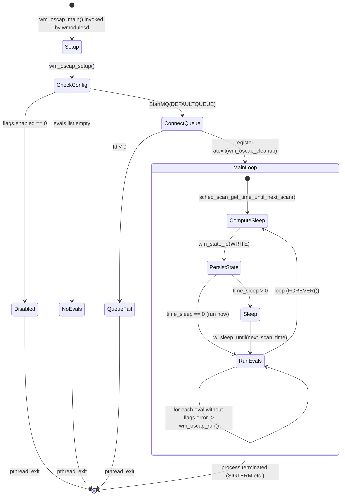
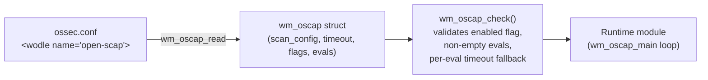

# OpenSCAP Compliance Scanner Module (`wazuh_modules_core_compliance_scanners_oscap`)

## Introduction

The **OpenSCAP module** (`wm_oscap`) is one of Wazuh's native C daemon modules (`wodles`) responsible for driving **SCAP (Security Content Automation Protocol)** compliance evaluations on agents and managers. It is a thin, scheduler-driven wrapper around the external `oscap` command-line tool (invoked through a bundled Python helper, `wodles/oscap/oscap.py`), translating XCCDF/OVAL/Datastream policy definitions declared in `ossec.conf` into scheduled scans, and forwarding both status messages (via the `rootcheck` queue) and raw scan output (via the `localfile`/log queue) into the Wazuh analysis pipeline.

This module is one of three **compliance scanner** siblings inside the `wazuh_modules_core_compliance_scanners` family — the other two being [CIS-CAT](wazuh_modules_core_compliance_scanners_ciscat.md) and [SCA](wazuh_modules_core_compliance_scanners_sca.md). All three share the same hosting infrastructure (module registration, execution helpers, scheduling) provided by the parent [Wazuh Modules Daemon](Wazuh_Modules_Daemon_(C).md) and its [wazuh_modules_core_lifecycle](Wazuh_Modules_Daemon_(C).md) children.

---

## Purpose and Core Functionality

| Responsibility | Description |
|---|---|
| **Scheduled execution** | Runs OpenSCAP evaluations according to a configurable schedule (interval, day/time, or run-on-start), reusing the shared `sched_scan_config` scheduling primitive. |
| **Policy management** | Maintains a linked list of `wm_oscap_eval` entries, each representing one XCCDF/OVAL/Datastream content file with associated profiles, IDs and per-policy timeout. |
| **External process orchestration** | Builds a command line for the `oscap.py` helper script and executes it through the shared `wm_exec()` helper, capturing stdout/status and enforcing timeouts. |
| **Event forwarding** | Sends a "scan started"/"scan ended" notification to the `rootcheck` queue and streams the raw tool output line-by-line to the `localfile` (log collector) queue, rate-limited by `wm_max_eps`. |
| **State persistence** | Persists `next_time` of the next scheduled scan across daemon restarts using `wm_state_io()`. |
| **Runtime introspection** | Exposes current configuration via `wm_oscap_dump()` (returns a `cJSON` object) for the `GET /manager/configuration` / `GET /agents/{id}/config` API endpoints, and via `wm_oscap_info()` for debug logging. |
| **Lifecycle management** | Implements the standard `wm_context` contract (`start`, `destroy`, `dump`) so it can be registered and driven generically by the [Wazuh Modules Daemon core](Wazuh_Modules_Daemon_(C).md). |

The module intentionally does **not** parse or interpret SCAP results itself — it treats the `oscap.py` output as an opaque stream of log lines that are re-injected into the standard Wazuh log pipeline, where downstream decoders/rules (in [Wazuh_Engine_Core_(C++)](Wazuh_Engine_Core_(C++).md) or legacy analysisd) are responsible for structuring and alerting on the content.

---

## Module Position in the System



**Related documentation:**
- Parent daemon and shared execution/scheduling infrastructure: [Wazuh_Modules_Daemon_(C).md](Wazuh_Modules_Daemon_(C).md)
- Sibling compliance scanners: [wazuh_modules_core_compliance_scanners_ciscat.md](wazuh_modules_core_compliance_scanners_ciscat.md), [wazuh_modules_core_compliance_scanners_sca.md](wazuh_modules_core_compliance_scanners_sca.md)
- XML configuration parsing counterpart: [Configuration_Data_Structures_(C_Headers).md](Configuration_Data_Structures_(C_Headers).md) (`Wmodules_Config` family; `wm_oscap_read()` is implemented alongside other wodle parsers)
- Message queue transport: [Agent_&_Manager_Native_Daemons_(C).md](Agent_&_Manager_Native_Daemons_(C).md) (`shared_lib_networking` — `mq_op.c`)
- Downstream consumption of forwarded log lines: [Wazuh_Engine_Core_(C++).md](Wazuh_Engine_Core_(C++).md)
- Manager/API surfacing of module configuration: [manager_module](API_&_Management_Framework_(Python).md) (`GET /manager/configuration` returns the JSON produced by `wm_oscap_dump`)

---

## Data Model

The module's state is captured entirely in the structures defined in `wm_oscap.h`.



Key notes:
- `wm_oscap` is the top-level module configuration; a single global instance is held in the static `oscap` pointer inside `wm_oscap.c` once `wm_oscap_setup()` runs.
- Each `wm_oscap_eval` corresponds to one `<content>` block in the module's XML configuration (a single XCCDF, OVAL, or Datastream file), and can list zero or more named `<profile>` entries to restrict the evaluation to specific SCAP profiles.
- `wm_oscap_flags` is reused at both the module level (global `enabled`/`scan_on_start` defaults) and the per-eval level (`error`, which is set when a content file fails to run so it is skipped on subsequent iterations).
- `wm_oscap_state` is the minimal persisted state — just the epoch time of the next scheduled run — serialized/deserialized via the generic `wm_state_io()` helper shared by all wodle modules.

---

## Module Registration (`wm_context`)

Like every wodle, OpenSCAP exposes itself through a static `wm_context` descriptor, which is what the [Wazuh Modules Daemon core](Wazuh_Modules_Daemon_(C).md) (`wmodules.c` / `main.c`) uses to generically start, stop, dump and destroy the module without needing module-specific knowledge.

```c
const wm_context WM_OSCAP_CONTEXT = {
    .name  = "open-scap",
    .start = (wm_routine)wm_oscap_main,
    .destroy = (void(*)(void *))wm_oscap_destroy,
    .dump  = (cJSON * (*)(const void *))wm_oscap_dump,
    .sync  = NULL,
    .stop  = NULL,
    .query = NULL,
};
```

| Field | Function | Purpose |
|---|---|---|
| `start` | `wm_oscap_main` | Entry point spawned as a dedicated thread (or, on Windows, effectively disabled). |
| `destroy` | `wm_oscap_destroy` | Frees the entire `wm_oscap` tree (evals → profiles) when the daemon reloads/unloads configuration. |
| `dump` | `wm_oscap_dump` | Serializes current configuration to `cJSON`, consumed by the configuration API. |
| `sync` / `stop` / `query` | `NULL` | OpenSCAP does not support on-demand queries, cluster sync, or graceful stop hooks — it only runs on its own schedule until process exit. |

> **Note:** On Windows builds, `wm_oscap_main` is compiled to a stub that only logs that the module is unsupported on that platform (OpenSCAP requires a POSIX-style `oscap` binary), so the module is effectively a Linux/Unix-only compliance scanner.

---

## Execution Flow

### High-level lifecycle (state diagram)



### Single-content scan sequence

```mermaid
sequenceDiagram
    participant Loop as wm_oscap_main loop
    participant Run as wm_oscap_run(eval)
    participant MQ as ossec queue (mq_op.c)
    participant Exec as wm_exec()
    participant Script as oscap.py + oscap binary
    participant Log as localfile/log queue

    Loop->>Run: invoke for each non-errored eval
    Run->>Run: build command line<br/>(--xccdf|--oval, path, --profiles,<br/>--xccdf-id/--oval-id/--ds-id/--cpe)
    Run->>MQ: SendMSG("Starting OpenSCAP scan...", rootcheck)
    Run->>Exec: wm_exec(command, timeout)
    Exec->>Script: fork + exec, capture stdout/status
    Script-->>Exec: output text, exit status
    Exec-->>Run: status code / WM_ERROR_TIMEOUT / output buffer

    alt status == 0 (success)
        Run->>Run: continue
    else status == 2 (fatal)
        Run->>Run: log error, free buffers, pthread_exit
    else other non-zero status
        Run->>Run: mark eval->flags.error = 1 (skip next iterations)
    else timeout
        Run->>Run: replace output with "Timeout expired" message
    end

    loop for each line in captured output
        Run->>Log: wm_sendmsg(line, WM_OSCAP_LOCATION, LOCALFILE_MQ)
    end

    Run->>MQ: SendMSG("Ending OpenSCAP scan...", rootcheck) [via wm_sendmsg]
    Run-->>Loop: return
```

Key implementation details:
- **Command construction** (`wm_oscap_run`): concatenates the script path (`WM_OSCAP_SCRIPT_PATH = "wodles/oscap/oscap.py"`), the evaluation type flag (`--xccdf` or `--oval`), the content file path, and optional `--profiles`, `--xccdf-id`, `--oval-id`, `--ds-id`, and `--cpe` arguments — all built with the shared `wm_strcat()` helper.
- **Rate limiting**: output lines are emitted with a per-line delay derived from the global `wm_max_eps` (events-per-second) setting, computed once as `usec = 1000000 / wm_max_eps` and passed to `wm_sendmsg()`.
- **Error classification**: a `status == 2` from the script is treated as fatal (the whole thread exits), any other non-zero status flags the specific eval as errored (permanently skipped for the life of the process) but keeps the daemon alive, and a `WM_ERROR_TIMEOUT` return from `wm_exec()` synthesizes a fake output line so the timeout is still visible in the logs.

---

## Configuration Handling

While the XML parser implementation (`wm_oscap_read()`) lives in the broader [Wmodules_Config](Configuration_Data_Structures_(C_Headers).md) parsing subsystem (declared in `wm_oscap.h` but implemented alongside other `<wodle>` readers), this module defines the contract that the parser must fulfill by populating a `wm_oscap` struct:



Defaults applied at runtime (`wm_oscap_check`):
- If the module is disabled (`flags.enabled == 0`) the thread exits immediately after logging.
- If no `<content>` evaluations were parsed, the thread logs a warning and exits (there is nothing to do).
- Each `wm_oscap_eval` without an explicit timeout inherits the module-level `oscap->timeout`, which itself falls back to `WM_OSCAP_DEF_TIMEOUT` (1800 seconds / 30 minutes) if unset.

Scheduling itself (interval vs. day-of-week/month vs. daytime) is delegated entirely to the shared `sched_scan_config` type and its helper functions (`sched_scan_get_time_until_next_scan`, `sched_get_next_scan_time`, `sched_scan_dump`), the same primitive used by CIS-CAT, SCA, and several other wodles — see [Configuration_Data_Structures_(C_Headers).md](Configuration_Data_Structures_(C_Headers).md) for the shared scheduling struct definitions.

---

## Runtime Introspection: `wm_oscap_dump`

`wm_oscap_dump()` builds a `cJSON` document mirroring the module's configuration, nesting an `open-scap` object that contains:
- Scheduling fields injected by `sched_scan_dump()`.
- `disabled` / `scan-on-start` string flags (`"yes"`/`"no"`).
- `timeout` (module default).
- A `content` array, one entry per `wm_oscap_eval`, including `path`, `xccdf-id`, `datastream-id`, `oval-id`, `cpe`, per-eval `timeout`, numeric `type`, and a nested `profile` array of profile names.

This JSON is what backs the manager/agent **configuration API** (see [manager_module](API_&_Management_Framework_(Python).md) `GET /manager/configuration?section=open-scap` and the equivalent per-agent endpoint), allowing operators to verify the effective OpenSCAP configuration without reading `ossec.conf` directly.

---

## Comparison with Sibling Compliance Scanners

| Aspect | OpenSCAP (`wm_oscap`) | [CIS-CAT](wazuh_modules_core_compliance_scanners_ciscat.md) (`wm_ciscat`) | [SCA](wazuh_modules_core_compliance_scanners_sca.md) (`wm_sca`) |
|---|---|---|---|
| External engine | `oscap` CLI via Python wrapper | Java-based CIS-CAT Pro/Assessor tool | Built-in YAML rule engine (no external tool) |
| Result delivery | Raw log lines → `localfile` queue | Structured results → `localfile`/dedicated queue | Structured checks synced to `wazuh-db` (SCA tables), queried via [sca_module API](API_&_Management_Framework_(Python).md) |
| Platform support | POSIX only (stub on Windows) | Cross-platform (Java) | Cross-platform |
| Persisted state | `next_time` only | `next_time` + scan metadata | Full check/result database (`wm_sca_policy_t`, hash info) |
| API exposure | Only via generic module `dump` (no dedicated REST resource) | Dedicated `GET /experimental/{agent}/ciscat/results` | Dedicated `GET /sca/{agent}` and `/sca/{agent}/checks/{policy}` |

Despite these differences, all three share the same execution scaffolding: `wm_context` registration, `sched_scan_config` scheduling, `wm_exec()` for external process invocation (where applicable), and `wm_state_io()` for lightweight state persistence — all defined in the parent [wazuh_modules_core_lifecycle](Wazuh_Modules_Daemon_(C).md) children.

---

## Key Functions Reference

| Function | Responsibility |
|---|---|
| `wm_oscap_main` | Module thread entry point; drives the infinite scan-and-sleep loop. |
| `wm_oscap_setup` | One-time initialization: check config, restore persisted state, connect to the message queue, register cleanup handler. |
| `wm_oscap_check` *(internal)* | Validates `enabled` flag, ensures at least one eval exists, applies timeout fallbacks. |
| `wm_oscap_run` | Executes a single `wm_oscap_eval`: builds the CLI command, sends start/end rootcheck notices, invokes `wm_exec`, forwards output lines. |
| `wm_oscap_cleanup` | `atexit`-registered cleanup: closes the queue file descriptor and logs shutdown. |
| `wm_oscap_info` *(internal, debug-only)* | Dumps the parsed configuration to the log when debug mode is enabled. |
| `wm_oscap_dump` | Serializes the live configuration into `cJSON` for API/config-check consumption. |
| `wm_oscap_destroy` | Frees all dynamically allocated memory in the `wm_oscap` tree (evals, profiles, strings). |

---

## Dependency Summary

- **Upstream (who drives this module):** [Wazuh_Modules_Daemon_(C).md](Wazuh_Modules_Daemon_(C).md) — `main.c`/`wmodules.c` load `WM_OSCAP_CONTEXT` from the parsed configuration and invoke its lifecycle callbacks.
- **Downstream (what this module calls):**
  - `wm_exec()` (shared execution helper, same file family as `wm_command`, `wm_download`) — process spawning with timeout enforcement.
  - `StartMQ` / `SendMSG` (from `shared/mq_op.c`, see [Agent_&_Manager_Native_Daemons_(C).md](Agent_&_Manager_Native_Daemons_(C).md)) — message queue transport for both rootcheck notices and log lines.
  - `wm_sendmsg`, `wm_strcat`, `sched_scan_*`, `wm_state_io` — shared wodle utility functions used across all modules in `wazuh_modules_core`.
- **External process:** `wodles/oscap/oscap.py`, which in turn shells out to the system's `oscap` binary and any bundled XCCDF/OVAL/CPE content.
- **Consumers of output:** the log collector/analysis pipeline ([Wazuh_Engine_Core_(C++).md](Wazuh_Engine_Core_(C++).md) or legacy analysisd) treats forwarded lines as regular log events to be decoded and alerted upon; the `rootcheck` queue messages are consumed the same way as other rootcheck status notices.
