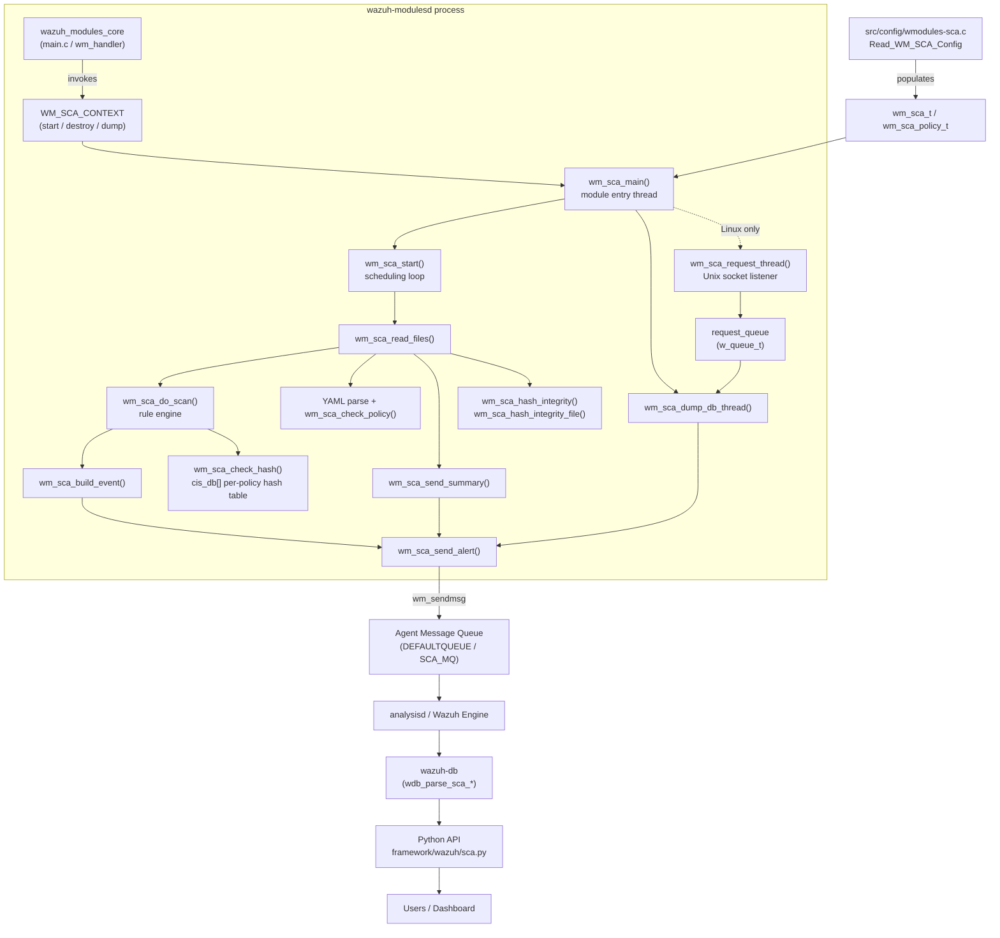
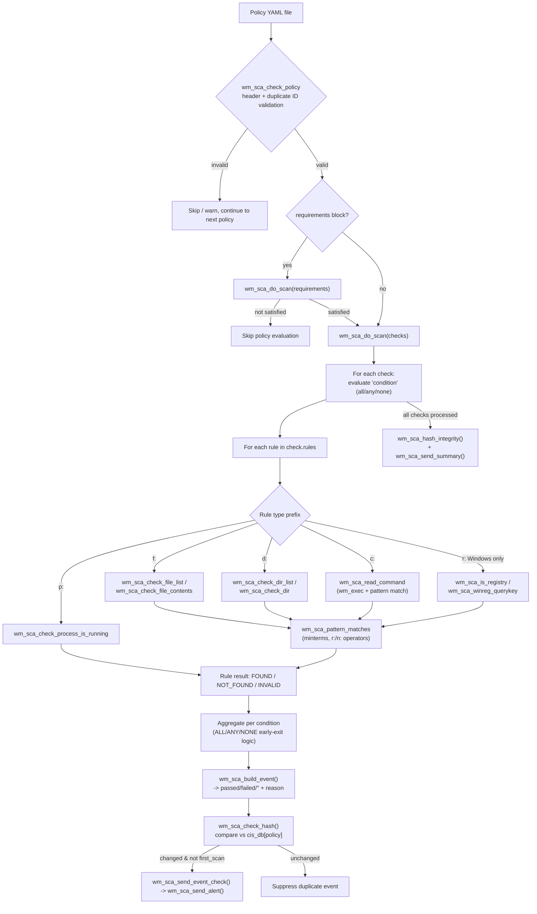
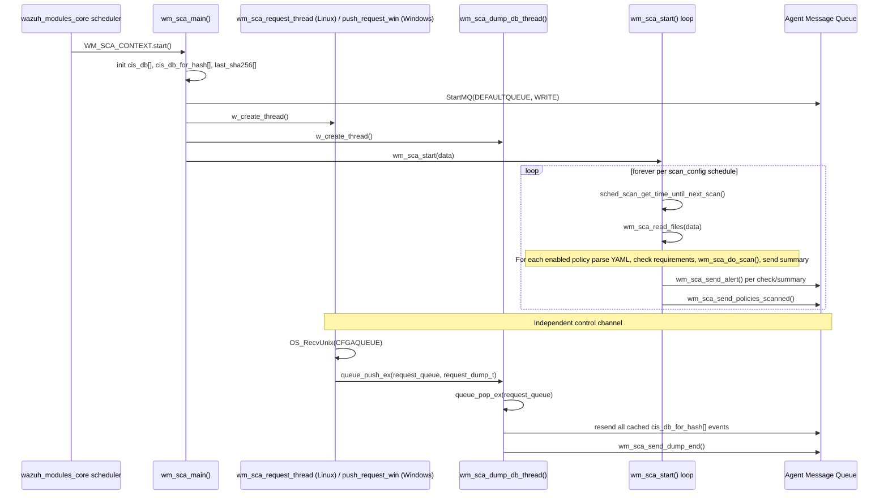
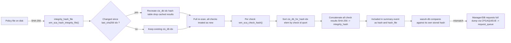

# SCA — Security Configuration Assessment Module (`wazuh_modules_core_compliance_scanners_sca`)

## Introduction

The **SCA (Security Configuration Assessment) module** is a native C component of the Wazuh agent/manager daemon (`wazuh-modulesd`) that periodically audits a host's configuration against a set of declarative **policy files** (YAML documents describing checks such as file existence, file content, registry values, running processes, and directory contents). For every check it produces a `passed` / `failed` / `not applicable` result, aggregates the results into a **policy summary** (with a pass/fail score and an integrity hash), and forwards both individual check events and summaries to the Wazuh analysis pipeline through the agent's message queue.

This module implements one of the three "compliance scanner" engines bundled in `wazuh-modulesd` — the sibling engines being **CIS-CAT** (`wazuh_modules_core_compliance_scanners_ciscat`) and **OpenSCAP** (`wazuh_modules_core_compliance_scanners_oscap`). Unlike those two (which shell out to external Java/Python tools), SCA is a **self-contained rule engine** implemented entirely in `wm_sca.c`.

Source files covered by this document:
- `src/wazuh_modules/wm_sca.c` — module logic, scan engine, event construction, dump/integrity threads.
- `src/wazuh_modules/wm_sca.h` — public data structures and constants used by the module and its configuration parser.

## Role in the Overall System

SCA is registered as one of the many "sub-modules" managed by the generic **Wazuh Modules Daemon** (`wazuh_modules_core`, see [wazuh_modules_core_lifecycle](wazuh_modules_core_lifecycle.md)). The daemon's core loop (`wm_handler`/`wm_cleanup` in `main.c`) starts each configured `wmodule`, and SCA's `WM_SCA_CONTEXT` (start/destroy/dump callbacks) is the hook point exposed to that generic scheduler.

Related modules/documents:
- **Configuration parsing**: SCA XML configuration (`<sca>` block) is parsed by `src/config/wmodules-sca.c`, which populates the `wm_sca_t` / `wm_sca_policy_t` structures defined in `wm_sca.h`. See `Wmodules_Config_sca` in the Configuration Data Structures module tree.
- **Sibling compliance scanners**: [wazuh_modules_core_compliance_scanners_ciscat](wazuh_modules_core_compliance_scanners_ciscat.md), [wazuh_modules_core_compliance_scanners_oscap](wazuh_modules_core_compliance_scanners_oscap.md).
- **Parent module**: [wazuh_modules_core_compliance_scanners](wazuh_modules_core_compliance_scanners.md), and the broader [wazuh_modules_core](wazuh_modules_core.md) daemon.
- **Persistence layer**: scan results and check state are persisted through `wazuh-db`. See `wazuh_db_command_parser` (`wdb_parse_sca_*` functions in `wdb_parser.c`) which stores/retrieves SCA data on request.
- **API exposure**: results stored by `wazuh-db` are exposed to users through the `sca_module` / `sca_module_details` Python API (`framework/wazuh/sca.py`, `framework/wazuh/core/sca.py`, `api/api/controllers/sca_controller.py`).
- **Message delivery**: events are emitted through the shared agent message queue infrastructure (`wm_sendmsg`, `StartMQ`), the same transport used by all `wazuh_modules_core` sub-modules — see `framework_core_communication` / `shared_lib_networking` for the underlying queue primitives on the C side.
- **Scheduling**: uses the common `sched_scan_config` scheduling primitives (`sched_scan_get_time_until_next_scan`, `sched_scan_dump`), shared with CIS-CAT, OSCAP, and other periodic wodles (see `shared_lib_system_utils_config_scheduling`).

## Purpose and Core Functionality

1. **Policy loading & validation** — reads one or more YAML policy files (`wm_sca_read_files`), validates their header (`id`, `name`, `file`, `description`), validates every check's uniqueness and rule syntax (`wm_sca_check_policy`), and validates the optional `requirements` block that gates whether the whole policy should run (`wm_sca_check_requirements`).
2. **Rule evaluation engine** — evaluates each check's `rules` array against one of five rule *types*: file (`f:`), registry (`r:`, Windows only), process (`p:`), directory (`d:`), and command (`c:`). Each rule test may use plain string matching, Wazuh's regex engine (`OS_REGEX`), or `PCRE2`, and supports negation (`NOT`/`!`) and numeric comparisons (`n:<regex> compare <op><value>`).
3. **Rule aggregation** — combines individual rule results per check using boolean aggregators `all`, `any`, and `none` (`wm_sca_set_condition`, aggregation logic in `wm_sca_do_scan`).
4. **Event & summary generation** — builds a structured JSON check event (`wm_sca_build_event`) and a policy-level summary event with pass/fail/invalid counts and a computed score (`wm_sca_send_summary`).
5. **State/Integrity tracking** — keeps an in-memory hash table per policy (`cis_db`) so only *changed* results are re-sent (`wm_sca_check_hash`), and computes a SHA-256 integrity hash over all check results (`wm_sca_hash_integrity`) plus a hash of the raw policy file (`wm_sca_hash_integrity_file`) to detect policy edits.
6. **On-demand DB dump** — a dedicated background thread (`wm_sca_dump_db_thread`) can be asked (through a request queue, fed either by a Unix socket listener on Linux or `wm_sca_push_request_win` on Windows) to resend the entire scanned-results DB for a policy, used to resynchronize `wazuh-db` when its checksum diverges from the module's.
7. **Scheduling** — runs forever (`wm_sca_start`) honoring the module's `sched_scan_config` (interval, `scan-day`, `scan-time`, or `scan_on_start`).

## Architecture Overview

## Key Data Structures

| Structure | File | Purpose |
|---|---|---|
| `wm_sca_t` | `wm_sca.h` | Top-level module configuration and runtime state: enabled flags, scan scheduling (`sched_scan_config`), policy list, alert-message scratch buffer, queue fd, remote-commands flag, command timeout. |
| `wm_sca_policy_t` | `wm_sca.h` | Per-policy descriptor: enabled/remote flags, `policy_path`, `policy_id`, `policy_regex_type` (OS_REGEX or PCRE2 default for the policy). |
| `cis_db_info_t` | `wm_sca.h` | Cached result of a single check (`id`, `result` string, full `event` cJSON) used for change detection and integrity hashing. |
| `cis_db_hash_info_t` | `wm_sca.h` | Array of `cis_db_info_t*` per policy — backs the sortable table used by `wm_sca_hash_integrity`. |
| `request_dump_t` (internal) | `wm_sca.c` | Message pushed onto `request_queue` to ask the dump thread to resend a policy's full result set (`policy_index`, `first_scan`). |

## Rule Engine — Data Flow

### Rule aggregation semantics

| Condition | Break-early trigger | Meaning when loop completes without break |
|---|---|---|
| `all` | first rule returns `NOT_FOUND` → check = `NOT_FOUND` | every rule matched → check = `FOUND` |
| `any` | first rule returns `FOUND` → check = `FOUND` | no rule matched → check = `NOT_FOUND` |
| `none` | first rule returns `FOUND` → check = `NOT_FOUND` | no rule matched → check = `FOUND` (result inverted at the end) |

`INVALID` results (e.g., unreadable file, bad regex, disabled remote command) propagate specially: for `any`, an `INVALID` keeps looking for a `FOUND`; for `all`/`none` an `INVALID` can short-circuit the whole check to `INVALID`.

## Runtime / Threading Model

- **Main scan loop** (`wm_sca_start`) is a single thread that sleeps according to the configured schedule and then calls `wm_sca_read_files` synchronously for all policies.
- **Dump thread** (`wm_sca_dump_db_thread`) runs independently, blocking on `queue_pop_ex(request_queue)`. It uses a read/write lock (`dump_rwlock`) shared with the main scan loop to avoid dumping while a scan is mutating `cis_db_for_hash`.
- **Request thread** (POSIX only) listens on the `CFGAQUEUE` Unix socket for `sca-dump:<policy_id>:<first_scan>` control messages (typically issued by `wazuh-db` when its integrity hash disagrees with the module's). On Windows the equivalent path is `wm_sca_push_request_win`, called directly from the message-passing layer instead of a socket thread.
- Access to the shared per-policy hash tables (`cis_db[]`) is guarded implicitly by the `dump_rwlock` taken around each policy scan and around the whole dump operation.

## Event Types Emitted

| `type` field | Producer | Description |
|---|---|---|
| `check` | `wm_sca_build_event` / `wm_sca_send_event_check` | Individual check result: `policy`, `policy_id`, and a `check` object with id, title, description, rationale, remediation, compliance mappings, rules, references, extracted file/directory/process/registry/command context, and `result`/`reason`. |
| `summary` | `wm_sca_send_summary` | Per-policy roll-up: `passed`, `failed`, `invalid`, `total_checks`, computed `score`, `start_time`/`end_time`, `hash` (results integrity), `hash_file` (policy file integrity), optional `first_scan` flag. |
| `policies` | `wm_sca_send_policies_scanned` | List of all enabled policy IDs, sent once per scan cycle so `wazuh-db`/manager can purge stale policies. |
| `dump_end` | `wm_sca_send_dump_end` | Marks the end of an on-demand DB dump, with `elements_sent` and `scan_id`, allowing the receiver to know the resynchronization is complete. |

All events are wrapped and sent via `wm_sca_send_alert`, which serializes the cJSON object and calls `wm_sendmsg(..., WM_SCA_STAMP, SCA_MQ)`, automatically reconnecting to the queue (`StartMQ`) on failure.

## Integrity & Change-Detection Mechanism

This two-level hashing (policy-file hash + results hash) lets the manager and `wazuh-db` detect both "the policy definition changed" and "the scan outcome changed" without needing to transmit the full result set on every scan cycle — only deltas (`wm_sca_check_hash` returns 1 only when a check's result differs from the cached one) are pushed, except on the very first scan or during an explicit dump.

## Configuration Surface

Although parsing itself lives in `src/config/wmodules-sca.c` (see `Wmodules_Config_sca`), the resulting fields consumed by this module are:

- `enabled`, `scan_on_start`, `skip_nfs` — boolean toggles.
- `scan_config` (`sched_scan_config`) — interval/day/time scheduling shared with other wodles.
- `policies[]` — array of `wm_sca_policy_t` (`policy_path`, enabled, remote flag, resolved `policy_id`, `policy_regex_type`).
- Internal options (`internal_options.conf`): `sca.request_db_interval` (capped to the scan interval), `sca.commands_timeout`, and (agent-only) `sca.remote_commands` (manager-pushed policies default to commands **disabled** unless explicitly allowed, mitigating remote command execution risk from centrally managed policies).

## Security Considerations

- **Remote command gating**: when a policy originates from the manager (`remote_policy` flag) and the check type is `c:` (command), the module refuses to execute it unless `data->remote_commands` is enabled, emitting an `INVALID` result with an explanatory `reason` instead — see the `WM_SCA_TYPE_COMMAND` branch in `wm_sca_do_scan`.
- **Symlink resolution guard** (`wm_sca_resolve_symlink`, POSIX only): all file/directory checks resolve the real path first and classify a missing/broken symlink as `NOT_FOUND` (not an error), while other resolution failures become `INVALID` with a captured `reason`.
- **NFS skip**: `data->skip_nfs` allows directory-type checks to skip network filesystems (`IsNFS`) to avoid hangs/latency during scans.
- **Duplicate/careless-policy protection**: `wm_sca_check_policy` rejects policies with duplicate top-level IDs or duplicate/invalid check IDs, and validates every rule prefix and aggregator keyword before any scan is attempted, failing safe (skips the whole policy) if the file is malformed.

## Testing

Unit tests for this module live under `Unit_Tests_-_Wazuh_Modules_(Cloud_Misc)` → `wm_sca_tests` (`src/unit_tests/wazuh_modules/sca/test_wm_sca.c`), covering:
- Numeric partial comparisons (`wm_sca_apply_numeric_partial_comparison_*`) for both `OS_REGEX` and `PCRE2` engines.
- Regex-based numeric comparisons (`wm_sca_regex_numeric_comparison_*`).
- Minterm evaluation (`wm_sca_test_positive_minterm_*`) including exact-match, regex, and PCRE2 paths, and their failure modes.
- Scheduling configuration parsing (`test_read_scheduling_*`) shared with the generic `sched_scan_config` helpers.
- Variable sorting utility (`wm_sort_variables`) used to substitute the longest variable names first and avoid partial-match collisions.

## Summary of Public API (context callbacks)

| Callback | Function | Notes |
|---|---|---|
| `start` | `wm_sca_main` | Entry point launched by the generic module scheduler; never returns (loops via `wm_sca_start`). |
| `destroy` | `wm_sca_destroy` | Frees the `wm_sca_t` structure. |
| `dump` | `wm_sca_dump` | Serializes current configuration (policies, scheduling, flags) to `cJSON` for the manager/agent config API path (see `manager_module` / `agent_module` API docs). |
| `sync` / `stop` | `NULL` | Not implemented for this module. |

These map to the generic `wm_context` contract shared by every sub-module under [wazuh_modules_core](wazuh_modules_core.md) (e.g., `wm_ciscat`, `wm_oscap`, `wm_command`), enabling the daemon's uniform lifecycle management (`wm_handler`, `wm_cleanup`, `wm_destroy` in `main.c` / `wmodules.c`).
