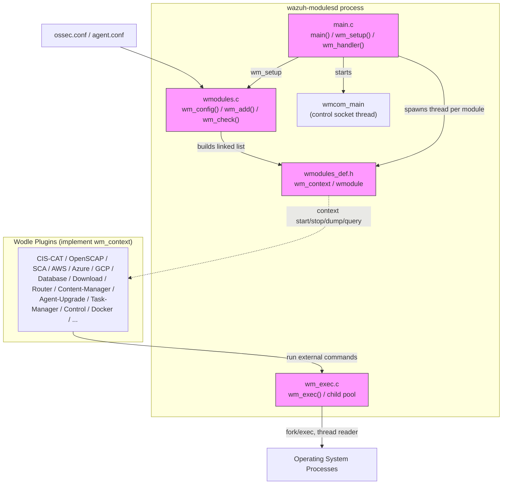
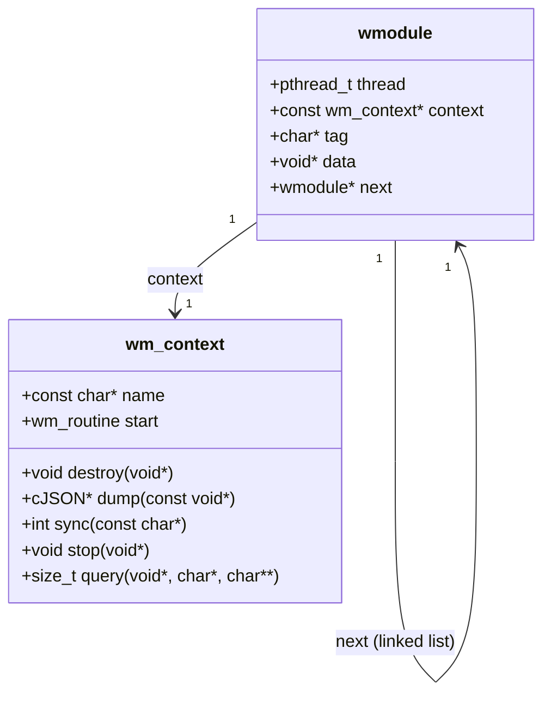
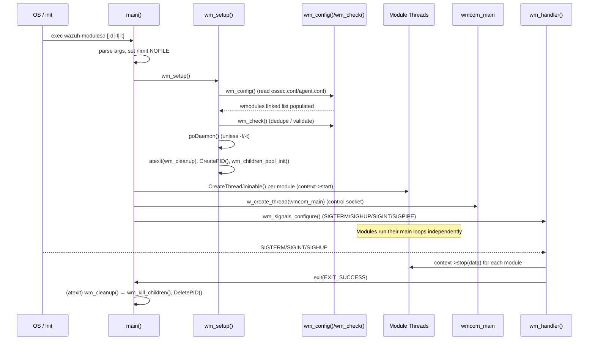
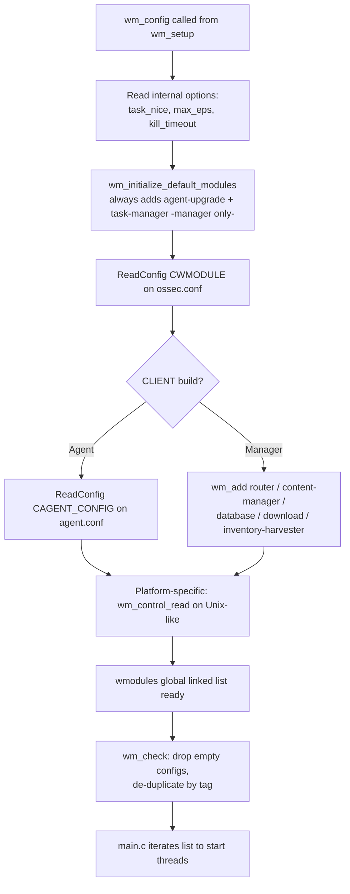
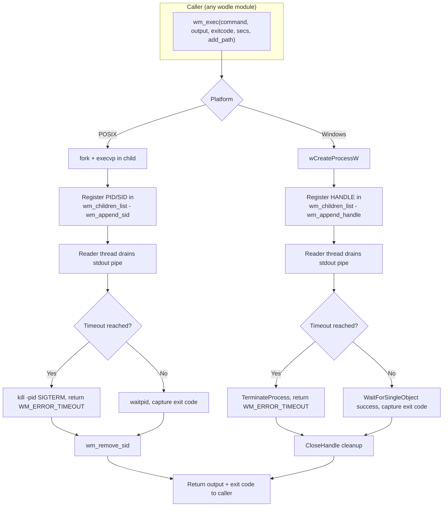
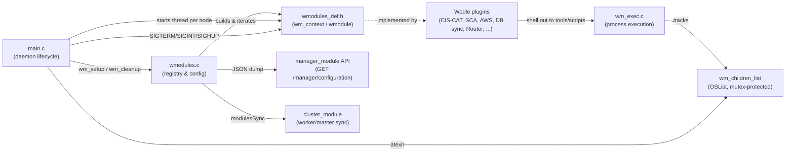

# Wazuh Modules Core Lifecycle

## Introduction

The **Wazuh Modules Core Lifecycle** module is the foundational runtime engine of the `wazuh-modulesd` daemon — the process that hosts and orchestrates all of Wazuh's "wodle" (Wazuh Module) integrations (CIS-CAT, OpenSCAP, SCA, cloud collectors, database sync, downloader, router bridge, etc.). It does **not** implement any specific integration itself; instead it provides:

- The **daemon entry point** and process lifecycle (startup, daemonization, signal handling, graceful shutdown).
- The **module plugin contract** (`wm_context` / `wmodule`) that every wodle implements to be discovered, started, dumped, queried and stopped uniformly.
- The **configuration loading and registry** logic that reads `ossec.conf`/`agent.conf`, instantiates configured modules, removes duplicates, and keeps the global `wmodules` linked list.
- The **child-process execution subsystem** (`wm_exec`) used by nearly every wodle to run external commands/scripts with timeouts, output capture, and safe cleanup of orphaned child processes.

Because this module is purely infrastructural, almost every other wodle-related module in the system depends on it. See [wazuh_modules_core_cloud_integrations.md](wazuh_modules_core_cloud_integrations.md), [wazuh_modules_core_compliance_scanners.md](wazuh_modules_core_compliance_scanners.md), [wazuh_modules_core_system_management.md](wazuh_modules_core_system_management.md), [wazuh_modules_core_native_bridges.md](wazuh_modules_core_native_bridges.md), [agent_upgrade_module.md](agent_upgrade_module.md) and [task_manager_module.md](task_manager_module.md) for the concrete modules that plug into this lifecycle.

---

## 1. Position in the System

`wazuh-modulesd` is one of the native C daemons that make up the Wazuh manager/agent (see [Agent_&_Manager_Native_Daemons_(C).md](Agent_%26_Manager_Native_Daemons_%28C%29.md) for siblings such as `remoted`, `monitord`, `logcollector`). The Core Lifecycle module sits at the root of the daemon's internal architecture:

Related sibling modules that consume this lifecycle:

| Module | Relationship |
|---|---|
| [wazuh_modules_core_cloud_integrations.md](wazuh_modules_core_cloud_integrations.md) | AWS/Azure/GCP/GitHub/MS-Graph/Office365 wodles registered via `wm_add()` and implementing `wm_context` |
| [wazuh_modules_core_compliance_scanners.md](wazuh_modules_core_compliance_scanners.md) | CIS-CAT, OpenSCAP, SCA modules — heavy users of `wm_exec()` to run scanners |
| [wazuh_modules_core_system_management.md](wazuh_modules_core_system_management.md) | Database sync, Docker listener, download, osquery monitor, command wodle |
| [wazuh_modules_core_native_bridges.md](wazuh_modules_core_native_bridges.md) | Router, Content-Manager, Syscollector, Vulnerability-Scanner, Inventory-Harvester native bridges |
| [agent_upgrade_module.md](agent_upgrade_module.md) | Registered unconditionally as a **default module** (see `default_modules[]`) |
| [task_manager_module.md](task_manager_module.md) | Registered unconditionally on managers as a **default module** |
| [Configuration_Data_Structures_(C_Headers).md](Configuration_Data_Structures_%28C_Headers%29.md) → `Wmodules_Config` | Defines the XML parsing structures consumed by `ReadConfig()` when building each `wmodule` |
| [Agent_&_Manager_Native_Daemons_(C).md](Agent_%26_Manager_Native_Daemons_%28C%29.md) → `shared_lib_system_utils_signals` / `shared_lib_logging` | Shared logging/signal helper primitives reused by `main.c` |

---

## 2. Core Data Structures

The plugin contract is defined in `wmodules_def.h` and is the single most important artifact of this module — every wodle in the codebase implements it.

- **`wm_context`** — a static, read-only vtable-like structure each module defines once (e.g. `wm_ciscat_context`, `wm_aws_context`). It exposes:
  - `start` — the thread entry point (`wm_routine`), run via `CreateThreadJoinable`.
  - `destroy` — frees the module's private `data` blob.
  - `dump` — serializes current configuration to JSON (used by `getModulesConfig()` / API `manager_module`).
  - `sync` — optional cluster/worker synchronization hook, invoked from `modulesSync()`.
  - `stop` — graceful-shutdown hook called from the signal handler.
  - `query` — optional ad-hoc query interface used by `wm_module_query()`.
- **`wmodule`** — one instance per configured module occurrence; holds the running thread handle, the module-specific `data`, and forms a singly linked list (`wmodules` global) that `main.c` iterates to start/stop/join every module.

---

## 3. Daemon Lifecycle (main.c)

`main.c` implements the classic Wazuh daemon bootstrap pattern shared with other native daemons (compare with `monitord_lifecycle`, `os_execd_daemon_lifecycle`, `client_agent_native_lifecycle` in [Agent_&_Manager_Native_Daemons_(C).md](Agent_%26_Manager_Native_Daemons_%28C%29.md)):

Key responsibilities:

- **CLI flags**: `-d` (debug), `-f` (foreground), `-t` (test config only, implies foreground), `-h` (help).
- **Resource limits**: raises `RLIMIT_NOFILE` based on the `wazuh_modules.rlimit_nofile` internal option.
- **`wm_setup()`**: performs configuration loading (`wm_config()`), daemonizes via `goDaemon()`/`nowDaemon()` unless running in foreground, drops to the `ossec` group (`Privsep_GetGroup`/`wm_setGroupID`), validates that at least one module is configured (`wm_check()`), registers `wm_cleanup()` with `atexit()`, writes the PID file, and initializes the child-process pool (`wm_children_pool_init()`).
- **Thread-per-module model**: every entry in the `wmodules` list gets its own joinable thread running `context->start(data)`; the main thread then blocks on `pthread_join()` for all of them.
- **Control socket**: a dedicated thread (`wmcom_main`, from `os_execd`/`wcom`-style command dispatch) allows external processes (e.g. `wazuh-control`) to query module status via the `wm_module_query()` mechanism.
- **Signal handling** (`wm_signals_configure` / `wm_handler`): a mutex-guarded, re-entrancy-safe handler for `SIGTERM`, `SIGHUP`, `SIGINT` that calls each module's `context->stop()` (currently primarily meaningful for the syscollector/inventory-style modules) before exiting; `SIGPIPE` is ignored.
- **`wm_cleanup()`**: invoked automatically at process exit — kills any still-running child processes (`wm_kill_children()`) and removes the daemon's PID file.

---

## 4. Configuration Loading & Module Registry (wmodules.c)

Key functions:

- **`wm_config()`** — orchestrates the entire configuration pipeline: reads internal option defaults (`task_nice`, `max_eps`, `kill_timeout`, `debug`), unconditionally instantiates **default modules** (`wm_initialize_default_modules`, currently `wm_agent_upgrade_read` and, on managers, `wm_task_manager_read`), parses `ossec.conf` (and `agent.conf` for agents) via the shared `ReadConfig()` routine, and — on managers/servers only — appends the Router, Content-Manager, Database-sync, Download and Inventory-Harvester modules (see [wazuh_modules_core_native_bridges.md](wazuh_modules_core_native_bridges.md) and [wazuh_modules_core_system_management.md](wazuh_modules_core_system_management.md)). On POSIX-like platforms it also always appends the Control module.
- **`wm_add()`** — appends a `wmodule` node to the tail of the global `wmodules` list.
- **`wm_check()`** — post-processing pass that removes modules with a NULL `context` (failed parse) and removes duplicate modules sharing the same `tag`, keeping only the last occurrence (mirrors XML override semantics).
- **`wm_destroy()` / `wm_free()` / `wm_module_free()`** — full teardown of the module list, invoking each module's `context->destroy()` to free its private configuration blob.
- **`getModulesConfig()` / `getModulesInternalOptions()`** — build the JSON representations consumed by the [manager_module](manager_module.md) API (`GET /manager/configuration`) to expose live wodle configuration and internal options.
- **`modulesSync(args)`** — cluster synchronization entry point: locates the target module by name embedded in `args` and, for `_sync` requests, invokes its `context->sync()` callback, retrying with backoff (`WM_MAX_ATTEMPTS` / `WM_MAX_WAIT`) if the module is not yet ready.
- **`wm_find_module()` / `wm_module_query()`** — implement the ad-hoc query protocol used by `wcom`-style control sockets to fetch runtime state from a named module (`"<module_name> <args>"` wire format).
- **`wm_state_io()`** — generic binary state persistence helper (used by modules like `wm_syscollector`/`wm_ciscat` to save/restore last-run state across daemon restarts).
- **`wm_read_http_size()` / `wm_read_http_header_element()`** — small HTTP response-header parsing helpers shared by cloud/HTTP-polling wodles (AWS, Azure, GCP, GitHub, MS-Graph, Office365 — see [wazuh_modules_core_cloud_integrations.md](wazuh_modules_core_cloud_integrations.md)).
- **`wm_relative_path()`** — cross-platform (Windows/POSIX) helper to classify a filesystem path as relative or absolute, used before resolving script/command paths.
- **`wm_validate_command()`** — verifies a command binary's integrity by comparing its MD5/SHA1/SHA256 digest against an expected value; used by modules that execute external/downloaded binaries (e.g. the [agent_upgrade_module](agent_upgrade_module.md) WPK installer).
- **`wm_sendmsg()` / `wm_sendmsg_ex()`** — rate-limited wrappers around `SendMSG()`/`SendMSGPredicated()` that sleep for a specified microsecond delay before enqueueing an event to the analysis queue, used by scanning modules to throttle event bursts (see `wm_max_eps`).

---

## 5. Child Process Execution Subsystem (wm_exec.c)

Almost every wodle that shells out to an external tool (CIS-CAT Java process, OpenSCAP `oscap`, SCA checks, agent-upgrade WPK installers, custom `command` wodle, etc.) does so through this subsystem, which provides a uniform, timeout-aware, thread-safe process execution API with two platform implementations (Windows / POSIX) behind a single `wm_exec()` signature.

Key elements:

- **`wm_children_pool_init()`** — initializes the global mutex-protected `OSList` (`wm_children_list`) used to track every spawned child so it can be terminated en masse on shutdown.
- **`wm_exec(command, output, status, secs, add_path)`** — the primary public API:
  - Optionally augments the child's `PATH` environment variable (`add_path`) — used, e.g., to expose bundled tool directories to scanners.
  - Creates a pipe to capture combined stdout/stderr if `output` is requested.
  - Spawns the child (`fork`+`execvp` on POSIX, `CreateProcess` on Windows) with the process niced according to `wm_task_nice` / mapped to a Windows priority class.
  - Registers the child's PID (POSIX, via `wm_append_sid`) or HANDLE (Windows, via `wm_append_handle`) in the tracked list.
  - Spawns an internal **reader thread** (`reader`/`Reader`) that drains the pipe into a dynamically-growing buffer bounded by `WM_STRING_MAX`.
  - Waits up to `secs` seconds (`pthread_cond_timedwait` / `WaitForSingleObject`); on timeout it kills the process group/handle and returns `WM_ERROR_TIMEOUT`; otherwise it reaps the process and reports its exit code.
  - Cleans up thread/pipe resources and de-registers the process (`wm_remove_sid`/`wm_remove_handle`).
- **`wm_append_sid` / `wm_remove_sid`** (POSIX) and **`wm_append_handle` / `wm_remove_handle`** (Windows) — pool bookkeeping guarded by `wm_children_mutex`.
- **`wm_kill_children()`** — invoked from `wm_cleanup()` at daemon shutdown (also safe to call from a signal handler); on POSIX it optionally forks a small watchdog process per child that sends `SIGTERM`, polls for exit up to `wm_kill_timeout` seconds, then escalates to `SIGKILL`; on Windows it simply calls `TerminateProcess` on every tracked handle. The tracking list is then destroyed.
- **`wm_children_node_clean`** — the `OSList` free-data callback that releases each tracked PID/handle node.

This subsystem depends on shared OS-abstraction primitives documented in [Agent_&_Manager_Native_Daemons_(C).md](Agent_%26_Manager_Native_Daemons_%28C%29.md) → `shared_lib_data_structures` (`OSList`) and `shared_lib_system_utils_signals`.

---

## 6. Component Interaction Overview

- **Upward dependency**: [manager_module.md](manager_module.md) surfaces `getModulesConfig()`/`getModulesInternalOptions()` output through the REST API.
- **Cluster integration**: `modulesSync()` is invoked from the cluster synchronization path (see the top-level `cluster_module` documentation) to propagate module-specific sync operations (e.g. database module) between master and workers.
- **Default modules**: Regardless of `ossec.conf` content, [agent_upgrade_module.md](agent_upgrade_module.md) and (manager-only) [task_manager_module.md](task_manager_module.md) are always instantiated by `wm_initialize_default_modules()`.

---

## 7. Key Files & Responsibilities Summary

| File | Responsibility |
|---|---|
| `src/wazuh_modules/main.c` | Daemon entry point, CLI parsing, thread lifecycle, signal handling, cleanup |
| `src/wazuh_modules/wmodules.c` | Configuration loading, module registry (add/check/destroy), JSON dump, query/sync dispatch, HTTP header helpers, command hash validation |
| `src/wazuh_modules/wmodules_def.h` | `wm_context` plugin vtable and `wmodule` instance/list structures |
| `src/wazuh_modules/wm_exec.c` | Cross-platform child-process execution with timeout, output capture, and orphan cleanup |

## 8. Extension Points for New Wodles

To add a new module to `wazuh-modulesd`:

1. Define a `wm_context` (`name`, `start`, `destroy`, `dump`, optionally `sync`/`stop`/`query`).
2. Implement an `wm_<name>_read()` XML parser function matching the `int (*)(const OS_XML*, xml_node**, wmodule*)` signature expected by `ReadConfig()` / `wm_initialize_default_modules()`.
3. Either let `ReadConfig()` discover it automatically from `<wodle name="...">` tags in `ossec.conf`, or explicitly call `wm_add()` from `wm_config()` if it must always run (as done for Router, Content-Manager, Database, Download, Inventory-Harvester, and the default modules).
4. Use `wm_exec()` for any external command execution to inherit timeout handling and orphan cleanup for free.
5. Use `wm_sendmsg()`/`wm_sendmsg_ex()` when forwarding events to the analysis queue to respect the configured EPS throttle (`wm_max_eps`).

For concrete examples of modules built on this lifecycle, see:
- [wazuh_modules_core_cloud_integrations.md](wazuh_modules_core_cloud_integrations.md)
- [wazuh_modules_core_compliance_scanners.md](wazuh_modules_core_compliance_scanners.md)
- [wazuh_modules_core_system_management.md](wazuh_modules_core_system_management.md)
- [wazuh_modules_core_native_bridges.md](wazuh_modules_core_native_bridges.md)
- [agent_upgrade_module.md](agent_upgrade_module.md)
- [task_manager_module.md](task_manager_module.md)
