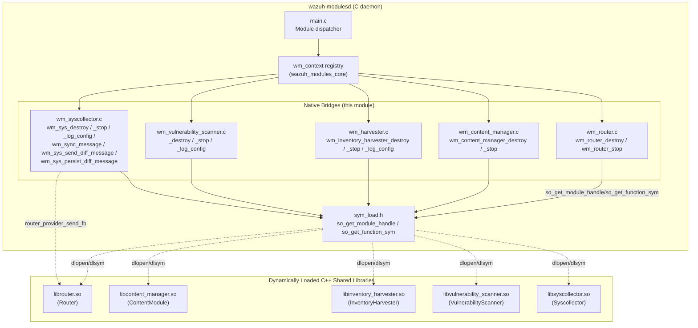
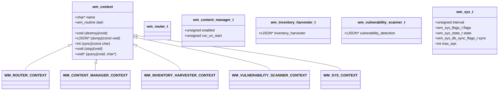
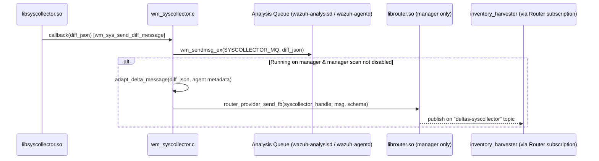
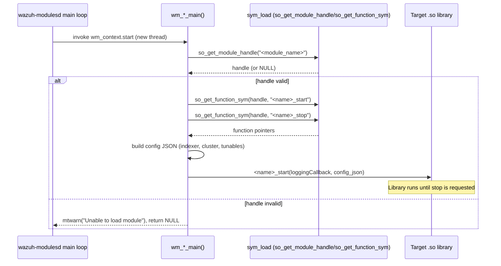
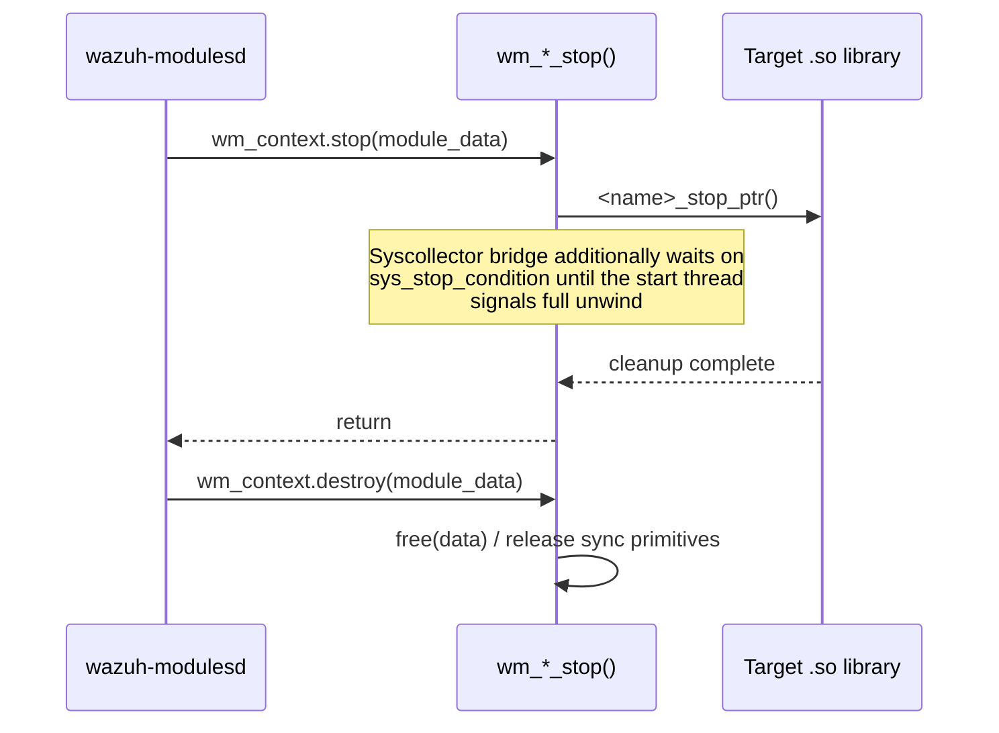
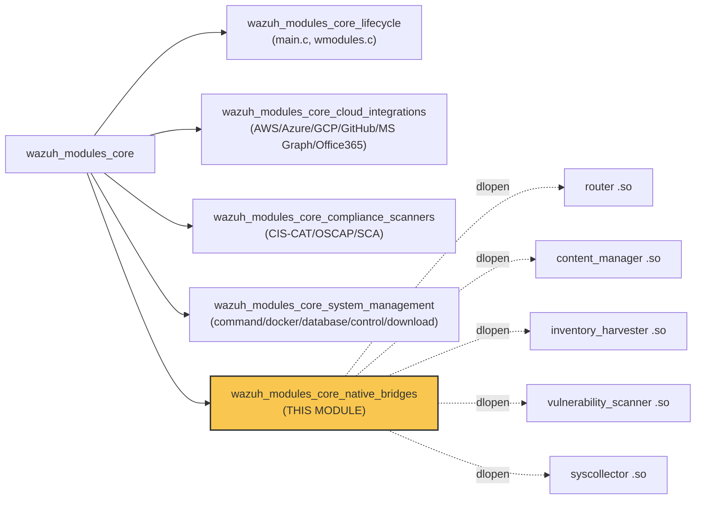

# Wazuh Modules Core — Native Bridges

## Introduction

The **Native Bridges** module is a thin, C-language integration layer inside the legacy `wazuh-modulesd` daemon (see [Wazuh_Modules_Daemon_(C)](Wazuh_Modules_Daemon_(C).md)) that connects the traditional C module-runner architecture to modern, independently-built C++ shared libraries. Rather than implementing business logic itself, this module exposes four thin "wrapper" modules — **Router**, **Content Manager**, **Inventory Harvester**, and **Vulnerability Scanner** — plus the **Syscollector** wrapper, each of which:

1. Registers itself with the generic `wm_context` module-runner interface used by [wazuh_modules_core](wazuh_modules_core.md).
2. Dynamically loads ("dlopen"-style, via `sym_load`) a corresponding pre-compiled shared library that contains the actual feature implementation (written in C++, documented in [Shared_Modules_Infrastructure_(C++)](Shared_Modules_Infrastructure_(C++).md) and [Advanced_Security_Modules_(C++_Inventory_&_Vulnerability)](Advanced_Security_Modules_(C++_Inventory_%26_Vulnerability).md)).
3. Resolves specific entry-point function symbols (`*_start`, `*_stop`, `*_initialize`, etc.) from the loaded library.
4. Forwards lifecycle calls (start/stop/dump) and runtime callbacks (logging, message delivery) between the C daemon and the C++ library.

This "native bridge" pattern allows Wazuh to keep a single long-running C daemon process (`wazuh-modulesd`) while incrementally migrating individual capabilities to independently versioned, modern C++ codebases without rewriting the entire daemon or its configuration/scheduling infrastructure.

## Purpose and Scope

| Bridge (this module) | Underlying shared library | Feature area | Related documentation |
|---|---|---|---|
| `wm_router.c/h` | `router` (`librouter.so`) | Internal pub/sub message routing between Wazuh subsystems | [router](router.md) (part of [Shared_Modules_Infrastructure_(C++)](Shared_Modules_Infrastructure_(C++).md)) |
| `wm_content_manager.c/h` | `content_manager` (`libcontent_manager.so`) | Downloading/updating CTI content (rules, feeds, vulnerability DB snapshots) | [content_manager](content_manager.md) |
| `wm_harvester.c/h` | `inventory_harvester` (`libinventory_harvester.so`) | Transforming FIM/Syscollector deltas into indexer-ready documents | [inventory_harvester_module](inventory_harvester_module.md) |
| `wm_vulnerability_scanner.c/h` | `vulnerability_scanner` (`libvulnerability_scanner.so`) | CVE feed management and vulnerability scanning/alerting | [vulnerability_scanner_module](vulnerability_scanner_module.md) |
| `wm_syscollector.c/h` | `syscollector` (`libsyscollector.so`) | Hardware/OS/network/package inventory collection | [syscollector_module](syscollector_module.md) |

Each bridge is registered as a standard `wmodule` inside `wazuh-modulesd`'s module table (see [wazuh_modules_core](wazuh_modules_core.md) for the parent daemon lifecycle, configuration parsing and thread orchestration), but none contains meaningful business logic of its own — it exists purely to **decouple the ABI/lifetime of the C daemon from the C++ shared libraries**, allowing them to be built, versioned, and (in test/debug builds) swapped independently.

## Architecture

### High-Level Component Diagram

### The `wm_context` Contract

Every bridge conforms to the same `wm_context` structure consumed by the module dispatcher in [wazuh_modules_core](wazuh_modules_core.md):

Each `wm_context` is a static, read-only descriptor: `name` is the module tag used in logs/config (`router`, `content_manager`, `inventory_harvester`, `vulnerability_scanner`, `syscollector`); `start` is the thread entry point invoked by the daemon's thread pool; `destroy`/`stop` are invoked during shutdown; `dump` serializes the effective runtime configuration to JSON (used for `GET /manager/configuration` style API calls, see [manager_module](manager_module.md)); and, for Syscollector only, `sync` bridges inbound synchronization messages coming from `wazuh-db`.

## Component Details

### 1. Router Bridge (`wm_router.c` / `wm_router.h`)

- **Struct**: `wm_router_t` — an empty marker struct; router is a singleton service with no per-instance state.
- **Function pointers resolved**: `router_start`, `router_stop`, `router_initialize`.
- **Behavior**: On `wm_router_main()`, loads `router` via `so_get_module_handle`, calls `router_initialize_ptr(taggedLogFunction)` to inject the daemon's logging callback, then `router_start_ptr()`. `wm_router_stop()` calls `router_stop_ptr()`. `wm_router_destroy()` is a no-op (no heap state to free).
- **Downstream implementation**: See [router](router.md) (`router_core`, `router_pubsub`, `router_api_gateway` sub-modules) under [Shared_Modules_Infrastructure_(C++)](Shared_Modules_Infrastructure_(C++).md). The Router is the central pub/sub bus used by Syscollector (see below), Inventory Harvester, and the Wazuh Engine to exchange structured messages/deltas.

### 2. Content Manager Bridge (`wm_content_manager.c` / `wm_content_manager.h`)

- **Struct**: `wm_content_manager_t { enabled, run_on_start }` — configuration bit-flags (parsed elsewhere in the XML config reader, not shown here).
- **Function pointers resolved**: `content_manager_start`, `content_manager_stop`.
- **Behavior**: `wm_content_manager_main()` loads `content_manager`, then calls `content_manager_start_ptr(mtLoggingFunctionsWrapper)`. `wm_content_manager_stop()` forwards to `content_manager_stop_ptr()`.
- **Downstream implementation**: See [content_manager](content_manager.md) (`content_manager_public_api`, `content_manager_facade`, `content_manager_orchestration`, `content_manager_components`) under [Shared_Modules_Infrastructure_(C++)](Shared_Modules_Infrastructure_(C++).md). Responsible for downloading, decompressing, and applying CTI/vulnerability feed snapshots used by [vulnerability_scanner_module](vulnerability_scanner_module.md).

### 3. Inventory Harvester Bridge (`wm_harvester.c` / `wm_harvester.h`)

- **Struct**: `wm_inventory_harvester_t { cJSON* inventory_harvester }`.
- **Function pointers resolved**: `inventory_harvester_start`, `inventory_harvester_stop`.
- **Behavior**: Builds a JSON configuration object combining:
  - The global `indexer_config` (see [Global_Config_Core](Global_Config_Core.md) / indexer connection settings).
  - Cluster metadata (`clusterEnabled`, `clusterName`, `clusterNodeName`), obtained via `get_cluster_status()`, `get_cluster_name()`, `get_node_name()` — bridging to [cluster_module](cluster_module.md) — or falling back to the local hostname in single-node mode.
  - Calls `wm_inventory_harvester_log_config()` to debug-log the effective configuration, then invokes `inventory_harvester_start_ptr(mtLoggingFunctionsWrapper, config_json)`.
- **Downstream implementation**: See [inventory_harvester_module](inventory_harvester_module.md) under [Advanced_Security_Modules_(C++_Inventory_&_Vulnerability)](Advanced_Security_Modules_(C++_Inventory_%26_Vulnerability).md). Consumes FIM and Syscollector deltas (via the Router) and produces indexer documents for OpenSearch/Wazuh Indexer.

### 4. Vulnerability Scanner Bridge (`wm_vulnerability_scanner.c` / `wm_vulnerability_scanner.h`)

- **Struct**: `wm_vulnerability_scanner_t { cJSON* vulnerability_detection }` — holds the full (possibly legacy-migrated) `<vulnerability-detection>` configuration block.
- **Function pointers resolved**: `vulnerability_scanner_start`, `vulnerability_scanner_stop`.
- **Behavior**:
  - Back-fills missing keys for backward compatibility with the deprecated VD config format (`enabled`, `index-status`, `feed-update-interval` defaults).
  - Assembles a rich configuration JSON including internal tunables read via `getDefine_Int` (`translationLRUSize`, `osdataLRUSize`, `remediationLRUSize`, `managerDisabledScan`), the shared `indexer_config`, EPS throttling (`wmMaxEps`), and cluster metadata (same pattern as the Harvester bridge).
  - Starts the underlying library with `vulnerability_scanner_start_ptr(mtLoggingFunctionsWrapper, config_json)`.
  - `wm_vulnerability_scanner_dump()` strips sensitive/internal fields (`index-status`, `cti-url`, `clusterName`) before returning the JSON used for external API/config-dump consumers.
- **Downstream implementation**: See [vulnerability_scanner_module](vulnerability_scanner_module.md) (facade, database feed manager, scan orchestrator, version matchers) under [Advanced_Security_Modules_(C++_Inventory_&_Vulnerability)](Advanced_Security_Modules_(C++_Inventory_%26_Vulnerability).md). Consumes feeds fetched by the Content Manager and produces vulnerability alerts/inventory documents.

### 5. Syscollector Bridge (`wm_syscollector.c` / `wm_syscollector.h`)

This is the most feature-rich bridge, as it also participates in the Router pub/sub bus and the `wazuh-db`-driven state-synchronization protocol.

- **Struct**: `wm_sys_t`, composed of:
  - `wm_sys_flags_t` — bit-flags for each inventory category (`hwinfo`, `netinfo`, `osinfo`, `programinfo`, `portsinfo`, `allports`, `procinfo`, `hotfixinfo`, `groups`, `users`), plus `scan_on_start`, `notify_first_scan`, `running`.
  - `wm_sys_state_t` — `next_time` for scheduling.
  - `wm_sys_db_sync_flags_t` — synchronization tunables (`enable_synchronization`, `sync_interval`, `sync_response_timeout`, `sync_max_eps`).
  - `max_eps` — output throttling for diff messages.
- **Function pointers resolved**: `syscollector_start`, `syscollector_stop` (from `libsyscollector.so`, implemented in `syscollector_module_native_daemon`, see [syscollector_module](syscollector_module.md)); optionally `router_provider_create` / `router_provider_send_fb` from `librouter.so` when running on a manager.
- **Key responsibilities**:
  1. **Message emission** — `wm_sys_send_diff_message()` forwards each syscollector delta both to the classic analysis queue (`wm_sendmsg_ex` → `SYSCOLLECTOR_MQ`) *and*, on managers, publishes it as a FlatBuffers message on the `deltas-syscollector` Router topic (only if manager-side scanning is not disabled via the `disable_scan_manager` internal option).
  2. **Persistence hook** — `wm_sys_persist_diff_message()` is a stub extension point (guarded by `enable_synchronization`) intended for stateful event persistence.
  3. **Synchronization bridge** — `wm_sync_message()` implements the daemon's generic `sync` callback, invoked when `wazuh-db` needs the module to accept an inbound synchronization payload.
  4. **Reconnection resilience** — `wm_sys_send_message()` implements automatic queue reconnection logic (`MQReconnectPredicated`) guarded by a mutex (`sys_reconnect_mutex`) to survive `wazuh-agentd`/`wazuh-analysisd` restarts.
  5. **Graceful shutdown** — Uses a condition variable (`sys_stop_condition`) to block `wm_sys_stop()` until the main thread signals that shutdown (`shutdown_process_started`) has fully unwound, preventing use-after-free of the shared library.
- **Downstream implementation**: The actual C++ collector logic lives in `syscollector_module_native_daemon` (`Syscollector`, `SysNormalizer`) — see [syscollector_module](syscollector_module.md) — which in turn depends on [System_Information_Data_Provider_(C++)](System_Information_Data_Provider_(C++).md) for OS-specific data collection (hardware, network, packages, ports, users/groups).

## Data Flow

### Syscollector Delta Publication (Bridge acting as a fan-out point)

### Bridge Startup Sequence (generic pattern shared by all 5 bridges)

### Shutdown Sequence

## Configuration Dump (`dump` Callback)

Each bridge implements a `*_dump()` function returning a `cJSON*` tree that mirrors the module's effective configuration. This is consumed by the manager configuration API (`GET /manager/configuration?section=...`, see [manager_module](manager_module.md)) and by `agent_control`/`manager_control` CLI tooling. Notably:

- `wm_router_dump()` and the equivalent functions for Content Manager and Inventory Harvester return a minimal `{"wazuh_control": {"enabled": "yes"}}` placeholder (they have no user-tunable XML configuration surface today).
- `wm_sys_dump()` (Syscollector) is the richest, reflecting every scan-category flag plus the nested `synchronization` sub-object.
- `wm_vulnerability_scanner_dump()` performs field redaction (removing `index-status`, `cti-url`, `clusterName`) before exposing the `vulnerability-detection` block externally.

## Relationship to the Parent Module

This module is one of five siblings inside `wazuh_modules_core` (see [wazuh_modules_core](wazuh_modules_core.md)):

Unlike its siblings (`wazuh_modules_core_lifecycle`, `_cloud_integrations`, `_compliance_scanners`, `_system_management`), which implement their feature logic largely in-line in C, the Native Bridges module deliberately contains **no business logic** — its sole responsibility is dynamic-library loading, configuration marshalling (JSON), logging-callback injection, and lifecycle forwarding. This isolates the C daemon from build/ABI churn in the faster-moving C++ subsystems.

## Key Design Patterns

1. **Late binding via `sym_load`**: All five bridges use the same two-step pattern — `so_get_module_handle(name)` to `dlopen` the shared object (with the OS-appropriate search path), followed by `so_get_function_sym(handle, symbol_name)` to resolve individual entry points. If either step fails, the bridge logs a warning and exits its thread gracefully rather than crashing the daemon.
2. **Logging callback injection**: Every library receives either `taggedLogFunction` or `mtLoggingFunctionsWrapper` — adapter functions from `shared_lib_logging` (see [Agent_&_Manager_Native_Daemons_(C)](Agent_%26_Manager_Native_Daemons_(C).md)) — so that C++ code can emit into the same rotating log files as the rest of `wazuh-modulesd` without linking directly against the C logging implementation.
3. **JSON as the configuration ABI boundary**: Rather than sharing C structs (which would create brittle ABI coupling), Harvester, Vulnerability Scanner, and Syscollector all serialize their configuration into `cJSON` trees before crossing the bridge boundary — the C++ side deserializes independently.
4. **Manager/agent conditional compilation**: The Syscollector bridge uses `#ifndef CLIENT` guards to only load Router integration and manager-side delta publishing on manager builds; agents only forward to the local `SYSCOLLECTOR_MQ`.
5. **Graceful reconnection & shutdown coordination**: The Syscollector bridge is the most defensive, using dedicated mutexes/condition variables (`sys_reconnect_mutex`, `sys_stop_mutex`/`sys_stop_condition`) to avoid races between in-flight message sends and daemon shutdown.

## Related Documentation

- [wazuh_modules_core](wazuh_modules_core.md) — parent module; overall `wazuh-modulesd` daemon lifecycle, module registry, and thread dispatch.
- [Wazuh_Modules_Daemon_(C)](Wazuh_Modules_Daemon_(C).md) — grandparent; full C daemon including agent-upgrade and task-manager modules.
- [router](router.md) / [content_manager](content_manager.md) / [inventory_harvester_module](inventory_harvester_module.md) / [vulnerability_scanner_module](vulnerability_scanner_module.md) — the C++ implementations loaded by these bridges.
- [Shared_Modules_Infrastructure_(C++)](Shared_Modules_Infrastructure_(C++).md) — parent of Router, Content Manager, DBSync, RSync and shared C++ utilities.
- [Advanced_Security_Modules_(C++_Inventory_&_Vulnerability)](Advanced_Security_Modules_(C++_Inventory_%26_Vulnerability).md) — parent of Inventory Harvester and Vulnerability Scanner.
- [syscollector_module](syscollector_module.md) — covers both the Python/API-facing `framework/wazuh/core/syscollector.py` and the native `Syscollector`/`SysNormalizer` C++ daemon loaded by `wm_syscollector.c`.
- [System_Information_Data_Provider_(C++)](System_Information_Data_Provider_(C++).md) — low-level OS data collection consumed by the Syscollector native daemon.
- [cluster_module](cluster_module.md) — source of cluster status/name metadata injected into Harvester and Vulnerability Scanner configuration.
- [manager_module](manager_module.md) — API surface that exposes each bridge's `dump()` output via the manager configuration endpoints.
