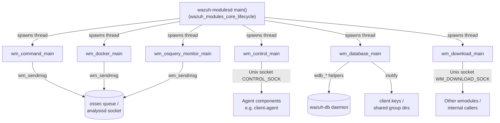
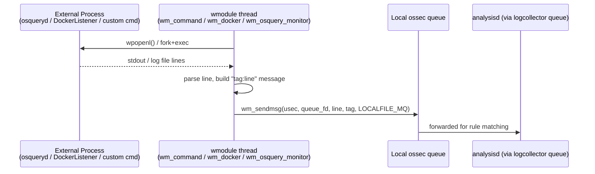
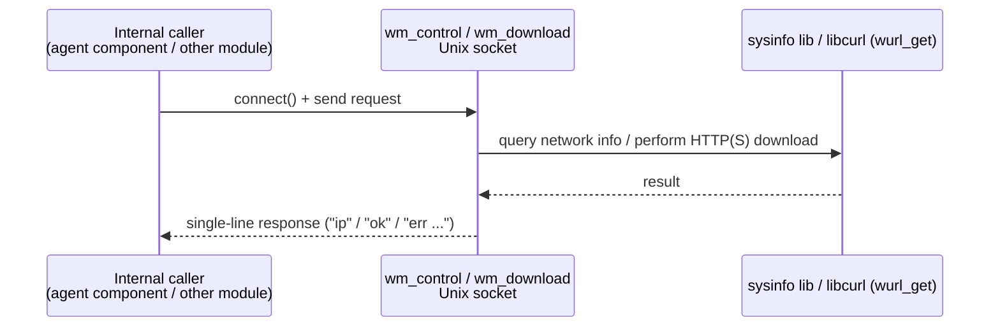

# Wazuh Modules Core: System Management

## 1. Introduction and Purpose

The **System Management** module is a collection of `wazuh_modules` (`wmodules`) plugins that run inside the `wazuh-modulesd` daemon (see [wazuh_modules_core_lifecycle.md](wazuh_modules_core_lifecycle.md) for the daemon's main loop and module registration). Each plugin in this module implements a self-contained system-administration or integration capability that does not belong to the compliance-scanning family ([wazuh_modules_core_compliance_scanners_sca.md](wazuh_modules_core_compliance_scanners_sca.md), CIS-CAT, OpenSCAP) or the cloud-integration family ([wazuh_modules_core_cloud_integrations_aws.md](wazuh_modules_core_cloud_integrations_aws.md), Azure, GCP, GitHub, MS Graph, Office365).

Concretely, this module provides:

* **Custom command execution** — periodically runs an arbitrary, optionally checksum-verified shell command and forwards its output to the manager (`wm_command`).
* **Agent primary-IP discovery service** — a local Unix-socket service that other agent components query to learn the agent's outbound IP address (`wm_control`).
* **Global/agent database synchronization** — keeps `global.db` (via `wazuh-db`) consistent with `client.keys` and the legacy group-assignment files, and performs housekeeping such as removing dangling per-agent databases (`wm_database`).
* **Docker events listener supervisor** — launches and supervises the `DockerListener` Python script and relays its events to the manager (`wm_docker`).
* **Generic file download service** — a local Unix-socket service used by other modules/components to request that the module download a file over HTTP(S) into a sandboxed path (`wm_download`).
* **Osquery integration** — launches/monitors the `osqueryd` binary (or tails its results log if already running elsewhere), injects Wazuh labels as osquery decorators and merges pack configuration (`wm_osquery_monitor`).

All six plugins share the same `wm_context` plugin contract used across `wazuh_modules_core` (see sibling documentation such as [wazuh_modules_core_cloud_integrations_aws.md](wazuh_modules_core_cloud_integrations_aws.md) for the same pattern applied to cloud connectors, and [agent_upgrade_module.md](agent_upgrade_module.md) / [task_manager_module.md](task_manager_module.md) for other manager-side services built on the same daemon).

## 2. Architecture Overview

### 2.1 Plugin contract

Every module in this document (and every other module under `wazuh_modules_core`) registers a static `wm_context` structure that exposes: `start`, `destroy`, `dump` (JSON representation for `GET /manager/configuration`), and optionally `sync`/`stop`/`query`. `wazuh-modulesd`'s `main.c` iterates the configured module list and spawns a thread (or, on Windows, a `DWORD WINAPI` thread) per module calling its `start` routine, which typically never returns until the process is terminated.

### 2.2 Common execution patterns

Two recurring patterns unify the six plugins:

1. **Scheduled/looping executors** (`wm_command`, `wm_docker`, `wm_osquery_monitor`, and — in polling mode — `wm_database`): a `do { ... } while (FOREVER())` loop that either sleeps for a configured interval/cron-like `sched_scan_config`, or blocks on `inotify` file-system events, then performs work and forwards results through `wm_sendmsg`/`SendMSG` to the local queue that `analysisd` (via the `logcollector`/`ossec` queue) consumes.
2. **Local Unix-socket micro-services** (`wm_control`, `wm_download`): bind a Unix domain socket, `select()`/`accept()` in a loop, read one request, perform a synchronous action (resolve primary IP, download a file), and write back a single-line response.

`wm_database` is unique in supporting **both** patterns: on systems with `INOTIFY_ENABLED` it reacts in real time to changes in `client.keys` and the shared-groups directory; otherwise it falls back to a fixed polling `interval`.

### 2.3 Sub-modules

| Sub-module | Focus | Documentation |
|---|---|---|
| Process Execution & Integration Wrappers | Spawns and supervises external processes/log files (`wm_command`, `wm_docker`, `wm_osquery_monitor`) and forwards their output as Wazuh log events | [wazuh_modules_core_system_management_process_integrations.md](wazuh_modules_core_system_management_process_integrations.md) |
| Global Database Synchronization | Keeps `global.db` agents/groups consistent with `client.keys` and legacy group files, and performs DB housekeeping (`wm_database`) | [wazuh_modules_core_system_management_database_sync.md](wazuh_modules_core_system_management_database_sync.md) |
| Local Socket Services | Minimal Unix-socket request/response services used internally: primary-IP discovery (`wm_control`) and generic file download (`wm_download`) | [wazuh_modules_core_system_management_socket_services.md](wazuh_modules_core_system_management_socket_services.md) |

## 3. High-Level Functionality per Sub-module

### 3.1 Process Execution & Integration Wrappers

Covers `wm_command_t`/`wm_command_main` (generic, optionally checksum-verified, scheduled command execution), `wm_docker_t`/`wm_docker_main` (supervises the external `DockerListener` script with retry/attempts logic), and `wm_osquery_monitor_t`/`wm_osquery_monitor_main` (launches/monitors `osqueryd`, tails its JSON results log, injects label decorators and pack configuration). All three read process stdout/log lines and forward them via `wm_sendmsg` to the agent queue for ingestion by the analysis engine. See [wazuh_modules_core_system_management_process_integrations.md](wazuh_modules_core_system_management_process_integrations.md) for full details, sequence diagrams, and configuration structures.

### 3.2 Global Database Synchronization

Covers `wm_database_t`/`wm_database_main`, responsible for: syncing the manager's hostname/OS info into `global.db`, reconciling agents present in `client.keys` against `global.db` (inserting new agents, removing orphaned ones and their artifacts), synchronizing shared-group directories, migrating legacy per-agent group-assignment files into the database, and removing dangling per-agent `wazuh-db` database files. Operates either via `inotify` real-time watches or periodic polling. See [wazuh_modules_core_system_management_database_sync.md](wazuh_modules_core_system_management_database_sync.md).

### 3.3 Local Socket Services

Covers `wm_control_t` (`CONTROL_SOCK` service resolving the agent's `getPrimaryIP()` by inspecting the default-route network interface via the `sysinfo` shared library) and `wm_download_t` (`WM_DOWNLOAD_SOCK` service exposing a `download <url>|<path>|<header>|<data>|<timeout>` protocol used by other components needing to fetch files, e.g. CTI/WPK downloads). See [wazuh_modules_core_system_management_socket_services.md](wazuh_modules_core_system_management_socket_services.md).

## 4. Data Flow Diagrams

## 5. Related Modules

* [wazuh_modules_core_lifecycle.md](wazuh_modules_core_lifecycle.md) — daemon startup, module dispatch table, and shared process-execution helpers (`wm_exec`).
* [wazuh_modules_core_compliance_scanners_sca.md](wazuh_modules_core_compliance_scanners_sca.md) — sibling scanner modules (SCA, CIS-CAT, OpenSCAP) using the same `wm_context` pattern.
* [wazuh_modules_core_cloud_integrations_aws.md](wazuh_modules_core_cloud_integrations_aws.md) — sibling cloud-integration modules.
* [wazuh_modules_core_native_bridges.md](wazuh_modules_core_native_bridges.md) — router/content-manager/syscollector/vulnerability-scanner bridge modules.
* [agent_upgrade_module.md](agent_upgrade_module.md) and [task_manager_module.md](task_manager_module.md) — other manager-side wmodules plugins hosted by the same daemon.
* [wazuh_db.md](wazuh_db.md) — the `wazuh-db` daemon consumed by the Global Database Synchronization sub-module through the `wdb_*` helper API.
