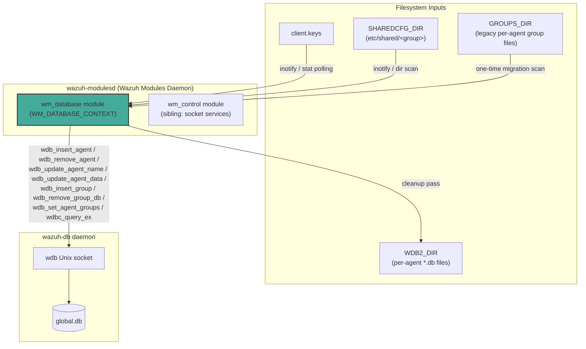
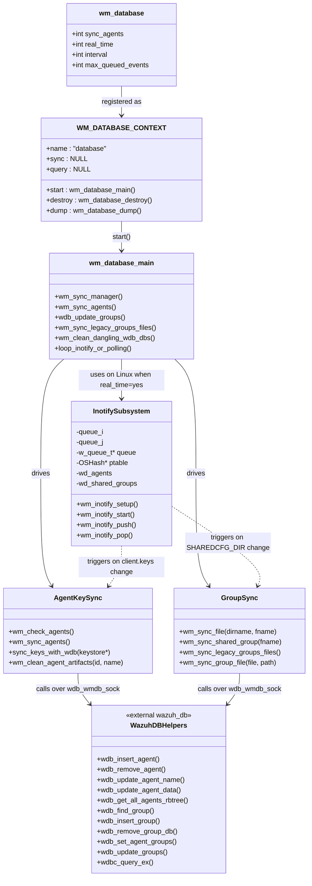
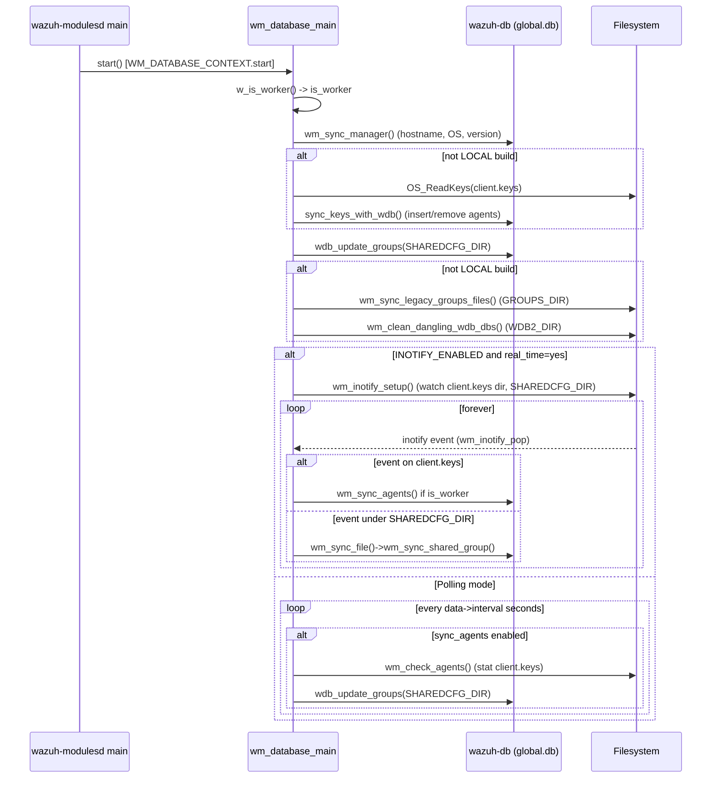
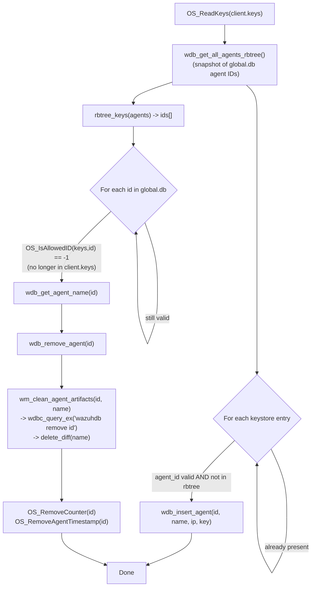
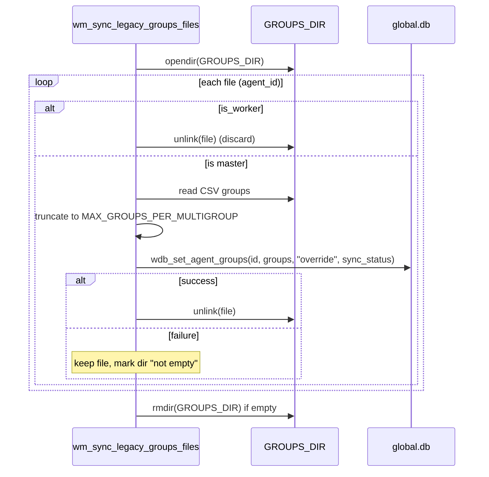
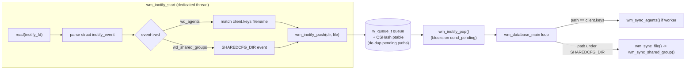
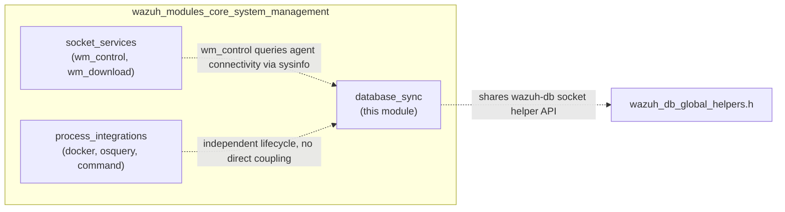

# Database Sync Module (`wm_database`)

## Introduction

The **Database Sync module** (internally named `wm_database`, log tag `wazuh-modulesd:database`) is a manager-only sub-module of the [Wazuh Modules Daemon](wazuh_modules_core.md) responsible for keeping the manager's authoritative agent inventory — stored in `global.db` and managed by [Wazuh DB](wazuh_db.md) — synchronized with the on-disk sources of truth:

- **`client.keys`** — the list of enrolled agents and their keys.
- **`SHAREDCFG_DIR`** (`etc/shared/`) — per-group shared configuration directories.
- **`GROUPS_DIR`** (legacy per-agent group assignment files, migrated to `global.db`).

It also performs manager self-registration (hostname/OS/version) into `global.db`, and periodically cleans up dangling `wazuh-db` per-agent database files that no longer have a corresponding agent.

This module has no public query/sync API of its own (`sync` and `query` context callbacks are `NULL`); it is a purely internal background worker of `wazuh-modulesd` and is only compiled for manager builds (`#ifndef CLIENT` / disabled entirely when built as `LOCAL`, i.e., agent-only builds).

Source files:
- `src/wazuh_modules/wm_database.c`
- `src/wazuh_modules/wm_database.h`

## Purpose and Core Functionality

| Responsibility | Function(s) |
|---|---|
| Manager self-registration in `global.db` | `wm_sync_manager` |
| Detect `client.keys` changes and re-sync agents | `wm_check_agents` (polling) / inotify watch on `wd_agents` |
| Insert/remove agents in `global.db` based on `client.keys` | `sync_keys_with_wdb` (declared in `wm_database.h`, defined in `wm_database.c`) |
| Remove per-agent artifacts (wazuh-db DB, diff folder) for deleted agents | `wm_clean_agent_artifacts` |
| Detect changes in `SHAREDCFG_DIR` group folders and sync group table | `wm_sync_file` → `wm_sync_shared_group` |
| Migrate legacy per-agent `GROUPS_DIR` files into `global.db` | `wm_sync_legacy_groups_files` / `wm_sync_group_file` |
| Remove orphaned `wazuh-db` `.db` files with no matching agent | `wm_clean_dangling_wdb_dbs` |
| Real-time change detection via `inotify` (Linux only) | `wm_inotify_setup`, `wm_inotify_start`, `wm_inotify_push`, `wm_inotify_pop` |
| Module lifecycle (config dump/destroy) | `wm_database_dump`, `wm_database_destroy`, `wm_database_read` |

The module operates in one of two modes, chosen at build/runtime:

1. **Real-time mode** (`INOTIFY_ENABLED`, Linux): uses `inotify` to watch `client.keys` and `SHAREDCFG_DIR` for changes and reacts immediately through an internal producer/consumer queue.
2. **Polling mode** (non-Linux, or `real_time` disabled): the main loop wakes up every `interval` seconds, checks `client.keys`' mtime/inode, and re-scans shared-group directories.

## Architecture Overview

This module is one of three children of the **[System Management](wazuh_modules_core_system_management.md)** group inside `wazuh_modules_core`:
- `wazuh_modules_core_system_management_process_integrations` (docker, osquery, command wodules)
- **`wazuh_modules_core_system_management_database_sync`** (this module)
- `wazuh_modules_core_system_management_socket_services` (`wm_control`, `wm_download`)

It relies on the following external/shared subsystems, documented separately:
- **[wazuh_db](wazuh_db.md)** — the actual SQLite-backed `global.db` engine and `wazuh_db_global_helpers` API (`wdb_insert_agent`, `wdb_remove_agent`, `wdb_update_agent_name`, `wdb_update_agent_data`, `wdb_set_agent_groups`, `wdb_find_group`, `wdb_insert_group`, `wdb_remove_group_db`, `wdb_get_all_agents_rbtree`, `wdb_get_agent_name`, etc.) that this module calls over the `wdb_wmdb_sock` socket.
- **[shared_lib_data_structures](shared_lib_data_structures.md)** primitives from the C shared library (`OSHash`, `w_queue_t`, `rb_tree`) used for the inotify pending-path table and queue.
- **[os_auth](os_auth.md)** and `os_crypto/shared/keys.c` for `keystore`, `keyentry`, `OS_ReadKeys`, `OS_IsAllowedID` used to parse `client.keys`.
- **[framework_core_communication](framework_core_communication.md)** — the Python-side equivalent (`WazuhDBConnection`) used by the API/framework to read the same `global.db` tables that this module writes to.
- **[cluster_module](cluster_module.md)** (`w_is_worker`) — determines whether the local node is a cluster worker, which affects whether legacy group files are synced or simply discarded, and whether agent key sync happens directly (workers) versus being primarily driven by `authd` (master).

## Component Diagram

## Module Lifecycle

## Agent Key Synchronization Flow

`sync_keys_with_wdb()` is the core reconciliation algorithm between the `client.keys` keystore and the `agent` table in `global.db`:

Key points:
- Insertion only happens for numeric, non-zero agent IDs not already present in `global.db` (avoids duplicating manager entry `000`).
- Removal cascades into cleanup of the agent's dedicated `wazuh-db` SQLite file (via the `wazuhdb remove <id>` command sent to the `wdb` socket) and its FIM diff folder (`delete_diff`).
- This routine only runs automatically on **worker** nodes during real-time/polling loops; on the **master**, ongoing add/remove is expected to be driven by `authd`, though the same code path is invoked once at startup for both master and worker.

## Group Synchronization Flow

Two distinct group-related synchronization mechanisms coexist:

1. **Shared-config group table sync** (`wdb_update_groups` at startup / `wm_sync_shared_group` on inotify or dir-scan):
   - For each folder under `SHAREDCFG_DIR`, ensures a matching row exists in the `group` table (`wdb_find_group` / `wdb_insert_group`).
   - If a folder is deleted, the corresponding group row is removed (`wdb_remove_group_db`).

2. **Legacy per-agent group file migration** (`wm_sync_legacy_groups_files` / `wm_sync_group_file`, run once at startup):
   - Reads each file under `GROUPS_DIR` (filename = agent ID, content = CSV of group names).
   - On a worker node, files are simply deleted (group assignment must come from the master).
   - On the master, the CSV is parsed, truncated to `MAX_GROUPS_PER_MULTIGROUP` (keeping the most recent groups), and applied via `wdb_set_agent_groups(id, groups, "override", sync_status)`.
   - Successfully migrated files are deleted; the `GROUPS_DIR` directory itself is removed once empty.

## Real-Time Change Detection (inotify)

On Linux builds with `INOTIFY_ENABLED`, the module avoids fixed-interval polling by watching the filesystem directly:

Implementation notes:
- `ptable` (an `OSHash`) prevents duplicate queuing of the same pending path while it is still unprocessed.
- The queue capacity is bounded by `max_queued_events` (module option), and the module also temporarily raises the kernel's `/proc/sys/fs/inotify/max_queued_events` value if a larger `max_queued_events` is configured (`get_max_queued_events` / `set_max_queued_events`), restoring the previous value afterward.
- Hidden files (dotfiles) under watched directories are ignored.
- If the kernel event queue overflows (`IN_Q_OVERFLOW`), an error is logged; no explicit resync is triggered.

## Dangling Database Cleanup

`wm_clean_dangling_wdb_dbs()` runs once per module start (manager only) and scans `WDB2_DIR` for per-agent SQLite files (`<id>.db`) whose ID no longer resolves to an agent name in `global.db` (`wdb_get_agent_name` returns empty). Such orphaned files are removed to reclaim disk space and prevent stale state from lingering after abnormal agent removals.

## Configuration

Read from `internal_options` (not user XML-configurable) via `wm_database_read()`:

| Option | Range | Meaning |
|---|---|---|
| `wazuh_database.sync_agents` | 0–1 | Enables the whole module (module is only created if `1`) |
| `wazuh_database.real_time` | 0–1 | Enables inotify-based real-time mode (Linux only) |
| `wazuh_database.interval` | 0–86400 | Polling interval in seconds when not in real-time mode |
| `wazuh_database.max_queued_events` | 0–INT_MAX | Bounds the inotify pending-event queue / kernel limit |

`wm_database_dump()` exposes this configuration as JSON for the `GET /manager/configuration` and cluster diagnostic endpoints, surfaced through the [manager_module](manager_module.md) API controller.

## Relationship to Sibling System-Management Modules

Unlike `wm_control` (which answers on-demand queries about system state) or `wm_download`/process-integration wodules (which run independent scheduled scans), `wm_database` is purely a background reconciliation loop with no external query interface — its only "output" is the state of `global.db`, consumed downstream by:
- The [agent_module](agent_module.md) framework/API layer (`framework/wazuh/agent.py`, `framework/wazuh/core/agent.py`) for agent listing, grouping, and status.
- The [cluster_module](cluster_module.md) for group/agent integrity checks across nodes (`get_groups_integrity`, `wdb_global.c::wdb_global_get_groups_integrity`).
- `remoted` (see [remoted](remoted.md)) which reads agent/group assignments to route shared configuration.

## Key External Dependencies Summary

| Dependency | Where documented | Used for |
|---|---|---|
| `wdb_global_helpers.c` / `wdb_global.c` / `wdb.c` | [wazuh_db](wazuh_db.md) | All `global.db` reads/writes (agents, groups) |
| `keystore` / `OS_ReadKeys` / `OS_IsAllowedID` | [os_auth](os_auth.md) / `os_crypto/shared/keys.c` | Parsing `client.keys` |
| `OSHash`, `w_queue_t`, `rb_tree` | [shared_lib_data_structures](shared_lib_data_structures.md) | inotify de-dup table, pending-path queue, agent-ID snapshot |
| `w_is_worker` | [cluster_module](cluster_module.md) | Master vs. worker behavioral branching |
| `wmodules_def.h` (`wm_context`, `wmodule`) | [wazuh_modules_core_lifecycle](wazuh_modules_core_lifecycle.md) | Module registration contract (`start`/`destroy`/`dump`) |
| `parse_uname_string`, `getuname` | [shared_lib_system_utils_sysinfo](shared_lib_system_utils_sysinfo.md) | Building manager OS info for `wm_sync_manager` |

## Summary

`wm_database` is the glue between the manager's filesystem-based agent/group bookkeeping (`client.keys`, `SHAREDCFG_DIR`, legacy `GROUPS_DIR`) and the canonical relational store (`global.db`) served by `wazuh-db`. It runs exclusively on managers, adapts its change-detection strategy to the platform (inotify vs. polling), enforces cluster role semantics (master vs. worker) for agent/group mutation, and performs janitorial cleanup of orphaned per-agent databases — all without exposing any external API, making it an entirely internal, always-on consistency-maintenance component of `wazuh-modulesd`.
