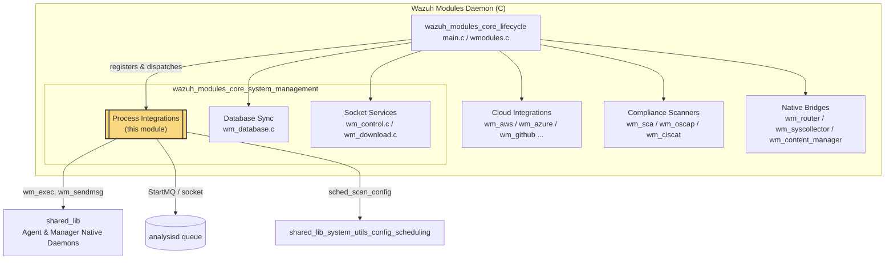
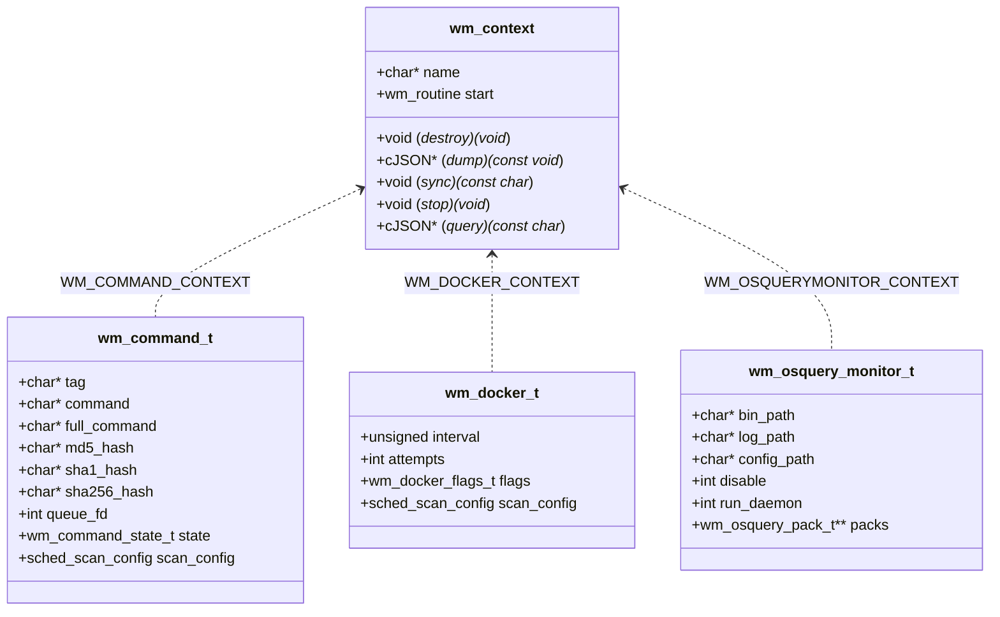
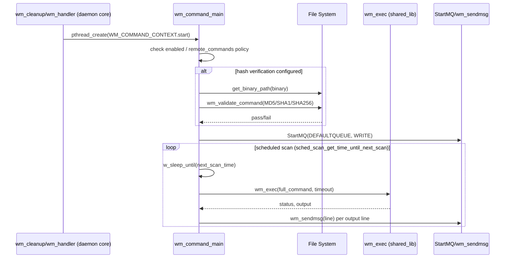
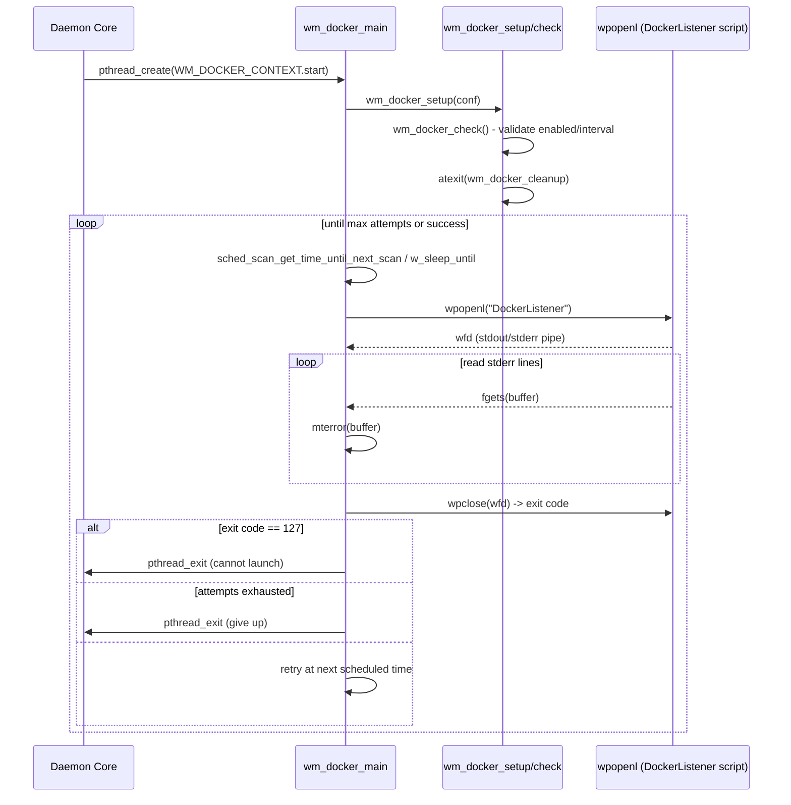
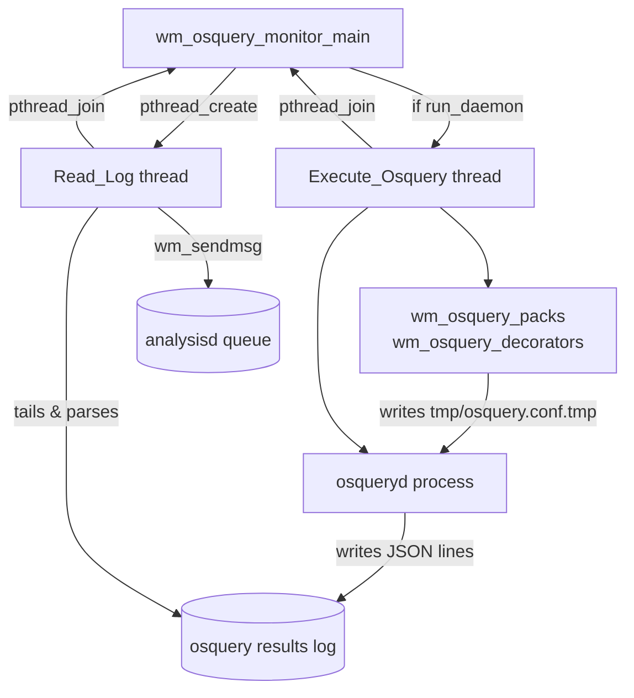
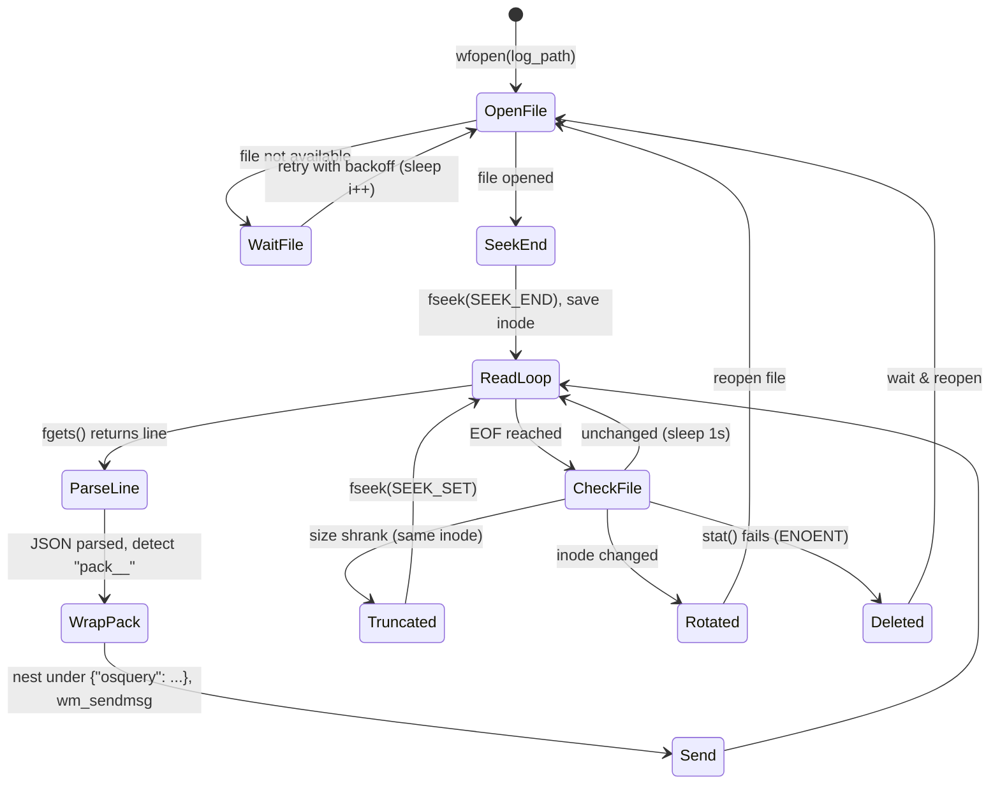
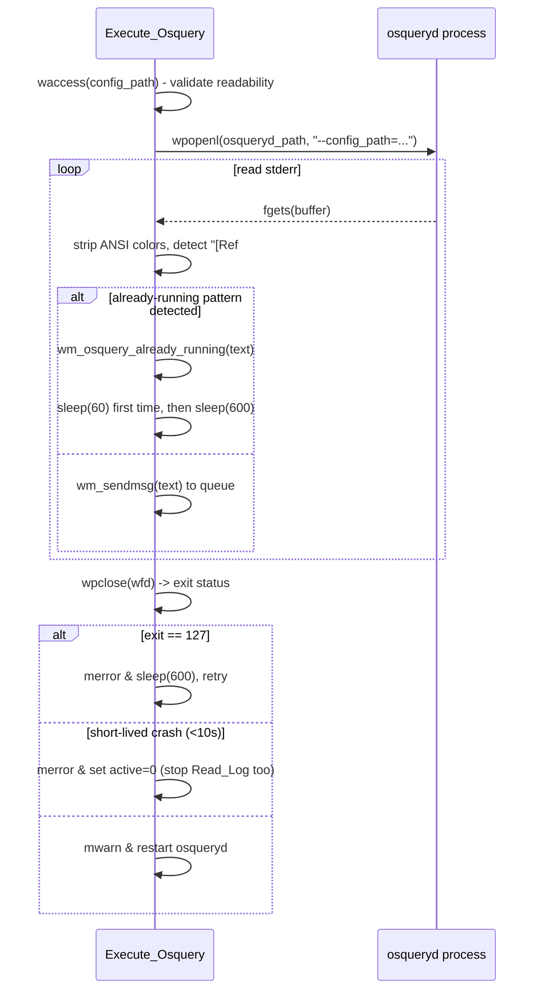
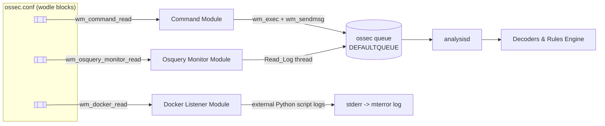

# Wazuh Modules Core – System Management: Process Integrations

## Introduction

The **System Management Process Integrations** module is a leaf component of the [Wazuh Modules Daemon (C)](Wazuh_Modules_Daemon_(C).md) subsystem. It groups together three independent `wodle` (Wazuh module) implementations that are responsible for **launching, supervising, and forwarding output from external processes and system-level integrations** on the Wazuh agent/manager:

| Sub-component | File(s) | Purpose |
|---|---|---|
| **Command Module** | `wm_command.c` / `wm_command.h` | Periodically executes an arbitrary, admin-defined shell command (with optional binary integrity verification) and forwards its output to the analysis engine. |
| **Docker Listener Module** | `wm_docker.c` / `wm_docker.h` | Launches and supervises the `DockerListener` Python script, which streams real-time Docker daemon events into Wazuh. |
| **Osquery Monitor Module** | `wm_osquery_monitor.c` / `wm_osquery_monitor.h` | Manages the `osqueryd` process lifecycle (or attaches to an already-running instance), tailors its configuration (packs, decorators), and tails its JSON results log to forward osquery events. |

All three modules share the same architectural pattern used across the whole Wazuh Modules Daemon: each exposes a `wm_context` (`WM_COMMAND_CONTEXT`, `WM_DOCKER_CONTEXT`, `WM_OSQUERYMONITOR_CONTEXT`) that plugs into the generic module dispatcher (see [Wazuh_Modules_Daemon_(C)](Wazuh_Modules_Daemon_(C).md) → `wazuh_modules_core_lifecycle`). They rely on common scheduling, process-execution, and messaging primitives provided by the shared library rather than re-implementing them.

This document focuses on the internal architecture, data flow, and lifecycle of these three sub-modules, and how they interface with the rest of the Wazuh agent/manager runtime.

---

## Position in the System

The parent module `wazuh_modules_core_system_management` groups process-oriented wodles (this module), the WDB synchronization wodle, and socket-based services (`wm_control`, `wm_download`). All of them are orchestrated by the generic module dispatcher documented in `wazuh_modules_core_lifecycle` (see [Wazuh_Modules_Daemon_(C)](Wazuh_Modules_Daemon_(C).md)).

---

## Common Architectural Pattern

Every wodle in this module follows the same `wm_context` contract defined in `wmodules_def.h` (see `wazuh_modules_core_lifecycle`):

Each `*_main()` routine is spawned as a POSIX thread (or Windows thread) by the daemon core (`wazuh_modules_core_lifecycle`), runs its own scan/scheduling loop, and never returns until the module is disabled or a fatal error occurs.

---

## 1. Command Module (`wm_command.c`)

### Purpose
Executes a single, statically configured shell command on a recurring schedule, optionally validating the target binary's checksum (MD5/SHA1/SHA256) before execution, and forwards each output line to the `logcollector` queue tagged as `osquery`-style syslog input (`LOCALFILE_MQ`).

### Key Data Structures
- `wm_command_t` (`wm_command.h`): holds the raw `command` string, computed `full_command` (with resolved absolute binary path), verification hashes, scheduling config (`sched_scan_config`), and `wm_command_state_t` (persisted `next_time` for scheduling continuity across restarts).

### Process Flow

### Lifecycle Notes
- If `remote_commands` is disabled (client-side `wazuh_command.remote_commands` internal option) and the command originated from `agent.conf` (`agent_cfg=1`), the module refuses to run for security reasons.
- Checksum failures either abort the thread (`pthread_exit`) or emit a warning and continue, depending on `skip_verification`.
- `wm_command_destroy` frees `tag`, `command`, and `full_command`.

---

## 2. Docker Listener Module (`wm_docker.c`)

### Purpose
Wraps an external Python script (`wodles/docker/DockerListener`) that subscribes to the Docker Engine event stream. This C wodle is a **process supervisor**: it launches the script, monitors its stderr for logging, and restarts it on failure up to a configurable number of `attempts`.

### Key Data Structures
- `wm_docker_t` (`wm_docker.h`): `interval` between restart attempts, `attempts` (max retries), `wm_docker_flags_t` (`enabled`, `run_on_start`), and `sched_scan_config`.

### Process Flow

### Lifecycle Notes
- Uses `wm_append_sid`/`wm_remove_sid` (POSIX) or `wm_append_handle`/`wm_remove_handle` (Windows) — shared child-process tracking utilities from `wazuh_modules_core_lifecycle` (`wm_exec.c`) — so the daemon can terminate child processes cleanly on shutdown.
- Exit code `127` (typical for `exec` failure) is treated as fatal and stops the module permanently.
- `wm_docker_destroy` is trivial (single `free`) because the struct contains no dynamically-nested pointers besides itself.

---

## 3. Osquery Monitor Module (`wm_osquery_monitor.c`)

### Purpose
The most complex of the three: it can (a) **launch and supervise** the `osqueryd` binary, and/or (b) **tail** the osquery JSON results log regardless of who started `osqueryd`, forwarding each JSON result line — enriched with Wazuh label "decorators" — to the manager. It also injects `packs` definitions into the osquery configuration file before execution.

### Key Data Structures
- `wm_osquery_monitor_t` (`wm_osquery_monitor.h`): `bin_path`, `log_path`, `config_path`, `disable`, `run_daemon` (supervise vs. attach-only), `add_labels` (inject Wazuh labels as decorators), and an array of `wm_osquery_pack_t` (`name`/`path` pairs for osquery query packs).

### Internal Threads

### `Read_Log` Thread — Log Tailing State Machine

### `Execute_Osquery` Thread — Process Supervision

### Configuration Injection
Before launching `osqueryd`, two optional transformations rewrite the osquery JSON configuration file, always writing the result to `tmp/osquery.conf.tmp` (`TMP_CONFIG_PATH`):

1. **`wm_osquery_packs`** — merges the `packs` array (name→path) from `wm_osquery_monitor_t.packs` into the `"packs"` JSON object of the osquery config, validating each pack file exists (`waccess`) unless it uses a wildcard path.
2. **`wm_osquery_decorators`** — if `add_labels` is set, reads Wazuh agent labels (`ReadConfig(CLABELS, ...)`) and injects them as `SELECT '<value>' AS '<key>';` entries under `decorators.always`, so every osquery result row is annotated with agent metadata.

### Lifecycle Notes
- `active` is a module-level `volatile int` flag shared between `Read_Log` and `Execute_Osquery`; setting it to `0` causes both threads to exit their loops cooperatively.
- If `run_daemon` is false, the module skips `Execute_Osquery` entirely and only tails an externally-managed osquery log (`attach-only` mode) — useful when osquery is managed by another system service.
- `wm_osquery_monitor_destroy` frees `bin_path`, `log_path`, `config_path`, and iterates/frees each `wm_osquery_pack_t` entry plus the `packs` array itself.

---

## Data Flow Overview (All Three Modules)

All three modules ultimately push events into the same local `ossec` queue consumed by `analysisd`/`logcollector` on the manager side, or forwarded upstream by `agentd` when running on an agent. See [Agent_&_Manager_Native_Daemons_(C)](Agent_&_Manager_Native_Daemons_(C).md) for the queue/socket infrastructure (`shared_lib_networking`, `remoted`), and [Wazuh_Engine_Core_(C++)](Wazuh_Engine_Core_(C++).md) for how ingested events are subsequently parsed and normalized.

---

## Dependencies on Other Modules

| Dependency | Used For | Reference |
|---|---|---|
| `wm_context`, `wmodule`, module registration/dispatch loop | Thread lifecycle, config parsing entry points (`wm_command_read`, `wm_docker_read`, `wm_osquery_monitor_read`) | [Wazuh_Modules_Daemon_(C)](Wazuh_Modules_Daemon_(C).md) → `wazuh_modules_core_lifecycle` |
| `wm_exec`, `wpopenl`/`wpclose`, `wm_append_sid`/`wm_remove_sid` | Spawning and tracking child processes (`Execute_Osquery`, Docker script, generic command) | [Wazuh_Modules_Daemon_(C)](Wazuh_Modules_Daemon_(C).md) → `wazuh_modules_core_lifecycle` (`wm_exec.c`) |
| `sched_scan_config`, `sched_scan_get_time_until_next_scan`, `sched_scan_dump` | Cron-like scheduling for Command and Docker modules | [Agent_&_Manager_Native_Daemons_(C)](Agent_&_Manager_Native_Daemons_(C).md) → `shared_lib_system_utils_config_scheduling` |
| `StartMQ`, `wm_sendmsg`, `SendMSG` | Delivering module output/events to the local Wazuh queue | [Agent_&_Manager_Native_Daemons_(C)](Agent_&_Manager_Native_Daemons_(C).md) → `shared_lib_networking` |
| `get_binary_path`, `wm_validate_command` | MD5/SHA1/SHA256 binary verification for the Command module | [Agent_&_Manager_Native_Daemons_(C)](Agent_&_Manager_Native_Daemons_(C).md) → `shared_lib` |
| `ReadConfig(CLABELS, ...)`, `wlabel_t` | Agent label injection as osquery decorators | [Agent_&_Manager_Native_Daemons_(C)](Agent_&_Manager_Native_Daemons_(C).md) → `headers/labels_op.h` |
| `json_fread`/`json_fwrite`, `cJSON` | Reading/rewriting the osquery JSON configuration file | External `cJSON` library (see `Unit_Test_Wrappers_&_Mocks` → `wrappers_externals_cjson` for test doubles) |

Sibling modules within `wazuh_modules_core_system_management`:
- **Database Sync** (`wm_database.c`) — synchronizes agent keys/groups with `wazuh-db`; unrelated to process supervision but shares the same parent grouping and daemon lifecycle.
- **Socket Services** (`wm_control.c`, `wm_download.c`) — provide control-socket and WPK download services; also thread-based wodles following the same `wm_context` pattern.

---

## Configuration Schema Summary

| Module | XML Block | Key Options |
|---|---|---|
| Command | `<wodle name="command">` | `tag`, `command`, `verify_md5`, `verify_sha1`, `verify_sha256`, `skip_verification`, `ignore_output`, `run_on_start`, scheduling (`interval`, `day`, `wday`, `time`) |
| Docker Listener | `<wodle name="docker-listener">` | `disabled`, `run_on_start`, `attempts`, `interval` |
| Osquery | `<wodle name="osquery">` | `disabled`, `run_daemon`, `add_labels`, `bin_path`, `log_path`, `config_path`, `pack` (multiple `name`/`path`) |

Configuration parsing entry points (`wm_command_read`, `wm_docker_read`, `wm_osquery_monitor_read`) are declared in the respective headers but implemented in companion config-parsing translation units registered with the global XML parser (see [Configuration_Data_Structures_(C_Headers)](Configuration_Data_Structures_(C_Headers).md) → `Wmodules_Config`).

---

## Testing

Unit tests for these three sub-modules live under `src/unit_tests/wazuh_modules/`:
- `command/test_wm_command.c`
- `docker/test_wm_docker.c`
- `osquery/test_wm_osquery_already_running.c`

These are documented in [Unit_Tests_-_Wazuh_Modules_(Cloud_Misc)](Unit_Tests_-_Wazuh_Modules_(Cloud_Misc).md), which also covers the shared scheduling test helpers (`wm_scheduling_tests`) used to validate `sched_scan_config` behavior common to the Command and Docker modules.

---

## Summary

This module packages three self-contained, thread-based Wazuh wodles that bridge **external processes and system integrations** (arbitrary commands, Docker events, osquery) into the Wazuh event pipeline. They share a uniform `wm_context` lifecycle contract, delegate process execution and scheduling to shared daemon utilities, and terminate in the same local message queue consumed by `analysisd`. Their design emphasizes resilience (retry/backoff loops, checksum verification, log-rotation handling) appropriate for long-running background daemons supervising unreliable external processes.
