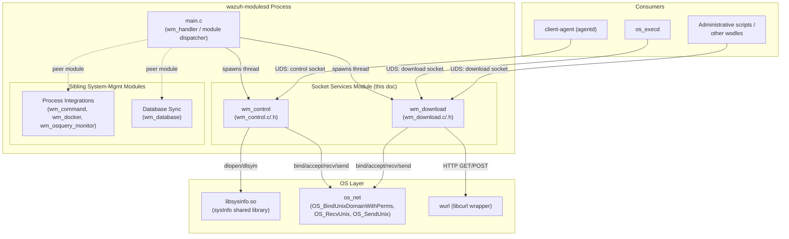
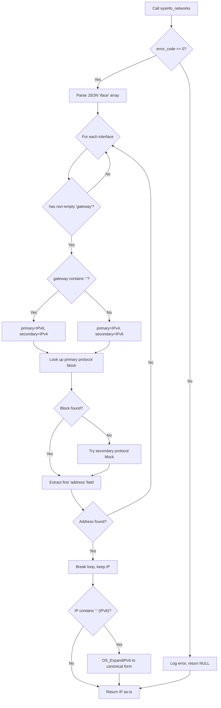
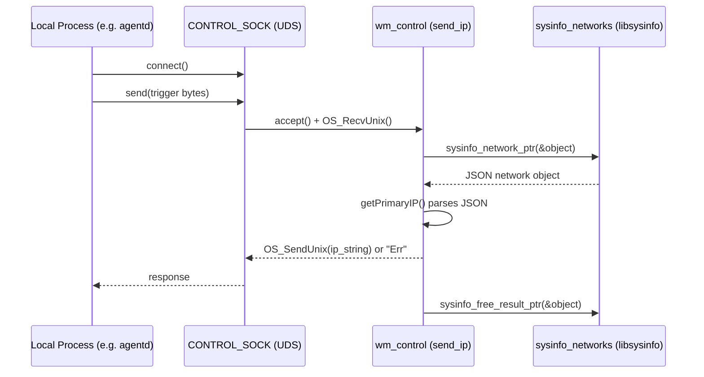
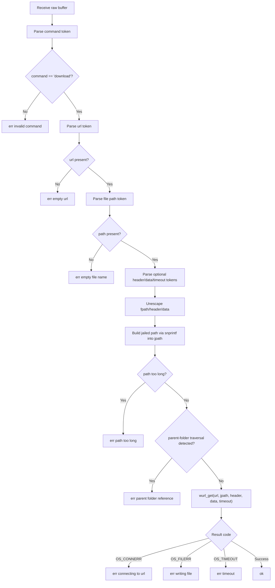
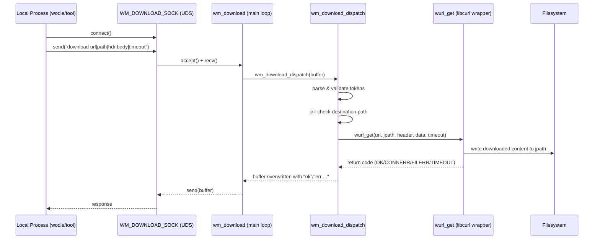
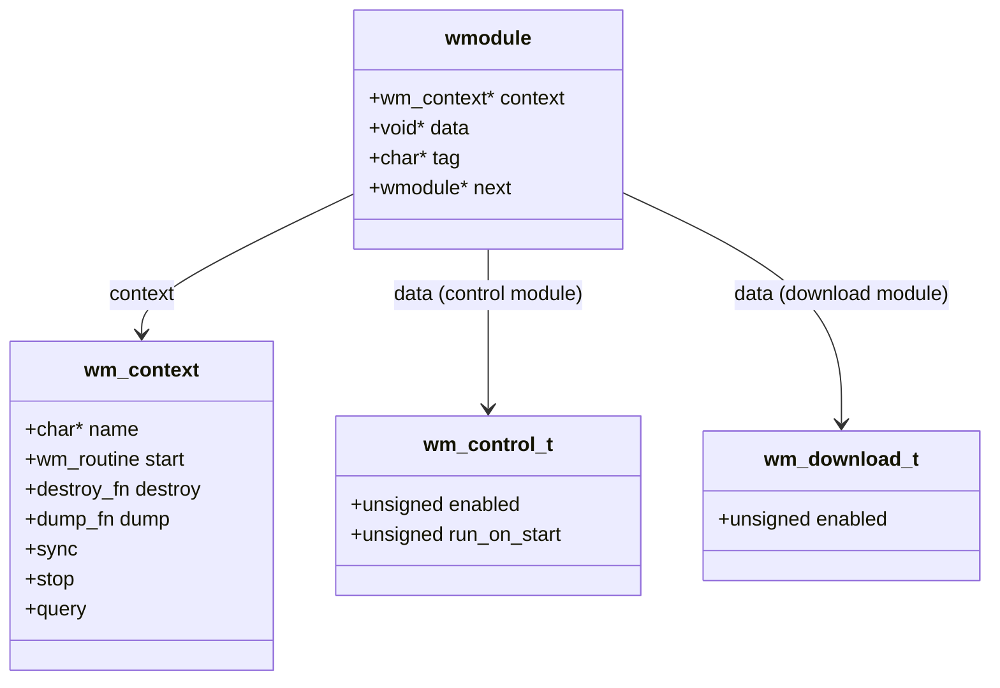
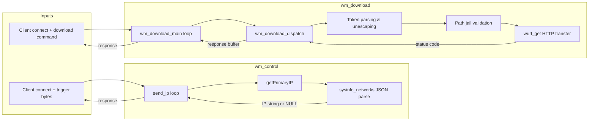

# Wazuh Modules Core – System Management – Socket Services

## Introduction

The **Socket Services** module is a small but critical part of the Wazuh Modules daemon (`wazuh-modulesd`). It provides two independent, self-contained Wazuh modules — **`control`** and **`download`** — that expose lightweight **Unix domain socket (UDS) services** used by other Wazuh components (mainly `agentd`, `execd`, and administrative tooling) to:

1. **Discover the agent's primary network IP address** (`control` module), used during agent enrollment/registration and status reporting.
2. **Perform arbitrary, sandboxed HTTP(S) file downloads on behalf of other processes** (`download` module), used for tasks such as fetching CDB lists, rules, WPK packages, or other remote content without requiring every caller to implement its own HTTP client and path-safety logic.

Both modules follow the standard Wazuh Module (`wmodule`) plugin contract defined in [wazuh_modules_core.md](wazuh_modules_core.md) (see `wm_context` in `wmodules_def.h`) and are registered into the `wazuh-modulesd` module list at startup. They are siblings of other **System Management** modules such as process-monitoring integrations (see [wazuh_modules_core_system_management_process_integrations.md](wazuh_modules_core_system_management_process_integrations.md)) and the WazuhDB synchronization module (see [wazuh_modules_core_system_management_database_sync.md](wazuh_modules_core_system_management_database_sync.md)).

Unlike most Wazuh Modules — which run periodic scheduled scans — the modules in this document run **long-lived socket servers** that block on `accept()`/`select()` loops, servicing requests for the lifetime of the daemon.

---

## Module Scope

| File | Core Components | Responsibility |
|---|---|---|
| `src/wazuh_modules/wm_control.c` | `wm_control_destroy`, `wm_control_main` (internal), `send_ip`, `getPrimaryIP` | Unix socket server (`CONTROL_SOCK`) that resolves and returns the agent/manager's primary IP address. |
| `src/wazuh_modules/wm_control.h` | `wm_control_t` | Configuration struct for the control module (`enabled`, `run_on_start` flags) and its `wmodule` factory (`wm_control_read`). |
| `src/wazuh_modules/wm_download.c` | `wm_download_destroy`, `wm_download_dispatch` (internal `wm_download_main`) | Unix socket server (`WM_DOWNLOAD_SOCK`) that receives download requests (URL + destination path + optional headers/body/timeout) and performs the HTTP(S) transfer using `wurl_get`. |
| `src/wazuh_modules/wm_download.h` | `wm_download_t` | Configuration struct for the download module and its `wmodule` factory (`wm_download_read`). |

Both modules are compiled only for **non-Windows** targets (`#ifndef WIN32` / POSIX-only `#if defined(__linux__) ...`), and `wm_download_read()` explicitly disables itself when compiled for `CLIENT` (agent) builds, restricting the download service to **manager** builds only.

---

## Architecture Overview



For details on the overall daemon lifecycle (`main`, `wm_cleanup`, `wm_handler`) and the generic module registry, see [wazuh_modules_core_lifecycle.md](wazuh_modules_core_lifecycle.md). For the full `wm_context` plugin interface (`start`, `destroy`, `dump`, `sync`, `stop`, `query`) refer to `wmodules_def.h` documented in [wazuh_modules_core.md](wazuh_modules_core.md).

---

## Component 1: `wm_control` – Primary IP Resolution Service

### Purpose

`wm_control` answers the question *"What is this host's primary IP address?"* for other local processes without requiring them to re-implement network interface parsing logic. This is primarily used during **agent enrollment** and **status reporting**, where the agent needs to report the IP it uses to reach the network gateway.

### Configuration Model

```c
typedef struct wm_control_t {
    unsigned int enabled:1;
    unsigned int run_on_start:1;
} wm_control_t;
```

Unlike most modules, `wm_control_read()` (referenced by `WM_CONTROL_CONTEXT`) creates a module descriptor with **no configurable data** in the default build path — the module is effectively always active once compiled in, acting purely as a socket responder rather than a scheduled task.

### Runtime Behavior

`wm_control_main()` performs one-time initialization and then blocks forever inside `send_ip()`:

1. **Dynamic library loading**: Uses `so_get_module_handle("sysinfo")` to `dlopen` the shared `sysinfo` library at runtime (see [SysInfo_Provider.md](SysInfo_Provider.md) / [data_provider_network.md](data_provider_network.md) for the underlying C++ implementation), then resolves two function pointers via `so_get_function_sym`:
   - `sysinfo_networks_func sysinfo_network_ptr` → maps to `sysinfo_networks` (see `src/data_provider/src/sysInfo.cpp::sysinfo_networks`).
   - `sysinfo_free_result_func sysinfo_free_result_ptr` → maps to `sysinfo_free_result`.

   This indirection avoids a hard link-time dependency on the data-provider library and allows `wm_control` to degrade gracefully (returning `NULL`/`"Err"`) if the library is unavailable.

2. **Socket server loop** (`send_ip`):
   - Binds a `SOCK_STREAM` Unix domain socket at `CONTROL_SOCK` with permissions `0660`, owned by the current UID and the Wazuh group (via `wm_getGroupID()`).
   - Uses `select()` to wait for incoming connections (interruption-safe: retries on `EINTR`).
   - On each connection: `accept()`, then `OS_RecvUnix()` to read up to `IPSIZE` bytes.
   - Any received payload triggers a call to `getPrimaryIP()`; the *content* of the client request is not otherwise parsed — the socket acts as a simple "ping-for-IP" trigger.
   - Sends back either the resolved IP string (via `OS_SendUnix`) or the literal string `"Err"` if resolution failed.
   - Closes the peer connection and continues looping (fully iterative, single-threaded server — one client at a time).

### IP Resolution Algorithm (`getPrimaryIP`)



Key design points:
- The function iterates network interfaces reported by `sysinfo_networks` (JSON) looking for the **first interface that has a configured gateway**, treating that as the "default route" interface.
- It prefers the address family matching the gateway's family (IPv6 gateway → prefer IPv6 address; otherwise IPv4), falling back to the other family if the preferred one is absent.
- IPv6 results are expanded to their canonical form via `OS_ExpandIPv6` (from `validate_op.c`, see [Unit_Tests_-_Networking_Regex_XML_Zlib.md](Unit_Tests_-_Networking_Regex_XML_Zlib.md) for related tests) before being returned.
- The caller **owns** the returned pointer and must `free()` it — documented explicitly in the function's Doxygen comment.

### Sequence Diagram – Client Request



### Module Destruction

`wm_control_destroy()` is invoked by the module manager during shutdown (`wm_destroy` in `wmodules.c`, see [wazuh_modules_core_lifecycle.md](wazuh_modules_core_lifecycle.md)). It safely unloads the dynamically loaded `sysinfo` library via `so_free_library()` if it was loaded, preventing resource leaks. Note that because `send_ip()` runs an infinite blocking loop with no shutdown signal check, in practice the module's socket-server thread is terminated by the daemon's process exit rather than a graceful in-loop stop — a pattern shared with several other legacy Wazuh Modules socket servers (compare with `wm_database`'s daemon loop in [wazuh_modules_core_system_management_database_sync.md](wazuh_modules_core_system_management_database_sync.md)).

---

## Component 2: `wm_download` – Sandboxed File Download Service

### Purpose

`wm_download` centralizes outbound HTTP(S) downloads for the manager process. Rather than every module or wodle linking against `libcurl` and re-implementing path-safety checks, they can send a simple pipe-delimited text command over a Unix socket and receive a plain-text status response. This is used, for example, by tasks that need to fetch CTI/vulnerability feed files, agent packages, or other remote resources (see [engine_geo.md](engine_geo.md) for related download consumers at the Engine layer, and [Advanced_Security_Modules_(C++_Inventory_&_Vulnerability)](Advanced_Security_Modules_(C%2B%2B_Inventory_%26_Vulnerability)).md for vulnerability-feed downloading use-cases).

### Configuration Model

```c
typedef struct wm_download_t {
    unsigned int enabled:1;
} wm_download_t;
```

`wm_download_read()` reads the `enabled` flag from the internal options (`wazuh_download.enabled`, default `0`) via `getDefine_Int`. Critically:

```c
wmodule * wm_download_read() {
#ifdef CLIENT
    // This module won't be available on agents
    return NULL;
#else
    ...
#endif
}
```

This means **the download service only exists in manager (server) builds** — agents never expose this socket, which is an intentional security boundary (agents should not act as arbitrary download proxies).

### Runtime Behavior

`wm_download_main()`:
1. Exits immediately (`pthread_exit`) if `data->enabled` is false.
2. Binds `WM_DOWNLOAD_SOCK` as a Unix `SOCK_STREAM` socket (0660 permissions, same ownership model as `wm_control`), retrying with exponential-ish backoff (60s, growing up to 600s cap) if binding fails.
3. Loops forever: `accept()` → `recv()` up to `OS_MAXSTR` bytes → `wm_download_dispatch(buffer)` mutates the buffer in place with the response → `send()` the mutated buffer back → `close(peer)`.

### Request Protocol

The wire protocol is a single pipe (`|`)-delimited ASCII line:

```
download <url>|<file_path>|[header]|[body]|[timeout]
```

- **command**: must be literally `download` (currently the only supported command).
- **url**: HTTP/HTTPS URL to fetch, delimited by the first space then by `|`.
- **file_path**: destination path (relative, jailed — see security section below).
- **header** *(optional)*: HTTP header string to send with the request.
- **body** *(optional)*: HTTP request body (e.g., for POST-like usage supported by `wurl_get`).
- **timeout** *(optional)*: integer seconds, parsed with `atol`.

All optional fields (`fpath`, `header`, `data`) are **unescaped** by replacing the literal sequence `\|` with `|`, allowing pipe characters to appear inside field values when properly escaped by the client.

### Request Dispatch Flow



### Security Considerations

`wm_download_dispatch` implements two explicit safety checks before touching the filesystem:

1. **Path length bounding** — the destination path is copied into a fixed-size `jpath[PATH_MAX]` buffer via `snprintf`; if the formatted length would exceed `PATH_MAX`, the request is rejected with `"err path too long"`.
2. **Path traversal ("jail") protection** — `w_ref_parent_folder(jpath)` (from the shared library, see [shared_lib_file_io.md](shared_lib_file_io.md)) detects `..`-style parent-folder references and rejects the request, preventing a malicious or buggy caller from writing outside the intended destination directory.

Because this module only exists on **manager** builds and its socket is filesystem-permission-restricted (`0660`, owned by the Wazuh group), only trusted local processes running as the Wazuh user/group can issue download requests.

### Sequence Diagram – Download Request



### Module Destruction

`wm_download_destroy(wm_download_t * data)` performs a simple `free(data)` — the module holds no dynamically loaded libraries or open handles beyond the (never explicitly closed) listening socket, which is reclaimed by the OS at process termination.

---

## Cross-Cutting Concerns

### Shared Infrastructure Dependencies

Both modules rely on common Wazuh shared-library primitives documented in other module docs:

| Dependency | Used For | Documented In |
|---|---|---|
| `OS_BindUnixDomainWithPerms`, `OS_RecvUnix`, `OS_SendUnix`, `recv`/`send`/`accept` | Unix domain socket transport | [os_net.md](os_net.md) / [shared_lib_networking.md](shared_lib_networking.md) |
| `so_get_module_handle`, `so_get_function_sym`, `so_free_library` | Runtime dynamic library loading (`sysinfo`) | [shared_lib_system_utils.md](shared_lib_system_utils.md) |
| `wurl_get` | HTTP(S) client (libcurl wrapper) | [shared_lib_networking.md](shared_lib_networking.md) |
| `w_ref_parent_folder`, path/string utilities (`wstr_chr`, `wstr_replace`) | Path traversal safety & string parsing | [shared_lib_file_io.md](shared_lib_file_io.md), [shared_lib_string_validation.md](shared_lib_string_validation.md) |
| `wm_getGroupID` | Resolves the Wazuh group for socket permissions | [wazuh_modules_core.md](wazuh_modules_core.md) |
| `mtinfo`/`mterror`/`mdebug1`/`mdebug2` logging macros | Module-tagged logging | [shared_lib_logging.md](shared_lib_logging.md) |

### Module Registration Pattern

Both modules follow the exact same `wm_context` registration idiom used throughout `wazuh_modules_core` (see sibling docs [wazuh_modules_core_system_management_process_integrations.md](wazuh_modules_core_system_management_process_integrations.md) and [wazuh_modules_core_system_management_database_sync.md](wazuh_modules_core_system_management_database_sync.md)):



Each module exposes a `wm_context` singleton (`WM_CONTROL_CONTEXT`, `WM_DOWNLOAD_CONTEXT`) with `.start` bound to its long-running main function and `.destroy` bound to its cleanup routine. These are wired into the generic `wmodule` linked list (`wmodules_def.h::wmodule.next`) at configuration-read time and iterated over by the daemon's dispatcher (`wm_handler` in `main.c`) and cleaned up via `wm_destroy` → `wm_free(wmodules)` at shutdown (see [wazuh_modules_core_lifecycle.md](wazuh_modules_core_lifecycle.md)).

### Comparison: `control` vs `download`

| Aspect | `wm_control` | `wm_download` |
|---|---|---|
| Availability | Agents & Managers | **Managers only** (`#ifdef CLIENT` disables it) |
| Socket | `CONTROL_SOCK` | `WM_DOWNLOAD_SOCK` |
| Trigger for action | Any received bytes | Structured pipe-delimited command string |
| External dependency | `sysinfo` shared library (dynamically loaded) | `libcurl` via `wurl_get` (statically linked) |
| Failure handling | Returns `"Err"` string | Returns detailed `"err <reason>"` strings |
| Configuration | Effectively always-on when compiled | Explicit `enabled` flag (`wazuh_download.enabled` internal option) |
| Path safety concerns | None (no file I/O) | Path length + parent-folder traversal checks |

---

## Data Flow Summary



---

## Where This Module Fits in the Larger System

- **Parent module**: [wazuh_modules_core_system_management.md](wazuh_modules_core_system_management.md) — groups this module together with process-integration wodles (`wm_command`, `wm_docker`, `wm_osquery_monitor`) and the database-synchronization wodle (`wm_database`).
- **Grandparent module**: [wazuh_modules_core.md](wazuh_modules_core.md) — the full `wazuh-modulesd` daemon, including cloud integrations, compliance scanners (SCA/OSCAP/CIS-CAT), and native bridges (router, content manager, syscollector, vulnerability scanner).
- **Consumers**: The `control` socket is primarily consumed by `client-agent` (agentd) during registration/status flows (see [client_agent_native_communication.md](client_agent_native_communication.md)); the `download` socket is consumed by various manager-side wodles and administrative tools needing safe, centralized file retrieval.
- **Testing**: Unit tests for the control module live under `src/unit_tests/wazuh_modules/control/test_wm_control.c` (see [Unit_Tests_-_Wazuh_Modules_(Cloud_Misc)](Unit_Tests_-_Wazuh_Modules_(Cloud_Misc)).md) — note that `wm_download` currently has no dedicated unit test suite in the codebase, unlike most other wodles.

---

## Summary

The Socket Services module demonstrates two minimal, purpose-built Unix-domain-socket microservices embedded inside the monolithic `wazuh-modulesd` daemon:

- **`wm_control`** exposes low-risk, read-only system information (primary IP) via dynamic loading of the `sysinfo` provider, decoupling the module manager from a hard compile-time dependency on the data-provider library.
- **`wm_download`** exposes a carefully sandboxed HTTP(S) download primitive restricted to manager builds, with explicit protections against path traversal and malformed requests.

Both follow the standard `wm_context`/`wmodule` plugin pattern shared by every other module in [wazuh_modules_core.md](wazuh_modules_core.md), making them straightforward to reason about in isolation despite operating as always-on socket servers rather than the more common scheduled-scan pattern used elsewhere in the Wazuh Modules daemon.
