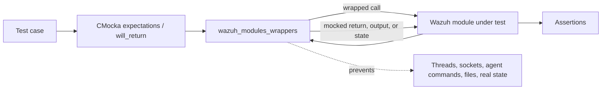
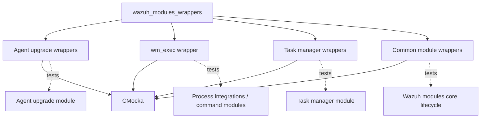
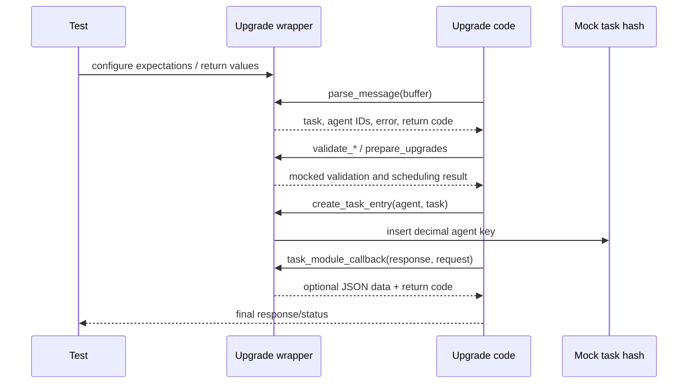
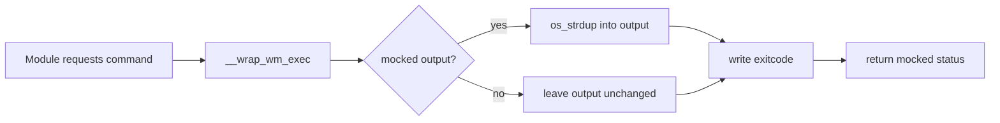
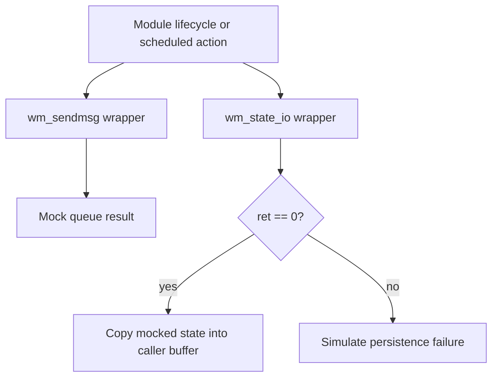
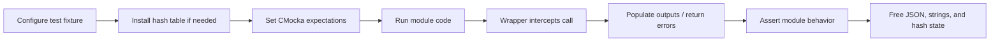

# `wazuh_modules_wrappers`

`wazuh_modules_wrappers` is the CMocka test-double layer for Wazuh module code. It replaces selected module entry points, parsers, validators, task handlers, execution helpers, messaging functions, and state persistence with controllable functions. Tests can therefore verify orchestration and error handling without starting real module threads, contacting agents, executing commands, writing state, or depending on external services.

The wrappers do not implement production module behavior. The production responsibilities remain documented in [wazuh_modules_core](wazuh_modules_core.md), [agent_upgrade_module](agent_upgrade_module.md), and [task_manager_module](task_manager_module.md).

## Position in the test architecture

The files are under `src/unit_tests/wrappers/wazuh/wazuh_modules/` and are linked into tests using the linker-wrap convention. A production call such as `wm_exec()` resolves to `__wrap_wm_exec()` during the test binary, where CMocka expectations and return values control the result.

The module has four functional areas:

| Area | Source | Main purpose |
| --- | --- | --- |
| Agent upgrade | `wm_agent_upgrade_agent_wrappers.c`, `wm_agent_upgrade_wrappers.c` | Control parsing, validation, task creation, upgrade dispatch, manager/agent startup, and task callbacks. |
| Command execution | `wm_exec_wrappers.c` | Substitute command execution and expose output, exit status, and return code. |
| Task manager | `wm_task_manager_wrappers.c` | Substitute task-message parsing, processing, response conversion, and result parsing. |
| Common module services | `wmodules_wrappers.c` | Substitute module messaging and serialized state I/O. |

## Component relationships

Related test doubles for lower-level dependencies are intentionally separate; for example, see [shared_wrappers](shared_wrappers.md), [wazuh_db_wrappers](wazuh_db_wrappers.md), [os_net_wrappers](os_net_wrappers.md), and [os_xml_wrappers](os_xml_wrappers.md).

## Agent upgrade wrappers

### Agent-side boundary

`wm_agent_upgrade_agent_wrappers.c` provides two boundaries:

- `__wrap_wm_agent_upgrade_start_agent_module(agent_config, enabled)` checks both arguments with `check_expected` and has no return value.
- `__wrap_wm_agent_upgrade_process_command(buffer, output)` checks the input buffer, assigns `*output` from `mock_type(char *)`, and returns a mocked `size_t`.

These hooks let agent-side tests exercise disabled/enabled startup and command-response handling without opening the agent upgrade communication path. See [agent_upgrade_agent](agent_upgrade_agent.md) and [agent_upgrade_com](agent_upgrade_com.md) for the surrounding production and test behavior.

### Manager-side boundaries

`wm_agent_upgrade_wrappers.c` covers the manager workflow. The wrappers fall into these groups:

| Group | Wrapped operations |
| --- | --- |
| Lifecycle and scheduling | `start_manager_module`, `check_status`, `prepare_upgrades`, `cancel_pending_upgrades` |
| Message and response conversion | `parse_message`, `parse_agent_response`, `parse_agent_upgrade_command_response`, `parse_data_response`, `parse_response`, `parse_task_module_request` |
| Upgrade execution | `process_upgrade_command`, `process_upgrade_custom_command`, `process_agent_result_command`, `process_upgrade_result_command`, `send_command_to_agent`, `send_tasks_information` |
| Task bookkeeping | `create_task_entry`, `remove_entry`, `get_first_node`, `get_next_node`, `get_agent_ids`, `task_module_callback` |
| Validation | `validate_id`, `validate_status`, `validate_system`, `validate_version`, `validate_wpk`, `validate_wpk_custom`, `validate_wpk_version`, `validate_task_ids_message`, `validate_task_status_message` |

Most wrappers use `check_expected(...)` for scalar/string arguments and `check_expected_ptr(...)` for pointer identity. Results are supplied through `mock()` or `mock_type(...)`. Several wrappers also populate output structures so the caller can continue through a realistic branch:

- `parse_message` writes mocked task, agent-ID, and error pointers.
- The agent-response parsers allocate returned strings with `os_strdup`.
- `validate_system` writes the selected package type.
- `validate_version` writes `wpk_version` for an upgrade task.
- Task-status and task-ID validators write status, agent ID, task ID, and response data.
- `parse_task_module_request`, `parse_response`, and the task callback attach mocked JSON nodes to the expected JSON locations.

The file also defines a shared `OSHash *hash_table`. `setup_hash_table()` creates it and optionally installs a task destructor; `teardown_hash_table()` frees it. `create_task_entry` inserts tasks under decimal agent-ID keys. `get_first_node` and `get_next_node` can either return explicitly mocked nodes or delegate to the real hash traversal, allowing tests to choose between deterministic edge cases and realistic iteration.

The detailed upgrade paths are covered by [agent_upgrade_parsing](agent_upgrade_parsing.md), [agent_upgrade_validate](agent_upgrade_validate.md), [agent_upgrade_commands](agent_upgrade_commands.md), [agent_upgrade_tasks](agent_upgrade_tasks.md), [agent_upgrade_tasks_callbacks](agent_upgrade_tasks_callbacks.md), and [agent_upgrade_upgrades](agent_upgrade_upgrades.md).

## Command execution wrapper

`__wrap_wm_exec(command, output, exitcode, secs, add_path)` verifies the command, timeout, and path arguments. It then optionally duplicates mocked command output into `*output`, writes a mocked exit code, and returns a mocked wrapper status. `expect_wm_exec(...)` is a convenience fixture that registers the corresponding string/value expectations and return sequence.

This prevents tests from invoking operating-system commands while preserving the production API contract. See [wazuh_modules_core_system_management_process_integrations](wazuh_modules_core_system_management_process_integrations.md) for the consumers.

## Task manager wrappers

`wm_task_manager_wrappers.c` is compiled only when `CLIENT` is not defined. It intercepts task-manager message parsing, task processing, response construction, and result parsing:

- `parse_message` returns a mocked JSON task.
- `process_task` checks the task, writes a mocked error code, and returns mocked JSON.
- `parse_data_response` verifies error, agent, task, and optional status values.
- `parse_data_result` verifies node, module, command, status, error, timestamps, and request command. Its response object is deliberately unused.

The conditional compilation reflects that these task-manager operations belong to manager-side functionality. See [task_manager_module](task_manager_module.md) and [wm_task_manager_commands_tests](wm_task_manager_commands_tests.md).

## Common module services

`wmodules_wrappers.c` isolates two cross-cutting services:

- `__wrap_wm_sendmsg(usec, queue, message, locmsg, loc)` verifies scheduling, queue, payload, localization message, and location, then returns a mocked status.
- `__wrap_wm_state_io(tag, op, state, size)` verifies the state operation and pointer. It returns a mocked status; on success (`ret == 0`) it copies mocked bytes into the supplied state buffer.

These hooks are useful for testing retry, startup, shutdown, serialization, and recovery branches without real message queues or state files. The broader lifecycle is described in [wazuh_modules_core_lifecycle](wazuh_modules_core_lifecycle.md) and [wmodules_tests](wmodules_tests.md).

## Mocking conventions and maintenance notes

1. Register expectations before invoking the code under test. Use `expect_string` for string contents, `expect_value` for scalar values, `expect_pointer`/`check_expected_ptr` when identity matters, and `will_return`/`mock_type` for outputs.
2. Match the return queue to the wrapper’s read order. A wrapper may consume multiple mocked values and may write through output pointers before returning.
3. Free allocated strings and JSON objects according to the owning test. The wrappers use `os_strdup`, `cJSON_AddItemToArray`, and `cJSON_AddItemToObject`; ownership can therefore move to the returned JSON tree.
4. Initialize and tear down `hash_table` around tests that exercise task bookkeeping. The global is test infrastructure state and is not thread-safe by itself.
5. Keep production semantics out of wrappers. If a production signature changes, update the wrapper header, implementation, linker-wrap configuration, and affected expectations together.
6. Preserve the `#ifndef CLIENT` guard for manager-only task-manager hooks unless the client build contract changes.

## Test flow summary

The wrapper layer is therefore a controllable boundary between module orchestration and side effects. It complements, rather than duplicates, the module-specific documentation and the lower-level wrapper families.
