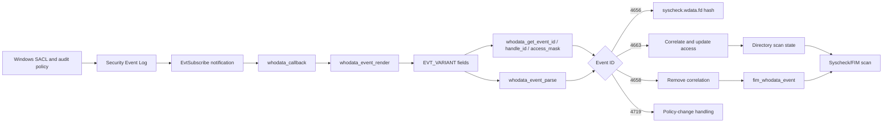
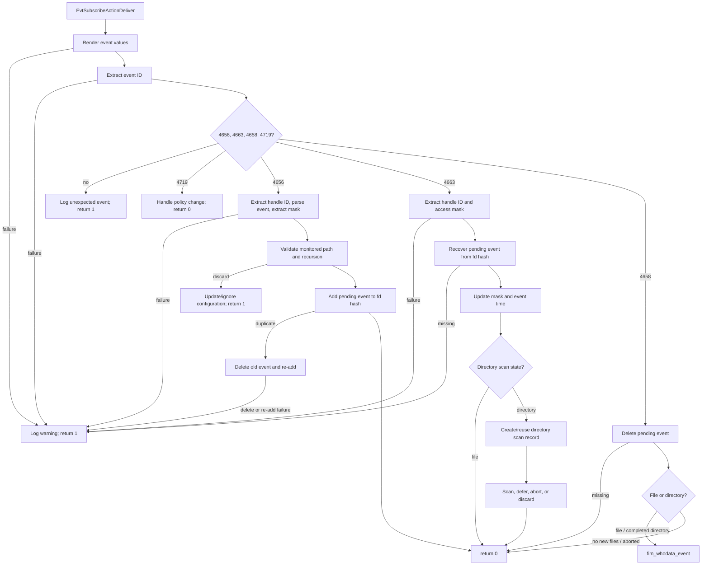
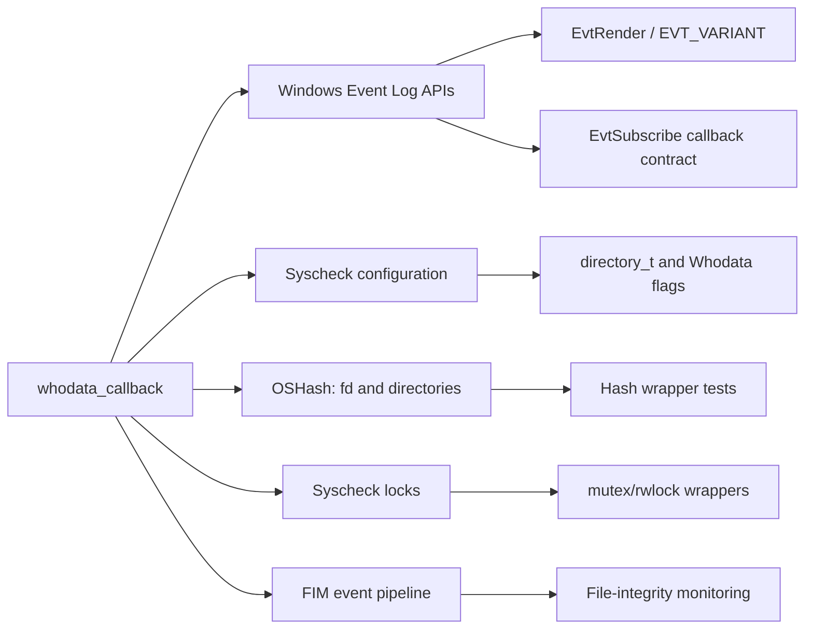
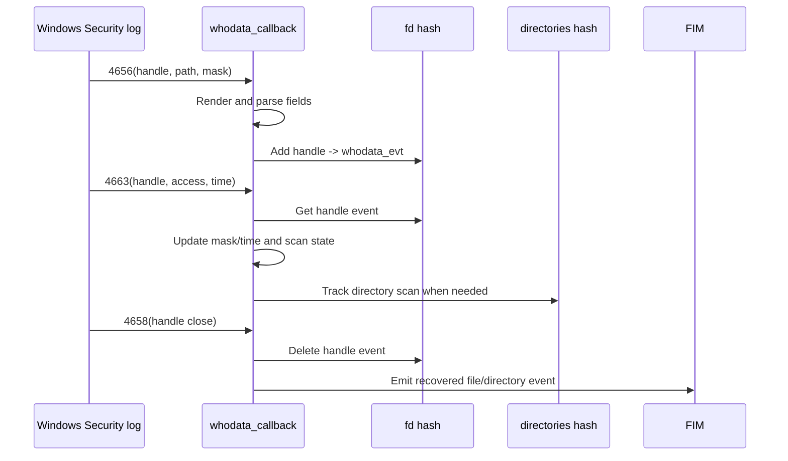

# `whodata_callback_tests`

`whodata_callback_tests` is the CMocka test group for the Windows Syscheck/FIM Whodata event callback. It validates how Windows Security Event Log records are rendered, parsed, correlated through handle and directory hash tables, and converted into file-integrity events or directory-scan state transitions.

The tests are implemented in `src/unit_tests/syscheckd/whodata/test_win_whodata.c`, in the `whodata_callback_tests[]` suite. The same source file also contains tests for the surrounding Whodata implementation; those neighboring responsibilities are documented in [test_win_whodata.md](test_win_whodata.md). For startup and subscription behavior, see [whodata_scan_startup_tests.md](whodata_scan_startup_tests.md); for the production Whodata implementation, see [syscheckd_whodata.md](syscheckd_whodata.md) and [syscheckd_whodata_audit.md](syscheckd_whodata_audit.md).

## Scope and purpose

The callback receives Windows Event Log subscription notifications and handles the event IDs used by real-time Whodata monitoring:

| Event ID | Meaning in the callback | Main state change |
|---|---|---|
| 4656 | Object handle/request opened | Creates or replaces a pending `whodata_evt` keyed by handle ID |
| 4663 | Object access recorded | Completes a pending event, updates the access mask, and may schedule a directory scan |
| 4658 | Object handle closed | Removes the pending event and emits a FIM event when appropriate |
| 4719 | Audit policy changed | Marks the Whodata policy as needing attention |

The suite is deliberately failure-oriented. It verifies malformed rendered fields, unsupported event IDs, missing correlations, duplicate handles, unmonitored paths, recursion limits, scan cancellation, and event recovery. A successful callback normally returns `0`; callback processing failures return `1`, while several handled-but-discarded events also return `0` after updating internal state.

## Position in the system

Whodata is the Windows-specific real-time attribution path underneath Syscheck/FIM. Windows audit policy and SACL configuration cause the operating system to emit Security-channel events. The production startup path creates the render context and subscribes `whodata_callback` to future events; the callback then uses Syscheck configuration and Whodata hash tables to associate events with monitored files and directories.



## Test architecture

The suite uses CMocka plus Wazuh wrapper functions. Windows APIs, event-log APIs, hash operations, synchronization primitives, logging, file operations, and FIM entry points are replaced by controllable wrappers. Tests therefore exercise callback decisions without requiring a live Windows Security channel or real ACL changes.

```mermaid
graph TD
    T[whodata_callback_tests[]] --> C[whodata_callback]
    C --> R[whodata_event_render]
    C --> P[whodata_event_parse]
    C --> EID[whodata_get_event_id]
    C --> HID[whodata_get_handle_id]
    C --> MASK[whodata_get_access_mask]
    C --> HFD[syscheck.wdata.fd]
    C --> HDIR[syscheck.wdata.directories]
    C --> FIM[fim_whodata_event]
    R --> W1[EvtRender wrapper]
    P --> W2[WideCharToMultiByte / string conversion wrappers]
    HFD --> W3[OSHash wrappers]
    HDIR --> W3
    C --> W4[mutex and rwlock wrappers]
    C --> W5[logging wrappers]
    T --> F[fixtures and teardown]
    F --> S[syscheck global configuration]
```

### Core state and fixtures

`setup_whodata_callback_group` creates the directory hash table, configures it to free stored data, creates a Syscheck directory list, and inserts `c:\windows` as a Whodata-enabled directory with recursion level `50`. It also disables the wrapper’s normal duplicate-check behavior so duplicate-handle paths can be simulated precisely. `teardown_whodata_callback_group` restores global test mode and wrapper behavior.

Tests that need a pending event use `setup_win_whodata_evt`, which allocates a zeroed `whodata_evt`; its teardown calls `free_whodata_event`. Tests that mutate the monitored directory’s Whodata flag or recursion level use `teardown_whodata_callback_restore_globals`.

The callback suite shares global objects with the other test groups in the source file, including `syscheck`, `context`, `policies_checked`, and the Whodata hash tables. This is why setup and teardown explicitly restore lists, hashes, locks, and global flags.

## Callback processing flow



## Event-specific coverage

### Event 4656: handle acquisition

The tests establish that the callback:

- rejects rendering, event-ID extraction, handle-ID extraction, event parsing, and access-mask extraction failures;
- discards paths that are not configured or are configured without Whodata;
- rejects paths above the configured recursion level;
- stores valid events in `syscheck.wdata.fd` under the decimal handle ID;
- detects duplicate handle IDs, attempts to remove the old entry, and attempts to re-add the new event;
- reports deletion and re-add failures without corrupting the test state.

`test_whodata_callback_4656_success` is the nominal path. The duplicate tests model the two outcomes of `OSHash_Add_ex`: duplicate (`1`) followed by successful deletion and either failed or successful replacement. `test_whodata_callback_4656_fail_to_add_event_to_hashmap` covers a direct insertion failure.

### Event 4663: access and directory-scan coordination

Event 4663 is correlated with an existing pending handle. The tests cover:

- invalid access-mask types;
- missing pending events;
- no-permission masks;
- file events, which update the pending event mask;
- directory events that are not rename/copy operations;
- unmonitored directories, which transition the event to a discarded state;
- failure to create a directory tracking record;
- newly detected files, already-scanned directories, and directories that must be scanned;
- invalid event time types;
- aborted scans.

The `scan_directory` state is central to these tests. The fixtures exercise the observed transitions: `0` for a file event, `1` for a directory awaiting scan, `2` for a discarded/aborted scan path, and `3` when an already-scanned directory is detected. Directory timestamps are stored in `syscheck.wdata.directories` and are used to prevent duplicate scans.

### Event 4658: handle release

The callback removes the handle from `syscheck.wdata.fd`. If no event is recovered, the callback safely returns. If an event is recovered, the tests distinguish file handling from directory handling:

- file events call `fim_whodata_event`;
- directory deletion or new-file conditions call the same FIM handoff when appropriate;
- a directory with no new files logs the condition and does not emit a FIM event;
- an aborted directory scan logs an abort and does not emit a FIM event.

The tests use `mask` values `0`, `0x2`, `0x4`, and `0x10000` to represent no changes, new-file conditions, scan-related changes, and directory deletion/file-access conditions.

### Event 4719: audit policy change

`test_whodata_callback_4719_success` sets `policies_checked` and verifies that an audit-policy event produces the configured policy-change warning while returning success. Policy validation and restoration are tested separately in the broader source-file suite and [whodata_scan_startup_tests.md](whodata_scan_startup_tests.md).

## Dependency map



Important boundaries are:

| Dependency | Role in the tests |
|---|---|
| Windows `winevt.h` types | Supplies `EVT_VARIANT`, subscription actions, handles, and event rendering contracts |
| `syscheck.h` | Defines `syscheck`, `directory_t`, `whodata_evt`, status flags, and Whodata state |
| `OSHash` | Correlates handle IDs and directory scan records |
| Syscheck locks | Verify callback synchronization around shared global state |
| CMocka wrappers | Inject API results, allocation failures, duplicate entries, and log expectations |
| `fim_whodata_event` | Verifies the final handoff of recovered file events |

For the general FIM scan model and shared test infrastructure, refer to [test_fim_scan.md](test_fim_scan.md) and [test_fim_scan_test_infrastructure.md](test_fim_scan_test_infrastructure.md). For lower-level real-time Whodata behavior, refer to [fim_realtime_whodata_tests.md](fim_realtime_whodata_tests.md).

## Rendering and parsing contract

`successful_whodata_event_render` models the normal two-call Windows pattern:

1. `EvtRender` is called with a zero buffer to obtain `BufferUsed`.
2. A buffer of `sizeof(EVT_VARIANT) * 10` is supplied.
3. The callback expects nine rendered properties and parses selected positions.

The helper is reused by callback tests so each event case focuses on callback behavior rather than repeating render setup. Separate tests verify that rendering failure and an invalid property count return `NULL`.

The parser tests establish the accepted representation variants:

- event ID: `EvtVarTypeUInt16`;
- handle ID: `EvtVarTypeHexInt64`, `EvtVarTypeSizeT`, or `EvtVarTypeHexInt32` depending on architecture;
- access mask: `EvtVarTypeHexInt32`;
- path, user name, and process name: wide strings converted to UTF-8;
- process ID: 32-bit size/hex or 64-bit hex values;
- user ID: SID converted with `ConvertSidToStringSid`.

Malformed optional fields can leave corresponding `whodata_evt` members null, while malformed required fields cause callback failure. These details are covered in the parser section of [test_win_whodata.md](test_win_whodata.md).

## Synchronization and ownership expectations

The callback accesses process-wide Syscheck state. Tests therefore expect read/write lock and mutex wrapper calls on paths that inspect or mutate monitored directories and hashes. Pending events are heap-owned and released through `free_whodata_event`; directory hash values are configured to be freed by the hash table. Teardown recreates or clears hashes where a test intentionally exercises deletion or duplicate replacement.

Maintainers adding a test should preserve these properties:

1. Use the callback group fixture when the test needs the standard monitored `c:\windows` directory.
2. Use a `whodata_evt` fixture when the callback is expected to recover or release an event.
3. Configure every expected wrapper call, especially `OSHash`, locks, and `EvtRender`.
4. Restore modified global flags such as `policies_checked`, directory status, recursion level, and `test_mode`.
5. Assert both the callback return value and the relevant state mutation (`mask`, `scan_directory`, hash membership, or FIM handoff).

## Process-flow summary for maintainers



In short, this module verifies the callback as a stateful event correlator rather than as a standalone parser: Windows events enter through `EvtRender`, are validated and normalized, are retained in hash tables until a matching close/access event arrives, and finally drive Syscheck/FIM processing or a safe discard path.
