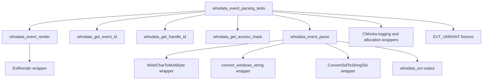
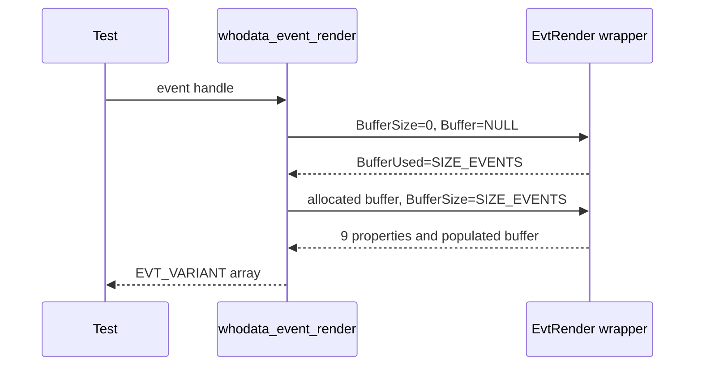
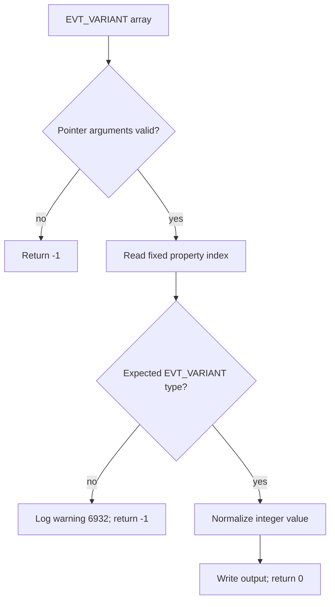
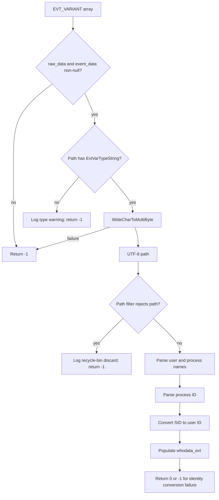
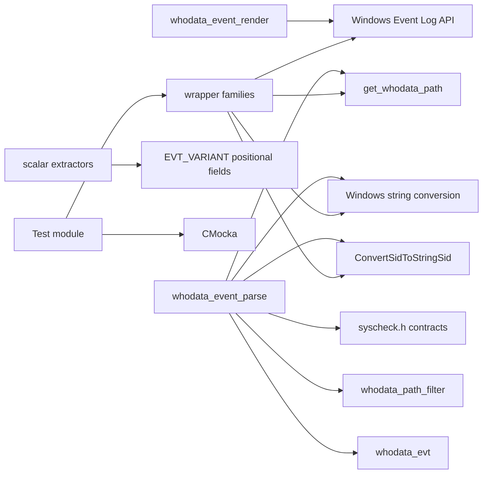

# `whodata_event_parsing_tests`

`whodata_event_parsing_tests` documents the CMocka tests for the Windows Whodata event-rendering and event-parsing primitives in `src/unit_tests/syscheckd/whodata/test_win_whodata.c`. The suite verifies conversion of Windows Event Log `EVT_VARIANT` data into the normalized values consumed by the Whodata callback: event ID, handle ID, access mask, path, user, process, process ID, and SID.

The tests are a narrow part of the larger Windows Whodata test module. See [test_win_whodata.md](test_win_whodata.md) for the complete suite, [whodata_callback_tests.md](whodata_callback_tests.md) for event correlation and callback behavior, [whodata_scan_startup_tests.md](whodata_scan_startup_tests.md) for subscription/startup behavior, and [syscheckd_whodata.md](syscheckd_whodata.md) for production architecture.

## Scope and purpose

The module tests five parsing stages:

| Stage | Production function | Responsibility |
|---|---|---|
| Render | `whodata_event_render` | Perform the two-call `EvtRender` operation and obtain the event property array. |
| Event identity | `whodata_get_event_id` | Read the event ID from the first rendered property. |
| Handle identity | `whodata_get_handle_id` | Read the pending-operation handle from the sixth property, across Windows data representations. |
| Access mask | `whodata_get_access_mask` | Read the access mask from the seventh property. |
| Event payload | `whodata_event_parse` | Normalize path and identity fields into `whodata_evt`. |

The tests also establish the parser’s failure contract: null inputs and invalid required fields return `-1`; optional fields with invalid types are logged and left null while parsing may continue; path conversion or recycle-bin filtering causes the event to be discarded.

## Position in the system

Windows SACL and audit-policy configuration produce Security-channel events. The production callback renders those events, extracts correlation fields, parses the payload, and then handles event IDs 4656, 4663, 4658, and 4719. This module stops at the render/parse boundary; downstream correlation is covered by [whodata_callback_tests.md](whodata_callback_tests.md).

```mermaid
flowchart LR
    A[Windows Security channel] --> B[EvtSubscribe callback]
    B --> C[whodata_event_render]
    C --> D[EVT_VARIANT[9 properties]]
    D --> E[whodata_get_event_id]
    D --> F[whodata_get_handle_id]
    D --> G[whodata_get_access_mask]
    D --> H[whodata_event_parse]
    E --> I[Event ID]
    F --> J[Handle ID]
    G --> K[Access mask]
    H --> L[whodata_evt]
    I --> M[whodata_callback]
    J --> M
    K --> M
    L --> M
    M --> N[Hash correlation / FIM event]
```

## Test architecture

The tests use CMocka expectations and wrapper functions rather than a live Windows Event Log. `EvtRender`, `WideCharToMultiByte`, Windows string conversion, SID conversion, logging, and memory ownership are injected at the boundary. This makes buffer sizing, Windows variant types, conversion failures, and cleanup deterministic.



The shared `setup_win_whodata_evt` fixture allocates a zeroed `whodata_evt`; `teardown_win_whodata_evt` releases its dynamically allocated members through `free_whodata_event`. Most parser tests use stack-allocated input arrays and therefore need no group-level Syscheck configuration. The rendering success test transfers the returned buffer to CMocka state so `teardown_memblock` can release it.

## Render contract

`whodata_event_render` follows the Windows Event Log two-call pattern:



The tests use `NUM_EVENTS = 10` for allocation but require a property count of `9`. Coverage includes:

- render failure on both calls, including propagation of `GetLastError` in warning `6933`;
- an invalid property count, reported as warning `6934`;
- successful return of the rendered buffer, including preservation of the first variant’s type.

The helper `successful_whodata_event_render` centralizes the expected two wrapper calls for callback tests in the same source file.

## Rendered property layout

The fixtures model the positional layout consumed by the production parser:

| Index | Logical field | Typical test type |
|---:|---|---|
| 0 | Event ID | `EvtVarTypeUInt16` |
| 1 | User name | `EvtVarTypeString` |
| 2 | Path | `EvtVarTypeString` |
| 3 | Process name | `EvtVarTypeString` |
| 4 | Process ID | size/hex integer |
| 5 | Handle ID | 32-bit size/hex or 64-bit hex integer |
| 6 | Access mask | `EvtVarTypeHexInt32` |
| 7 | User SID | `EvtVarTypeSid` |
| 8 | Event time | `EvtVarTypeFileTime` |

The parser tests focus on indexes 1–7; event time is validated by callback tests such as those documented in [whodata_callback_tests.md](whodata_callback_tests.md).

## Scalar extraction behavior

### Event ID

`whodata_get_event_id` reads property `0` as `EvtVarTypeUInt16`. It rejects a null raw-data pointer, a null output pointer, and any other variant type, logging warning `6932` for a type mismatch. A valid value such as `1234` is copied to the `short` output and returns `0`.

### Handle ID

`whodata_get_handle_id` reads property `5` and normalizes architecture-dependent representations to `unsigned __int64`:

- `EvtVarTypeHexInt64` for 64-bit values;
- `EvtVarTypeSizeT` for a 32-bit size value;
- `EvtVarTypeHexInt32` for a 32-bit hexadecimal value.

Null input/output pointers and unsupported types return `-1`. The tests use `0x123456` for all accepted forms, proving that the normalized value is consistent across architectures.

### Access mask

`whodata_get_access_mask` reads property `6` as `EvtVarTypeHexInt32`, returning the value as `unsigned long`. Null arguments and invalid types return `-1`; the valid fixture uses mask `0x123456`.



## Full event parsing

`whodata_event_parse` converts a rendered event into a `whodata_evt`. The required path is converted from UTF-16 to UTF-8 using `get_whodata_path`; user and process names are converted with `convert_windows_string`; the SID is converted with `ConvertSidToStringSid`.



### Required versus optional fields

The tests distinguish failure severity:

| Input problem | Observed behavior |
|---|---|
| Null raw data or output event | Return `-1` immediately. |
| Invalid path type | Log `6932` and return `-1`. |
| UTF-16 path conversion failure | Log `6306` and return `-1`. |
| Recycle-bin path such as `C:\$recycle.bin\test.file` | Log `6289` and return `-1`; event is discarded. |
| Invalid user, process, process-ID, or SID variant type | Log `6932`; optional output remains null and parsing may continue. |
| SID conversion failure | Log the invalid-UID diagnostic and return `-1` in the covered cases. |

The nominal 64-bit case produces `c:\windows\a\path`, `user_name`, `process_name`, process ID `0x123456`, and user ID `S-8-15`. The 32-bit cases verify both `EvtVarTypeSizeT` and `EvtVarTypeHexInt32` process-ID forms, while the 64-bit case verifies `EvtVarTypeHexInt64`.

## Dependency and interaction map



The important boundary is that this module tests parsing contracts, not the operating system itself. The Windows API wrappers simulate API results and errors; `syscheck.h` supplies the production structures and constants; downstream Syscheck hash correlation and FIM emission are tested by [whodata_callback_tests.md](whodata_callback_tests.md).

## Test inventory

The source registers the following focused cases in `main`:

- `test_whodata_event_render_fail_to_render_event`
- `test_whodata_event_render_wrong_property_count`
- `test_whodata_event_render_success`
- `test_whodata_get_event_id_null_raw_data`
- `test_whodata_get_event_id_null_event_id`
- `test_whodata_get_event_id_wrong_event_type`
- `test_whodata_get_event_id_success`
- `test_whodata_get_handle_id_null_raw_data`
- `test_whodata_get_handle_id_null_handle_id`
- `test_whodata_get_handle_id_64bit_handle_success`
- `test_whodata_get_handle_id_32bit_handle_wrong_type`
- `test_whodata_get_handle_id_32bit_success`
- `test_whodata_get_handle_id_32bit_hex_success`
- `test_whodata_get_access_mask_null_raw_data`
- `test_whodata_get_access_mask_null_mask`
- `test_whodata_get_access_mask_wrong_type`
- `test_whodata_get_access_mask_success`
- `test_whodata_event_parse_null_raw_data`
- `test_whodata_event_parse_null_event_data`
- `test_whodata_event_parse_wrong_path_type`
- `test_whodata_event_parse_fail_to_get_path`
- `test_whodata_event_parse_filter_path`
- `test_whodata_event_parse_wrong_types`
- `test_whodata_event_parse_32bit_process_id`
- `test_whodata_event_parse_32bit_hex_process_id`
- `test_whodata_event_parse_64bit_process_id`

## Maintenance guidance

When the Windows event schema or parser changes, update the property-layout table and all fixtures together. In particular:

1. Keep the expected `EvtRender` property count synchronized with `event_fields` and the production render context.
2. Add a fixture for every newly accepted Windows variant type and retain a wrong-type case for required fields.
3. Preserve explicit tests for both 32-bit and 64-bit integer representations.
4. Keep ownership clear: parser-created strings belong to `whodata_evt` and must be released by `free_whodata_event`.
5. Put handle-table, directory-state, and FIM-emission assertions in [whodata_callback_tests.md](whodata_callback_tests.md), where the complete callback fixture is available.

